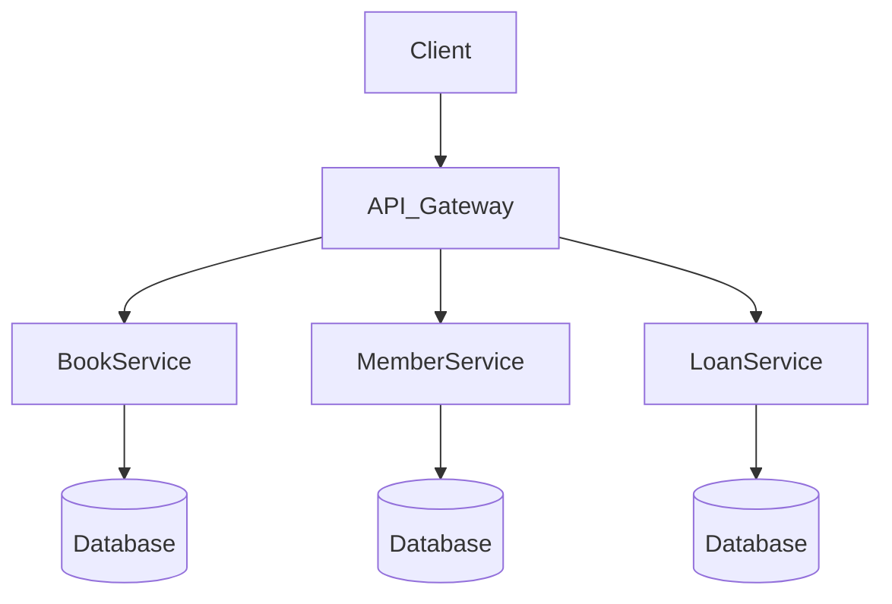

# library

Generated by [Datrix](https://datrix.dev).

## Quick Start

1. Copy `.env.example` to `.env` and configure values
2. Start services: `./scripts/deploy.sh` (Linux/macOS) or `scripts/deploy.ps1` (Windows).
3. Run unit tests: for each service, `./mvnw test`

## Services

| Service | Port | Description |
|---------|------|-------------|
| BookService | 8000 | Spring Boot service (4 entities) |
| MemberService | 8002 | Spring Boot service (2 entities) |
| LoanService | 8001 | Spring Boot service (2 entities) |

## Development

```bash
# Start all services locally
./scripts/deploy.sh          # Linux/macOS   (Windows: scripts/deploy.ps1)

# Stop all services
docker compose down

# Run unit tests (per service)
./mvnw test
```

## Architecture



## API Documentation

Each service exposes interactive API docs at:
- **BookService**: http://localhost:8000/swagger-ui.html
- **MemberService**: http://localhost:8002/swagger-ui.html
- **LoanService**: http://localhost:8001/swagger-ui.html

## Environment Variables

See [ENV.md](ENV.md) for the complete list of environment variables.

---

*Generated by datrix-codegen-java*
