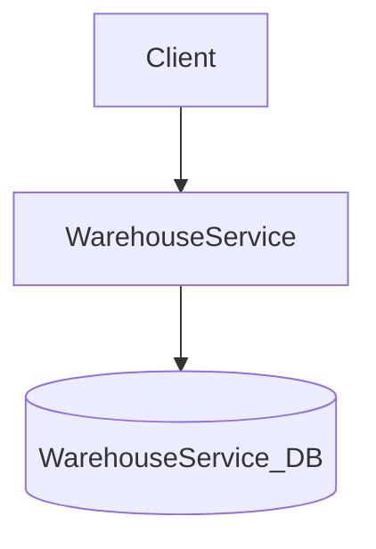
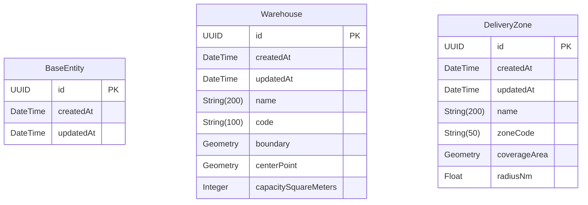

# Architecture

## Overview

warehouse is a microservice-based application built with Spring Boot and Java 25.

## System Overview

| Property | Value |
|----------|-------|
| Services | 1 |
| Entities | 3 |
| Database | PostgreSQL (JPA/Hibernate) |
| Framework | Spring Boot |
| Language | Java 25 |
| Architecture | Layered (entity / repository / service / controller) |
| Deployment | docker-compose |

## Architecture Diagram

## Services

### WarehouseService

- **Port:** 8000
- **Directory:** `warehouse_warehouse_service/`
- **Entities:** BaseEntity, DeliveryZone, Warehouse
- **REST API:** Yes

## Database Schema

### Entity Relationships

### Entity Details

#### BaseEntity

| Field | Type | Optional | Description |
|-------|------|----------|-------------|
| `id` | UUID | No | Id |
| `createdAt` | DateTime | No | Createdat |
| `updatedAt` | DateTime | No | Updatedat |

#### Warehouse

| Field | Type | Optional | Description |
|-------|------|----------|-------------|
| `id` | UUID | No | Id |
| `createdAt` | DateTime | No | Createdat |
| `updatedAt` | DateTime | No | Updatedat |
| `name` | String(200) | No | Name |
| `code` | String(100) | No | Code |
| `boundary` | Geometry | No | Boundary |
| `centerPoint` | Geometry | No | Centerpoint |
| `capacitySquareMeters` | Integer | No | Capacitysquaremeters |

#### DeliveryZone

| Field | Type | Optional | Description |
|-------|------|----------|-------------|
| `id` | UUID | No | Id |
| `createdAt` | DateTime | No | Createdat |
| `updatedAt` | DateTime | No | Updatedat |
| `name` | String(200) | No | Name |
| `zoneCode` | String(50) | No | Zonecode |
| `coverageArea` | Geometry | No | Coveragearea |
| `radiusNm` | Float | No | Radiusnm |

## Infrastructure Components

| Component | Description |
|-----------|-------------|
| Spring Boot | Servlet web framework with springdoc-generated OpenAPI docs |
| Structured Logging | JSON logging in production, console logging in development |
| Health Checks | Generated `/live`, `/ready`, `/health` REST endpoints (RFC 7807 problem-detail error responses) |
| Virtual Threads | `spring.threads.virtual.enabled=true` for request handling |
| Micrometer / Prometheus | `/actuator/prometheus` endpoint for scraping |
| OpenTelemetry | Distributed tracing with OTLP export |

---

*Generated by datrix-codegen-java*
