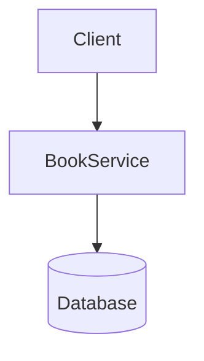

# library

Generated by [Datrix](https://datrix.dev).

## Quick Start

1. Copy `.env.example` to `.env` and configure values
2. Start services: `./scripts/deploy.sh` (Linux/macOS) or `scripts/deploy.ps1` (Windows).
   These build the shared base image (`python-base/`) that every service is `FROM`
   before running `docker compose up -d --build`. A bare `docker compose up` fails
   here: Compose does not build a `FROM` image, so the base image must be built first.
3. Run unit tests: `python tests/unit_tests.py`

## Services

| Service | Port | Description |
|---------|------|-------------|
| BookService | 8000 | FastAPI service (3 entities) |

## Development

```bash
# Start all services locally (builds the shared base image first, then the stack)
./scripts/deploy.sh          # Linux/macOS   (Windows: scripts/deploy.ps1)

# Stop all services
docker compose down

# Run unit tests
python tests/unit_tests.py

# Run with coverage
python tests/unit_tests.py --coverage
```

## Architecture



## API Documentation

Each service exposes interactive API docs at:
- **BookService**: http://localhost:8000/docs

## Environment Variables

See [ENV.md](ENV.md) for the complete list of environment variables.

---

*Generated by datrix-codegen-python*
