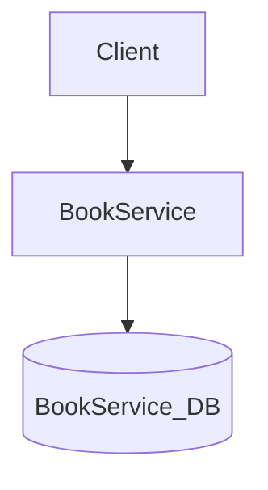
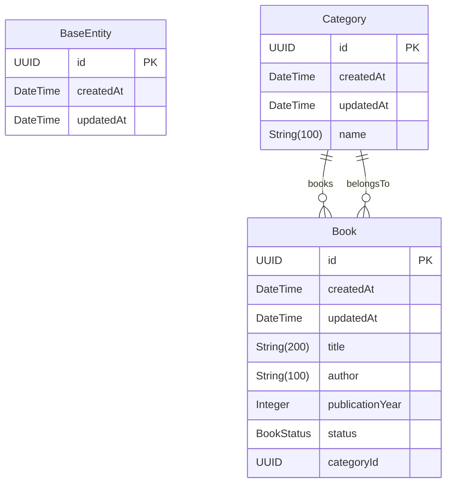

# Architecture

## Overview

library is a microservice-based application built with FastAPI and Python 3.11+.

## System Overview

| Property | Value |
|----------|-------|
| Services | 1 |
| Entities | 3 |
| Database | PostgreSQL (async) |
| Framework | FastAPI |
| Language | Python 3.11+ |
| Architecture | Clean Architecture |
| Deployment | docker-compose |

## Architecture Diagram

## Services

### BookService

- **Port:** 8000
- **Directory:** `library_book_service/`
- **Entities:** BaseEntity, Book, Category

## Database Schema

### Entity Relationships

### Entity Details

#### BaseEntity

| Field | Type | Optional | Description |
|-------|------|----------|-------------|
| `id` | UUID | No | Id |
| `createdAt` | DateTime | No | Createdat |
| `updatedAt` | DateTime | No | Updatedat |

#### Category

| Field | Type | Optional | Description |
|-------|------|----------|-------------|
| `id` | UUID | No | Id |
| `createdAt` | DateTime | No | Createdat |
| `updatedAt` | DateTime | No | Updatedat |
| `name` | String(100) | No | Name |

#### Book

| Field | Type | Optional | Description |
|-------|------|----------|-------------|
| `id` | UUID | No | Id |
| `createdAt` | DateTime | No | Createdat |
| `updatedAt` | DateTime | No | Updatedat |
| `title` | String(200) | No | Title |
| `author` | String(100) | No | Author |
| `publicationYear` | Integer | No | Publicationyear |
| `status` | BookStatus | No | Status |
| `categoryId` | UUID | No | Categoryid |

## Infrastructure Components

| Component | Description |
|-----------|-------------|
| FastAPI | ASGI web framework with auto-generated OpenAPI docs |
| Structured Logging | JSON logging in production, console logging in development |
| Health Checks | `/health` endpoint with service status |
| Middleware | CORS, request logging, error handling |
| Prometheus Metrics | `/metrics` endpoint for scraping |
| OpenTelemetry | Distributed tracing with OTLP export |
| Message Queue | Async event-driven communication |

---

*Generated by datrix-codegen-python*
