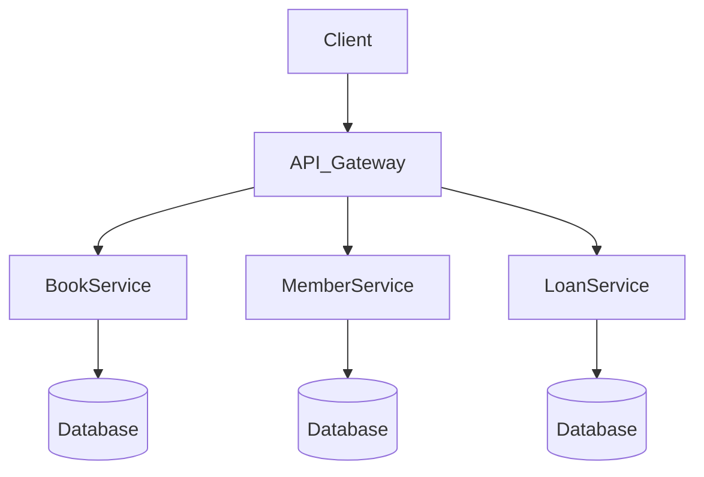

# library

Generated by [Datrix](https://datrix.dev).

## Quick Start

1. Copy `.env.example` to `.env` and configure values
2. Start services: `docker compose up -d --build`
3. Run unit tests: `dotnet test`

## Services

| Service | Port | Description |
|---------|------|-------------|
| BookService | 8000 | ASP.NET Core service (6 entities) |
| MemberService | 8002 | ASP.NET Core service (2 entities) |
| LoanService | 8001 | ASP.NET Core service (2 entities) |

## Development

```bash
# Start all services locally
docker compose up -d --build

# Stop all services
docker compose down

# Run unit tests
dotnet test
```

## Architecture



## API Documentation

Each service exposes its OpenAPI document at:
- **BookService**: http://localhost:8000/openapi/v1.json
- **MemberService**: http://localhost:8002/openapi/v1.json
- **LoanService**: http://localhost:8001/openapi/v1.json

No interactive Swagger/Scalar UI is generated in this phase — only the raw OpenAPI JSON document is served.

## Environment Variables

See [ENV.md](ENV.md) for the complete list of environment variables.

---

*Generated by datrix-codegen-dotnet*
