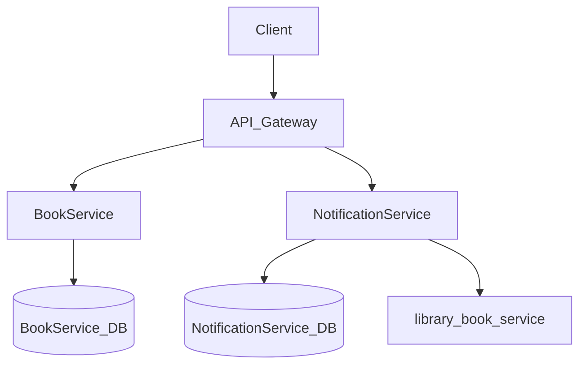
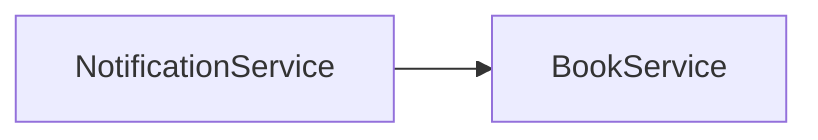

# Architecture

## Overview

library is a microservice-based application built with Spring Boot and Java 25.

## System Overview

| Property | Value |
|----------|-------|
| Services | 2 |
| Entities | 6 |
| Database | PostgreSQL (JPA/Hibernate) |
| Framework | Spring Boot |
| Language | Java 25 |
| Architecture | Layered (entity / repository / service / controller) |
| Deployment | docker-compose |

## Architecture Diagram



## Services

### BookService

- **Port:** 8000
- **Directory:** `library_book_service/`
- **Entities:** BaseEntity, Book, Category, User
- **REST API:** Yes

### NotificationService

- **Port:** 8001
- **Directory:** `library_notification_service/`
- **Entities:** BaseEntity, NotificationDeliveryLog


## Database Schema

### Entity Relationships

```mermaid
erDiagram
    BaseEntity {

        UUID id PK
        DateTime createdAt
        DateTime updatedAt
    }

    Category {

        UUID id PK
        DateTime createdAt
        DateTime updatedAt
        String(100) name
        String(500)? description
    }

    User {

        UUID id PK
        DateTime createdAt
        DateTime updatedAt
        String(255) email
        Password passwordHash
        UserRole role
    }

    Book {

        UUID id PK
        DateTime createdAt
        DateTime updatedAt
        String(200) title
        String(10, 13) isbn
        String(100) author
        Integer publicationYear
        BookStatus status
        BookFormat format
        String(50)? catalogNumber
        Array<String> keywords
        Decimal(3, 2) rating
        UUID categoryId
    }

    BaseEntity {

        UUID id PK
        DateTime createdAt
        DateTime updatedAt
    }

    NotificationDeliveryLog {

        UUID id PK
        DateTime createdAt
        DateTime updatedAt
        UUID bookId
        Email recipientEmail
        String(2000) messagePreview
    }

    Category ||--o{ Book : "books"

    Book }o--|| Category : "belongsTo"

```

### Entity Details

#### BaseEntity

| Field | Type | Optional | Description |
|-------|------|----------|-------------|
| `id` | UUID | No | Id |
| `createdAt` | DateTime | No | Createdat |
| `updatedAt` | DateTime | No | Updatedat |

#### Category

| Field | Type | Optional | Description |
|-------|------|----------|-------------|
| `id` | UUID | No | Id |
| `createdAt` | DateTime | No | Createdat |
| `updatedAt` | DateTime | No | Updatedat |
| `name` | String(100) | No | Name |
| `description` | String(500)? | Yes | Description |

#### User

| Field | Type | Optional | Description |
|-------|------|----------|-------------|
| `id` | UUID | No | Id |
| `createdAt` | DateTime | No | Createdat |
| `updatedAt` | DateTime | No | Updatedat |
| `email` | String(255) | No | Email |
| `passwordHash` | Password | No | Passwordhash |
| `role` | UserRole | No | Role |

#### Book

| Field | Type | Optional | Description |
|-------|------|----------|-------------|
| `id` | UUID | No | Id |
| `createdAt` | DateTime | No | Createdat |
| `updatedAt` | DateTime | No | Updatedat |
| `title` | String(200) | No | Title |
| `isbn` | String(10, 13) | No | Isbn |
| `author` | String(100) | No | Author |
| `publicationYear` | Integer | No | Publicationyear |
| `status` | BookStatus | No | Status |
| `format` | BookFormat | No | Format |
| `catalogNumber` | String(50)? | Yes | Catalognumber |
| `keywords` | Array<String> | No | Keywords |
| `rating` | Decimal(3, 2) | No | Rating |
| `categoryId` | UUID | No | Categoryid |

#### BaseEntity

| Field | Type | Optional | Description |
|-------|------|----------|-------------|
| `id` | UUID | No | Id |
| `createdAt` | DateTime | No | Createdat |
| `updatedAt` | DateTime | No | Updatedat |

#### NotificationDeliveryLog

| Field | Type | Optional | Description |
|-------|------|----------|-------------|
| `id` | UUID | No | Id |
| `createdAt` | DateTime | No | Createdat |
| `updatedAt` | DateTime | No | Updatedat |
| `bookId` | UUID | No | Bookid |
| `recipientEmail` | Email | No | Recipientemail |
| `messagePreview` | String(2000) | No | Messagepreview |


## Infrastructure Components

| Component | Description |
|-----------|-------------|
| Spring Boot | Servlet web framework with springdoc-generated OpenAPI docs |
| Structured Logging | JSON logging in production, console logging in development |
| Health Checks | Generated `/live`, `/ready`, `/health` REST endpoints (RFC 7807 problem-detail error responses) |
| Virtual Threads | `spring.threads.virtual.enabled=true` for request handling |
| Micrometer / Prometheus | `/actuator/prometheus` endpoint for scraping |
| OpenTelemetry | Distributed tracing with OTLP export |
| Message Queue | Async event-driven communication |

## Service Dependencies



- **NotificationService** -> **BookService**: HTTP client communication

---

*Generated by datrix-codegen-java*
