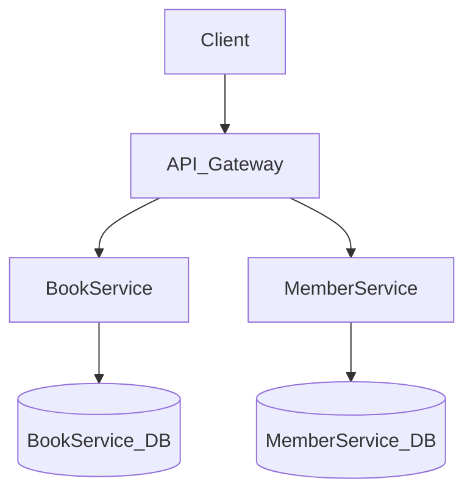

# Architecture

## Overview

library is a microservice-based application built with Spring Boot and Java 25.

## System Overview

| Property | Value |
|----------|-------|
| Services | 2 |
| Entities | 2 |
| Database | PostgreSQL (JPA/Hibernate) |
| Framework | Spring Boot |
| Language | Java 25 |
| Architecture | Layered (entity / repository / service / controller) |
| Deployment | docker-compose |

## Architecture Diagram



## Services

### BookService

- **Port:** 8000
- **Directory:** `library_book_service/`
- **Entities:** Book
- **REST API:** Yes

### MemberService

- **Port:** 8001
- **Directory:** `library_member_service/`
- **Entities:** Member
- **REST API:** Yes


## Database Schema

### Entity Relationships

```mermaid
erDiagram
    Book {

        DateTime createdAt
        DateTime updatedAt
        UUID id PK
        String(200) title
        String(100) author
    }

    Member {

        DateTime createdAt
        DateTime updatedAt
        UUID id PK
        String(100) name
        Email email
        String? emailVerificationToken
    }

```

### Entity Details

#### Book

| Field | Type | Optional | Description |
|-------|------|----------|-------------|
| `createdAt` | DateTime | No | Createdat |
| `updatedAt` | DateTime | No | Updatedat |
| `id` | UUID | No | Id |
| `title` | String(200) | No | Title |
| `author` | String(100) | No | Author |

#### Member

| Field | Type | Optional | Description |
|-------|------|----------|-------------|
| `createdAt` | DateTime | No | Createdat |
| `updatedAt` | DateTime | No | Updatedat |
| `id` | UUID | No | Id |
| `name` | String(100) | No | Name |
| `email` | Email | No | Email |
| `emailVerificationToken` | String? | Yes | Emailverificationtoken |


## Infrastructure Components

| Component | Description |
|-----------|-------------|
| Spring Boot | Servlet web framework with springdoc-generated OpenAPI docs |
| Structured Logging | JSON logging in production, console logging in development |
| Health Checks | Generated `/live`, `/ready`, `/health` REST endpoints (RFC 7807 problem-detail error responses) |
| Virtual Threads | `spring.threads.virtual.enabled=true` for request handling |
| Micrometer / Prometheus | `/actuator/prometheus` endpoint for scraping |
| OpenTelemetry | Distributed tracing with OTLP export |


---

*Generated by datrix-codegen-java*
