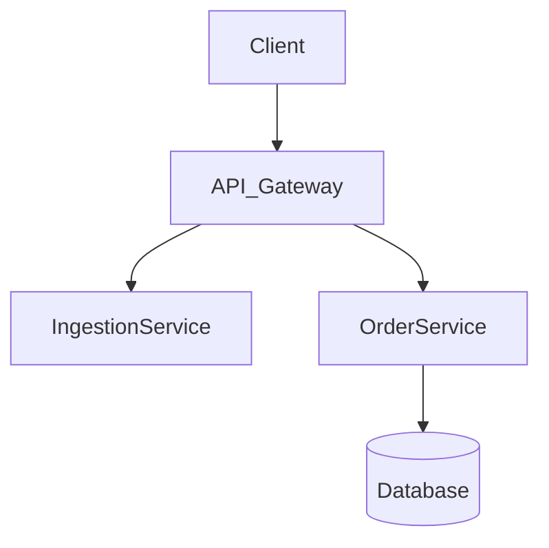

# examples

Generated by [Datrix](https://datrix.dev).

## Quick Start

1. Copy `.env.example` to `.env` and configure values
2. Install dependencies: `pnpm install` in each service
3. Start services: `docker compose up -d`
4. Run tests: `pnpm exec jest --config tests/jest-deploy.config.ts`

## Services

| Service | Port | Description |
|---------|------|-------------|
| IngestionService | 8002 | NestJS service (0 entities) |
| OrderService | 8001 | NestJS service (1 entities) |

## Development

```bash
# Start all services
docker compose up -d

# Stop all services
docker compose down

# Run deployment tests
pnpm exec jest --config tests/jest-deploy.config.ts

# Start a single service in dev mode
cd examples_ingestion_service && pnpm start:dev
```

## Architecture



## API Documentation

Each service exposes endpoints at:
- **IngestionService**: http://localhost:8002
- **OrderService**: http://localhost:8001

## Environment Variables

See per-service `ENV.md` files for the complete list of environment variables.

---

*Generated by datrix-codegen-typescript*
