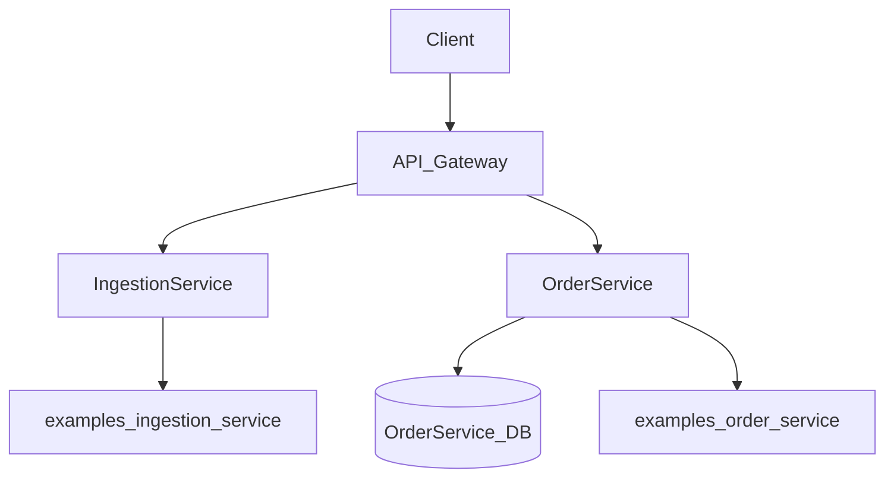
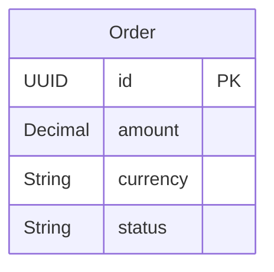
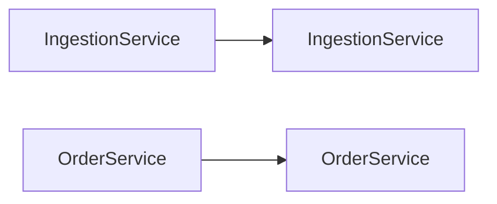

# Architecture

## Overview

examples is a microservice-based application built with NestJS and TypeScript.

## System Overview

| Property | Value |
|----------|-------|
| Services | 2 |
| Entities | 1 |
| Database | PostgreSQL |
| Framework | NestJS |
| Language | TypeScript |
| Architecture | Modular Architecture |

## Architecture Diagram

## Services

### IngestionService

- **Port:** 8002
- **Directory:** `examples_ingestion_service/`

### OrderService

- **Port:** 8001
- **Directory:** `examples_order_service/`
- **Entities:** Order
- **REST API:** Yes

## Database Schema

### Entity Relationships

### Entity Details

#### Order

| Field | Type | Optional | Description |
|-------|------|----------|-------------|
| `id` | UUID | No | Id |
| `amount` | Decimal | No | Amount |
| `currency` | String | No | Currency |
| `status` | String | No | Status |

## Infrastructure Components

| Component | Description |
|-----------|-------------|
| NestJS | TypeScript framework with modular architecture |
| MikroORM | Database ORM with migration support |
| Health Checks | `/health` endpoint with service status |
| Middleware | CORS, validation, error handling |
| Prometheus Metrics | `/metrics` endpoint for scraping |
| OpenTelemetry | Distributed tracing with OTLP export |
| Message Queue | Async event-driven communication |

## Service Dependencies

- **IngestionService** -> **IngestionService**: HTTP client communication
- **OrderService** -> **OrderService**: HTTP client communication

---

*Generated by datrix-codegen-typescript*
