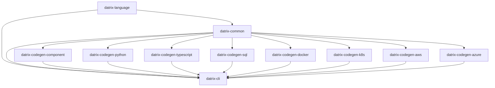

# Datrix Architecture Overview

**Version:** 2.0
**Last Updated:** April 12, 2026

---

## Introduction

Datrix is a code generation system that transforms `.dtrx` domain specifications into production-ready applications across multiple languages and platforms.

### Key Features

✅ **Template-Based Generation** - Jinja2 templates with automatic formatting
✅ **Fail-Fast Error Handling** - Errors caught at generation time, not runtime
✅ **Multi-Language Support** - Python, TypeScript, SQL
✅ **Multi-Platform Support** - Docker, Kubernetes, AWS, Azure
✅ **Type-Safe** - Exhaustive type mappings with validation
✅ **Modular Architecture** - 11 packages plus showcase and projects repos
✅ **Specification-Level Testing** - DSL `test` blocks transpile to pytest under `tests/spec/` (Python) and Jest under `test/spec/` (TypeScript); see tutorial `42-spec-tests`

---

## System Architecture

### Pipeline Flow

```
.dtrx Source Files
 ↓
┌─────────────────────────────────┐
│ Parser (datrix-language) │
│ - Lexical analysis │
│ - Syntax parsing (Tree-sitter) │
└─────────────────────────────────┘
 ↓
┌─────────────────────────────────┐
│ AST (datrix-common) │
│ - Immutable syntax tree │
│ - Source locations preserved │
└─────────────────────────────────┘
 ↓
┌─────────────────────────────────┐
│ Semantic Analysis (datrix-common) │
│ - Symbol collection & imports │
│ - Reference resolution │
│ - Inheritance merging │
│ - Type checking │
│ - Domain validation │
└─────────────────────────────────┘
 ↓
┌─────────────────────────────────┐
│ Config Resolution │
│ - Parse YAML config files │
│ - Select active profile │
│ - Validate against schemas │
│ - Attach resolved_config to │
│ AST blocks │
└─────────────────────────────────┘
 ↓
┌─────────────────────────────────┐
│ Application (datrix-common) │
│ - Language-agnostic AST model │
│ - Service-scoped entities │
│ (service.rdbms_blocks[name]) │
│ - Immutable representation │
│ - Config attached to blocks │
└─────────────────────────────────┘
 ↓
┌─────────────────────────────────┐
│ Code Generators │
│ - datrix-codegen-component │
│ - datrix-codegen-python │
│ - datrix-codegen-typescript │
│ - datrix-codegen-sql │
└─────────────────────────────────┘
 ↓
┌─────────────────────────────────┐
│ Platform Generators │
│ - datrix-codegen-docker │
│ - datrix-codegen-k8s │
│ - datrix-codegen-aws │
│ - datrix-codegen-azure │
└─────────────────────────────────┘
 ↓
Generated Application
```

The `datrix generate` command supports `--language`, `--hosting`, and `--platform` to override config-driven values for a single generation run. In the generation pipeline, overrides run in the `apply_cli_overrides` stage after config resolution and service filtering, and before `platform_validation`.

### Phase 01 capabilities (Python and Docker)

Details and generator APIs: [code-generation.md](../../../datrix-common/docs/architecture/code-generation.md) (Datrix common docs) and [generators-api.md](../../../datrix-common/docs/generators-api.md).

- **Background jobs** — DSL `jobs` blocks plus resolved `JobsConfig` drive `JobsGenerator` (`datrix_codegen_python.generators.messaging.jobs_generator`): APScheduler wiring (`jobs/scheduler.py`, `jobs/runner.py`, `jobs/config.py`), transpiled job bodies via `PythonTranspiler`, timeout/retry/DLQ from config. For Python on Docker, `ComposeBuilder` (`datrix_codegen_docker.generators.compose.compose_builder`) adds a `<compose-service>-worker` that runs `python -m <package>.jobs.scheduler` (no HTTP port, shared env/infra deps).

- **Alembic initial schema** — `MigrationGenerator` (`datrix_codegen_python.generators.persistence.migration_generator`) emits per-RDBMS-block Alembic trees and `0001_initial_schema.py` with explicit `op.create_table()` / column DDL from `OrmTypeResolver` and `build_initial_migration_context` (`_migration_schema.py`); table creation order is topologically sorted from foreign keys.

- **Seed data** — Optional `config/seed-data.yaml` in the generated service tree is read by `SeedGenerator` (`datrix_codegen_python.generators.persistence.seed_generator`), which emits `seed.py` and packaged `seed_data.yaml` with PostgreSQL idempotent inserts (`ON CONFLICT … DO NOTHING`).

- **Elasticsearch** — When `IntegrationsProfileConfig.search` targets Elasticsearch and the service has `:searchable` fields, `IntegrationGenerator` (`datrix_codegen_python.generators.cross_cutting.integration_generator`) emits search client code, index mapping, and sync helpers. `datrix-codegen-docker` adds Elasticsearch infrastructure services, wires `ELASTICSEARCH_HOST` / `ELASTICSEARCH_PORT`, and optional `*-search-index-init` containers (see `datrix_codegen_docker.generators.compose._compose_wiring`).

### Phase 02 capabilities (Python, Docker, docs)

Cross-cutting behavior described here matches the **current** generators; see [code-generation.md](../../../datrix-common/docs/architecture/code-generation.md) for pipeline detail.

- **Inter-service internal HTTP auth** — Services that expose `INTERNAL` REST endpoints (and services that depend on them) receive `INTERNAL_API_TOKEN` in Docker Compose and root `.env.example`. Generated Python clients read `os.environ["INTERNAL_API_TOKEN"]` and send `X-Internal-Token` on outbound calls to those routes. This is a **shared secret** checked by string equality at runtime, not a JWT and not per-service cryptographic identity.

- **User-facing JWT (gateway apps)** — When gateway JWT settings are present in project config, Compose emits `JWT_SECRET`, `JWT_ALGORITHM`, and `JWT_EXPIRY` into service environments (see `datrix_codegen_docker.generators.compose.compose_builder`). Python gateway generation (`datrix_codegen_python.generators.api.gateway_generator`) emits JWT verification aligned with those settings.

- **Config-driven operational settings** — Service and project YAML profiles resolve to typed Pydantic models attached to the AST; Docker and Python generators consume those models (ports, health checks, resources, jobs, etc.) instead of hardcoding production values. `.env.example` documents variables the stack expects.

- **Entity lifecycle hooks** — `beforeCreate` / `afterCreate` / etc. on entities are transpiled in the Python service layer (`datrix_codegen_python.generators.service.service_generator` and related templates) and invoked around persistence operations as defined in the DSL.

- **Multi-service NGINX gateway** — For applications with more than one service, `datrix_codegen_docker.generators.config.gateway_generator` renders `config/nginx/nginx.conf` via `nginx.conf.j2`: one **upstream** per service, **location** blocks for public REST paths (including each `rest_api` **base_path** prefix), **GraphQL** `graphql_api` base paths (with WebSocket upgrade headers when the API has subscriptions), **health** aliases derived from the primary REST `base_path` plus `service.config.health_check.path` when a primary REST API exists (with `GenerationError` on duplicate external health paths), **403** for versioned paths matching internal REST segments (`INTERNAL_PATH_DENY_REGEX` in the gateway module), **CORS OPTIONS** handling and **proxy timeouts** on proxied locations, and **`client_max_body_size`** on routes for services that declare **storage** blocks. Rate limit zones from `@rateLimit` on endpoints are preserved. If an upstream has **no** matching locations, generation raises `GenerationError` listing that upstream (instead of emitting a broken config). Test-only multi-service fixtures use `attach_config_for_docker` / `ensure_minimal_rest_api_for_multi_service_gateway` in `datrix_codegen_docker.test_helpers` to add minimal `rest_api` stubs when the parsed `.dtrx` omits API blocks.

### Phase 03 capabilities (Python, Docker)

- **GraphQL DataLoaders** — `GraphqlResolverGenerator` (`datrix_codegen_python.generators.api.graphql_resolver_generator`) emits Strawberry DataLoader wiring and batch resolvers from DSL definitions so related fields load in grouped queries instead of per-row round-trips.

- **Rate limiting** — Two paths: (1) **Gateway apps** with `gateway.yaml` rate limits use `GatewayGenerator` (`datrix_codegen_python.generators.api.gateway_generator`) and `api/gateway_rate_limit.py.j2` (slowapi, per-route limits from config). (2) **Per-route Redis sliding windows** for `@rateLimit` on REST endpoints use `EndpointGenerator.generate_rate_limit_module` and `api/middleware_rate_limit.py.j2` (sorted-set style windows in Redis).

- **RFC 7807 error envelope** — `ProjectGenerator._generate_error_modules` renders `api/error_response.py.j2` and `api/error_handlers.py.j2`; `main.py.j2` calls `register_error_handlers(app)` so API errors return a shared `ErrorResponse` / `FieldError` model (Problem Details fields: `type`, `title`, `status`, `detail`, `instance`, optional `errors`).

- **Prometheus application metrics** — Before sub-generators run, `PythonGenerator` sets the Jinja global `has_prometheus_metrics` from the resolved observability profile. When true, generated **RDBMS** `connection.py` modules expose `sqlalchemy_pool_*` gauges (pool listeners), **Redis cache** access increments `redis_cache_hits_total` / `redis_cache_misses_total`, and **jobs** `runner.py` records `job_runs_total`, `job_failures_total`, and `job_duration_seconds` (see `metrics_middleware.py.j2` for HTTP counters/histograms as before).

- **Docker monitoring stack** — With `observability.metrics` (Prometheus) and `observability.visualization` (Grafana), `datrix-codegen-docker` adds **cAdvisor** next to Prometheus, scrapes it from `prometheus.yml.j2`, writes **per-compose-service Grafana dashboards** plus a **multi-service overview** (`datrix-system-overview.json`) via `DashboardBuilder` / `generate_dashboards` in `datrix_codegen_docker.generators.infra.dashboard_builder`, and emits **per-service alert files** under `config/prometheus/` (standard rules: `HighErrorRate`, `HighLatency`, optional pool/cache/job rules from service features, plus a **DSL** group when blocks declare alerts). Grafana dashboards require metrics; missing metrics with visualization enabled raises `GenerationError` at generation time.

---

## Repository Architecture

The project is split into 11 packages plus the **datrix** showcase repo (docs, examples, scripts) and **datrix-projects** repo (private production projects). This structure provides clear boundaries, independent versioning/releases, selective installation, and per-repo CI/CD pipelines.

### Core Repositories (2)

#### 1. datrix-common
**Purpose:** Shared foundation and code generation framework for all Datrix packages — AST model, type system, semantic analysis, config resolution, and generator infrastructure.

**Responsibilities:**
- **AST and types:** AST model (`Application`, `Entity`, `Service`, `RdbmsBlock`, etc.) — the single representation consumed by all generators; type system (`TypeRegistry`, `ScalarType`) and builtin scalar type definitions
- **Semantic analysis:** 6-phase pipeline (symbol collection, import resolution, reference resolution, inheritance merging, type checking, domain validation)
- **Config resolution:** parses YAML config files referenced by AST blocks, selects active profile, validates against schemas, attaches resolved config to blocks
- **Generation framework:** Generator base classes, plugin protocols (`GeneratorPlugin`, `PlatformPlugin`), pipeline orchestration, template rendering (Jinja2), YAML/JSON document builders, file coordination, code formatting integration, testing utilities for generator packages
- **Shared:** Rendering utilities, error classes, configuration models, shared utilities

**Dependencies:** None (zero dependencies on other Datrix packages)

---

#### 2. datrix-language
**Purpose:** Parser and CST-to-AST transformers for .dtrx files

**Responsibilities:**
- Parsing .dtrx files (Tree-sitter grammar, lexer, parser)
- CST-to-AST transformers that produce `Application` objects (defined in `datrix-common`)

**Key Insight:** The parser + transformers produce `Application` directly. There is no separate IR layer. The `Application` model and all AST types are defined in `datrix-common`; datrix-language imports them.

**Dependencies:**
- `datrix-common` (AST model, type system, semantic analysis, config resolution)

---

### Code Generators (4)

These are **specialized extensions** of the generation framework in `datrix-common` for specific languages or platform-agnostic artifacts.

#### 3. datrix-codegen-component
Generates platform-agnostic components: documentation (README, API reference, architecture), configuration (Alembic, pytest, coverage), scripts (entrypoint, dev scripts), and shared templates (Mermaid diagrams)

#### 4. datrix-codegen-python
Generates Python code (FastAPI, Django, Flask)

#### 5. datrix-codegen-typescript
Generates TypeScript code (Express, NestJS, Next.js)

#### 6. datrix-codegen-sql
Generates SQL DDL (PostgreSQL, MySQL)

**Dependencies:**
- `datrix-common` (AST model, type system, template rendering, generation framework)
- `jinja2` (for template rendering)

---

### Platform Generators (4)

Generate infrastructure and deployment configurations.

#### 7. datrix-codegen-docker
Generates Dockerfiles and docker-compose.yml, including optional **job worker** services for Python services with jobs and **Elasticsearch** infrastructure plus index-init containers when search integration and searchable fields are present

#### 8. datrix-codegen-k8s
Generates Kubernetes manifests (Deployment, Service, etc.)

#### 9. datrix-codegen-aws
Generates AWS infrastructure (CDK, CloudFormation)

#### 10. datrix-codegen-azure
Generates Azure infrastructure (Bicep, ARM templates)

**Dependencies:**
- `datrix-common` (AST model, configuration, generation framework, YAML/JSON builders)

---

### CLI (1)

#### 11. datrix-cli
Command-line interface for code generation

**Responsibilities:**
- Pipeline orchestration
- Plugin discovery
- Linting and formatting
- Progress reporting
- User interaction

**Dependencies:**
- `datrix-common` (AST model, type system, configuration, semantic analysis, pipeline, generator discovery)
- `datrix-language` (parser, CST-to-AST transformers)
- Discovers installed generator *plugins* dynamically (datrix-codegen-python, etc.)

---

### Showcase (1)

#### 12. datrix
Public repository with documentation, examples, scripts, and tutorials.

---

## Plugin Architecture

Generators are discovered dynamically via a plugin architecture using four entry-point groups:

1. **Protocol-based plugins** — Generators implement `GeneratorPlugin` or `PlatformPlugin` protocols
2. **Language-specific hooks** — Language packages implement `LanguageHooks` and `LanguageRuntimeSpec` protocols
3. **Dynamic discovery** — CLI discovers plugins via entry points at runtime
4. **Independent packages** — Each generator is a separate package that can be installed independently
5. **Clear interfaces** — Protocols define exactly what generators must implement

### Entry Point Groups

| Group | Purpose | Protocol |
|-------|---------|----------|
| `datrix.generators` | Code generators (Python, TypeScript, SQL, component) | `GeneratorPlugin` |
| `datrix.platforms` | Platform generators (Docker, K8s, AWS, Azure) | `PlatformPlugin` |
| `datrix.language_hooks` | Post-generation hooks (formatting, validation) | `LanguageHooks` |
| `datrix.language_runtime_spec` | Infrastructure details (Dockerfiles, healthchecks, migrations) | `LanguageRuntimeSpec` |

All protocols are defined in `datrix-common` (see `datrix_common.plugin.protocol`, `datrix_common.generation.language_hooks`, `datrix_common.generation.language_runtime_spec`). The CLI and pipeline discover installed plugins at runtime. Users only install the generators they need — no unused dependencies.

### Adding a New Language

Adding a new target language (e.g., Go, Rust, Java) requires only a new `datrix-codegen-{lang}` package:

1. Implement `GeneratorPlugin` — code generation from AST to target language
2. Implement `LanguageHooks` — post-generation formatting and validation
3. Implement `LanguageRuntimeSpec` — Dockerfile context, healthchecks, DB URL schemes, migration commands, job runner commands
4. Register all three entry points in `pyproject.toml`

No changes to datrix-common, Docker, K8s, Component, or CLI packages are needed. Platform generators consume `LanguageRuntimeSpec` via protocol dispatch instead of language-specific branching.

---

## Dependency Graph



**Legend:**
- **datrix-common** (no dependencies) — Foundation and generation framework (AST model, type system, semantic analysis, config resolution, plugin protocols, pipeline)
- **datrix-language** (depends on datrix-common) — Parser + CST-to-AST transformers
- **Code Generators** (depend on datrix-common) — Python, TypeScript, SQL, component
- **Platform Generators** (depend on datrix-common) — Docker, Kubernetes, AWS, Azure
- **datrix-cli** (depends on datrix-common, datrix-language; discovers generator plugins dynamically)

---

## Builtin Traits and Enums

Datrix provides a catalog of **ten builtin traits** and **two builtin enums** that are always available in every service and module without user definition.

### Builtin Traits

| Trait | Fields | Purpose |
|-------|--------|---------|
| **Activatable** | `Boolean isActive`, `DateTime? activatedAt`, `DateTime? deactivatedAt` | Enable/disable entities |
| **Auditable** | `UUID createdBy`, `UUID? updatedBy` | Track who created/modified |
| **Publishable** | `DateTime? publishedAt`, `UUID? publishedBy`, `PublishStatus publishStatus` | Draft/publish workflow |
| **Schedulable** | `DateTime? scheduledFor`, `DateTime? executedAt`, `ScheduleStatus scheduleStatus` | Scheduled execution |
| **Sluggable** | `String(200) slug : unique` | URL-friendly slugs |
| **SoftDeletable** | `DateTime? deletedAt`, `UUID? deletedBy`, computed `isDeleted` | Soft deletion |
| **Taggable** | `Array<String> tags` | Tagging |
| **Tenantable** | `UUID tenantId : immutable, indexed` | Row-level tenant isolation |
| **Timestampable** | `DateTime createdAt`, `DateTime updatedAt` | Automatic timestamps |
| **Versionable** | `Int version` | Optimistic locking |

### Builtin Enums

| Enum | Values | Used By |
|------|--------|---------|
| **PublishStatus** | `Draft`, `Published`, `Archived` | Publishable trait |
| **ScheduleStatus** | `Pending`, `Scheduled`, `Executed`, `Cancelled` | Schedulable trait |

### How It Works

1. Builtin traits and enums are **programmatically-constructed AST objects** defined in `datrix_common.builtins.traits` and `datrix_common.builtins.enums`
2. They are **injected into every TypeContainer** (Service, Module) before reference resolution
3. Users reference them with `with TraitName` on entity declarations (e.g., `entity User extends BaseEntity with Tenantable`)
4. They are **opt-in** — no trait is automatically applied to entities
5. User code **cannot redefine** builtin trait or enum names (BLT001 validator enforces this)

---

## Core Principles

### 1. Fail Fast, Fail Loud

**Philosophy:** Catch errors at generation time, not runtime. See [Design Principles](./design-principles.md).

---

### 2. Template-Based Generation with Formatters

**Philosophy:** Generate code using Jinja2 templates with formatting checks (ruff format for Python, Prettier for TypeScript). See [Design Principles](./design-principles.md).

**Benefits:**
- Clean separation of logic and output
- Easy to read and maintain templates
- Automatic formatting ensures valid syntax
- Reusable template macros

---

### 3. Exhaustive Type Mappings

**Philosophy:** All type mappings must be explicit. Fail if unmapped. See [Design Principles](./design-principles.md).

---

### 4. Immutable AST Model

**Philosophy:** The Application model cannot be modified after creation. See [Design Principles](./design-principles.md).

**Benefits:**
- Thread-safe
- Predictable behavior
- Prevents accidental modifications

---

### 5. Single Responsibility

Each repository has ONE clear purpose:
- `datrix-common`: AST model, type system, semantic analysis, config resolution, generation framework, shared utilities
- `datrix-language`: Parser and CST-to-AST transformers
- `datrix-codegen-python`: Python code generation
- Each platform generator: One platform

---

## Technology Stack

### Languages & Frameworks
- **Python 3.11+** - All implementations
- **Tree-sitter** - Parser generation
- **Pydantic v2** - Data validation

### Code Generation
- **Jinja2** - Template-based code generation
- **ruff format** - Python code formatting
- **Prettier** - TypeScript code formatting
- **ruamel.yaml** - YAML generation

### Code Quality
- **ruff** - Python linting and formatting
- **mypy** - Type checking (strict mode)
- **pytest** - Testing

### CLI
- **Typer/Click** - CLI framework
- **Rich** - Terminal UI

---

## Key Architectural Decisions

### Decision 1: No Separate IR Layer

**Rationale:**
- The parser produces the Application (AST model) directly
- There is no IR layer; the AST model is the single representation
- Fewer transformations means fewer bugs

**Result:** The AST model (`Application`, `Entity`, `Service`, etc.) lives in `datrix-common`. The parser in `datrix-language` produces `Application` objects but the type is defined in `datrix-common`, making the AST available to all packages without depending on the parser.

---

### Decision 2: `datrix-codegen-*` Naming

**Rationale:**
- Shows family relationship (all codegen)
- They extend/specialize `datrix-common`
- User mental model: "codegen for Python"

**Result:**
- `datrix-codegen-python` (not `datrix-generator-python`)
- `datrix-codegen-typescript`
- `datrix-codegen-sql`

---

### Decision 3: One Repo Per Platform

**Rationale:**
- Independent versioning
- Independent releases
- Clear ownership
- Plugin architecture

**Result:** Separate repos for Docker, K8s, AWS, Azure

---

## Installation

```bash
# Minimal (CLI only)
pip install datrix-cli

# Python + Docker
pip install datrix-cli datrix-codegen-python datrix-codegen-docker

# Full stack
pip install datrix-cli \
 datrix-codegen-python datrix-codegen-typescript datrix-codegen-sql \
 datrix-codegen-docker datrix-codegen-k8s datrix-codegen-aws datrix-codegen-azure
```

**Note:** The CLI automatically discovers installed generators. You only need to install the generators you plan to use.

---

## Usage

Use the CLI to validate and generate:
```bash
# Validate a file or directory of .dtrx files
datrix validate system.dtrx
datrix validate examples/01-tutorial/03-basic-api

# Generate (defaults: profile test; language/hosting from YAML for that profile)
datrix generate --source system.dtrx --output ./generated

# Generate for a specific profile
datrix generate --source system.dtrx --output ./generated --profile production

# Override language / hosting / platform for one run (optional short flags)
datrix generate --source system.dtrx --output ./generated --language typescript
datrix generate --source system.dtrx --output ./generated -L python -H docker -P compose
```

**Config-driven generation:** The usual source of truth is YAML: `language` and `hosting` in `system-config.yaml`, and service-level `platform` in each service config (e.g. `compose`, `ecs-fargate`, `lambda`). Use `--language` / `-L`, `--hosting` / `-H`, and `--platform` / `-P` only when you want CLI overrides for a single invocation.

---

## Next Steps

- Read [Design Principles](./design-principles.md) to understand core principles
- Read [Language Reference](../reference/language-reference.md) to learn how to write `.dtrx` files
- See [Getting Started](../getting-started/first-project.md) and the runnable trees under [`examples/`](../../examples/)

---

**Last Updated:** April 13, 2026
