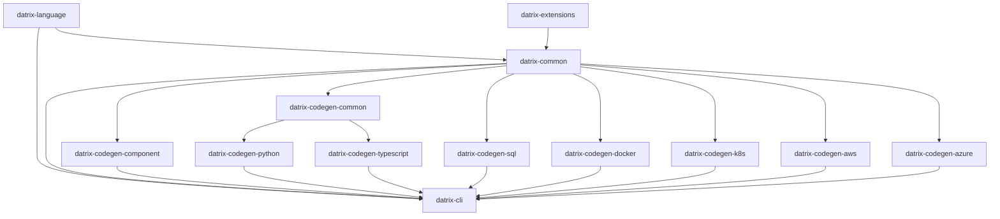

# Datrix Architecture Overview

**Version:** 2.0
**Last Updated:** May 2, 2026

---

## Introduction

Datrix is a code generation system that transforms `.dtrx` domain specifications into production-ready applications across multiple languages and platforms.

### Key Features

✅ **Template-Based Generation** - Jinja2 templates with automatic formatting
✅ **Fail-Fast Error Handling** - Errors caught at generation time, not runtime
✅ **Multi-Language Support** - Python, TypeScript, SQL
✅ **Multi-Platform Support** - Docker, Kubernetes, AWS, Azure
✅ **Type-Safe** - Exhaustive type mappings with validation
✅ **Modular Architecture** - 13 installable packages (core toolchain + optional **datrix-extensions**) plus showcase and projects repos
✅ **Specification-Level Testing** - DSL `test` blocks transpile to pytest under `tests/spec/` (Python) and Jest under `test/spec/` (TypeScript); see the [spec testing documentation](../guide/spec-testing.md)
✅ **Event contracts** - `ensure` clauses on `publish` events enforce publisher-side validation before `dispatch`
✅ **External library interfacing** - `extern service` declarations generate typed HTTP clients and deployment wiring for user-built services

---

## System Architecture

### Pipeline Flow

```
.dtrx Source Files
 ↓
┌─────────────────────────────────┐
│ Parser (datrix-language) │
│ - Lexical analysis │
│ - Syntax parsing (Tree-sitter) │
└─────────────────────────────────┘
 ↓
┌─────────────────────────────────┐
│ Application (immutable AST) │
│ - Pydantic models in datrix-common │
│ - Built by datrix-language transforms │
│ - Source locations preserved │
└─────────────────────────────────┘
 ↓
┌─────────────────────────────────┐
│ Extension directives (AST) │
│ use extension <name>; on system │
│ → app.extension_directives │
└─────────────────────────────────┘
 ↓
┌─────────────────────────────────┐
│ Extension resolution (logical) │
│ PluginRegistry: datrix.extensions │
│ entry points; load_declared_extensions │
│ TypeRegistry.load_extensions(...) │
│ when callers register pack scalars │
└─────────────────────────────────┘
 ↓
┌─────────────────────────────────┐
│ Semantic Analysis (datrix-common) │
│ - Stdlib placeholders + lazy load │
│ - Symbol collection & imports │
│ - Reference resolution │
│ - Inheritance merging │
│ - Type checking │
│ - Domain validation │
└─────────────────────────────────┘
 ↓
┌─────────────────────────────────┐
│ Config Resolution │
│ - Parse YAML config files │
│ - Select active profile │
│ - Validate against schemas │
│ - Attach resolved_config to │
│ AST blocks │
└─────────────────────────────────┘
 ↓
┌─────────────────────────────────┐
│ Same Application, config-bound │
│ - YAML resolved per profile │
│ - resolved_config on blocks │
│ - Ready for platform validation │
│ - Generators read-only over AST │
└─────────────────────────────────┘
 ↓
┌─────────────────────────────────┐
│ Code Generators │
│ - datrix-codegen-component │
│ - datrix-codegen-python │
│ - datrix-codegen-typescript │
│ - datrix-codegen-sql │
│ (language-owned maps merge core │
│ + declared extensions, e.g. │
│ build_python_type_map) │
└─────────────────────────────────┘
 ↓
┌─────────────────────────────────┐
│ Platform Generators │
│ - datrix-codegen-docker │
│ - datrix-codegen-k8s │
│ - datrix-codegen-aws │
│ - datrix-codegen-azure │
└─────────────────────────────────┘
 ↓
Generated Application
```

The `datrix generate` command supports `--language`, `--hosting`, and `--platform` to override config-driven values for a single generation run. Overrides run in the `apply_cli_overrides` stage after service and infrastructure YAML are resolved on the AST (and after optional `--service` filtering), and before `platform_validation`.

**Pipeline stages (`GenerationPipeline.run` in `datrix-common`)** align with the diagram above through semantic analysis; afterward the implementation continues with: optional service filter → `apply_cli_overrides` → `normalize_service_memory_limits` → `platform_validation` → incremental merge (may early-exit when nothing changed) → `discover_generators` and `discover_platforms` → execute generators → write files → optional migrations stage → `LanguageHooks` post-processing (import fix, format, validate when `format_output` is enabled) → JSON normalization → `snapshot`. Extension **directives** are recorded during parse; **registry** and **type-registry** integration run when the active code path invokes `PluginRegistry` / `TypeRegistry` APIs (see [Domain extension system](#domain-extension-system)). Language generators receive declared extension names via `declared_extension_names(app)` and merge per-language maps (for example `build_python_type_map` in `datrix-codegen-python`).

### Standard library

Datrix ships a **standard library**: eight `.dtrx` modules under `datrix-language/src/datrix_language/stdlib/` (`datrix.foundation`, `datrix.auth`, `datrix.geo`, `datrix.contact`, `datrix.api`, `datrix.data`, `datrix.billing`, `datrix.notification`). They provide commonly reused types, functions, and constants—`BaseEntity`, pagination helpers, `Address`, password/token helpers, rate-limit guards, geographic utilities, billing and notification enums, and similar patterns that were previously duplicated across dozens of example and production specs.

**Why it exists:** The same structures (base entities, auth helpers, address shapes, API guard helpers) were copy-pasted identically across projects. The stdlib centralizes those patterns so new services start from shared, reviewed definitions instead of re-declaring them in every `common.dtrx`.

**How it works (language layer):**

1. **Build-time pre-parse** — Stdlib sources are parsed when `datrix-language` is built/packaged and stored as serialized module ASTs for fast startup.
2. **Placeholder registration** — During semantic analysis, every stdlib export name is registered on the application scope as a lightweight placeholder backed by a symbol index. No full stdlib module is deserialized yet.
3. **Implicit global availability** — User modules can reference stdlib exports by simple name (`BaseEntity`, `hashPassword`, …) without import statements, the same way other global symbols are resolved once analysis runs.
4. **Lazy materialization** — The first resolution that needs symbols from a given stdlib module triggers deserialization of that module only; its declarations attach to `Application`, placeholders promote to real symbols, and analysis continues. Modules that are never referenced are never loaded.
5. **Shadowing and qualification** — User-defined types and functions with the same simple name as a stdlib export always win. To refer to the shipped definition explicitly, use qualified names (for example `datrix.contact.Address` or the owning module path) as documented in the language rules.
6. **Generators** — After analysis, generators see a normal validated `Application`: stdlib entities behave like user entities wherever they were materialized; unused stdlib leaves no footprint in the AST beyond placeholders that were never touched.

**Relationship to builtins:** Builtins supply abstract primitives—scalar kinds, builtin traits, builtin objects—that the language and type system understand everywhere. The stdlib composes those primitives into concrete patterns (for example `abstract entity BaseEntity with Timestampable`). Builtins are prerequisites; stdlib is optional in the sense that unreferenced modules never load, but the feature is always present in the toolchain.

**Relationship to domain extensions:** Extensions (`use extension …;`) add infrastructure-aware or domain-packaged scalars, extra dependencies, and DB extension hooks (PostGIS, TimescaleDB, etc.). Stdlib stays **database-agnostic** and ships with the core language—only builtin scalars and traits, no extension directives. Extensions and stdlib coexist: extensions answer “which engine extensions and pack types exist,” stdlib answers “which everyday service patterns ship by default.”

**Further reading:** Module-by-module catalog and naming rules live in [datrix-stdlib-reference.md](../../../datrix-language/docs/reference/datrix-stdlib-reference.md) inside `datrix-language`.

### Phase 01 capabilities (Python and Docker)

Details and generator APIs: [code-generation.md](../../../datrix-common/docs/architecture/code-generation.md) (Datrix common docs) and [generators-api.md](../../../datrix-common/docs/generators-api.md).

- **Background jobs** — DSL `jobs` blocks plus resolved `JobsConfig` drive `JobsGenerator` (`datrix_codegen_python.generators.messaging.jobs_generator`): APScheduler wiring (`jobs/scheduler.py`, `jobs/runner.py`, `jobs/config.py`), transpiled job bodies via `PythonTranspiler`, timeout/retry/DLQ from config. For Python on Docker, `ComposeBuilder` (`datrix_codegen_docker.generators.compose.compose_builder`) adds a `<compose-service>-worker` that runs `python -m <package>.jobs.scheduler` (no HTTP port, shared env/infra deps).

- **Alembic initial schema** — `MigrationGenerator` (`datrix_codegen_python.generators.persistence.migration_generator`) emits per-RDBMS-block Alembic trees and `0001_initial_schema.py` with explicit `op.create_table()` / column DDL from `OrmTypeResolver` and `build_initial_migration_context` (`_migration_schema.py`); table creation order is topologically sorted from foreign keys. When `schema` is configured on the RDBMS block, migrations include `CREATE SCHEMA IF NOT EXISTS`, pass `schema=` to all DDL operations, and scope the Alembic version table to the service schema.

- **Seed data** — Optional `config/seed-data.yaml` in the generated service tree is read by `SeedGenerator` (`datrix_codegen_python.generators.persistence.seed_generator`), which emits `seed.py` and packaged `seed_data.yaml` with PostgreSQL idempotent inserts (`ON CONFLICT … DO NOTHING`).

- **Elasticsearch (config-driven)** — When `IntegrationsProfileConfig.search` targets Elasticsearch and the service has `:searchable` fields, `IntegrationGenerator` (`datrix_codegen_python.generators.cross_cutting.integration_generator`) emits search client code, index mapping, and sync helpers. `datrix-codegen-docker` adds Elasticsearch infrastructure services, wires `ELASTICSEARCH_HOST` / `ELASTICSEARCH_PORT`, and optional `*-search-index-init` containers (see `datrix_codegen_docker.generators.compose._compose_wiring`). This is the **config-driven** search integration path (no DSL `search` block required). See also [Search engine integration](#search-engine-integration) for the DSL-level `search` block.

### Phase 02 capabilities (Python, Docker, docs)

Cross-cutting behavior described here matches the **current** generators; see [code-generation.md](../../../datrix-common/docs/architecture/code-generation.md) for pipeline detail.

- **Inter-service internal HTTP auth** — Services that expose `INTERNAL` REST endpoints (and services that depend on them) receive `INTERNAL_API_TOKEN` in Docker Compose and root `.env.example`. Generated Python clients read `os.environ["INTERNAL_API_TOKEN"]` and send `X-Internal-Token` on outbound calls to those routes. This is a **shared secret** checked by string equality at runtime, not a JWT and not per-service cryptographic identity.

- **User-facing JWT (gateway apps)** — When gateway JWT settings are present in project config, Compose emits `JWT_SECRET`, `JWT_ALGORITHM`, and `JWT_EXPIRY` into service environments (see `datrix_codegen_docker.generators.compose.compose_builder`). Python gateway generation (`datrix_codegen_python.generators.api.gateway_generator`) emits JWT verification aligned with those settings.

- **Config-driven operational settings** — Service and project YAML profiles resolve to typed Pydantic models attached to the AST; Docker and Python generators consume those models (ports, health checks, resources, jobs, etc.) instead of hardcoding production values. `.env.example` documents variables the stack expects.

- **Entity lifecycle hooks** — `beforeCreate` / `afterCreate` / etc. on entities are transpiled in the Python service layer (`datrix_codegen_python.generators.service.service_generator` and related templates) and invoked around persistence operations as defined in the DSL.

- **Multi-service NGINX gateway** — For applications with more than one service, `datrix_codegen_docker.generators.config.gateway_generator` renders `config/nginx/nginx.conf` via `nginx.conf.j2`: one **upstream** per service, **location** blocks for public REST paths (including each `rest_api` **base_path** prefix), **GraphQL** `graphql_api` base paths (with WebSocket upgrade headers when the API has subscriptions), **health** aliases derived from the primary REST `base_path` plus `service.config.health_check.path` when a primary REST API exists (with `GenerationError` on duplicate external health paths), **403** for versioned paths matching internal REST segments (`INTERNAL_PATH_DENY_REGEX` in the gateway module), **CORS OPTIONS** handling and **proxy timeouts** on proxied locations, and **`client_max_body_size`** on routes for services that declare **storage** blocks. Rate limit zones from `@rateLimit` on endpoints are preserved. If an upstream has **no** matching locations, generation raises `GenerationError` listing that upstream (instead of emitting a broken config). Test-only multi-service fixtures use `attach_config_for_docker` / `ensure_minimal_rest_api_for_multi_service_gateway` in `datrix_codegen_docker.test_helpers` to add minimal `rest_api` stubs when the parsed `.dtrx` omits API blocks.

### Phase 03 capabilities (Python, Docker)

- **GraphQL DataLoaders** — `GraphqlResolverGenerator` (`datrix_codegen_python.generators.api.graphql_resolver_generator`) emits Strawberry DataLoader wiring and batch resolvers from DSL definitions so related fields load in grouped queries instead of per-row round-trips.

- **Rate limiting** — A unified plan-based system requiring a Redis/Valkey-backed cache block:

  **Plan-based rate limiting** (`RateLimitGenerator` in `datrix_codegen_python.generators.cross_cutting.rate_limit_generator`) — Automatically generated for any service with REST or GraphQL APIs plus a Redis-backed cache. Emits `rate_limit/` package: `rate_limit_config.py` (baked plan tiers: RPM sliding window + daily quota + per-endpoint overrides), `rate_limiter.py` (Redis sorted-set implementation), `rate_limit_dependency.py` (FastAPI dependency `enforce_plan_rate_limit` wired at router level; GraphQL variant `enforce_plan_rate_limit_graphql` called in context getter). Client identification uses JWT `sub` claim → `x-forwarded-for` → IP fallback. Plan ID extracted from JWT claims. Emits standard headers: `X-RateLimit-Limit`, `X-RateLimit-Remaining`, `X-RateLimit-Reset`, `Retry-After`.

  **Per-endpoint overrides** — When endpoints use `@rateLimit(requests=N, window=S)` in the DSL, the decorator values are collected by `collect_endpoint_rate_limit_overrides` and baked into `ENDPOINT_OVERRIDES` in `rate_limit_config.py`. At runtime, `enforce_plan_rate_limit` checks overrides before applying plan RPM: if the request matches an override, the endpoint-specific requests/window constraint applies instead of the plan RPM (daily quota still applies). All rate limiting flows through a single path using consistent JWT-aware client identification.

  **`DISABLE_RATE_LIMIT` env var** (values `1`, `true`, `yes`) — early return before Redis access, enabling tests to run without Redis infrastructure. Raises 503 when Redis is unavailable and rate limiting is not disabled.

- **RFC 7807 error envelope** — `ProjectGenerator._generate_error_modules` renders `api/error_response.py.j2` and `api/error_handlers.py.j2`; `main.py.j2` calls `register_error_handlers(app)` so API errors return a shared `ErrorResponse` / `FieldError` model (Problem Details fields: `type`, `title`, `status`, `detail`, `instance`, optional `errors`).

- **Prometheus application metrics** — Before sub-generators run, `PythonGenerator` sets the Jinja global `has_prometheus_metrics` from the resolved observability profile. When true, generated **RDBMS** `connection.py` modules expose `sqlalchemy_pool_*` gauges (pool listeners), **Redis cache** access increments `redis_cache_hits_total` / `redis_cache_misses_total`, and **jobs** `runner.py` records `job_runs_total`, `job_failures_total`, and `job_duration_seconds` (see `metrics_middleware.py.j2` for HTTP counters/histograms as before).

- **Docker monitoring stack** — With `observability.metrics` (Prometheus) and `observability.visualization` (Grafana), `datrix-codegen-docker` adds **cAdvisor** next to Prometheus, scrapes it from `prometheus.yml.j2`, writes **per-compose-service Grafana dashboards** plus a **multi-service overview** (`datrix-system-overview.json`) via `DashboardBuilder` / `generate_dashboards` in `datrix_codegen_docker.generators.infra.dashboard_builder`, and emits **per-service alert files** under `config/prometheus/` (standard rules: `HighErrorRate`, `HighLatency`, optional pool/cache/job rules from service features, plus a **DSL** group when blocks declare alerts). Grafana dashboards require metrics; missing metrics with visualization enabled raises `GenerationError` at generation time.

### Search engine integration

Datrix supports full-text search through two paths: **config-driven** (existing, via `IntegrationsProfileConfig.search`) and **DSL-level** (via `search` blocks in services and shared containers).

**DSL-level `search` block** — Declares search indexes with field mappings, analyzers, boost weights, facet/sortable flags, and entity sync rules directly in `.dtrx` files:

```datrix
service CatalogService {
    rdbms db('config/rdbms.yaml') {
        entity Product { ... }
    }
    search es('config/search.yaml') {
        index ProductSearch syncs Product {
            field name : text, boost(3.0), analyzer("standard")
            field description : text, boost(1.0), analyzer("english")
            field category : keyword, facet
            field price : float, sortable
        }
        analyzer autocomplete {
            tokenizer: edge_ngram(minGram: 2, maxGram: 20)
            filter: [lowercase]
        }
    }
}
```

**Multi-platform code generation:**

| Platform | Search Service | Client Library |
|----------|---------------|----------------|
| Docker Compose | Elasticsearch container + init container | `elasticsearch` / `@elastic/elasticsearch` |
| Kubernetes | Elasticsearch StatefulSet + headless Service + init Job | `elasticsearch` / `@elastic/elasticsearch` |
| AWS | Amazon OpenSearch Service domain (CDK) | `elasticsearch` / `@elastic/elasticsearch` (wire-compatible) |
| Azure | Azure AI Search (Bicep) | `azure-search-documents` / `@azure/search-documents` |

**Platform-variant code generation:** Docker, K8s, and AWS targets are Elasticsearch-compatible and share the same generated client code. Azure AI Search has a different API surface, so the language code generators produce platform-variant search integration code: separate templates for index init, search client, and sync handlers. The variant is selected based on the target platform in `CodegenContext`.

**Azure AI Search type mapping:** Elasticsearch field types, analyzers, and boost weights are translated to Azure AI Search equivalents. `boost` values become scoring profiles (an index-level construct). Language-specific analyzers map to `.lucene` variants (e.g., `"english"` → `"en.lucene"`). The mapping is exhaustive and fails fast on unsupported types.

**`fulltext()` entity modifier** remains for database-native full-text indexes (PostgreSQL GIN / MySQL FULLTEXT). The `search` block targets external search engines with relevance scoring, faceted search, autocomplete, and multi-entity indexes — a different performance tier.

### CDN / Content Delivery

Datrix supports CDN configuration through `cdn` blocks in services and shared containers. A `cdn` block declares a CDN distribution with named origins, cache behaviors, and optional custom domains.

**DSL syntax:**

```datrix
service frontend.WebService : version('1.0.0') {
    storage mediaStore('config/storage.yaml') {
        bucket StaticAssets { ... }
        bucket UserUploads { ... }
    }
    rest_api WebAPI : basePath('/api/v1') { ... }

    cdn WebCDN('config/cdn.yaml') {
        origin StaticAssets {
            source: mediaStore.StaticAssets
            cacheTtl: 86400
            pathPattern: '/static/*'
        }
        origin UserMedia {
            source: mediaStore.UserUploads
            cacheTtl: 3600
            pathPattern: '/media/*'
        }
        origin API {
            source: WebAPI
            cacheTtl: 60
            pathPattern: '/api/*'
            forwardHeaders: ['Authorization']
            forwardQueryStrings: true
        }
        defaultOrigin: API
        customDomain: 'cdn.example.com'
    }
}
```

**Multi-platform code generation:**

| Platform | CDN Service | Generated Artifacts |
|----------|-------------|---------------------|
| Docker Compose | Varnish cache proxy (simulates edge caching) | Varnish container + VCL configuration |
| Kubernetes | Ingress annotations (origin-compatible headers) | CDN-origin Ingress with CORS and cache-control annotations |
| AWS | CloudFront distribution with OAC | CDK/CloudFormation: distribution, behaviors, OAC, optional ACM certificate |
| Azure | Azure Front Door profile | Bicep: profile, endpoints, origin groups, routes, cache configuration |

**Cache invalidation utilities:** When CDN is configured on AWS or Azure, language code generators (Python, TypeScript) emit platform-specific cache invalidation helper modules.

**Origin types:** CDN origins can reference `storage` bucket sources (S3, Blob Storage) or `rest_api` endpoints (ALB, Container Apps). Each origin specifies its own cache TTL, path pattern, and header forwarding rules.

**Custom domains and SSL:** When `customDomain` is set in CDN config, the platform generators provision SSL certificates automatically — ACM certificates in `us-east-1` for CloudFront (with DNS validation), or Front Door managed certificates for Azure.

### Managed API Gateway

Datrix supports managed API gateway infrastructure through a `gateway` block at the application level and a unified `gateway.yaml` configuration. When `type: managed` (or `type: kong` / `type: traefik`), platform generators emit cloud-managed or self-hosted API gateway resources with throttling, API keys, usage plans, request validation, response caching, WAF integration, and custom domain/TLS management.

**DSL syntax (application-level `gateway` block):**

```datrix
application ecommerce.Ecommerce {
    gateway : type('managed') {
        throttle(1000, 2000);       // 1000 steady-state, 2000 burst per second

        apiKeys {
            plan BasicPlan : rateLimit(100, 'hour'), quota(1000, 'day');
            plan ProPlan : rateLimit(1000, 'hour'), quota(50000, 'day');
            plan EnterprisePlan : rateLimit(10000, 'hour'), quota(unlimited);
        }

        cache(ttl: 300);            // 300 seconds default TTL
        waf : enabled;
        domain('api.ecommerce-app.com');
    }

    service ecommerce.UserService { ... }
    service ecommerce.OrderService { ... }
}
```

Gateway configuration can also be specified entirely in `gateway.yaml` (profile-based, as with other config files) for users who prefer YAML over DSL-level gateway config. The `type` field in `GatewayProfileConfig` determines the gateway infrastructure: `nginx` (default, existing NGINX reverse proxy), `managed` (cloud-native: AWS API Gateway / Azure APIM), `kong` (Kong Gateway for Docker/K8s), or `traefik` (Traefik for K8s).

**Multi-platform code generation:**

| Platform | Gateway Service | Generated Artifacts |
|----------|----------------|---------------------|
| Docker Compose | Kong Gateway (declarative mode) when `type: managed`/`kong`; NGINX when `type: nginx` | Kong container + `kong.yml` declarative config with rate-limiting, key-auth, and proxy-cache plugins |
| Kubernetes | Kong Ingress Controller CRDs or Traefik IngressRoute | KongPlugin CRDs (rate-limiting, key-auth) + annotated Ingress resources |
| AWS | API Gateway REST API (full-featured) or HTTP API (throttling-only) | CDK/CloudFormation: REST API with usage plans, API keys, caching, VPC Link + NLB for ECS integration |
| Azure | Azure API Management (APIM) | Bicep: APIM service, per-service APIs, products (usage plans), XML rate-limiting/quota policies |

**AWS auto-selection:** The AWS generator uses REST API when any advanced feature is enabled (`apiKeys`, `cache`, `waf`) and HTTP API otherwise. REST API supports usage plans, API keys, request validation, response caching, and WAF association. HTTP API provides lower latency and cost for simple throttling and routing.

**VPC Link for private integration:** On AWS, API Gateway communicates with ECS services through a VPC Link connected to a Network Load Balancer (NLB). The generator creates an NLB when API Gateway is used: API Gateway → VPC Link → NLB → ECS Target Groups.

**WAF integration:** When `waf.enabled: true`, the AWS generator provisions a WAF Web ACL with `AWSManagedRulesCommonRuleSet` (general protection) and `AWSManagedRulesSQLiRuleSet` (SQL injection) managed rule groups, and associates it with the API Gateway stage.

**Application-level awareness:** When behind a managed gateway, language generators (Python, TypeScript) emit trusted-proxy middleware so services correctly handle `X-Forwarded-For` and API key headers injected by the gateway. Application-level API key validation is omitted when gateway-level API key enforcement is enabled.

**Backward compatibility with NGINX:** When `type: nginx` (or no gateway type specified), the existing NGINX generation path in `datrix-codegen-docker` runs unchanged. The managed gateway is opt-in.

---

## Repository Architecture

The project is split into **thirteen** installable packages (twelve core toolchain packages plus optional **datrix-extensions**), plus the **datrix** showcase repo (docs, examples, scripts) and **datrix-projects** repo (private production projects). This structure provides clear boundaries, independent versioning/releases, selective installation, and per-repo CI/CD pipelines.

### Core Repositories (2)

#### 1. datrix-common
**Purpose:** Shared foundation and code generation framework for all Datrix packages — AST model, type system, semantic analysis, config resolution, and generator infrastructure.

**Responsibilities:**
- **AST and types:** AST model (`Application`, `Entity`, `Service`, **`Shared`**, `RdbmsBlock`, etc.) — the single representation consumed by all generators; type system (`TypeRegistry`, `ScalarType`) and builtin scalar type definitions
- **Semantic analysis:** ordered passes in `SemanticAnalyzer.analyze` (`datrix_common.semantic.analyzer`) — stdlib symbol registration, symbol collection, import and reference resolution, field typing, inheritance merge, FK synthesis, index resolution, type checking, and domain validators (collects diagnostics; fails the pipeline when errors remain)
- **Config resolution:** parses YAML config files referenced by AST blocks, selects active profile, validates against schemas, attaches resolved config to blocks
- **Generation framework:** Generator base classes, plugin protocols (`GeneratorPlugin`, `PlatformPlugin`), pipeline orchestration, template rendering (Jinja2), YAML/JSON document builders, file coordination, code formatting integration, testing utilities for generator packages
- **Transpiler:** Staged DSL-to-source pipeline shared across language packages — **`NameResolver`** (Stage 1) and **`QueryExpander`** (Stage 2) in **datrix-common** produce **`ResolutionTable`** / query-annotation side-tables; each **`LanguageTranspiler`** subclass (Stage 3) consumes those tables and returns **`TranspileResult`**. Configuration is a frozen **`TranspileContext`**; per-file sibling-flow state lives in **`FileScope`** / **`PythonFileScope`** / **`TypeScriptFileScope`**. Expression and statement work uses **`ExpressionVisitor`** / **`StatementVisitor`** and **`node.accept()`**; call targets use **`CallTargetEmitter`** and **`dispatch_call()`**. See [datrix-common — Transpiler architecture](../../../datrix-common/docs/architecture.md#transpiler-architecture-staged-pipeline), [code-generation.md — Consolidated generator infrastructure](../../../datrix-common/docs/architecture/code-generation.md#consolidated-generator-infrastructure), and [datrix-common-api — Transpiler modules](../../../datrix-common/docs/datrix-common-api.md#transpiler-modules).
- **Shared:** Rendering utilities, error classes, configuration models, shared utilities

**Dependencies:** None (zero dependencies on other Datrix packages)

---

#### 2. datrix-language
**Purpose:** Parser and CST-to-AST transformers for .dtrx files

**Responsibilities:**
- Parsing .dtrx files (Tree-sitter grammar, lexer, parser)
- Shipped **standard library** `.dtrx` modules under `src/datrix_language/stdlib/` (pre-parsed artifacts, consumed by semantic analysis in `datrix-common` via the stdlib loader)
- CST-to-AST transformers that produce `Application` objects (defined in `datrix-common`)
- **Server-managed fields** via the **`server`** field modifier (for example `UUID id : primaryKey, server = uuid();`, `DateTime createdAt : server = now();`) — not a `@` prefix on the type
- **Custom exception catalogs** via `exceptions { … }` blocks on `module` and `service`
- **User-defined scalars** via `scalar Name : BaseType { … }` on `module` and `service` (constrained aliases; distinct from extension-pack scalars — see [language reference](../reference/language-reference.md#custom-scalar-types))

**Key Insight:** The parser + transformers produce `Application` directly. There is no separate IR layer. The `Application` model and all AST types are defined in `datrix-common`; datrix-language imports them.

**Dependencies:**
- `datrix-common` (AST model, type system, semantic analysis, config resolution)

---

### Shared Codegen Intelligence (1)

#### 3. datrix-codegen-common
**Purpose:** Language-agnostic algorithms, context models, profile-driven transpiler, field analysis, and parity checking consumed by language codegen packages.

**Responsibilities:**
- **Profile-driven transpiler:** `LanguageProfile` (7 sub-profiles), `SharedTranspiler` (final, no subclassing), `SyntaxEmitters` protocol with `CBraceSyntaxEmitters` and `PythonIndentSyntaxEmitters`
- **Algorithms:** `build_*_context()` functions that compute language-agnostic semantic contexts from AST
- **Context models:** Frozen dataclasses (`EntityContext`, `ServiceContext`, `SchemaContext`, etc.) carrying semantic data from algorithms to micro-generators
- **Field analysis:** Reusable entity/field analysis (lookup methods, cascade checks, sortable/filterable classification, lifecycle hooks)
- **Micro-generator pattern:** `MicroGenerator[TContext]` ABC for language-specific rendering from shared context
- **Parity checking:** `validate_profile_completeness()`, `verify_micro_generator_parity()`, `validate_builtin_parity()` — automated cross-language feature verification

**Dependencies:**
- `datrix-common` (AST model, type system, transpiler base, generation framework)

See [datrix-codegen-common — Architecture](../../../datrix-codegen-common/docs/architecture.md).

---

### Code Generators (4)

These are **specialized extensions** of the generation framework in `datrix-common` for specific languages or platform-agnostic artifacts.

#### 4. datrix-codegen-component
Generates platform-agnostic components: documentation (README, API reference, architecture), configuration (Alembic, pytest, coverage), scripts (entrypoint, dev scripts), and shared templates (Mermaid diagrams)

#### 5. datrix-codegen-python
Generates Python code (FastAPI, Django, Flask)

#### 6. datrix-codegen-typescript
Generates TypeScript code (Express, NestJS, Next.js)

#### 7. datrix-codegen-sql
Generates SQL DDL (PostgreSQL, MySQL)

**Dependencies (language generators):**
- `datrix-codegen-common` (shared transpiler, algorithms, context models, field analysis)
- `datrix-common` (AST model, type system, template rendering, generation framework)
- `jinja2` (for template rendering)

**Dependencies (component, SQL):**
- `datrix-common` (AST model, type system, template rendering, generation framework)
- `jinja2` (for template rendering)

---

### Platform Generators (4)

Generate infrastructure and deployment configurations.

#### 8. datrix-codegen-docker
Generates Dockerfiles and docker-compose.yml, including optional **job worker** services for Python services with jobs, **Elasticsearch** infrastructure plus index-init containers when search integration and searchable fields are present, **Varnish** cache proxy containers when `cdn` blocks are configured (simulates edge caching for local development), **PgBouncer** containers when `connectionPooler.enabled: true` on RDBMS blocks (one PgBouncer container per consolidated database, with health check and dependency wiring), and **Kong Gateway** containers with declarative config when `gateway.type` is `managed` or `kong` (rate-limiting, key-auth, and proxy-cache plugins)

#### 9. datrix-codegen-k8s
Generates Kubernetes manifests (Deployment, Service, etc.) including Elasticsearch StatefulSets, headless Services, and search index init Jobs when `search` blocks are present, PgBouncer Deployment + ClusterIP Service + ConfigMap when `connectionPooler.enabled: true` on RDBMS blocks, and Kong Ingress Controller CRDs (KongPlugin resources for rate-limiting, key-auth) with annotated Ingress when `gateway.type` is `managed` or `kong`

#### 10. datrix-codegen-aws
Generates AWS infrastructure (CDK, CloudFormation) including VPC, ECS Fargate, RDS, ElastiCache, SNS/SQS, MSK (Kafka), Amazon MQ (RabbitMQ), DynamoDB, Amazon DocumentDB (MongoDB), S3, ALB, Amazon OpenSearch Service domains, CloudFront CDN distributions (with OAC for S3 origins, custom domains, and SSL certificates), RDS Proxy resources when `connectionPooler.enabled: true` on RDBMS blocks, API Gateway (REST API or HTTP API) with usage plans, API keys, response caching, WAF Web ACL, VPC Link + NLB, and custom domains when `gateway.type` is `managed`, and AWS Cloud Map service discovery (private DNS namespace + ECS service registration for internal service-to-service communication)

#### 11. datrix-codegen-azure
Generates Azure infrastructure (Bicep, ARM templates) including Container Apps, Flexible Server, Cosmos DB, Service Bus, Event Hubs (Kafka), Azure Cache for Redis, Blob Storage, Azure AI Search services, Azure Front Door CDN profiles (with origin groups, routes, and cache configuration), built-in PgBouncer server parameters on Flexible Server when `connectionPooler.enabled: true` on RDBMS blocks, Azure API Management (APIM) with per-service APIs, products (usage plans), and XML rate-limiting/quota policies when `gateway.type` is `managed`, and Container Apps internal service discovery (peer traffic encryption, internal/external ingress, and peer service URL env vars)

**Dependencies:**
- `datrix-common` (AST model, configuration, generation framework, YAML/JSON builders)

---

### CLI (1)

#### 12. datrix-cli
Command-line interface for code generation

**Responsibilities:**
- Pipeline orchestration
- Plugin discovery
- Linting and formatting
- Progress reporting
- User interaction

**Dependencies:**
- `datrix-common` (AST model, type system, configuration, semantic analysis, pipeline, generator discovery)
- `datrix-language` (parser, CST-to-AST transformers)
- Discovers installed generator *plugins* dynamically (datrix-codegen-python, etc.)

---

### Extension packs (optional)

#### 13. datrix-extensions
Optional package of **domain extension** entry points registered under the `datrix.extensions` group. Each pack contributes language-agnostic scalar definitions, builtin objects, database extension names (for example PostGIS), extra dependency hints, and optional template directories. **Language-specific type mappings** live in `datrix-codegen-python`, `datrix-codegen-typescript`, `datrix-codegen-sql`, not in the extension pack (split ownership).

**Dependencies:**
- `datrix-common` (protocols, types)

**Installation:** Only required when a project’s `system.dtrx` declares `use extension <name>;`. Not a hard dependency of `datrix-cli` or the language generators.

---

### Showcase (1)

#### 14. datrix
Public repository with documentation, examples, and scripts.

---

## Plugin Architecture

Generators and domain extensions load through **setuptools entry-point groups** discovered at runtime (see table). Cross-cutting pieces:

- **Protocols** — Code generators implement `GeneratorPlugin`; platform generators implement `PlatformPlugin`. **Language targets subclass `LanguageGenerator`** (`datrix_common.generation.language_generator`): `generate()` is `@final` in the base class; subclasses implement **nine abstract methods**. See [code-generation.md](../../../datrix-common/docs/architecture/code-generation.md#consolidated-generator-infrastructure) in datrix-common.
- **`TypeMappingRegistry`** (`datrix_common.generation.type_mapping_registry`) — each registered language maps canonical `TypeRegistry` types (`global_registry.register_language()` at import time).
- **`LanguageHooks` / `LanguageRuntimeSpec`** — post-write formatting and validation hooks, and infrastructure details for Docker/K8s (Dockerfile context, health checks, migration commands), respectively.

### Entry Point Groups

| Group | Purpose | Protocol |
|-------|---------|----------|
| `datrix.generators` | Code generators (Python, TypeScript, SQL, component) | `GeneratorPlugin` |
| `datrix.platforms` | Platform generators (Docker, K8s, AWS, Azure) | `PlatformPlugin` |
| `datrix.language_hooks` | Post-generation hooks (formatting, validation) | `LanguageHooks` |
| `datrix.language_runtime_spec` | Infrastructure details (Dockerfiles, healthchecks, migrations) | `LanguageRuntimeSpec` |
| `datrix.extensions` | Domain extension packs (types, builtins, DB extension names, templates) | `DatrixExtension` |

All protocols are defined in `datrix-common` (see `datrix_common.plugin.protocol`, `datrix_common.plugin.extension`, `datrix_common.generation.language_hooks`, `datrix_common.generation.language_runtime_spec`). The CLI and pipeline discover installed plugins at runtime. Users only install the generators they need — no unused dependencies. Install **`datrix-extensions`** only when using `use extension` in `system.dtrx`.

---

## Domain extension system

Domain-specific scalars, builtin objects, and infrastructure hints (for example PostGIS) can ship in **extension packs** instead of bloating `datrix-common`. See the [extensions guide](../../../datrix-extensions/docs/extensions-guide.md) and the [datrix-common extensions overview](../../../datrix-common/docs/extensions.md).

### Split ownership

| Layer | Owns |
|-------|------|
| Extension pack (`datrix.extensions`) | Language-agnostic scalar defs, builtin object types, `db_extensions()`, `extra_dependencies()`, `template_dirs()` |
| Each language generator (`datrix-codegen-python`, …) | All **language-specific** type mappings for core **and** declared extensions (for example `PYTHON_EXTENSION_MAPS` + `build_python_type_map` in `datrix_codegen_python.type_mappings`) |

Adding a new target language updates **one** codegen package with core maps plus whichever extension keys it supports. Adding a new extension updates the extension pack **and** each language generator that should support it.

### Discovery and types

- **`PluginRegistry.discover_extensions()`** — loads classes from the `datrix.extensions` entry-point group (`datrix_common.plugin.registry`).
- **`PluginRegistry.load_declared_extensions(declared)`** — resolves names from `app.extension_directives` to `DatrixExtension` instances; raises **`ExtensionNotFoundError`** with install hints when a name is missing.
- **`TypeRegistry.load_extensions(extensions)`** — registers extension scalar definitions into the shared type registry when callers supply loaded instances (`datrix_common.types.registry`).

### DSL

Projects enable packs in **`system.dtrx`** with:

```datrix
use extension geo;
```

(`use extension` must appear inside the `system { }` block; see `datrix_language` transformer validation.)

### Application containers

A `.dtrx` application is built from **five** top-level container kinds (plus `include` / `import`):

| Container | Purpose | Typical members |
|-----------|---------|-----------------|
| **`system { }`** | Application metadata | `config`, `discovery`, `use extension` |
| **`module { }`** | Shared types and functions | `entity`, `enum`, `trait`, `struct`, `scalar`, `const`, `fn`, `exceptions`, `import` |
| **`service { }`** | Deployable microservice | Everything in **module** scope **plus** infrastructure (`rdbms`, `nosql`, `cache`, `pubsub`, `storage`, `queues`, `search`, `cdn`), APIs, jobs, CQRS, **`subscribe`** (service-level), **`uses`**, `enqueue`, `test`, service `config` / `discovery` |
| **`shared { }`** | **Cross-service infrastructure** | `rdbms`, `nosql`, `cache`, `pubsub`, `storage`, `queues`, `search`, `cdn` only — **no** APIs, jobs, CQRS, or `subscribe` |
| **`extern service { }`** | **External library/tool contract** | `struct`, `enum`, `rest_api` (signature-only endpoints), `errors`, `auth`, `health` — **no** infrastructure blocks, no implementation bodies |

**Messaging:** Topics and **`publish`** events live under **`pubsub`** blocks (whether owned by a service or a **`shared`** block). **`subscribe { … }`** is always a **direct child of `service { }`**, not nested inside `pubsub`. Services declare which other containers they depend on with **`uses SharedOrServiceName : modifiers;`**. Infrastructure blocks navigate to their owner via **`block.container()`** (`Service` or `Shared`). See [datrix-language — Service blocks reference](../../../datrix-language/docs/reference/datrix-service-blocks.md) and [design/shared-block.md](../../../design/shared-block.md).

### Extern services (external library interfacing)

An `extern service` declares a **contract** for an external HTTP service that Datrix does not generate code for. The user builds and deploys the external service independently (in any language); Datrix generates a **typed HTTP client** in consuming services and wires **deployment infrastructure** (Docker Compose entry, K8s manifests, health checks, environment variables).

**Why HTTP services instead of in-process dependencies:**
- No language lock-in — user writes external service in any language
- Completely isolated dependency graph — no conflicts with Datrix-managed packages
- No user code inside the generated project — re-generation is always safe
- Clean deployment separation — one container per concern, independent scaling

**DSL syntax:**

```dtrx
extern service pricing.PricingEngine('config/pricing-engine.yaml') : version('1.0.0') {
    struct PricingRequest { String productId; Integer quantity; String currency; }
    struct PricingResponse { Decimal price; Decimal tax; String currency; }
    errors { NotFound(String message); ValidationError(String field, String reason); }
    auth : apiKey(header: 'X-API-Key');
    health : path('/health');
    rest_api PricingAPI : basePath('/api/v1') {
        post calculatePrice(PricingRequest request) -> PricingResponse {
            ensure request.quantity > 0;
            ensure request.currency.length == 3;
        }
    }
}
```

**Constraints:** An `extern service` may only contain `struct`, `enum`, `rest_api` (signature-only), `errors`, `auth`, and `health` declarations. Infrastructure blocks (`rdbms`, `cache`, `pubsub`, etc.), entity definitions, implementation bodies, and `discovery` blocks are not allowed.

**Consumption:** A generated service uses an extern service via the same `uses` declaration used for inter-service dependencies:

```dtrx
service ecommerce.OrderService('config/order-service.yaml') : version('1.0.0') {
    uses PricingEngine;
    // Generated code receives a typed HTTP client for PricingEngine
}
```

**What Datrix generates:**
- **Typed HTTP client** — client class with methods matching each endpoint, auth header injection, error mapping to typed exceptions
- **Contract validation** — `ensure` clauses run before HTTP dispatch (raises `ContractViolationError`)
- **Client DTOs** — request/response models from the extern service's struct definitions
- **Docker Compose entry** — container with user-provided image (no build context), health check, `depends_on` wiring
- **K8s manifests** — Deployment, Service, Secret for colocated extern services
- **Environment wiring** — `{SERVICE}_SERVICE_URL` injected into consuming services

**Config profiles:** Extern services support two deployment modes via config YAML:
- `deployment: container` — colocated container (development, docker-compose). Requires `image` and `port`.
- `deployment: external` — remote URL, no container managed by Datrix (production). Requires `url`.

**Network:** Extern services are internal-only — not routed through the nginx gateway by default. They serve other Datrix-generated services, not end users.

### Pipeline integration

The high-level flow is: **parse** records extension directives on the AST → **registry / type registry** APIs load and validate packs when invoked → **semantic analysis** and **generators** consume the resulting types and maps. Exact call ordering follows the implementation in `GenerationPipeline` and semantic analysis; language generation always receives declared names via `declared_extension_names(app)` (`datrix_common.generation.language_helpers`).

### Adding a New Language

Adding a new target language (e.g., Go, Rust, Java) requires a new `datrix-codegen-{lang}` package that depends on `datrix-common` and `datrix-codegen-common`. Follow the **consolidated checklist**:

1. Create `datrix-codegen-{lang}` package (depends on `datrix-common` and `datrix-codegen-common`).
2. Subclass **`LanguageGenerator`** — implement the nine abstract methods; wire sub-generators and project-level output through the shared `generate()` implementation.
3. Define a **`LanguageProfile`** instance (`datrix_codegen_common.transpiler.profile`) with the 7 sub-profiles (Syntax, Operators, Builtins, Types, Naming, ORM, Scope). For C-style languages, inherit from `CBraceSyntaxEmitters`.
4. Wire the **`SharedTranspiler`** from `datrix-codegen-common` with the language profile. Implement an ORM-specific entity query module for the language's framework.
5. Implement **micro-generators** (`MicroGenerator[TContext]` from `datrix_codegen_common`) for each domain, using shared context models.
6. Add **`type_mappings.py`** — map every canonical type; register with `global_registry.register_language()`.
7. Implement **`LanguageHooks`** — post-generation formatting and validation.
8. Implement **`LanguageRuntimeSpec`** — Dockerfile context, healthchecks, DB URL schemes, migration commands, job runner commands.
9. Register entry points in **`pyproject.toml`** (`datrix.generators`, and hooks/runtime spec as required).
10. Run parity verification: `validate_profile_completeness(LANG_PROFILE)` and `verify_micro_generator_parity(...)` to detect missing builtins, types, or domain generators.

The shared transpiler algorithm, context builders, and field analysis require **zero new code** — they work automatically with the new profile and micro-generators. See [datrix-codegen-common — Adding a New Language](../../../datrix-codegen-common/docs/architecture.md#adding-a-new-language) for detailed line counts.

Platform generators consume `LanguageRuntimeSpec` via protocol dispatch instead of language-specific branching. See [code-generation.md — Consolidated generator infrastructure](../../../datrix-common/docs/architecture/code-generation.md#consolidated-generator-infrastructure).

---

## Dependency Graph



**Legend:**
- **datrix-common** (no dependencies) — Foundation and generation framework (AST model, type system, semantic analysis, config resolution, plugin protocols, pipeline)
- **datrix-language** (depends on datrix-common) — Parser + CST-to-AST transformers
- **datrix-extensions** (depends on datrix-common) — Optional domain packs; **not** required by `datrix-cli` or generators unless you declare `use extension` and install the pack
- **datrix-codegen-common** (depends on datrix-common) — Shared codegen intelligence: profile-driven transpiler, language-agnostic algorithms, context models, field analysis, parity checking. Consumed only by language codegen packages.
- **Language Code Generators** (depend on datrix-codegen-common, which depends on datrix-common) — Python, TypeScript
- **Other Code Generators** (depend on datrix-common) — SQL, component
- **Platform Generators** (depend on datrix-common) — Docker, Kubernetes, AWS, Azure
- **datrix-cli** (depends on datrix-common, datrix-language; discovers generator plugins dynamically)

---

## Builtin Traits and Enums

Datrix provides a catalog of **ten builtin traits** and **two builtin enums** that are always available in every service and module without user definition.

### Builtin Traits

| Trait | Fields | Purpose |
|-------|--------|---------|
| **Activatable** | `Boolean isActive`, `DateTime? activatedAt`, `DateTime? deactivatedAt` | Enable/disable entities |
| **Auditable** | `UUID createdBy`, `UUID? updatedBy` | Track who created/modified |
| **Publishable** | `DateTime? publishedAt`, `UUID? publishedBy`, `PublishStatus publishStatus` | Draft/publish workflow |
| **Schedulable** | `DateTime? scheduledFor`, `DateTime? executedAt`, `ScheduleStatus scheduleStatus` | Scheduled execution |
| **Sluggable** | `String(200) slug : unique` | URL-friendly slugs |
| **SoftDeletable** | `DateTime? deletedAt`, `UUID? deletedBy`, computed `isDeleted` | Soft deletion |
| **Taggable** | `Array<String> tags` | Tagging |
| **Tenantable** | `UUID tenantId : server, immutable, indexed` | Row-level tenant isolation |
| **Timestampable** | `DateTime createdAt`, `DateTime updatedAt` | Automatic timestamps |
| **Versionable** | `Int version` | Optimistic locking |

### Builtin Enums

| Enum | Values | Used By |
|------|--------|---------|
| **PublishStatus** | `Draft`, `Published`, `Archived` | Publishable trait |
| **ScheduleStatus** | `Pending`, `Scheduled`, `Executed`, `Cancelled` | Schedulable trait |

### How It Works

1. Builtin traits and enums are **defined in Datrix DSL** in `datrix-language/src/datrix_language/builtins/builtins.dtrx`. `datrix_language.builtins.loader` parses that file once (with `inject_builtins=False` to avoid recursion), caches the module, and returns **deep copies** for injection.
2. The CST→AST transformer **`_inject_builtins()`** merges those definitions into **every TypeContainer** (Service, Module) after the `Application` is built from user source and before reference resolution.
3. Injected trait/enum nodes are tagged with **`is_builtin = True`**. `datrix_common` still exposes **`BUILTIN_TRAIT_NAMES`**, **`BUILTIN_ENUM_NAMES`**, and **`ENUM_REQUIRED_BY_TRAIT`** for BLT001 and injection policy (so validators do not depend on `datrix-language`).
4. Users reference traits with `with TraitName` on entity declarations (e.g., `entity User extends BaseEntity with Tenantable`).
5. Traits are **opt-in** — no trait is automatically applied to entities.
6. User code **cannot redefine** builtin trait or enum names (BLT001 validator enforces this).

---

## Core Principles

### 1. Fail Fast, Fail Loud

**Philosophy:** Catch errors at generation time, not runtime. See [Design Principles](./design-principles.md).

---

### 2. Template-Based Generation with Formatters

**Philosophy:** Generate code using Jinja2 templates with formatting checks (ruff format for Python, Prettier for TypeScript). See [Design Principles](./design-principles.md).

**Benefits:**
- Clean separation of logic and output
- Easy to read and maintain templates
- Automatic formatting ensures valid syntax
- Reusable template macros

---

### 3. Exhaustive Type Mappings

**Philosophy:** All type mappings must be explicit. Fail if unmapped. See [Design Principles](./design-principles.md).

---

### 4. Immutable AST Model

**Philosophy:** The Application model cannot be modified after creation. See [Design Principles](./design-principles.md).

**Benefits:**
- Thread-safe
- Predictable behavior
- Prevents accidental modifications

---

### 5. Single Responsibility

Each repository has ONE clear purpose:
- `datrix-common`: AST model, type system, semantic analysis, config resolution, generation framework, shared utilities
- `datrix-language`: Parser and CST-to-AST transformers
- `datrix-codegen-python`: Python code generation
- Each platform generator: One platform

---

## Technology Stack

### Languages & Frameworks
- **Python 3.11+** - All implementations
- **Tree-sitter** - Parser generation
- **Pydantic v2** - Data validation

### Code Generation
- **Jinja2** - Template-based code generation
- **ruff format** - Python code formatting
- **Prettier** - TypeScript code formatting
- **ruamel.yaml** - YAML generation
- **Transpiler** — `StagePipeline` + `TranspileContext` + `TranspileResult` + visitor protocols (`datrix_common.transpiler`, `datrix_common.datrix_model.visitor_protocols`); see [datrix-common-api — Transpiler modules](../../../datrix-common/docs/datrix-common-api.md#transpiler-modules)

### Code Quality
- **ruff** - Python linting and formatting
- **mypy** - Type checking (strict mode)
- **pytest** - Testing

### CLI
- **Typer/Click** - CLI framework
- **Rich** - Terminal UI

---

## Key Architectural Decisions

### Decision 1: No Separate IR Layer

**Rationale:**
- The parser produces the Application (AST model) directly
- There is no IR layer; the AST model is the single representation
- Fewer transformations means fewer bugs

**Result:** The AST model (`Application`, `Entity`, `Service`, etc.) lives in `datrix-common`. The parser in `datrix-language` produces `Application` objects but the type is defined in `datrix-common`, making the AST available to all packages without depending on the parser.

---

### Decision 2: `datrix-codegen-*` Naming

**Rationale:**
- Shows family relationship (all codegen)
- They extend/specialize `datrix-common`
- User mental model: "codegen for Python"

**Result:**
- `datrix-codegen-python` (not `datrix-generator-python`)
- `datrix-codegen-typescript`
- `datrix-codegen-sql`

---

### Decision 3: One Repo Per Platform

**Rationale:**
- Independent versioning
- Independent releases
- Clear ownership
- Plugin architecture

**Result:** Separate repos for Docker, K8s, AWS, Azure

---

## Installation

```bash
# Minimal (CLI only)
pip install datrix-cli

# Python + Docker
pip install datrix-cli datrix-codegen-python datrix-codegen-docker

# Full stack
pip install datrix-cli \
 datrix-codegen-python datrix-codegen-typescript datrix-codegen-sql \
 datrix-codegen-docker datrix-codegen-k8s datrix-codegen-aws datrix-codegen-azure
```

**Note:** The CLI automatically discovers installed generators. You only need to install the generators you plan to use.

---

## Usage

Use the CLI to validate and generate:
```bash
# Validate a file or directory of .dtrx files
datrix validate system.dtrx
datrix validate examples/02-features/01-core-data-modeling/rest-api

# Generate (defaults: profile test; language/hosting from YAML for that profile)
datrix generate --source system.dtrx --output ./generated

# Generate for a specific profile
datrix generate --source system.dtrx --output ./generated --profile production

# Override language / hosting / platform for one run (optional short flags)
datrix generate --source system.dtrx --output ./generated --language typescript
datrix generate --source system.dtrx --output ./generated -L python -H docker -P compose
```

**Config-driven generation:** The usual source of truth is YAML: `language` and `hosting` in `system-config.yaml`, and service-level `platform` in each service config (e.g. `compose`, `ecs-fargate`, `lambda`). Use `--language` / `-L`, `--hosting` / `-H`, and `--platform` / `-P` only when you want CLI overrides for a single invocation.

---

## Next Steps

- Read [Design Principles](./design-principles.md) to understand core principles
- Read [Language Reference](../reference/language-reference.md) to learn how to write `.dtrx` files
- See [Getting Started](../getting-started/first-project.md) and the runnable trees under [`examples/`](../../examples/)
