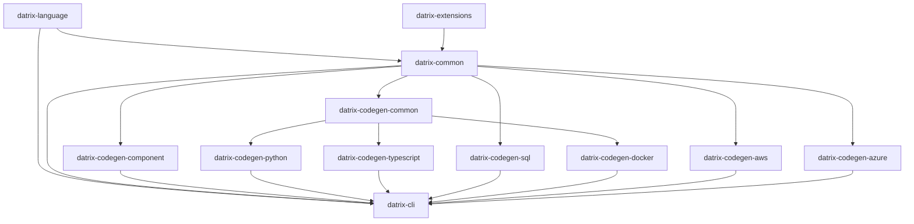

# Datrix Architecture Overview

**Version:** 2.1
**Last Updated:** June 23, 2026

---

## Introduction

Datrix is a code generation system that transforms `.dtrx` domain specifications into production-ready applications across multiple languages and platforms.

### Key Features

✅ **Template-Based Generation** - Jinja2 templates with automatic formatting
✅ **Fail-Fast Error Handling** - Errors caught at generation time, not runtime
✅ **Multi-Language Support** - Python, TypeScript, SQL
✅ **Multi-Platform Support** - Docker, AWS, Azure
✅ **Type-Safe** - Exhaustive type mappings with validation
✅ **Modular Architecture** - 12 installable packages (core toolchain + optional **datrix-extensions**) plus showcase and projects repos
✅ **Specification-Level Testing** - DSL `test` blocks transpile to pytest under `tests/spec/` (Python) and Jest under `test/spec/` (TypeScript); see the [spec testing documentation](../guide/spec-testing.md)
✅ **Event contracts** - `ensure` clauses on `publish` events enforce publisher-side validation before `dispatch`
✅ **External library interfacing** - `extern service` declarations generate typed HTTP clients and deployment wiring for user-built services
✅ **Serverless block code generation** - `serverless` blocks deploy handlers as Lambda functions, Azure Functions, or container processes with platform-specific entry points and infrastructure provisioning
✅ **Centralized runtime config store** - a system-level `configStore` section generates a runtime configuration plane (AWS AppConfig, Azure App Configuration, or self-hosted Consul KV), local JSON defaults, and Python/TypeScript runtime clients for feature flags and operational tuning without rebuilds
✅ **Zero-environment runtime** - generated services read zero environment variables; all deployment-static values (config-store endpoint, secrets-backend URL, region, credential kind) are baked as literal constants at generation time (see [Decision 14](#decision-14-runtime-configuration--secrets--zero-environment-architecture))

---

## Sub-Documents

This overview was split into focused sub-documents for easier navigation. Each sub-document preserves the original section headings.

- **[Pipeline Flow & Capabilities](architecture/pipeline-and-capabilities.md)** — System architecture, pipeline stages, standard library, phase 01/02/03 capabilities, search engine integration, CDN / content delivery, managed API gateway
- **[Repository Architecture & Plugins](architecture/repository-architecture.md)** — 13 packages, plugin system, domain extension system, extern services, application containers, adding a new language
- **[Builtin Traits & Enums](architecture/builtin-traits-enums.md)** — 10 builtin traits, 2 builtin enums, injection mechanism

### Moved section anchors

The following anchors previously lived in this file and are now in sub-documents. Update links accordingly:

| Old anchor in this file | New location |
|------------------------|--------------|
| `#system-architecture` | [pipeline-and-capabilities.md#system-architecture](architecture/pipeline-and-capabilities.md#system-architecture) |
| `#pipeline-flow` | [pipeline-and-capabilities.md#pipeline-flow](architecture/pipeline-and-capabilities.md#pipeline-flow) |
| `#standard-library` | [pipeline-and-capabilities.md#standard-library](architecture/pipeline-and-capabilities.md#standard-library) |
| `#phase-01-capabilities-python-and-docker` | [pipeline-and-capabilities.md#phase-01-capabilities-python-and-docker](architecture/pipeline-and-capabilities.md#phase-01-capabilities-python-and-docker) |
| `#phase-02-capabilities-python-docker-docs` | [pipeline-and-capabilities.md#phase-02-capabilities-python-docker-docs](architecture/pipeline-and-capabilities.md#phase-02-capabilities-python-docker-docs) |
| `#phase-03-capabilities-python-docker` | [pipeline-and-capabilities.md#phase-03-capabilities-python-docker](architecture/pipeline-and-capabilities.md#phase-03-capabilities-python-docker) |
| `#search-engine-integration` | [pipeline-and-capabilities.md#search-engine-integration](architecture/pipeline-and-capabilities.md#search-engine-integration) |
| `#cdn--content-delivery` | [pipeline-and-capabilities.md#cdn--content-delivery](architecture/pipeline-and-capabilities.md#cdn--content-delivery) |
| `#managed-api-gateway` | [pipeline-and-capabilities.md#managed-api-gateway](architecture/pipeline-and-capabilities.md#managed-api-gateway) |
| `#repository-architecture` | [repository-architecture.md#repository-architecture](architecture/repository-architecture.md#repository-architecture) |
| `#plugin-architecture` | [repository-architecture.md#plugin-architecture](architecture/repository-architecture.md#plugin-architecture) |
| `#domain-extension-system` | [repository-architecture.md#domain-extension-system](architecture/repository-architecture.md#domain-extension-system) |
| `#application-containers` | [repository-architecture.md#application-containers](architecture/repository-architecture.md#application-containers) |
| `#extern-services-external-library-interfacing` | [repository-architecture.md#extern-services-external-library-interfacing](architecture/repository-architecture.md#extern-services-external-library-interfacing) |
| `#adding-a-new-language` | [repository-architecture.md#adding-a-new-language](architecture/repository-architecture.md#adding-a-new-language) |
| `#builtin-traits-and-enums` | [builtin-traits-enums.md#builtin-traits-and-enums](architecture/builtin-traits-enums.md#builtin-traits-and-enums) |

---

## Dependency Graph



**Legend:**
- **datrix-common** (no dependencies) — Foundation and generation framework (AST model, type system, semantic analysis, standard library resources + loader protocols, config resolution, plugin protocols, generation framework). Does **not** import `datrix-language` — parser and stdlib-loader implementations are injected via protocols.
- **datrix-language** (depends on datrix-common) — Parser + CST-to-AST transformers, implements `ParserProtocol` and `StdlibParserProtocol` defined in datrix-common
- **datrix-extensions** (depends on datrix-common) — Optional domain packs; **not** required by `datrix-cli` or generators unless you declare `use extension` and install the pack
- **datrix-codegen-common** (depends on datrix-common) — Shared codegen intelligence: profile-driven transpiler, language-agnostic algorithms, context models, field analysis, parity checking, shared Grafana dashboard builder, GenDSL runtime, serverless/replayable-ingestion plans. Consumed by language codegen packages and by **all three** platform generators for its language-agnostic services.
- **Language Code Generators** (depend on datrix-codegen-common, which depends on datrix-common) — Python, TypeScript
- **Other Code Generators** (depend on datrix-common) — SQL, component
- **Platform Generators** (Docker, AWS, Azure) — all three depend on **datrix-codegen-common** for its language-agnostic platform services (GenDSL runtime, shared Grafana `DashboardBuilder`, serverless and replayable-ingestion plans, shared enums) as well as datrix-common. They must **not** import the language-specific parts of codegen-common (`transpiler.*`, language-shaped `context_models`/`algorithms`) or any language generator package — see the [platform → codegen-common subtree contract](../../datrix-common/docs/architecture/import-boundaries.md#platform--codegen-common-subtree-contract).
- **datrix-cli** (depends on datrix-common, datrix-language; owns `GenerationPipeline` orchestration; discovers generator plugins dynamically)

> **`datrix_codegen_common/platform/` subpackage.** A `platform/` subpackage lives **inside the existing `datrix-codegen-common`** — a sibling of `gendsl/`, `dashboards/`, `algorithms/`, and `context_models/`. **No new package or repo is created**: the shared provider seam (the `resolve_runtime_spec` / `runtime_stack_token` helpers and the `PlatformInfrastructure` protocol) is language-agnostic platform code, exactly the layer `datrix-codegen-common` already owns. Because the three platform generators already legally import `datrix-codegen-common`, `platform.*` simply joins the closed list of language-agnostic codegen-common subtrees platforms may import (alongside `gendsl.*`, `dashboards.*`, `algorithms.serverless`, `context_models.serverless`, `context_models.replayable_ingestion`, `enums`) — no new graph node and no new boundary edge. The shared Grafana `DashboardBuilder` **stays in `datrix-codegen-common/dashboards/`** and platforms continue to import it directly; there is no re-home and no `ObservabilityIntegration` facade. See [Shared Provider Library](../../datrix-codegen-common/docs/architecture.md#shared-provider-library-platform) and [Decision 12: Language-Agnostic Provider Generators](#decision-12-language-agnostic-provider-generators).

**Import boundary enforcement:** The dependency edges above are enforced by automated tooling — see [Import Boundaries](../../datrix-common/docs/architecture/import-boundaries.md) for the full rule table and scanner usage. The scanner currently reports a known lower-bound caveat: files carrying a UTF-8 BOM are silently skipped (read with `encoding="utf-8"`), so the violation count is a lower bound until the scanner reads with `encoding="utf-8-sig"`. Fixing that is a tracked scanner-robustness follow-up, separate from the boundary-rule reconciliation.

---

## Core Principles

1. **Fail Fast, Fail Loud** — Catch errors at generation time, not runtime. See [Design Principles](./design-principles.md).
2. **Template-Based Generation with Formatters** — Jinja2 templates with ruff format (Python) / Prettier (TypeScript). See [Design Principles](./design-principles.md).
3. **Exhaustive Type Mappings** — All type mappings must be explicit; fail if unmapped. See [Design Principles](./design-principles.md).
4. **Immutable AST Model** — The Application model cannot be modified after creation (thread-safe, predictable). See [Design Principles](./design-principles.md).
5. **Single Responsibility** — Each repository has ONE clear purpose (`datrix-common`: AST + framework; `datrix-language`: parser; each codegen: one language/platform).

---

## Technology Stack

### Languages & Frameworks
- **Python 3.11+** - All implementations
- **Tree-sitter** - Parser generation
- **Pydantic v2** - Data validation

### Code Generation
- **Jinja2** - Template-based code generation
- **ruff format** - Python code formatting
- **Prettier** - TypeScript code formatting
- **ruamel.yaml** - YAML generation
- **Transpiler** — `StagePipeline` + `TranspileContext` + `TranspileResult` + visitor protocols (`datrix_common.transpiler`, `datrix_common.datrix_model.visitor_protocols`); see [datrix-common-api — Transpiler modules](../../../datrix-common/docs/datrix-common-api.md#transpiler-modules)

### Code Quality
- **ruff** - Python linting and formatting
- **mypy** - Type checking (strict mode)
- **pytest** - Testing

### CLI
- **Typer/Click** - CLI framework
- **Rich** - Terminal UI

---

## Key Architectural Decisions

### Decision 1: No Separate IR Layer

**Rationale:**
- The parser produces the Application (AST model) directly
- There is no IR layer; the AST model is the single representation
- Fewer transformations means fewer bugs

**Result:** The AST model (`Application`, `Entity`, `Service`, etc.) lives in `datrix-common`. The parser in `datrix-language` produces `Application` objects but the type is defined in `datrix-common`, making the AST available to all packages without depending on the parser.

---

### Decision 2: `datrix-codegen-*` Naming

**Rationale:**
- Shows family relationship (all codegen)
- They extend/specialize `datrix-common`
- User mental model: "codegen for Python"

**Result:**
- `datrix-codegen-python` (not `datrix-generator-python`)
- `datrix-codegen-typescript`
- `datrix-codegen-sql`

---

### Decision 3: One Repo Per Platform

**Rationale:**
- Independent versioning
- Independent releases
- Clear ownership
- Plugin architecture

**Result:** Separate repos for Docker, AWS, Azure

---

### Decision 4: One DateTime Type, Always Timezone-Aware

**Rationale:**
- A timezone-aware datetime and a UTC datetime are the same *type* with different *values* for the timezone component — UTC is just one timezone
- Having separate `UDateTime` / `UDate` / `UTime` types implies UTC is structurally different from other timezones, which it isn't
- Naive datetimes (no timezone info) are almost always a bug in server code
- The Python ecosystem is moving away from naive datetimes; JavaScript's `Date` is always aware

**Result:**
- **`DateTime`** is always timezone-aware. There is no naive datetime in the DSL.
- **`Timezone`** is a builtin object that specifies which timezone. `Timezone.UTC` is the default; `Timezone.of("America/New_York")` for arbitrary IANA timezones.
- **`DateTime.now()`** defaults to UTC (no argument needed). `DateTime.now(Timezone.of("US/Eastern"))` for other timezones.
- `UDateTime`, `UDate`, `UTime` and all aliases (`UTCDateTime`, `DateTimeUTC`, `Instant`, `UTCDate`, `UTCTime`) are removed.
- `DateTime.utcNow()` is removed — it's just `DateTime.now()`.
- `Date` and `Time` remain timezone-unaware (calendar dates and wall-clock times don't carry timezone semantics).

---

### Decision 5: Generator Definition DSL (Implemented)

**Rationale:**
- Generator implementations encode structure (file declarations, iteration patterns, feature gates, semantic requirements) as imperative Python — registries, class constructors, context builders, and template rendering paths
- The same structural information is split across multiple locations, making it hard to answer "what does this generator produce?"
- Feature gates are repeated and sometimes implicit; semantic contracts are not declared adjacent to file emission; context dictionaries are often untyped
- Platform generators cannot reuse the language-generator registry model

**Result:**
- A constrained generator-definition DSL (genDSL) embedded in Python docstrings declares generator structure: identity, domains, feature gates, semantic requirements, iteration scopes, context models, file declarations, and cross-domain contributions
- The genDSL compiles in memory at import time into Python IR objects (`GeneratorDefinition`, `DomainDefinition`, `FileDefinition`, etc.) consumed by the existing generator runtime — no generated source files, no checked-in artifacts
- Python remains the implementation language for context builders, type resolvers, transpilers, and complex algorithms; the genDSL declares structure, Python implements computation
- IR foundation types live in `datrix-common`; the parser, validator, and runtime live in `datrix-codegen-common`; each generator package embeds its own genDSL definitions
- When a generator migrates to genDSL, the entire registry moves at once — no partial migration, no mixed sources, no backward compatibility wrappers

**Design reference:** [GenDSL Documentation](../../../datrix-codegen-common/docs/gendsl/overview.md) — Complete specification in datrix-codegen-common/docs/gendsl/

---

### Decision 6: Deployment Target Contract (Stable)

> **Superseded in part by Decision 15 (Multi-Target Plugin Architecture, Planned — Design 023):** the closed `language`/`provider` value sets and the fixed generator-orchestration lineup table below are replaced by open identity (`LanguageId`/`ProviderId`) and declared phase + `runs_after` ordering when design 023 DI-2/DI-3 land. The content below documents the current (pre-023) contract and remains accurate until then.

**Rationale:**
- Legacy models conflated runtime packaging shape, infrastructure provider, and cloud-managed targets into a single dimension
- "Docker Compose" and "ECS Fargate" are runtime/packaging targets, not cloud providers; "AWS" and "Azure" are providers, not runtimes
- One-dimensional models cannot express combinations like "ECS Fargate on AWS" or "Azure App Service on Azure" without overloading terms
- CLI overrides can create partial deployment states where the command line says one target but resolved config still contains values for another

**Result:**
- An explicit deployment target model replaces the single `hosting` dimension with three orthogonal fields:

```yaml
language: python | typescript

deployment:
  runtime: docker-compose | azure-app-service | ecs-fargate | app-runner
  provider: local | existing | aws | azure
  registry: acr | ecr | ...           # optional, provider-specific
```

- `language` selects the generated application implementation
- `deployment.runtime` selects the deployable artifact shape (Compose, Azure App Service, ECS Fargate, etc.)
- `deployment.provider` selects the infrastructure provider or substrate owner
- `deployment.registry` is an optional provider-specific refinement
- There is no `target` dimension; cloud deployments use only native runtimes (`ecs-fargate`/`app-runner` for AWS, `azure-app-service` for Azure)
- `host` remains a network endpoint concept only — never used to mean AWS, Azure, or Docker

> **Note:** `runtime: azure-container-apps` is **retired**. Use `runtime: azure-app-service` for the native Azure PaaS runtime. Specifying the retired value raises a generation error with migration guidance.

**Construct-mapped realization:** Once a deployment target is resolved, each DSL block maps to the target platform's native primitive. Service deployment shape is derived entirely from declared blocks — no separate per-service runtime selector is needed. See [Design Principles — Construct-Mapped Platform Realization](./design-principles.md#11-construct-mapped-platform-realization-stable) for the full mapping table and rationale.

**Concept matrix:**

| Concept | Examples | Owns |
| --- | --- | --- |
| Language | `python`, `typescript` | Application source code, framework/runtime adapters, language package/dependency files |
| Runtime | `docker-compose`, `azure-app-service`, `ecs-fargate`, `app-runner` | Deployable artifact shape and process model |
| Provider | `local`, `existing`, `aws`, `azure` | Provider-managed substrate, registry, identity, networking, managed services |
| Infrastructure flavor | `container`, `external`, `rds`, `flexible-server`, `event-hubs` | Per-block provisioning choice (RDBMS, cache, pubsub, etc.) |
| Host | `db.example.com`, `api.example.com`, `localhost` | Network endpoint |

**Deployment examples:**

```yaml
# Local Docker Compose
language: python
deployment:
  runtime: docker-compose
  provider: local

# AWS App Runner
language: python
deployment:
  runtime: app-runner
  provider: aws
  registry: ecr

# Azure App Service (native PaaS)
language: python
deployment:
  runtime: azure-app-service
  provider: azure
  registry: acr

# AWS ECS Fargate
language: python
deployment:
  runtime: ecs-fargate
  provider: aws
  registry: ecr
```

**Generator orchestration** becomes multidimensional:

| Deployment | Language generators | Runtime generators | Provider generators |
| --- | --- | --- | --- |
| Python Docker Compose local | `component`, `python`, `sql` | `docker` | none |
| TypeScript Docker Compose local | `component`, `typescript`, `sql`, `python_http_contract_overlay` | `docker` | none |
| Python Azure App Service | `component`, `python`, `sql` | none (PaaS) | `azure` App Service + managed infra |
| Python ECS Fargate | `component`, `python`, `sql` | none (PaaS) | `aws` ECS/Fargate/managed infra |

Provider-native runtimes are produced entirely by their provider generator. The `docker-compose` runtime is local-only — it is never paired with a cloud provider, and provider generators never augment Compose output. For `runtime: azure-app-service`, the Azure generator produces all infrastructure Bicep — there is no separate runtime generator. For `runtime: ecs-fargate` / `app-runner`, the AWS generator produces all infrastructure directly.

**Explicit config rule:** Defaults are an anti-pattern for deployment generation. Every deployment-relevant field must come from resolved config. Missing required fields must produce explicit errors naming the config path and expected field. Invalid combinations must produce validation errors rather than being corrected silently. No generator may override a user-provided config value.

**Validation rules:** Provider values are scoped by runtime:

| Runtime | Valid providers |
| --- | --- |
| `docker-compose` | `local` |
| `azure-app-service` | `azure` |
| `ecs-fargate` | `aws` |
| `app-runner` | `aws` |

**CLI contract:** Deployment-affecting values are not accepted as one-off CLI overrides. `datrix generate` reads `language` and `deployment` from resolved config. `--hosting` and `--platform` generation-time overrides are removed. Users who need to change deployment target edit config files (or use a `datrix config set-deployment` helper command that writes config explicitly).

**Output path contract:** Generated output paths include language, runtime, and provider:

```text
.projects/<app>/<language>/<runtime>/<provider>/
```

---

### Decision 7: Extension Naming — PostGIS Split

**Rationale:**
- The current `geo` extension is semantically a PostGIS pack: it owns `Geometry`, `Geography`, `GeoSql`, PostGIS database extension validation, PostGIS migration templates, and PostGIS/geometry runtime dependencies
- Raster helpers (tile grid calculation, GeoTIFF parsing) are database-independent operations that should not inherit PostGIS infrastructure or dependency behavior
- A single `geo` name conflates two distinct concerns: PostGIS-coupled spatial types and database-independent geospatial computation

**Result:**
- The existing PostGIS-backed extension is renamed from `geo` to **`postgis`** with no backward compatibility alias
- The `geo` name is reclaimed for a new generic, database-independent geospatial extension providing raster and tile helpers (`GeoTile`, `GeoTiff`)
- Existing DSL projects that declare `use extension geo;` for PostGIS behavior must update to `use extension postgis;`
- The `DatrixExtension` protocol gains a **`value_struct_definitions()`** surface so extensions can contribute named struct types (e.g., `GeoBounds`, `GeoTileSpec`, `GeoElevationGrid`) in addition to scalars and builtin objects

**Extension ownership after split:**

| Extension | DSL declaration | Provides |
| --- | --- | --- |
| `postgis` | `use extension postgis;` | `Geometry`, `Geography` spatial types, `GeoShape.*` value-level ops, `GeoSql.*` SQL expressions, PostGIS database extension, geoalchemy2/shapely/turf dependencies |
| `geo` | `use extension geo;` | `GeoTile.*` tile grid operations, `GeoTiff.*` raster parsing, `GeoBounds`/`GeoTileSpec`/`GeoElevationGrid` value structs (Python helpers only in Phase 1; TypeScript fails loudly until helper support is added) |

**Core `Geo.*` stdlib** (distance, tile coordinate math) remains unaffected — it is always available without any extension declaration.

---

### Decision 8: Incremental RDBMS Schema Migrations

**Rationale:**
- Generated services with RDBMS entities are deployed with an initial schema migration applied. If a later regeneration rewrites that initial migration to include newly added fields, the live database does not change because migration engines track applied revision IDs, not changed file contents
- Generated application code can then reference columns that do not exist in the deployed database
- Python/Alembic and TypeScript/MikroORM both exhibit this gap: a fixed initial migration file is overwritten on each generation, but once applied, no new migration identity is created for schema changes

**Result:**
- **Canonical schema snapshots** — Language-neutral JSON files (`schema.json`) under `{app_dir}/.datrix/rdbms-migrations/{rdbms_id}/` record the deployed database contract
- **Revision ledger** — An append-only JSON file (`ledger.json`) in the same directory records ordered Datrix revision IDs and database-agnostic canonical migration operations
- **RDBMS UUID identity** — Every `RdbmsConfig` in ConfigDSL requires an `id: UUID` field. This UUID is the canonical migration identity, independent of service name, block alias, profile, engine, platform, or output directory
- **Immutable migration history** — Once generated, a migration revision file is append-only. Later generations append new revisions; they never rewrite previous revisions
- **Append-only file retention** — `GeneratedFile` gains a `retention` field (`"normal"` or `"append_only"`). `FileWriter` and manifest logic preserve append-only files across regenerations and reject content changes
- **Shared diff and safety policy** — Schema changes are classified as `safe`, `risky`, or `blocked` before adapter rendering. Destructive changes (field/table removal, rename, type narrowing, enum removal) are generation errors — no ConfigDSL or CLI override converts them to automatic migrations
- **Target-language adapter protocol** — `RdbmsMigrationAdapter` in `datrix-codegen-common` defines the contract. Python/Alembic, TypeScript/MikroORM, and SQL are adapters that render target-native migration files from shared canonical state
- **Shared-owned RDBMS migrations** — Shared RDBMS blocks generate migration files under `SharedPaths.rdbms_dir`, not under a consuming service. Platform generators create one migration apply unit per shared `rdbms_id`

**State ownership:** The migration orchestrator owns snapshot/ledger lifecycle. Adapters render target-native files from `MigrationState` but do not load, write, or allocate revision IDs. Canonical state (`schema.json`, `ledger.json`) lives under the application source folder and is target-language/platform/engine agnostic.

**Reference:** [RDBMS Migration Decisions (D1-D23)](rdbms-migration-decisions.md) | [Migration API](../../../datrix-common/docs/architecture/migration.md) | [Adapter Protocol](../../../datrix-codegen-common/docs/migration-adapter.md)

---

### Decision 9: Centralized Runtime Config Store

**Rationale:**
- ConfigDSL (`.dcfg`) resolves configuration at generation/deploy time and bakes it into generated code, env vars, Compose files, and cloud infrastructure. That cannot support operational changes that must happen without rebuilding and redeploying an image: feature flags and kill switches, rate-limit/TTL/retry/timeout tuning, per-environment overrides of the same artifact, and secret-rotation coordination
- Datrix needs to generate the runtime config-store infrastructure, initial values, access permissions, and language-specific runtime clients while preserving the existing static ConfigDSL pipeline
- A runtime config plane must not become a backdoor for secrets — it stores only non-sensitive values and *references* to secrets, never secret values

**Result:**
- A system-level `configStore` section is added to existing **system** ConfigDSL. No application DSL grammar change is introduced — the runtime plane is purely an infrastructure + generated-client capability. The resolved object attaches to `app.system.config.config_store` via `SystemConfigProfileConfig.config_store` (`ConfigStoreConfig | None`)
- `configStore` is **additive and gated**: services receive a generated runtime client only when `configStore` is present; apps without it produce byte-equivalent output (no client files, no new env vars, no config-store infrastructure). It does **not** replace service/system `.dcfg` — ConfigDSL remains the source for generation-time and deploy-time configuration. The config store adds runtime-mutable keys only
- **Supported engines (initial set):** AWS AppConfig (`engine: aws-managed`, `platform: managed`), Azure App Configuration (`engine: azure-managed`, `platform: managed`), and self-hosted Consul KV for Docker (`engine: consul`, `platform: container` or `external`). Parameter Store and etcd are future extensions
- **Centralized compatibility validation:** engine/platform/provider combinations are validated in `datrix-common` during system config resolution, using the resolved deployment runtime/provider plus config-store engine/platform. Unsupported combinations fail loud with diagnostics naming runtime, provider, engine, and platform. Generator-side `GenerationError` guards remain as a defensive backstop. There is no silent fallback from cloud config to local JSON — local defaults are client startup data, not an infrastructure substitute
- **Generated clients** (Python and TypeScript) share one conceptual API: `start/stop/refresh`, typed scalar accessors (`get_bool/get_int/get_float/get_string`), `get_namespace`, and `get_secret_ref`. The dynamic API is the public contract; generators also emit typed namespace/key constants (Python frozen constants, TypeScript `as const` + literal types) but no per-key accessor methods. Behavior: cache seeded from generated defaults, remote values merged over defaults profile-by-profile, unknown namespace/key access raises, single background poll task per process, and explicit fail-open (log-and-continue) vs fail-closed (fail startup / raise on refresh) semantics
- **Secrets boundary:** keys may declare a `secretRef` (provider + name/path + optional version) — a non-sensitive pointer. Scalar accessors raise for `secretRef` keys; only `get_secret_ref` returns reference metadata. Actual secret values resolve through generated secret-manager access code (Vault, Azure Key Vault, AWS Secrets Manager, env). Secret-manager read permissions are generated from declared secret references, not from arbitrary runtime values. Raw secret-looking defaults are rejected using the same placeholder/secret hygiene as extern-service config
- **Feature-flag profiles** (`kind: featureFlag`) may contain only `Boolean` keys and render to provider-native feature-flag shapes (AppConfig feature flags, Azure feature-management content type); non-Boolean runtime values use `kind: freeform`

**Engine compatibility matrix:**

| Deployment target | aws-managed (AWS AppConfig) | azure-managed (Azure App Configuration) | consul container | consul external |
| --- | --- | --- | --- | --- |
| Docker/local | invalid | invalid | supported | supported |
| AWS provider | supported | invalid | invalid | supported |
| Azure provider | invalid | supported | invalid | supported |

**Reference:** [Config Store Schema](../../../datrix-common/docs/config-store.md) — `ConfigStoreConfig` schema and validation rules

---

### Decision 10: Database Drift Detection & Reconciliation

**Rationale:**
- The migration engine is purely source-driven and offline: every revision diffs a **recorded** baseline (`schema.json`) against a **desired** snapshot built from the AST. It never consults the live database — deliberate, so generation runs in CI without DB access, but it leaves the engine blind to the actual deployed schema
- When a database is changed out-of-band (manual hotfix during troubleshooting, restored backup, partially-applied migration, parallel environment), the recorded baseline `R`, the live schema `L`, and the desired schema `D` diverge silently. The engine plans `R → D` and applies it against a database already at `L`, colliding with the out-of-band edits
- This is a generic framework gap, not a per-project problem: any Datrix project whose database drifts from the recorded baseline hits it

**Result:**
- **Live snapshot is a third source of `RdbmsSchemaSnapshot`** — an environment-side exporter (where the DB is reachable) reflects the live catalog into a portable, hash-verified `live-schema-snapshot.json`. Datrix imports the artifact offline; the entire existing diff → classify → allocate → ledger pipeline is reused unchanged
- **Datrix never connects to a live database** — generation and the new `drift`/`reconcile` commands accept only `--live-snapshot <path>`; credentials, connection strings, and reachability stay in the deployment environment
- **Shared canonicalization** normalizes both source-built and imported live snapshots (implicit/backing indexes, PK-derived constraints, default-literal formatting, type aliasing, identifier casing, index column ordering) so equivalent schemas canonicalize to zero drift
- **Read-only drift detection** — `datrix migrations drift --live-snapshot` reports `diff(recorded R, live L)` classified, exits non-zero when drift exists (CI-guard friendly), and never writes the ledger or DB
- **Append-only reconciliation** — `reconcile --adopt` appends an `adopted` revision whose after-state is `L`, sets `R := L`, and records live-snapshot alignment separately (a sibling of the `adapter-alignment.json` precedent), running no DDL; `reconcile --to-desired` emits `diff(L, D)` as a reconciliation revision with destructive entries `blocked` exactly as in source-driven generation — no override flag
- **Adopt records reality; converge generates DDL** — adopting an observed dropped column documents fact (safe); regenerating one away is gated by `change_policy` (blocked). The ledger gains an `"adopted"` classification and an explicit non-DDL `adopt_live_schema` operation (schema version bumped)
- **Policy split** — a per-environment selector (default off) makes production treat drift as a guard (detect & refuse, never auto-reconcile) while pre-prod gains the reconcile loop. First reflector scope: Postgres, MySQL, MariaDB (MariaDB routes through the MySQL-family reflector, matching the existing dialect mapping)

**Reference:** [RDBMS Migration Decisions D24–D29](rdbms-migration-decisions.md#database-drift-detection--reconciliation-d24d29) | [Migration API](../../../datrix-common/docs/architecture/migration.md)

---

### Decision 11: Typed Inter-Service Calls & Dependency Resilience Policy

**Rationale:**
- A cross-service call is an RPC against another service's endpoint contract — the network is where type safety matters most — yet the call surface carried the provider's HTTP **path as a string argument** (or, worse, no route at all), so a typo, stale path, or wrong-typed value became a runtime 404/422/500 instead of a generation error, and a pathless positional call could silently resolve to the wrong endpoint
- Cross-service responses were untyped `JSON`, so every consumer hand-wrote shape validators against the same peer shapes
- Resilience was keyed on the dependency/path rather than the endpoint operation it actually invokes, and was either mechanically tied to the call or expressible only as per-service config repetition — there was no operation-level policy (a failed cache write could fail a route whose source of truth already committed; a rate-limit counter could fail open)
- A single `/health` endpoint conflated process liveness, readiness, and degraded-but-serving states, so deployment probes could not distinguish them

**Result — two coupled pillars that land together:**

**Pillar A — Typed, named inter-service call surface.** Cross-service callability is bound to the explicit internal-API boundary:
- A custom endpoint is cross-service-callable **if and only if** it is marked `access(Service)`. A service-facing custom endpoint **must** carry a name (placed after the HTTP method, like a function name); external-facing endpoints (`public`, `access(authenticated)`, role-gated) carry no cross-service name and are unreachable as RPCs. Exposing an endpoint to peers is the deliberate act of marking it `access(Service)`, never a side effect of naming — so a peer can never invoke a user-facing endpoint and bypass its end-user authorization context
- The cross-service identity is `(HTTP method, name)`. Callers invoke a custom endpoint as `Service.Block.<method>.<name>(args)` and a resource (auto-CRUD) endpoint as `Service.Block.<db>.<Entity>.<op>(args)`, with typed arguments (positional then named) and **no route string**. Endpoint identity is a stable contract; the `@path`/URL is a deployment detail that can change without breaking callers
- The string-path, interpolated-path, and pathless positional forms are removed outright (no backward-compatible alias)
- A named call's static type is the provider's declared return type, surfaced in the caller as a generated, validated **response struct** (transitive type closure; only `-> JSON` endpoints stay untyped), eliminating hand-written boundary validators

**Contract registry.** A cross-service endpoint contract registry — keyed by endpoint identity, not route — is built at generation time as a **complete, consistent, content-pinned snapshot** of every transitive dependency, and is consumed identically by validation and codegen. A missing dependency contract is a distinct, actionable diagnostic (regenerate the dependency first), never confused with a genuinely-absent endpoint; resolution never binds against a stale provider revision.

**Pillar B — Application-level dependency resilience policy.** Resilience is a property of the dependency, declared once and applied everywhere; the generator never synthesizes values and never auto-classifies operations:
- A `dependencyPolicy` section under `resilience` declares per-dependency-kind (`cache`, `rdbms`, `pubsub`, `objectStorage`, `service`, `extern`) availability, health severity, and operation-level `onFailure` behavior. A safe baseline is authored **once at the application level** (a `defaults` block every dependency of that kind inherits); an individual dependency overrides only where it differs
- A policy-managed operation, or a `service` dependency that has inter-service calls, left uncovered at every level is a generation error (`RESILIENCE_POLICY_REQUIRED`) — nothing is invented to fill the gap. Degradation applies only where the author declared it and the operation semantics permit (e.g. a cache write may degrade only when known to run after the source-of-truth commit)
- Every typed inter-service call routes through a generated **per-dependency resilient client** driven by that policy. Timeout, circuit breaker, and bulkhead are non-amplifying and stay on; **retry is off by default** and enabled only when the provider endpoint is marked `idempotent` (HTTP `GET` is not a safe proxy for idempotency), and even then is bounded by a retry budget and suppressed while the breaker is open
- Generated services expose `/live` (process liveness), `/ready` (required dependencies), and `/health` (detailed, including degraded optional dependencies) with distinct semantics; deployment probes point at `/ready`. The prior single-`/health` contract is replaced outright

**Reference:** [Pipeline & Capabilities — Inter-service typed calls and dependency resilience](architecture/pipeline-and-capabilities.md#phase-02-capabilities-python-docker-docs) | [Design Principles — Explicit Over Implicit / Configuration Boundary](./design-principles.md#7-explicit-over-implicit)

---

### Decision 12: Language-Agnostic Provider Generators

> **Superseded in part by Decision 15 (Multi-Target Plugin Architecture, Planned — Design 023):** the language-agnostic `LanguageRuntimeSpec` consumption pattern described below is widened into a full `PlatformPlugin` aggregate — bundling descriptor, generator, infrastructure, a new `PlatformRuntimeSpec`, and a new `PlatformCapabilityDeclaration` (design 023, D3/D6/D7) — when design 023 DI-3/DI-4 land. The content below documents the current (pre-023) contract and remains accurate until then.

**Rationale:**
- Provider generators (AWS, Azure) were coupled to the target language in a way runtime generators (Docker) were not: Docker discover the language via the `LanguageRuntimeSpec` protocol and ask it for language-appropriate commands, while AWS branched on the `Language` enum inline and hardcoded Python idioms (CDK stack language, scheduled-job command), and Azure hardcoded the App Service `gunicorn … uvicorn` startup command and `PYTHON|…` `linuxFxVersion`
- Consequence: a new target language required editing every provider generator independently, and a new provider had to re-derive language handling from scratch instead of inheriting it
- There was no shared home for provider-level, language-agnostic concerns (config resolution, observability integration, networking/auth/managed-service provisioning), so each provider re-implemented them

**Result:**
- **Language is discovered, never branched.** Every platform generator obtains language-specific runtime details from `LanguageRuntimeSpec` via `discover_language_runtime_spec(target_language)`, exactly as Docker do. Zero `Language`-enum branches and zero `language_name == "…"` string comparisons remain in any platform package's application-wiring code (Docker, AWS, Azure)
- **The `LanguageRuntimeSpec` protocol gains exactly three language-agnostic methods** (default-free abstract declarations, implemented in `datrix-codegen-python` and `datrix-codegen-typescript`, covered by the Design 014 parity gate): `container_command(service, package_name) -> list[str]` (the explicit HTTP-service start command; sole consumer is Azure App Service — AWS inherits its container `ENTRYPOINT` from the built Docker image and needs no wiring), `hosts_consumers_in_process() -> bool` (whether the language runs scheduled-job / event-consumer / queue-worker containers in-process on Compose), and `project_language() -> ProjectLanguage` (the language's own `ProjectLanguage` member, replacing a silent string→enum fallback). `health_check_endpoint` is **not** added — the readiness path is the shared, language-neutral `HTTP_HEALTH_CHECK_PATH = "/ready"` constant
- **IaC language ≠ application language.** The language a provider authors its infrastructure artifacts in (AWS CDK Python, Azure Bicep) is independent of the generated application's language. A TypeScript app deployed via AWS still gets Python CDK stacks; the CDK references a TypeScript container command obtained from the runtime spec. AWS collapses its three Python-IaC string constants into one named `_CDK_IAC_LANGUAGE` constant documenting this invariant
- **The `datrix_codegen_common/platform/` subpackage** (inside the existing `datrix-codegen-common`, a sibling of `gendsl/`, `dashboards/`, `algorithms/`, `context_models/` — **not a new package**) is the shared home for provider-level concerns that are language-agnostic and shared by ≥2 platforms: the `resolve_runtime_spec(context)` discovery helper (raises `GenerationError`, never falls back to Python), the `runtime_stack_token(lang_spec, runtime_version)` `LANG|VERSION` composer, and the `PlatformInfrastructure` protocol. The shared Grafana `DashboardBuilder` already lives in `datrix_codegen_common/dashboards/` and platforms import it directly — no re-home, no facade
- **`PlatformInfrastructure` protocol** (`@runtime_checkable`, in `datrix_codegen_common/platform/`) expresses provider-level infrastructure surfaces — `network_topology(app)`, `service_to_service_auth(app)`, and `provision_managed_service(block, block_kind, service)` — exposed as a `platform_infrastructure` property on each `PlatformGenerator` subclass. Every platform implements the **full** protocol: clouds fully; Docker return explicit no-op value objects (`NetworkTopology.none()`, empty `ManagedServicePlan`) — honest "no VPC/IAM" facts, never silent stubs. Value objects (`NetworkTopology`, `ServiceAuthModel`, `ManagedServicePlan`) are frozen Pydantic models in `datrix_codegen_common/platform/`, keeping provider concepts out of the AST model
- **The platform seam is the existing `PlatformGenerator` + `datrix.platforms` entry-point group** — discovered via `discover_platforms`. No new `PlatformAdapter` type is introduced. `PlatformInfrastructure` and the shared `DashboardBuilder` are *consumed by* `PlatformGenerator` subclasses, never a competing discovery contract. A new provider implements a `PlatformGenerator` subclass + a `PlatformInfrastructure` implementation, and *consumes* the shared `DashboardBuilder` (`datrix_codegen_common.dashboards`) and `LanguageRuntimeSpec` — language support is free

**Reference:** [Repository Architecture — Platform Generators](architecture/repository-architecture.md#platform-generators-3) | [Import Boundaries — Platform → codegen-common subtree contract](../../datrix-common/docs/architecture/import-boundaries.md#platform--codegen-common-subtree-contract)

---

### Decision 13: Managed Identity Provider Integration

**Rationale:**
- Every production application needs authentication, but Datrix previously generated only self-managed JWT validation (a static configured public key) plus role-based `access(role)` checks. Users had to hand-build the rest: a `User` entity with `passwordHash`, password hashing, login/register endpoints, token minting, refresh tokens, and MFA — error-prone, insecure by default, and repeated in every project.
- The generated auth path had concrete foot-guns: a static public key instead of a JWKS endpoint (no key rotation), a transitive `ROLE_HIERARCHY` that implicitly widened authorization, and self-minted tokens — all properties of the local-auth model rather than a managed identity provider.
- Authentication ("who are you") belongs to a managed identity provider (Cognito, Microsoft Entra, Zitadel); the application should validate provider-issued tokens, not own credentials, sessions, or token issuance.

**Result — managed identity replaces manual authentication (no backward compatibility):**

- **DSL is semantic, config is operational.** An `identity { provider <name> config('<path>') { … } }` block declares logical provider names, application-visible identity fields (type-first, e.g. `String company;`), and `group "<provider-local>" as <datrixRole>` mappings. Operational settings (MFA, password policy, social login, token lifetime, callback/logout URLs, tenant/realm/pool, claim paths) live only in the referenced provider `.dcfg` file. The provider *type* lives in config, not `.dtrx`.
- **Unified `auth(...)` protected-surface contract.** Every externally reachable REST/GraphQL/WebSocket/webhook/externally-invokable-serverless surface resolves exactly one effective `AuthContract`. Forms: `auth(public)`, `auth(required, providers: […])`, `auth(optional, providers: […])`, `auth(required, providers: […], roles: […])`, `auth(service, providers: […])`, `auth(webhook)`. `providers: [...]` is a **set** (issuer selects the provider; no fallback order); `roles: [...]` is **any-of** with **no transitive hierarchy**. Non-public, non-webhook modes require an explicit provider list — there is no application default provider and no implicit public default. `auth(webhook)` instead requires a mandatory `verify(...)` contract whose scheme authenticates the external sender: a generic `hmac` scheme covers arbitrary senders, with a provider registry retained as a convenience for well-known signature formats (e.g. Stripe, GitHub, Slack).
- **`AuthContract` replaces `AccessLevel` + `Endpoint.required_roles`/`Endpoint.access_level`.** The legacy `AccessLevel` enum, the `Endpoint.access_level`/`Endpoint.required_roles` fields, and the `is_public`/`is_service_facing`/`is_authorized()` predicates in `datrix-common` are **deleted, not adapted**. The transformer's modifier-string + `@authorize`-decorator access handling lowers to a frozen `AuthContract` (`mode`, `providers`, `roles`, `principalTypes`, `surfaceId`, `delegation`, `profile`, `verify`). The generated auth code drops `ROLE_HIERARCHY`/`_expand_roles` — a deliberate forward-only break: a token previously passing a check only via transitive role inclusion no longer passes unless it carries the literal role.
- **Provider is the source of truth; the stable local id is deterministic by default.** Datrix never mints primary tokens. It validates provider tokens via issuer/audience/client/JWKS. The stable local user id is resolved by an explicit per-provider `localIdentity` strategy carried in the plan: the **default `deterministicUuid5`** computes `userId = uuidv5(c9a255a1-350b-4414-beb9-7f06f7dfd92d, "<provider>:<sub>")` — stateless, uniform across services, UUID-shaped, no tables and no first-auth upsert. The frozen namespace is defined once in `datrix-common` and read from the plan by both codegens (never redeclared). Server-side profile attributes + cross-IdP account linking are an **opt-in** feature: declaring `profileProjection { enabled = true; profileStore = <service>; }` selects `localIdentity = projected`, which injects the Datrix-managed `IdentityProfile` (+ `IdentityLink` keyed `(providerName, providerSubject)`) into the single **explicitly declared** store and upserts on first auth. Store resolution is fail-loud — an enabled projection with an unresolvable `profileStore` is a generation error, never a silent runtime disable. Providers on the default path inject no identity tables; per-request attributes come from validated token claims (with `required` identityFields enforced 401-at-the-edge), and tenancy is app-owned via onboarding. Account linking is explicit and verified; weak email-only linking is forbidden.
- **Opinionated per-target providers.** Docker → Zitadel (provisioned with project/organization import, clients, groups/roles, social providers — Google, GitHub, generic-OIDC); AWS → Cognito User Pool (app-level, per-service app client); Azure customer → Microsoft Entra External ID, Azure workforce → Microsoft Entra ID, Azure machine → user-assigned managed identity (app registration via the Microsoft Graph Bicep extension, never a `deploy-identity.sh` stub). `provider self` (`ProviderPlanEntry.mode="self"`) is a Datrix-managed Zitadel issuer realizable on Docker targets — Docker reuses existing Zitadel provisioning; a self-host Zitadel instance on a cloud target (AWS/Azure) raises a `GenerationError` (external mode must be used to consume a remotely-hosted Zitadel). `mode: external` consumes issuer/JWKS/audience/client and provisions nothing. A capability matrix in `datrix-common` is the authoritative source for supported `(providerType, target, feature)` combinations; unsupported combinations fail loud.
- **Structured versioned provider plan.** A `config/generated/identity-providers.json` artifact (schema owned by `datrix-common`, one per application+environment) carries providers, surfaces, role/attribute mappings, revocation mode, and `*_SECRET_REF` names. Runtime guards resolve provider per surface by issuer from `plan.surfaces[surfaceId]` — never a hardcoded provider name. A non-secret public-client metadata artifact (`identity-client-<provider>.<env>.json`) is the only supported input for frontend login config. Secrets are `ConfigSecretRef` references only (reusing the existing structured secret model + raw-secret hygiene), wired to platform-native secret stores; raw secrets never appear in source, manifests, logs, or docs.
- **Security-sensitive defaults fail closed.** Auth/JWKS-refresh failures, authorization-bearing cache reads/deletes (revocation, role mappings, identity links), and revocation checks reuse the existing `dependencyPolicy` model with `onFailure="raise"`/`"deny"` only (the model has no `fallback`). Error bodies are opaque (RFC 7807) and never leak issuer/audience/client/role/claim detail; structured reason codes go to logs only. WebSocket auth uses fixed close codes (4401 auth-failed/expired, 4403 forbidden) and clears membership/`Auth.*` state on expiry.

**Enforcement (managed-only):** Authentication issuance is provider-owned, end to end. The `Auth` issuance builtin (`generateToken`/`verifyToken`/`hashPassword`/`verifyPassword`/`generateOtp`/`generateApiKey`/…) is **removed wholesale** — the only recognized authentication is a provider-issued token validated through `auth(...)`, and a provider (external *or* `provider self`) owns issuance. The Decision-13 `Auth.*` context views (`Auth.isAuthenticated`/`subject`/`identity.*`) are generated runtime, not that builtin, and stay. Non-authentication cryptography (signing, hashing, HMAC, secure random, opaque keys) belongs to the pre-existing `Crypto` builtin — the sanctioned non-auth surface, which produces signed/hashed data and never confers an `Auth.*` principal. Enforcement extends the existing `LegacyAuthConflictValidator` + `IdentityValidator` (removed-issuance-builtin diagnostics, dangling-provider checks, a best-effort hand-rolled-auth heuristic) — no new validator class. The Python first-party local-validation short-circuit (`_validate_local_issuer_token`, the `iss == JWT_ISSUER` path) is removed; `provider self` tokens validate through the standard provider-plan/JWKS path like any provider (TypeScript never had such a path).

**Runtime libraries (defaults, behavior is the contract):** Python (FastAPI) uses `pyjwt[crypto]` + `PyJWKClient` + `httpx`; TypeScript (NestJS) uses `jose` (`createRemoteJWKSet` + `jwtVerify`). The current Python template already uses PyJWT, so the change is JWKS-based validation with `kid` rotation, not a library swap. Symmetric algorithms and `alg: none` are always rejected.

**External-product caveats (verify before implementing):** Microsoft Entra External ID being the forward consumer-identity path and the Microsoft Graph Bicep extension's availability/API, the provider claim paths (Cognito `cognito:groups`, Zitadel `urn:zitadel:iam:org:project:roles`, Entra `roles`), runtime library maintenance/API surface, the WebSocket private-use close-code range, and platform handshake-header capabilities rest on external product knowledge as of the 2026 cutoff and are not verifiable from the Datrix repo.

**Cross-design boundaries:** The WebSocket design depends on this design for protected-handshake identity and consumes the shared identity plan (it owns transport/routing/rooms). The Config Store (`ConfigSecretRef`) and resilience (`dependencyPolicy`) subsystems are reused, not owned here.

**Licensing note (Docker IdP — Zitadel):** Zitadel v3 is licensed under AGPLv3, whereas its predecessor (Keycloak) was Apache-2.0. Datrix deploys Zitadel as an unmodified, standalone server consumed only over standard network protocols (OIDC/OAuth2). AGPLv3's copyleft obligation attaches to *modifications of the Zitadel source code* that are conveyed or served over a network — it does not reach into the separate generated application that merely consumes Zitadel's network API. Because Datrix neither modifies Zitadel nor distributes its source, no copyleft obligation propagates into generated application code. Operators who fork and modify Zitadel itself take on AGPLv3 obligations for their fork; that is outside the scope of Datrix-generated apps.

**Reference:** [API Auth Contracts](../../../datrix-language/docs/reference/access-levels.md) | [Semantic Validators — Identity](../../../datrix-common/docs/architecture/semantic-validators.md)

---

### Decision 14: Runtime Configuration & Secrets — Zero-Environment Architecture

**Rationale:**
- Prior generated services read runtime connection parameters and secret-backend endpoints from environment variables (`DATRIX_CONFIG_STORE_ENDPOINT`, `AZURE_KEY_VAULT_URL`, `AWS_REGION`, `ENVIRONMENT`, `AWS_SECRET_PREFIX`, etc.), creating an implicit contract that endpoints, regions, and credential mechanisms were supplied by the deployment orchestrator at container start.
- Design 009 (*datrix-common Config/Secret Hardening*, historical — do not edit) addressed `.dcfg` path-containment and secret-ref allowlist hygiene at generation time; its surrounding context assumed this env-injection contract for runtime endpoint delivery.
- Env-based endpoint injection is fragile: a misconfigured env var silently falls back to library defaults (boto3 reads `AWS_REGION`; `DefaultAzureCredential` walks the full credential chain including environment credentials), the deployment manifest and the application code have no shared schema, and environment variable injection cannot be statically verified at generation time.

**Result — generated services read ZERO environment variables:**

- **Bootstrap constants (`config/_bootstrap.py`)** are baked at generation time as `typing.Final` literals. They encode every deployment-static value the service needs to reach its config and secrets backends:

  | Constant | Kind | Purpose |
  |---|---|---|
  | `PROVIDER` | `str` | `"LOCAL"` / `"AZURE"` / `"AWS"` |
  | `CREDENTIAL_KIND` | `str` | `"azure-managed-identity"` / `"aws-instance-role"` / `"mounted-file"` |
  | `ENVIRONMENT` | `str` | Deployment environment label |
  | `REGION` | `str \| None` | Cloud region / location; `None` for LOCAL |
  | `CONFIG_STORE_ENDPOINT` | `str \| None` | Azure App Configuration URL or Consul endpoint; `None` for AWS / LOCAL |
  | `SECRETS_STORE_ENDPOINT` | `str \| None` | Azure Key Vault URL; `None` for AWS / LOCAL |
  | `SECRET_PREFIX` | `str` | Prefix applied to logical secret handles |
  | `CONFIG_FILE_PATH` | `str \| None` | Mounted JSON config file path (LOCAL only) |
  | `SECRETS_DIR_PATH` | `str \| None` | Mounted secrets directory path (LOCAL only) |
  | `CREDENTIAL_FILE_PATH` | `str \| None` | Mounted credential file path (LOCAL only) |

  None of these are read from environment variables at service startup. The module imports only `typing`.

- **No-environment credential provider (`config/_credentials.py`)** selects the credential mechanism via the baked `CREDENTIAL_KIND` constant and constructs credentials without consulting any environment variable:
  - `"azure-managed-identity"` → `ManagedIdentityCredential(exclude_environment_credential=True)` — never walks the `DefaultAzureCredential` chain; IMDS only.
  - `"aws-instance-role"` → `boto3.client(service, region_name=REGION)` — always passes the baked region; never reads `AWS_REGION` or `AWS_DEFAULT_REGION`.
  - `"mounted-file"` → reads the baked `CREDENTIAL_FILE_PATH` constant; no env lookup.

- **Config store (`connections` namespace + optional application profiles)** is the runtime source for non-secret scalars (host, port, database name, broker addresses, peer-service base URLs). The backend is selected from `PROVIDER` / `CONFIG_STORE_ENDPOINT`:
  - LOCAL: `FileConfigBackend` reads the baked `CONFIG_FILE_PATH`.
  - Azure: `AzureAppConfigBackend` authenticates via the managed-identity credential and contacts the baked `CONFIG_STORE_ENDPOINT`.
  - AWS: `AppConfigBackend` uses the instance-role boto3 client with the baked `REGION`.
  - Cloud backends receive provisioned config values — including managed-backend hosts assigned at deploy time — via the config store rather than via environment variables. LOCAL deployments receive these values from the mounted config JSON file baked at `CONFIG_FILE_PATH`.

- **Secrets backend (Key Vault / Secrets Manager / file)** resolves credentials by logical handle. The backend, endpoint, and naming policy are baked constants in `config/secrets_resolver.py`:
  - Azure: Azure Key Vault via `SECRETS_STORE_ENDPOINT` + managed-identity credential.
  - AWS: Secrets Manager via the instance-role boto3 client + baked `REGION`. (`aws-ssm` is **not** a valid backend for generated service runtime; reintroducing it would require a separate design.)
  - LOCAL: file backend reads from `SECRETS_DIR_PATH`; no network, no credentials.
  - The legacy `env` backend (reading secrets from environment variables) is not a valid backend for a zero-environment generated service — selecting it **fails at generation time**, and the canonical resolver emits no environment fetch branch.
  - Generated services emit exactly **one** secret API — the canonical `config/secrets_resolver.py`. The obsolete `secrets_manager` package (and any provider-specific runtime secret-manager modules) is not emitted; all generated consumers call the canonical resolver directly.

- **`AppSettings` (frozen at startup)** is assembled once during the lifespan `startup` phase by `assemble_settings(config_client, secrets_resolver)`. It composes connection strings from the config-store `connections` namespace (non-secret parts) plus `SecretsResolver` (credential parts). No connection string, endpoint URL, or secret value is baked at generation time; all are composed at startup from the two runtime sources. `get_settings()` raises `RuntimeError` if called before `assemble_settings()` completes — there is no silent default or fallback.

**Canonical resolution stack (from baked constants to running service):**

```
Generation time
  └─ RuntimeBootstrap baked into config/_bootstrap.py (Final literals; no env)

Service startup
  1. _bootstrap.py constants — available at import time; no action required
  2. Config client start — connects to backend using baked PROVIDER / CONFIG_STORE_ENDPOINT
  3. Secrets resolver — backend / endpoint / naming policy baked; no startup fetch
  4. assemble_settings() — reads connections namespace + resolves credential secrets
  5. Engine / client init — uses composed AppSettings fields (URLs already have secrets embedded)
```

**Single planning pipeline (one plan, many renderers).** The deployment-static decisions that feed generation are computed **once** from the resolved ConfigDSL model into an immutable `ResolvedRuntimePlan`, and every renderer translates that plan into target syntax — no renderer decides what is secret, reclassifies config keys, or re-derives secret names:

```
.dcfg ConfigDSL + deployment profile
        └─ ResolvedRuntimePlan  (immutable; built once)
             ├─ SecretReferenceManifest  → Python runtime constants, AWS/Azure/Docker provisioning, IAM/RBAC scopes
             ├─ ConfigSeedPlan           → AWS AppConfig, Azure App Configuration, local config-store artifact
             ├─ RuntimeBootstrap         → baked bootstrap constants + credential factories
             └─ InfraSettingsPlan        → target-specific non-secret infrastructure settings
```

- **`SecretReferenceManifest`** is the single generated list of logical handles and their rendered backend references. Each `SecretReference` carries `logical_handle`, `backend`, `rendered_name`, `runtime_ref`, `provision_ref`, `required`, and value-free `consumer_paths` — and **never** a `value`/`secret_value`/`default`/`example`/`sample`/`plaintext` field. The backend name is built once (handle + deployment policy prefix/separator, composed per service); renderers and IAM/RBAC scopes consume the same reference. For Python it is emitted as data-only constants in `config/_secret_manifest.py` (no I/O, no env reads).
- **`ConfigSeedPlan`** is the single source of truth for what may be written to a config store. Each key is classified once — `ConfigScalarSeed` (non-secret static), `FeatureFlagSeed`, `ConfigSecretMetadata` (points to a handle, no value), `DeploymentExpressionSeed` (resolved by target infra at deploy time), or `OmittedConfigSeed` (no safe generation-time value, with an explicit reason). Renderers must not reclassify; an unrecognized seed type **fails generation**. Config stores carry non-secret values and secret metadata only — never secret values.
- **`InfraSettingsPlan`** holds non-secret infrastructure settings a target platform needs outside the application config model (service name, App Configuration endpoint app setting, Key Vault reference strings, platform routing flags) — distinct from application config, and never an application secret/config source.
- **Generation fails closed** on: an `env` secret backend for service runtime; service-level `secretsStore` runtime-placement fields (non-secret naming/layout belongs in the deployment-profile `SecretBackendPolicy`, not per-service); a missing required handle that cannot be rendered; and an unknown seed/reference type.

**Supersede note:** This supersedes the env-injection contract documented in Design 009 (*datrix-common Config/Secret Hardening*, historical; see `design/009-datrix-common-config-secret-hardening.md`) and the prior `service-config` docs that assumed env-var delivery of endpoints and regions. Design 009 remains the canonical record for its own scope (`.dcfg` path-containment, secret-ref allowlist, fail-open default hardening) and is not edited. The zero-env runtime model — now with a single planning pipeline feeding all renderers — is the canonical Datrix architecture from this point forward.

**Reference:** [Deployment and Runtime Bootstrap](../../../datrix-common/docs/deployment-runtime-bootstrap.md) | [Secret Backend Policy](../../../datrix-common/docs/secret-backend-policy.md) | [Runtime Bootstrap — Python](../../../datrix-codegen-python/docs/runtime-bootstrap.md) | [AppSettings and Startup Assembly](../../../datrix-codegen-python/docs/app-settings.md) | [SecretsResolver](../../../datrix-codegen-python/docs/secrets-resolver.md) | [Config Store Schema](../../../datrix-common/docs/config-store.md)

---

### Decision 15: Multi-Target Plugin Architecture — Open-World Targets, Derived Conformance (Planned — Design 023)

**Rationale:**
- Datrix already has the skeleton of an open architecture (entry-point discovery, protocol contracts) but closed-world identity and policy undermine it: target identity lives in central enums (`Language`, `ProjectLanguage`, `DeploymentProvider`) and target policy lives in hand-maintained tables and if-chains across the shared layers — adding a language touches 11 packages, adding a platform touches 8 mandatory shared-layer files before the new package exists
- Language↔platform abstraction is asymmetric: platforms consume languages through a protocol (`LanguageRuntimeSpec`), so adding a language never touches platform packages, but languages consume platforms through hardcoded provider branches, so adding a platform edits every language package
- Decision logic ("what to emit") is re-decided per target and duplicated, policed only by hand-authored conformance that has already drifted — structural parity checks silently skip TypeScript's jobs/cqrs output today, and no cross-provider realization conformance exists at all

**Result:**
- One self-describing `LanguagePlugin` aggregate per language, registered once under `datrix.languages`; the five current language entry-point groups and every central language registry (`GENERATORS_BY_LANGUAGE`, both `_TARGET_KIND_MAP`s, `_KNOWN_DEFINITION_MODULES`, the CLI migration-adapter factory) are derived from the discovered plugin set and their hardcoded forms deleted
- One `PlatformPlugin` aggregate per platform under `datrix.platforms` (widening the existing group), bundling descriptor, generator, infrastructure, a new `PlatformRuntimeSpec`, and a new `PlatformCapabilityDeclaration`
- **Open identity:** `Language`/`ProjectLanguage`/`DeploymentProvider` enums are deleted, replaced by validated `LanguageId`/`ProviderId` resolved against the discovered plugin registry; an unknown target fails loud, listing installed plugins
- **Declared ordering:** each generator declares a phase (`artifacts | language | persistence | platform`) and optional `runs_after` names on its descriptor; the CLI topologically sorts, replacing the hardcoded lineup tuples; companion generators declare an activation predicate instead of membership in another target's tuple
- **Capability declarations replace every central policy table:** `PlatformCapabilityDeclaration` replaces the default-secret-backend table, the valid-runtimes-by-provider table, the serverless-compute-model table, the ~40-cell notification realization table, and the aws/azure flavor-gate twins — each platform owns its column; one generic validator in `datrix-common` asks the selected platform plugin for its realization
- **Symmetric platform contract:** a `PlatformRuntimeSpec` (defined in `datrix-common`, implemented per platform, consumed by language generators) exposes named capability negotiation, so language packages stop hardcoding provider branches for trigger bindings, secrets access, and startup execution
- **Decision/rendering split completed:** "what to emit" computation moves into `datrix-codegen-common` as data-driven engines over AST + plugin declarations; leaf packages own syntax only; the import-boundary allowlist target is zero entries
- **Conformance derived, never hand-authored:** conformance is derived from per-plugin declarations rather than authored in prose — an absent declaration is an error, and a per-package self-consistency gate verifies declaration ↔ registration ↔ fixture output; platform `block_realizations` are validated the same way, creating cross-provider drift detection that does not exist today
- The conformance kit ships as `datrix_codegen_common.testkit` behind a `[testkit]` extra, consumed by every target package as a dev-dependency; a new target package is "integrated" when the kit passes in its own repo
- `datrix-codegen-sql` becomes an independent artifact plugin activated by the presence of declared `rdbms` blocks regardless of target language; the `python_http_contract_overlay` companion gets its own activation predicate under the same activation-by-declared-need pattern
- Repo topology is unchanged — the 12-repo split stays; shared-layer changes affecting multiple packages remain coordinated multi-repo trains under the existing cross-surface impact rule

The design's seven end-state invariants (I1–I7) hold as gates, each proven by an executable check, and implementation proceeds as six independently shippable increments DI-1…DI-6: guards + testkit skeleton, language plugin aggregate, platform plugin aggregate + open identity, symmetric platform contract, decision/rendering split, and derived conformance.

**Reference:** [Design 023: Multi-Target Plugin Architecture](../../../design/023-multi-target-plugin-architecture.md)

---

### Decision 16: Declaration-Driven Service Ingress (Planned — Design 022)

**Rationale:**
- A service's network exposure (public / gateway-fronted / internal / none) was decided by per-platform heuristics, not declarations: Azure force-classified any service whose name contained "ingestion" as internal, overriding an explicit per-service `gateway {}` declaration; Docker decided whether a gateway existed at all from `len(app.services) > 1` and host-published every service unconditionally; AWS published every serverless `@path` handler on its own ad-hoc public API regardless of any declaration
- The declaration this exposure needs already exists one layer down: every REST and serverless HTTP endpoint carries a mandatory, explicit `auth(...)` contract, and `auth(service)` already means "reachable exclusively via the authenticated inter-service call surface, never as an end-user HTTP request" — so exposure is a derivable fact, never a new config key. Exposure is also profile-invariant (a public API is public in every environment), ruling out a `.dcfg` key as the right layer

**Result:**
- **Ingress exposure is DERIVED, never declared, name-inferred, or count-inferred.** A service's network exposure — public, gateway-fronted, internal, or none — is derived from the per-endpoint `auth(...)` contracts on its HTTP surface plus the presence of the system `gateway {}` declaration
- **The classification.** `auth(service)` is the sole east-west (machine-only) mode; `auth(public)`, `auth(optional)`, `auth(required)`, and the new `auth(webhook)` are external-caller (north-south) surfaces. A service whose HTTP surface is entirely `auth(service)` derives `internal`; any external-caller endpoint (or a `graphql_api`) makes it `gateway`-fronted when the system declares a `gateway {}`, else its own `public` edge; a service with no HTTP/GraphQL surface at all derives `none`
- **Resolution-attached, single read path.** The `ServiceIngressExposure` classification is homed in `datrix_common/datrix_model/ingress.py` and attached as `Service.resolved_ingress` during config resolution — the same resolution-attached-derived-attribute pattern as `resolved_tracing_level` — and every platform generator reads `resolved_ingress` and nothing else, replacing Azure's name-based classifier, Docker's service-count heuristic, and AWS's unconditional per-handler public API

**Reference:** [Design 022: Declaration-Driven Service Ingress](../../../design/022-declaration-driven-service-ingress.md)

---

## Installation

```bash
# Minimal (CLI only)
pip install datrix-cli

# Python + Docker
pip install datrix-cli datrix-codegen-python datrix-codegen-docker

# Full stack
pip install datrix-cli \
 datrix-codegen-python datrix-codegen-typescript datrix-codegen-sql \
 datrix-codegen-docker datrix-codegen-aws datrix-codegen-azure
```

**Note:** The CLI automatically discovers installed generators. You only need to install the generators you plan to use.

---

## Usage

Use the CLI to validate and generate:
```bash
# Validate a file or directory of .dtrx files
datrix validate system.dtrx
datrix validate examples/02-features/01-core-data-modeling/rest-api

# Generate (defaults: profile test; language and deployment from ConfigDSL for that profile)
datrix generate --source system.dtrx --output ./generated

# Generate for a specific profile
datrix generate --source system.dtrx --output ./generated --profile production

# Override language for testing only (optional short flag)
datrix generate --source system.dtrx --output ./generated --language typescript
datrix generate --source system.dtrx --output ./generated -L python
```

**Config-driven generation:** The source of truth is ConfigDSL: `language` and `deployment` (runtime, provider, target, registry) in `config/system.dcfg`. Infrastructure flavor for individual blocks (e.g. `flexible-server`, `event-hubs`, `blob-storage`) is set in each block's `.dcfg` config file. Generation reads deployment settings from resolved config — there are no deployment-affecting CLI overrides. See [Decision 6: Deployment Target Contract](#decision-6-deployment-target-contract-stable) for the full deployment model.

> **Note:** The `--hosting` and `--platform` CLI overrides have been removed. Deployment target is configured in ConfigDSL files, not CLI flags.

---

## Next Steps

- Read [Design Principles](./design-principles.md) to understand core principles
- Read [Language Reference](../reference/language-reference.md) to learn how to write `.dtrx` files
- See [Getting Started](../getting-started/first-project.md) and the runnable trees under [`examples/`](../../examples/)
