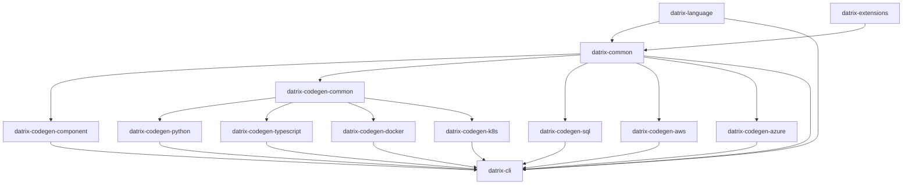

# Datrix Architecture Overview

**Version:** 2.0
**Last Updated:** May 2, 2026

---

## Introduction

Datrix is a code generation system that transforms `.dtrx` domain specifications into production-ready applications across multiple languages and platforms.

### Key Features

✅ **Template-Based Generation** - Jinja2 templates with automatic formatting
✅ **Fail-Fast Error Handling** - Errors caught at generation time, not runtime
✅ **Multi-Language Support** - Python, TypeScript, SQL
✅ **Multi-Platform Support** - Docker, Kubernetes, AWS, Azure
✅ **Type-Safe** - Exhaustive type mappings with validation
✅ **Modular Architecture** - 13 installable packages (core toolchain + optional **datrix-extensions**) plus showcase and projects repos
✅ **Specification-Level Testing** - DSL `test` blocks transpile to pytest under `tests/spec/` (Python) and Jest under `test/spec/` (TypeScript); see the [spec testing documentation](../guide/spec-testing.md)
✅ **Event contracts** - `ensure` clauses on `publish` events enforce publisher-side validation before `dispatch`
✅ **External library interfacing** - `extern service` declarations generate typed HTTP clients and deployment wiring for user-built services
🔲 **Serverless block code generation** - `serverless` blocks deploy handlers as Lambda functions, Azure Functions, or container processes with platform-specific entry points and infrastructure provisioning

---

## Sub-Documents

This overview was split into focused sub-documents for easier navigation. Each sub-document preserves the original section headings.

- **[Pipeline Flow & Capabilities](architecture/pipeline-and-capabilities.md)** — System architecture, pipeline stages, standard library, phase 01/02/03 capabilities, search engine integration, CDN / content delivery, managed API gateway
- **[Repository Architecture & Plugins](architecture/repository-architecture.md)** — 13 packages, plugin system, domain extension system, extern services, application containers, adding a new language
- **[Builtin Traits & Enums](architecture/builtin-traits-enums.md)** — 10 builtin traits, 2 builtin enums, injection mechanism

### Moved section anchors

The following anchors previously lived in this file and are now in sub-documents. Update links accordingly:

| Old anchor in this file | New location |
|------------------------|--------------|
| `#system-architecture` | [pipeline-and-capabilities.md#system-architecture](architecture/pipeline-and-capabilities.md#system-architecture) |
| `#pipeline-flow` | [pipeline-and-capabilities.md#pipeline-flow](architecture/pipeline-and-capabilities.md#pipeline-flow) |
| `#standard-library` | [pipeline-and-capabilities.md#standard-library](architecture/pipeline-and-capabilities.md#standard-library) |
| `#phase-01-capabilities-python-and-docker` | [pipeline-and-capabilities.md#phase-01-capabilities-python-and-docker](architecture/pipeline-and-capabilities.md#phase-01-capabilities-python-and-docker) |
| `#phase-02-capabilities-python-docker-docs` | [pipeline-and-capabilities.md#phase-02-capabilities-python-docker-docs](architecture/pipeline-and-capabilities.md#phase-02-capabilities-python-docker-docs) |
| `#phase-03-capabilities-python-docker` | [pipeline-and-capabilities.md#phase-03-capabilities-python-docker](architecture/pipeline-and-capabilities.md#phase-03-capabilities-python-docker) |
| `#search-engine-integration` | [pipeline-and-capabilities.md#search-engine-integration](architecture/pipeline-and-capabilities.md#search-engine-integration) |
| `#cdn--content-delivery` | [pipeline-and-capabilities.md#cdn--content-delivery](architecture/pipeline-and-capabilities.md#cdn--content-delivery) |
| `#managed-api-gateway` | [pipeline-and-capabilities.md#managed-api-gateway](architecture/pipeline-and-capabilities.md#managed-api-gateway) |
| `#repository-architecture` | [repository-architecture.md#repository-architecture](architecture/repository-architecture.md#repository-architecture) |
| `#plugin-architecture` | [repository-architecture.md#plugin-architecture](architecture/repository-architecture.md#plugin-architecture) |
| `#domain-extension-system` | [repository-architecture.md#domain-extension-system](architecture/repository-architecture.md#domain-extension-system) |
| `#application-containers` | [repository-architecture.md#application-containers](architecture/repository-architecture.md#application-containers) |
| `#extern-services-external-library-interfacing` | [repository-architecture.md#extern-services-external-library-interfacing](architecture/repository-architecture.md#extern-services-external-library-interfacing) |
| `#adding-a-new-language` | [repository-architecture.md#adding-a-new-language](architecture/repository-architecture.md#adding-a-new-language) |
| `#builtin-traits-and-enums` | [builtin-traits-enums.md#builtin-traits-and-enums](architecture/builtin-traits-enums.md#builtin-traits-and-enums) |

---

## Dependency Graph



**Legend:**
- **datrix-common** (no dependencies) — Foundation and generation framework (AST model, type system, semantic analysis, standard library resources + loader protocols, config resolution, plugin protocols, generation framework). Does **not** import `datrix-language` — parser and stdlib-loader implementations are injected via protocols.
- **datrix-language** (depends on datrix-common) — Parser + CST-to-AST transformers, implements `ParserProtocol` and `StdlibParserProtocol` defined in datrix-common
- **datrix-extensions** (depends on datrix-common) — Optional domain packs; **not** required by `datrix-cli` or generators unless you declare `use extension` and install the pack
- **datrix-codegen-common** (depends on datrix-common) — Shared codegen intelligence: profile-driven transpiler, language-agnostic algorithms, context models, field analysis, parity checking, shared Grafana dashboard builder. Consumed by language codegen packages and platform generators that emit Grafana dashboards (Docker, Kubernetes).
- **Language Code Generators** (depend on datrix-codegen-common, which depends on datrix-common) — Python, TypeScript
- **Other Code Generators** (depend on datrix-common) — SQL, component
- **Platform Generators** — Docker and Kubernetes depend on datrix-codegen-common (for shared dashboard builder); AWS and Azure depend on datrix-common only (they use platform-native dashboard builders)
- **datrix-cli** (depends on datrix-common, datrix-language; owns `GenerationPipeline` orchestration; discovers generator plugins dynamically)

**Import boundary enforcement:** The dependency edges above are enforced by automated tooling — see [Import Boundaries](../../datrix-common/docs/architecture/import-boundaries.md) for the full rule table and scanner usage.

---

## Core Principles

1. **Fail Fast, Fail Loud** — Catch errors at generation time, not runtime. See [Design Principles](./design-principles.md).
2. **Template-Based Generation with Formatters** — Jinja2 templates with ruff format (Python) / Prettier (TypeScript). See [Design Principles](./design-principles.md).
3. **Exhaustive Type Mappings** — All type mappings must be explicit; fail if unmapped. See [Design Principles](./design-principles.md).
4. **Immutable AST Model** — The Application model cannot be modified after creation (thread-safe, predictable). See [Design Principles](./design-principles.md).
5. **Single Responsibility** — Each repository has ONE clear purpose (`datrix-common`: AST + framework; `datrix-language`: parser; each codegen: one language/platform).

---

## Technology Stack

### Languages & Frameworks
- **Python 3.11+** - All implementations
- **Tree-sitter** - Parser generation
- **Pydantic v2** - Data validation

### Code Generation
- **Jinja2** - Template-based code generation
- **ruff format** - Python code formatting
- **Prettier** - TypeScript code formatting
- **ruamel.yaml** - YAML generation
- **Transpiler** — `StagePipeline` + `TranspileContext` + `TranspileResult` + visitor protocols (`datrix_common.transpiler`, `datrix_common.datrix_model.visitor_protocols`); see [datrix-common-api — Transpiler modules](../../../datrix-common/docs/datrix-common-api.md#transpiler-modules)

### Code Quality
- **ruff** - Python linting and formatting
- **mypy** - Type checking (strict mode)
- **pytest** - Testing

### CLI
- **Typer/Click** - CLI framework
- **Rich** - Terminal UI

---

## Key Architectural Decisions

### Decision 1: No Separate IR Layer

**Rationale:**
- The parser produces the Application (AST model) directly
- There is no IR layer; the AST model is the single representation
- Fewer transformations means fewer bugs

**Result:** The AST model (`Application`, `Entity`, `Service`, etc.) lives in `datrix-common`. The parser in `datrix-language` produces `Application` objects but the type is defined in `datrix-common`, making the AST available to all packages without depending on the parser.

---

### Decision 2: `datrix-codegen-*` Naming

**Rationale:**
- Shows family relationship (all codegen)
- They extend/specialize `datrix-common`
- User mental model: "codegen for Python"

**Result:**
- `datrix-codegen-python` (not `datrix-generator-python`)
- `datrix-codegen-typescript`
- `datrix-codegen-sql`

---

### Decision 3: One Repo Per Platform

**Rationale:**
- Independent versioning
- Independent releases
- Clear ownership
- Plugin architecture

**Result:** Separate repos for Docker, K8s, AWS, Azure

---

### Decision 4: One DateTime Type, Always Timezone-Aware

**Rationale:**
- A timezone-aware datetime and a UTC datetime are the same *type* with different *values* for the timezone component — UTC is just one timezone
- Having separate `UDateTime` / `UDate` / `UTime` types implies UTC is structurally different from other timezones, which it isn't
- Naive datetimes (no timezone info) are almost always a bug in server code
- The Python ecosystem is moving away from naive datetimes; JavaScript's `Date` is always aware

**Result:**
- **`DateTime`** is always timezone-aware. There is no naive datetime in the DSL.
- **`Timezone`** is a builtin object that specifies which timezone. `Timezone.UTC` is the default; `Timezone.of("America/New_York")` for arbitrary IANA timezones.
- **`DateTime.now()`** defaults to UTC (no argument needed). `DateTime.now(Timezone.of("US/Eastern"))` for other timezones.
- `UDateTime`, `UDate`, `UTime` and all aliases (`UTCDateTime`, `DateTimeUTC`, `Instant`, `UTCDate`, `UTCTime`) are removed.
- `DateTime.utcNow()` is removed — it's just `DateTime.now()`.
- `Date` and `Time` remain timezone-unaware (calendar dates and wall-clock times don't carry timezone semantics).

---

### Decision 5: Generator Definition DSL (Planned)

**Rationale:**
- Generator implementations encode structure (file declarations, iteration patterns, feature gates, semantic requirements) as imperative Python — registries, class constructors, context builders, and template rendering paths
- The same structural information is split across multiple locations, making it hard to answer "what does this generator produce?"
- Feature gates are repeated and sometimes implicit; semantic contracts are not declared adjacent to file emission; context dictionaries are often untyped
- Platform generators cannot reuse the language-generator registry model

**Result:**
- A constrained generator-definition DSL (genDSL) embedded in Python docstrings declares generator structure: identity, domains, feature gates, semantic requirements, iteration scopes, context models, file declarations, and cross-domain contributions
- The genDSL compiles in memory at import time into Python IR objects (`GeneratorDefinition`, `DomainDefinition`, `FileDefinition`, etc.) consumed by the existing generator runtime — no generated source files, no checked-in artifacts
- Python remains the implementation language for context builders, type resolvers, transpilers, and complex algorithms; the genDSL declares structure, Python implements computation
- IR foundation types live in `datrix-common`; the parser, validator, and runtime live in `datrix-codegen-common`; each generator package embeds its own genDSL definitions
- When a generator migrates to genDSL, the entire registry moves at once — no partial migration, no mixed sources, no backward compatibility wrappers

**Design reference:** [GenDSL Documentation](../../../datrix-codegen-common/docs/gendsl/overview.md) — Complete specification in datrix-codegen-common/docs/gendsl/

---

### Decision 6: Deployment Target Contract (Planned)

**Rationale:**
- Legacy models conflated runtime packaging shape, infrastructure provider, and cloud-managed targets into a single dimension
- "Docker" and "Kubernetes" are runtime/packaging targets, not cloud providers; "AWS" and "Azure" are providers, not runtimes
- One-dimensional models cannot express combinations like "Kubernetes on Azure (AKS)" or "Docker Compose on AWS (VM)" without overloading terms
- CLI overrides can create partial deployment states where the command line says one target but resolved config still contains values for another

**Result:**
- An explicit deployment target model replaces the single `hosting` dimension with four orthogonal fields:

```yaml
language: python | typescript

deployment:
  runtime: docker-compose | kubernetes | azure-container-apps | azure-app-service | ecs-fargate | app-runner
  provider: local | existing | aws | azure
  target: aks | eks | vm | ...        # optional, provider-specific
  registry: acr | ecr | ...           # optional, provider-specific
```

- `language` selects the generated application implementation
- `deployment.runtime` selects the deployable artifact shape (Compose, Kubernetes manifests, etc.)
- `deployment.provider` selects the infrastructure provider or substrate owner
- `deployment.target` and `deployment.registry` are optional provider-specific refinements
- `host` remains a network endpoint concept only — never used to mean AWS, Azure, Docker, or Kubernetes
- The word "platform" is retired from user-facing deployment selection; where it remains temporarily, it is qualified as "service flavor" (per-service runtime variant) or "infrastructure flavor" (per-component provisioning choice)

**Concept matrix:**

| Concept | Examples | Owns |
| --- | --- | --- |
| Language | `python`, `typescript` | Application source code, framework/runtime adapters, language package/dependency files |
| Runtime | `docker-compose`, `kubernetes`, `ecs-fargate`, `azure-container-apps` | Deployable artifact shape and process model |
| Provider | `local`, `existing`, `aws`, `azure` | Provider-managed substrate, registry, identity, networking, managed services |
| Service flavor | `compose`, `container-apps`, `ecs-fargate`, `app-service` | Per-service runtime flavor when multiple are possible under a provider/runtime |
| Infrastructure flavor | `container`, `external`, `rds`, `flexible-server`, `event-hubs` | Per-component provisioning choice |
| Host | `db.example.com`, `api.example.com`, `localhost` | Network endpoint |

**Deployment examples:**

```yaml
# Local Docker Compose
language: python
deployment:
  runtime: docker-compose
  provider: local

# Kubernetes on Azure
language: python
deployment:
  runtime: kubernetes
  provider: azure
  target: aks
  registry: acr

# Azure Container Apps
language: typescript
deployment:
  runtime: azure-container-apps
  provider: azure
  registry: acr
```

**Generator orchestration** becomes multidimensional:

| Deployment | Language generators | Runtime generators | Provider generators |
| --- | --- | --- | --- |
| Python Docker Compose local | `component`, `python`, `sql` | `docker` | none |
| TypeScript Docker Compose local | `component`, `typescript`, `sql`, `python_http_contract_overlay` | `docker` | none |
| Python Kubernetes existing | `component`, `python`, `sql` | `k8s` | none |
| Python Kubernetes on Azure | `component`, `python`, `sql` | `k8s` | `azure` provider support |
| TypeScript Azure Container Apps | `component`, `typescript`, `sql`, `python_http_contract_overlay` | image/runtime support | `azure` native app support |
| Python ECS Fargate | `component`, `python`, `sql` | image/runtime support | `aws` native app support |

Provider generators augment runtime output unless the runtime is provider-native. For `runtime: kubernetes, provider: azure`, Azure support adds AKS/ACR/identity/networking/managed-service integration without replacing Kubernetes manifests.

**Explicit config rule:** Defaults are an anti-pattern for deployment generation. Every deployment-relevant field must come from resolved config. Missing required fields must produce explicit errors naming the config path and expected field. Invalid combinations must produce validation errors rather than being corrected silently. No generator may override a user-provided config value.

**Validation rules:** Provider values are scoped by runtime:

| Runtime | Valid providers |
| --- | --- |
| `docker-compose` | `local`, `aws`, `azure` |
| `kubernetes` | `existing`, `aws`, `azure` |
| `azure-container-apps` | `azure` |
| `azure-app-service` | `azure` |
| `ecs-fargate` | `aws` |
| `app-runner` | `aws` |

**CLI contract:** Deployment-affecting values are not accepted as one-off CLI overrides. `datrix generate` reads `language` and `deployment` from resolved config. `--hosting` and `--platform` generation-time overrides are removed. Users who need to change deployment target edit config files (or use a `datrix config set-deployment` helper command that writes config explicitly).

**Output path contract:** Generated output paths include language, runtime, and provider:

```text
.projects/<app>/<language>/<runtime>/<provider>/
```

---

### Decision 7: Extension Naming — PostGIS Split

**Rationale:**
- The current `geo` extension is semantically a PostGIS pack: it owns `Geometry`, `Geography`, `GeoSql`, PostGIS database extension validation, PostGIS migration templates, and PostGIS/geometry runtime dependencies
- Raster helpers (tile grid calculation, GeoTIFF parsing) are database-independent operations that should not inherit PostGIS infrastructure or dependency behavior
- A single `geo` name conflates two distinct concerns: PostGIS-coupled spatial types and database-independent geospatial computation

**Result:**
- The existing PostGIS-backed extension is renamed from `geo` to **`postgis`** with no backward compatibility alias
- The `geo` name is reclaimed for a new generic, database-independent geospatial extension providing raster and tile helpers (`GeoTile`, `GeoTiff`)
- Existing DSL projects that declare `use extension geo;` for PostGIS behavior must update to `use extension postgis;`
- The `DatrixExtension` protocol gains a **`value_struct_definitions()`** surface so extensions can contribute named struct types (e.g., `GeoBounds`, `GeoTileSpec`, `GeoElevationGrid`) in addition to scalars and builtin objects

**Extension ownership after split:**

| Extension | DSL declaration | Provides |
| --- | --- | --- |
| `postgis` | `use extension postgis;` | `Geometry`, `Geography` spatial types, `GeoShape.*` value-level ops, `GeoSql.*` SQL expressions, PostGIS database extension, geoalchemy2/shapely/turf dependencies |
| `geo` | `use extension geo;` | `GeoTile.*` tile grid operations, `GeoTiff.*` raster parsing, `GeoBounds`/`GeoTileSpec`/`GeoElevationGrid` value structs (Python helpers only in Phase 1; TypeScript fails loudly until helper support is added) |

**Core `Geo.*` stdlib** (distance, tile coordinate math) remains unaffected — it is always available without any extension declaration.

---

### Decision 8: Incremental RDBMS Schema Migrations

**Rationale:**
- Generated services with RDBMS entities are deployed with an initial schema migration applied. If a later regeneration rewrites that initial migration to include newly added fields, the live database does not change because migration engines track applied revision IDs, not changed file contents
- Generated application code can then reference columns that do not exist in the deployed database
- Python/Alembic and TypeScript/MikroORM both exhibit this gap: a fixed initial migration file is overwritten on each generation, but once applied, no new migration identity is created for schema changes

**Result:**
- **Canonical schema snapshots** — Language-neutral JSON files (`schema.json`) under `{app_dir}/.datrix/rdbms-migrations/{rdbms_id}/` record the deployed database contract
- **Revision ledger** — An append-only JSON file (`ledger.json`) in the same directory records ordered Datrix revision IDs and database-agnostic canonical migration operations
- **RDBMS UUID identity** — Every `RdbmsConfig` in ConfigDSL requires an `id: UUID` field. This UUID is the canonical migration identity, independent of service name, block alias, profile, engine, platform, or output directory
- **Immutable migration history** — Once generated, a migration revision file is append-only. Later generations append new revisions; they never rewrite previous revisions
- **Append-only file retention** — `GeneratedFile` gains a `retention` field (`"normal"` or `"append_only"`). `FileWriter` and manifest logic preserve append-only files across regenerations and reject content changes
- **Shared diff and safety policy** — Schema changes are classified as `safe`, `risky`, or `blocked` before adapter rendering. Destructive changes (field/table removal, rename, type narrowing, enum removal) are generation errors — no ConfigDSL or CLI override converts them to automatic migrations
- **Target-language adapter protocol** — `RdbmsMigrationAdapter` in `datrix-codegen-common` defines the contract. Python/Alembic, TypeScript/MikroORM, and SQL are adapters that render target-native migration files from shared canonical state
- **Shared-owned RDBMS migrations** — Shared RDBMS blocks generate migration files under `SharedPaths.rdbms_dir`, not under a consuming service. Platform generators create one migration apply unit per shared `rdbms_id`

**State ownership:** The migration orchestrator owns snapshot/ledger lifecycle. Adapters render target-native files from `MigrationState` but do not load, write, or allocate revision IDs. Canonical state (`schema.json`, `ledger.json`) lives under the application source folder and is target-language/platform/engine agnostic.

**Reference:** [RDBMS Migration Decisions (D1-D23)](rdbms-migration-decisions.md) | [Migration API](../../../datrix-common/docs/architecture/migration.md) | [Adapter Protocol](../../../datrix-codegen-common/docs/migration-adapter.md)

---

## Installation

```bash
# Minimal (CLI only)
pip install datrix-cli

# Python + Docker
pip install datrix-cli datrix-codegen-python datrix-codegen-docker

# Full stack
pip install datrix-cli \
 datrix-codegen-python datrix-codegen-typescript datrix-codegen-sql \
 datrix-codegen-docker datrix-codegen-k8s datrix-codegen-aws datrix-codegen-azure
```

**Note:** The CLI automatically discovers installed generators. You only need to install the generators you plan to use.

---

## Usage

Use the CLI to validate and generate:
```bash
# Validate a file or directory of .dtrx files
datrix validate system.dtrx
datrix validate examples/02-features/01-core-data-modeling/rest-api

# Generate (defaults: profile test; language and deployment from ConfigDSL for that profile)
datrix generate --source system.dtrx --output ./generated

# Generate for a specific profile
datrix generate --source system.dtrx --output ./generated --profile production

# Override language for testing only (optional short flag)
datrix generate --source system.dtrx --output ./generated --language typescript
datrix generate --source system.dtrx --output ./generated -L python
```

**Config-driven generation:** The source of truth is ConfigDSL: `language` and `deployment` (runtime, provider, target, registry) in `config/system.dcfg`, and service-level `flavor` in each service config (e.g. `compose`, `ecs-fargate`, `container-apps`). Generation reads deployment settings from resolved config — there are no deployment-affecting CLI overrides. See [Decision 6: Deployment Target Contract](#decision-6-deployment-target-contract-planned) for the full deployment model.

> **Note:** The `--hosting` and `--platform` CLI overrides have been removed. Deployment target is configured in ConfigDSL files, not CLI flags.

---

## Next Steps

- Read [Design Principles](./design-principles.md) to understand core principles
- Read [Language Reference](../reference/language-reference.md) to learn how to write `.dtrx` files
- See [Getting Started](../getting-started/first-project.md) and the runnable trees under [`examples/`](../../examples/)
