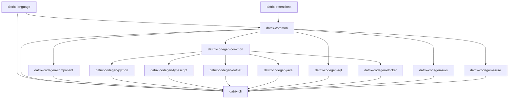

# Datrix Architecture Overview

**Version:** 2.1
**Last Updated:** June 23, 2026

---

## Introduction

Datrix is a code generation system that transforms `.dtrx` domain specifications into production-ready applications across multiple languages and platforms.

### Key Features

✅ **Template-Based Generation** - Jinja2 templates with automatic formatting
✅ **Fail-Fast Error Handling** - Errors caught at generation time, not runtime
✅ **Multi-Language Support** - Python, TypeScript, SQL — the language set is open, and .NET and Java generators are scaffolding in progress (repos registered; source not landed yet)
✅ **Multi-Platform Support** - Docker, AWS, Azure
✅ **Type-Safe** - Exhaustive type mappings with validation
✅ **Modular Architecture** - 14 installable packages (13 core toolchain + optional **datrix-extensions**) plus showcase and projects repos
✅ **Specification-Level Testing** - DSL `test` blocks transpile to pytest under `tests/spec/` (Python) and Jest under `test/spec/` (TypeScript); see the [spec testing documentation](../guide/spec-testing.md)
✅ **Event contracts** - `ensure` clauses on `publish` events enforce publisher-side validation before `dispatch`
✅ **External library interfacing** - `extern service` declarations generate typed HTTP clients and deployment wiring for user-built services
✅ **Serverless block code generation** - `serverless` blocks deploy handlers as Lambda functions, Azure Functions, or container processes with platform-specific entry points and infrastructure provisioning
✅ **Centralized runtime config store** - a system-level `configStore` section generates a runtime configuration plane (AWS AppConfig, Azure App Configuration, or self-hosted Consul KV), local JSON defaults, and Python/TypeScript runtime clients for feature flags and operational tuning without rebuilds
✅ **Zero-environment runtime** - generated services read zero environment variables; all deployment-static values (config-store endpoint, secrets-backend URL, region, credential kind) are baked as literal constants at generation time (see [Decision 14](#decision-14-runtime-configuration--secrets--zero-environment-architecture))

---

## Sub-Documents

This overview was split into focused sub-documents for easier navigation. Each sub-document preserves the original section headings.

- **[Pipeline Flow & Capabilities](architecture/pipeline-and-capabilities.md)** — System architecture, pipeline stages, standard library, phase 01/02/03 capabilities, search engine integration, CDN / content delivery, managed API gateway
- **[Repository Architecture & Plugins](architecture/repository-architecture.md)** — 15 repos (14 installable packages + the showcase repo), plugin system, domain extension system, extern services, application containers, adding a new language
- **[Builtin Traits & Enums](architecture/builtin-traits-enums.md)** — 10 builtin traits, 2 builtin enums, injection mechanism

Related:

- **[Generated Output Stability](generated-output-stability.md)** — the reference-example parity gate: the repo's proof that generated output does not change unintentionally, how to read a failure, and the re-bless command

### Moved section anchors

The following anchors previously lived in this file and are now in sub-documents. Update links accordingly:

| Old anchor in this file | New location |
|------------------------|--------------|
| `#system-architecture` | [pipeline-and-capabilities.md#system-architecture](architecture/pipeline-and-capabilities.md#system-architecture) |
| `#pipeline-flow` | [pipeline-and-capabilities.md#pipeline-flow](architecture/pipeline-and-capabilities.md#pipeline-flow) |
| `#standard-library` | [pipeline-and-capabilities.md#standard-library](architecture/pipeline-and-capabilities.md#standard-library) |
| `#phase-01-capabilities-python-and-docker` | [pipeline-and-capabilities.md#phase-01-capabilities-python-and-docker](architecture/pipeline-and-capabilities.md#phase-01-capabilities-python-and-docker) |
| `#phase-02-capabilities-python-docker-docs` | [pipeline-and-capabilities.md#phase-02-capabilities-python-docker-docs](architecture/pipeline-and-capabilities.md#phase-02-capabilities-python-docker-docs) |
| `#phase-03-capabilities-python-docker` | [pipeline-and-capabilities.md#phase-03-capabilities-python-docker](architecture/pipeline-and-capabilities.md#phase-03-capabilities-python-docker) |
| `#search-engine-integration` | [pipeline-and-capabilities.md#search-engine-integration](architecture/pipeline-and-capabilities.md#search-engine-integration) |
| `#cdn--content-delivery` | [pipeline-and-capabilities.md#cdn--content-delivery](architecture/pipeline-and-capabilities.md#cdn--content-delivery) |
| `#managed-api-gateway` | [pipeline-and-capabilities.md#managed-api-gateway](architecture/pipeline-and-capabilities.md#managed-api-gateway) |
| `#repository-architecture` | [repository-architecture.md#repository-architecture](architecture/repository-architecture.md#repository-architecture) |
| `#plugin-architecture` | [repository-architecture.md#plugin-architecture](architecture/repository-architecture.md#plugin-architecture) |
| `#domain-extension-system` | [repository-architecture.md#domain-extension-system](architecture/repository-architecture.md#domain-extension-system) |
| `#application-containers` | [repository-architecture.md#application-containers](architecture/repository-architecture.md#application-containers) |
| `#extern-services-external-library-interfacing` | [repository-architecture.md#extern-services-external-library-interfacing](architecture/repository-architecture.md#extern-services-external-library-interfacing) |
| `#adding-a-new-language` | [repository-architecture.md#adding-a-new-language](architecture/repository-architecture.md#adding-a-new-language) |
| `#builtin-traits-and-enums` | [builtin-traits-enums.md#builtin-traits-and-enums](architecture/builtin-traits-enums.md#builtin-traits-and-enums) |

---

## Dependency Graph



**Legend:**
- **datrix-common** (no dependencies) — Foundation and generation framework (AST model, type system, semantic analysis, standard library resources + loader protocols, config resolution, plugin protocols, generation framework). Does **not** import `datrix-language` — parser and stdlib-loader implementations are injected via protocols.
- **datrix-language** (depends on datrix-common) — Parser + CST-to-AST transformers, implements `ParserProtocol` and `StdlibParserProtocol` defined in datrix-common
- **datrix-extensions** (depends on datrix-common) — Optional domain packs; **not** required by `datrix-cli` or generators unless you declare `use extension` and install the pack
- **datrix-codegen-common** (depends on datrix-common) — Shared codegen intelligence: profile-driven transpiler, language-agnostic algorithms, context models, field analysis, parity checking, shared Grafana dashboard builder, GenDSL runtime, serverless/replayable-ingestion plans. Consumed by language codegen packages and by **all three** platform generators for its language-agnostic services.
- **Language Code Generators** (depend on datrix-codegen-common, which depends on datrix-common) — Python, TypeScript, and, as **scaffolding in progress**, .NET and Java (repos registered and discovered by the plugin system; source not landed yet). The set is open: each new target language is one more peer package here, and a language generator never depends on a sibling language package.
- **Other Code Generators** (depend on datrix-common) — SQL, component
- **Platform Generators** (Docker, AWS, Azure) — all three depend on **datrix-codegen-common** for its language-agnostic platform services (GenDSL runtime, shared Grafana `DashboardBuilder`, serverless and replayable-ingestion plans, shared enums) as well as datrix-common. They must **not** import the language-specific parts of codegen-common (`transpiler.*`, language-shaped `context_models`/`algorithms`) or any language generator package — see the [platform → codegen-common subtree contract](../../datrix-common/docs/architecture/import-boundaries.md#platform--codegen-common-subtree-contract).
- **datrix-cli** (depends on datrix-common, datrix-language; owns `GenerationPipeline` orchestration; discovers generator plugins dynamically)

> **`datrix_codegen_common/platform/` subpackage.** A `platform/` subpackage lives **inside the existing `datrix-codegen-common`** — a sibling of `gendsl/`, `dashboards/`, `algorithms/`, and `context_models/`. **No new package or repo is created**: the shared provider seam (the `resolve_runtime_spec` / `runtime_stack_token` helpers and the `PlatformInfrastructure` protocol) is language-agnostic platform code, exactly the layer `datrix-codegen-common` already owns. Because the three platform generators already legally import `datrix-codegen-common`, `platform.*` simply joins the closed list of language-agnostic codegen-common subtrees platforms may import (alongside `gendsl.*`, `dashboards.*`, `algorithms.serverless`, `context_models.serverless`, `context_models.replayable_ingestion`, `enums`) — no new graph node and no new boundary edge. The shared Grafana `DashboardBuilder` **stays in `datrix-codegen-common/src/datrix_codegen_common/dashboards/`** and platforms continue to import it directly; there is no re-home and no `ObservabilityIntegration` facade. See [Shared Provider Library](../../datrix-codegen-common/docs/architecture.md#shared-provider-library-platform) and [Decision 12: Language-Agnostic Provider Generators](#decision-12-language-agnostic-provider-generators).

**Import boundary enforcement:** The dependency edges above are enforced by automated tooling — see [Import Boundaries](../../datrix-common/docs/architecture/import-boundaries.md) for the full rule table and scanner usage. The scanner currently reports a known lower-bound caveat: files carrying a UTF-8 BOM are silently skipped (read with `encoding="utf-8"`), so the violation count is a lower bound until the scanner reads with `encoding="utf-8-sig"`. Fixing that is a tracked scanner-robustness follow-up, separate from the boundary-rule reconciliation.

---

## Core Principles

1. **Fail Fast, Fail Loud** — Catch errors at generation time, not runtime. See [Design Principles](./design-principles.md).
2. **Template-Based Generation with Formatters** — Jinja2 templates with ruff format (Python) / Prettier (TypeScript). See [Design Principles](./design-principles.md).
3. **Exhaustive Type Mappings** — All type mappings must be explicit; fail if unmapped. See [Design Principles](./design-principles.md).
4. **Immutable AST Model** — The Application model cannot be modified after creation (thread-safe, predictable). See [Design Principles](./design-principles.md).
5. **Single Responsibility** — Each repository has ONE clear purpose (`datrix-common`: AST + framework; `datrix-language`: parser; each codegen: one language/platform).

---

## Technology Stack

### Languages & Frameworks
- **Python 3.11+** - All implementations
- **Tree-sitter** - Parser generation
- **Pydantic v2** - Data validation

### Code Generation
- **Jinja2** - Template-based code generation
- **ruff format** - Python code formatting
- **Prettier** - TypeScript code formatting
- **ruamel.yaml** - YAML generation
- **Transpiler** — `StagePipeline` + `TranspileContext` + `TranspileResult` + visitor protocols (`datrix_common.transpiler`, `datrix_common.datrix_model.visitor_protocols`); see [datrix-common-api — Transpiler modules](../../../datrix-common/docs/datrix-common-api.md#transpiler-modules)

### Code Quality
- **ruff** - Python linting and formatting
- **mypy** - Type checking (strict mode)
- **pytest** - Testing

### CLI
- **Typer/Click** - CLI framework
- **Rich** - Terminal UI

---

## Key Architectural Decisions

### Decision 1: No Separate IR Layer

**Rationale:**
- The parser produces the Application (AST model) directly
- There is no IR layer; the AST model is the single representation
- Fewer transformations means fewer bugs

**Result:** The AST model (`Application`, `Entity`, `Service`, etc.) lives in `datrix-common`. The parser in `datrix-language` produces `Application` objects but the type is defined in `datrix-common`, making the AST available to all packages without depending on the parser.

---

### Decision 2: `datrix-codegen-*` Naming

**Rationale:**
- Shows family relationship (all codegen)
- They extend/specialize `datrix-common`
- User mental model: "codegen for Python"

**Result:**
- `datrix-codegen-python` (not `datrix-generator-python`)
- `datrix-codegen-typescript`
- `datrix-codegen-sql`
- Every new target language joins under the same convention — e.g. `datrix-codegen-dotnet` and `datrix-codegen-java` (scaffolding in progress)

---

### Decision 3: One Repo Per Platform

**Rationale:**
- Independent versioning
- Independent releases
- Clear ownership
- Plugin architecture

**Result:** Separate repos for Docker, AWS, Azure

---

### Decision 4: One DateTime Type, Always Timezone-Aware

**Rationale:**
- A timezone-aware datetime and a UTC datetime are the same *type* with different *values* for the timezone component — UTC is just one timezone
- Having separate `UDateTime` / `UDate` / `UTime` types implies UTC is structurally different from other timezones, which it isn't
- Naive datetimes (no timezone info) are almost always a bug in server code
- The Python ecosystem is moving away from naive datetimes; JavaScript's `Date` is always aware

**Result:**
- **`DateTime`** is always timezone-aware. There is no naive datetime in the DSL.
- **`Timezone`** is a builtin object that specifies which timezone. `Timezone.UTC` is the default; `Timezone.of("America/New_York")` for arbitrary IANA timezones.
- **`DateTime.now()`** defaults to UTC (no argument needed). `DateTime.now(Timezone.of("US/Eastern"))` for other timezones.
- `UDateTime`, `UDate`, `UTime` and all aliases (`UTCDateTime`, `DateTimeUTC`, `Instant`, `UTCDate`, `UTCTime`) are removed.
- `DateTime.utcNow()` is removed — it's just `DateTime.now()`.
- `Date` and `Time` remain timezone-unaware (calendar dates and wall-clock times don't carry timezone semantics).

---

### Decision 5: Generator Definition DSL (Implemented)

**Rationale:**
- Generator implementations encode structure (file declarations, iteration patterns, feature gates, semantic requirements) as imperative Python — registries, class constructors, context builders, and template rendering paths
- The same structural information is split across multiple locations, making it hard to answer "what does this generator produce?"
- Feature gates are repeated and sometimes implicit; semantic contracts are not declared adjacent to file emission; context dictionaries are often untyped
- Platform generators cannot reuse the language-generator registry model

**Result:**
- A constrained generator-definition DSL (genDSL) embedded in Python docstrings declares generator structure: identity, domains, feature gates, semantic requirements, iteration scopes, context models, file declarations, and cross-domain contributions
- The genDSL compiles in memory at import time into Python IR objects (`GeneratorDefinition`, `DomainDefinition`, `FileDefinition`, etc.) consumed by the existing generator runtime — no generated source files, no checked-in artifacts
- Python remains the implementation language for context builders, type resolvers, transpilers, and complex algorithms; the genDSL declares structure, Python implements computation
- IR foundation types live in `datrix-common`; the parser, validator, and runtime live in `datrix-codegen-common`; each generator package embeds its own genDSL definitions
- When a generator migrates to genDSL, the entire registry moves at once — no partial migration, no mixed sources, no backward compatibility wrappers
- **GenDSL 2 hardening (adopted and complete, 2026-07-08):** compilation closed — `where`/`when` resolve against typed context models and builder references resolve eagerly at registration, so an unknown property or reference is a load-time error instead of a silent `False`; a `FeatureCatalog` derived from AST block presence and plugin capability declarations replaced the hardcoded `_app_feature_*` executor predicates; declared-file rendering became the only render path, with the `render_declared_files` escape hatch removed and each consumer's hand-coded iteration loop deleted; and parity collapsed to a single derived mechanism (`parity/generated_parity_table.py`), retiring the hand-maintained exemptions, feature-gate, and per-package declaration lists.

**Design reference:** [GenDSL Documentation](../../../datrix-codegen-common/docs/gendsl/overview.md) — Complete specification in datrix-codegen-common/docs/gendsl/. GenDSL 2 hardening: [Design Decisions 14–17](../../../datrix-codegen-common/docs/gendsl/design-decisions.md#decision-14-closed-compilation--typed-context-validation-and-eager-reference-resolution) and [Migration Guide Phase 8](../../../datrix-codegen-common/docs/gendsl/migration-guide.md#phase-8-gendsl-2--closed-compilation-declared-rendering-single-parity-design-025).

---

### Decision 6: Deployment Target Contract (Stable)

> **Partially superseded by Decision 15 (Multi-Target Plugin Architecture, adopted):** `language` and `deployment.provider` are no longer closed enum value sets — they are open, plugin-registry-validated identifiers (`LanguageId`/`ProviderId`; see [datrix-common API — Open identity](../../../datrix-common/docs/datrix-common-api.md#open-identity-languageid--providerid)), and the "Generator orchestration" table below is no longer a fixed lineup — each generator declares a phase and optional `runs_after` names, and the CLI topologically sorts them (`datrix_common.generation.generator_lineup`). `deployment.runtime` (`DeploymentRuntime`) is unaffected and remains a closed enum, preserving the runtime/provider orthogonality this decision established. The YAML shape and concept matrix below are otherwise unchanged.

**Rationale:**
- Legacy models conflated runtime packaging shape, infrastructure provider, and cloud-managed targets into a single dimension
- "Docker Compose" and "ECS Fargate" are runtime/packaging targets, not cloud providers; "AWS" and "Azure" are providers, not runtimes
- One-dimensional models cannot express combinations like "ECS Fargate on AWS" or "Azure App Service on Azure" without overloading terms
- CLI overrides can create partial deployment states where the command line says one target but resolved config still contains values for another

**Result:**
- An explicit deployment target model replaces the single `hosting` dimension with three orthogonal fields:

```yaml
language: python | typescript

deployment:
  runtime: docker-compose | azure-app-service | azure-app-service-container | ecs-fargate | app-runner
  provider: local | existing | aws | azure
  registry: acr | ecr | ...           # optional, provider-specific
```

- `language` selects the generated application implementation
- `deployment.runtime` selects the deployable artifact shape (Compose, Azure App Service, ECS Fargate, etc.)
- `deployment.provider` selects the infrastructure provider or substrate owner
- `deployment.registry` is an optional provider-specific refinement
- There is no `target` dimension; cloud deployments use only native runtimes (`ecs-fargate`/`app-runner` for AWS, `azure-app-service` for Azure)
- `host` remains a network endpoint concept only — never used to mean AWS, Azure, or Docker

> **Note:** `runtime: azure-container-apps` is **retired**. Use `runtime: azure-app-service` for the native Azure PaaS runtime. Specifying the retired value raises a generation error with migration guidance.

**Construct-mapped realization:** Once a deployment target is resolved, each DSL block maps to the target platform's native primitive. Service deployment shape is derived entirely from declared blocks — no separate per-service runtime selector is needed. See [Design Principles — Construct-Mapped Platform Realization](./design-principles.md#11-construct-mapped-platform-realization-stable) for the full mapping table and rationale.

**Concept matrix:**

| Concept | Examples | Owns |
| --- | --- | --- |
| Language | `python`, `typescript` | Application source code, framework/runtime adapters, language package/dependency files |
| Runtime | `docker-compose`, `azure-app-service`, `azure-app-service-container`, `ecs-fargate`, `app-runner` | Deployable artifact shape and process model |
| Provider | `local`, `existing`, `aws`, `azure` | Provider-managed substrate, registry, identity, networking, managed services |
| Infrastructure flavor | `container`, `external`, `rds`, `flexible-server`, `event-hubs` | Per-block provisioning choice (RDBMS, cache, pubsub, etc.) |
| Host | `db.example.com`, `api.example.com`, `localhost` | Network endpoint |

**Deployment examples:**

```yaml
# Local Docker Compose
language: python
deployment:
  runtime: docker-compose
  provider: local

# AWS App Runner
language: python
deployment:
  runtime: app-runner
  provider: aws
  registry: ecr

# Azure App Service (native PaaS)
language: python
deployment:
  runtime: azure-app-service
  provider: azure
  registry: acr

# AWS ECS Fargate
language: python
deployment:
  runtime: ecs-fargate
  provider: aws
  registry: ecr
```

**Generator orchestration** becomes multidimensional:

| Deployment | Language generators | Runtime generators | Provider generators |
| --- | --- | --- | --- |
| Python Docker Compose local | `component`, `python`, `sql` | `docker` | none |
| TypeScript Docker Compose local | `component`, `typescript`, `sql`, `python_http_contract_overlay` | `docker` | none |
| Python Azure App Service (code-based) | `component`, `python`, `sql` | none (PaaS, no containers) | `azure` App Service + managed infra |
| Python Azure App Service Container | `component`, `python`, `sql` | `docker` (custom-container delivery) | `azure` App Service + managed infra |
| Python ECS Fargate | `component`, `python`, `sql` | `docker` (containers need Dockerfiles) | `aws` ECS/Fargate/managed infra |
| Python App Runner | `component`, `python`, `sql` | `docker` (image-based PaaS pulls an ECR image) | `aws` App Runner + managed infra |

Provider-native runtimes are produced by their provider generator plus, where the runtime is container-based, the shared `docker` runtime generator supplying Dockerfiles. The `docker-compose` runtime is local-only — it is never paired with a cloud provider, and provider generators never augment Compose output. For `runtime: azure-app-service` (code-based delivery), the Azure generator produces all infrastructure Bicep and there is no separate runtime generator — no containers are involved. For `runtime: azure-app-service-container`, the Azure generator produces the infrastructure Bicep and the `docker` runtime generator supplies the Dockerfile for the custom-container delivery mode. For `runtime: ecs-fargate`, the AWS generator produces the infrastructure and the `docker` runtime generator supplies per-service Dockerfiles. For `runtime: app-runner`, the AWS generator produces the infrastructure; App Runner's own generated stack pulls an ECR image, so it likewise requires the `docker` runtime generator to supply that image's Dockerfile — App Runner is image-based PaaS, not containerless.

**Explicit config rule:** Defaults are an anti-pattern for deployment generation. Every deployment-relevant field must come from resolved config. Missing required fields must produce explicit errors naming the config path and expected field. Invalid combinations must produce validation errors rather than being corrected silently. No generator may override a user-provided config value.

**Validation rules:** Provider values are scoped by runtime:

| Runtime | Valid providers |
| --- | --- |
| `docker-compose` | `local` |
| `azure-app-service` | `azure` |
| `azure-app-service-container` | `azure` |
| `ecs-fargate` | `aws` |
| `app-runner` | `aws` |

**CLI contract:** Deployment-affecting values are not accepted as one-off CLI overrides. `datrix generate` reads `language` and `deployment` from resolved config. `--hosting` and `--platform` generation-time overrides are removed. Users who need to change deployment target edit config files (or use a `datrix config set-deployment` helper command that writes config explicitly).

**Output path contract:** Generated output paths include language, runtime, and provider:

```text
.projects/<app>/<language>/<runtime>/<provider>/
```

---

### Decision 7: Extension Naming — PostGIS Split

**Rationale:**
- The current `geo` extension is semantically a PostGIS pack: it owns `Geometry`, `Geography`, `GeoSql`, PostGIS database extension validation, PostGIS migration templates, and PostGIS/geometry runtime dependencies
- Raster helpers (tile grid calculation, GeoTIFF parsing) are database-independent operations that should not inherit PostGIS infrastructure or dependency behavior
- A single `geo` name conflates two distinct concerns: PostGIS-coupled spatial types and database-independent geospatial computation

**Result:**
- The existing PostGIS-backed extension is renamed from `geo` to **`postgis`** with no backward compatibility alias
- The `geo` name is reclaimed for a new generic, database-independent geospatial extension providing raster and tile helpers (`GeoTile`, `GeoTiff`)
- Existing DSL projects that declare `use extension geo;` for PostGIS behavior must update to `use extension postgis;`
- The `DatrixExtension` protocol gains a **`value_struct_definitions()`** surface so extensions can contribute named struct types (e.g., `GeoBounds`, `GeoTileSpec`, `GeoElevationGrid`) in addition to scalars and builtin objects

**Extension ownership after split:**

| Extension | DSL declaration | Provides |
| --- | --- | --- |
| `postgis` | `use extension postgis;` | `Geometry`, `Geography` spatial types, `GeoShape.*` value-level ops, `GeoSql.*` SQL expressions, PostGIS database extension, geoalchemy2/shapely/turf dependencies |
| `geo` | `use extension geo;` | `GeoTile.*` tile grid operations, `GeoTiff.*` raster parsing, `GeoBounds`/`GeoTileSpec`/`GeoElevationGrid` value structs (Python helpers only in Phase 1; TypeScript fails loudly until helper support is added) |

**Core `Geo.*` stdlib** (distance, tile coordinate math) remains unaffected — it is always available without any extension declaration.

---

### Decision 8: Incremental RDBMS Schema Migrations

**Rationale:**
- Generated services with RDBMS entities are deployed with an initial schema migration applied. If a later regeneration rewrites that initial migration to include newly added fields, the live database does not change because migration engines track applied revision IDs, not changed file contents
- Generated application code can then reference columns that do not exist in the deployed database
- Python/Alembic and TypeScript/MikroORM both exhibit this gap: a fixed initial migration file is overwritten on each generation, but once applied, no new migration identity is created for schema changes

**Result:**
- **Canonical schema snapshots** — Language-neutral JSON files (`schema.json`) under `{app_dir}/.datrix/rdbms-migrations/{rdbms_id}/` record the deployed database contract
- **Revision ledger** — An append-only JSON file (`ledger.json`) in the same directory records ordered Datrix revision IDs and database-agnostic canonical migration operations
- **RDBMS UUID identity** — Every `RdbmsConfig` in ConfigDSL requires an `id: UUID` field. This UUID is the canonical migration identity, independent of service name, block alias, profile, engine, platform, or output directory
- **Immutable migration history** — Once generated, a migration revision file is append-only. Later generations append new revisions; they never rewrite previous revisions
- **Append-only file retention** — `GeneratedFile` gains a `retention` field (`"normal"` or `"append_only"`). `FileWriter` and manifest logic preserve append-only files across regenerations and reject content changes
- **Shared diff and safety policy** — Schema changes are classified as `safe`, `risky`, or `blocked` before adapter rendering. Destructive changes (field/table removal, rename, type narrowing, enum removal) are generation errors — no ConfigDSL or CLI override converts them to automatic migrations
- **Target-language adapter protocol** — `RdbmsMigrationAdapter` in `datrix-codegen-common` defines the contract. Python/Alembic, TypeScript/MikroORM, and SQL are adapters that render target-native migration files from shared canonical state
- **Shared-owned RDBMS migrations** — Shared RDBMS blocks generate migration files under `SharedPaths.rdbms_dir`, not under a consuming service. Platform generators create one migration apply unit per shared `rdbms_id`

**State ownership:** The migration orchestrator owns snapshot/ledger lifecycle. Adapters render target-native files from `MigrationState` but do not load, write, or allocate revision IDs. Canonical state (`schema.json`, `ledger.json`) lives under the application source folder and is target-language/platform/engine agnostic.

**Reference:** [RDBMS Migration Decisions (D1-D23)](rdbms-migration-decisions.md) | [Migration API](../../../datrix-common/docs/architecture/migration.md) | [Adapter Protocol](../../../datrix-codegen-common/docs/migration-adapter.md)

---

### Decision 9: Centralized Runtime Config Store

**Rationale:**
- ConfigDSL (`.dcfg`) resolves configuration at generation/deploy time and bakes it into generated code, env vars, Compose files, and cloud infrastructure. That cannot support operational changes that must happen without rebuilding and redeploying an image: feature flags and kill switches, rate-limit/TTL/retry/timeout tuning, per-environment overrides of the same artifact, and secret-rotation coordination
- Datrix needs to generate the runtime config-store infrastructure, initial values, access permissions, and language-specific runtime clients while preserving the existing static ConfigDSL pipeline
- A runtime config plane must not become a backdoor for secrets — it stores only non-sensitive values and *references* to secrets, never secret values

**Result:**
- A system-level `configStore` section is added to existing **system** ConfigDSL. No application DSL grammar change is introduced — the runtime plane is purely an infrastructure + generated-client capability. The resolved object attaches to `app.system.config.config_store` via `SystemConfigProfileConfig.config_store` (`ConfigStoreConfig | None`)
- `configStore` is **additive and gated**: services receive a generated runtime client only when `configStore` is present; apps without it produce byte-equivalent output (no client files, no new env vars, no config-store infrastructure). It does **not** replace service/system `.dcfg` — ConfigDSL remains the source for generation-time and deploy-time configuration. The config store adds runtime-mutable keys only
- **Supported engines (initial set):** AWS AppConfig (`engine: aws-managed`, `platform: managed`), Azure App Configuration (`engine: azure-managed`, `platform: managed`), and self-hosted Consul KV for Docker (`engine: consul`, `platform: container` or `external`). Parameter Store and etcd are future extensions
- **Centralized compatibility validation:** engine/platform/provider combinations are validated in `datrix-common` during system config resolution, using the resolved deployment runtime/provider plus config-store engine/platform. Unsupported combinations fail loud with diagnostics naming runtime, provider, engine, and platform. Generator-side `GenerationError` guards remain as a defensive backstop. There is no silent fallback from cloud config to local JSON — local defaults are client startup data, not an infrastructure substitute
- **Generated clients** (Python and TypeScript) share one conceptual API: `start/stop/refresh`, typed scalar accessors (`get_bool/get_int/get_float/get_string`), `get_namespace`, and `get_secret_ref`. The dynamic API is the public contract; generators also emit typed namespace/key constants (Python frozen constants, TypeScript `as const` + literal types) but no per-key accessor methods. Behavior: cache seeded from generated defaults, remote values merged over defaults profile-by-profile, unknown namespace/key access raises, single background poll task per process, and explicit fail-open (log-and-continue) vs fail-closed (fail startup / raise on refresh) semantics
- **Secrets boundary:** keys may declare a `secretRef` (provider + name/path + optional version) — a non-sensitive pointer. Scalar accessors raise for `secretRef` keys; only `get_secret_ref` returns reference metadata. Actual secret values resolve through generated secret-manager access code (Vault, Azure Key Vault, AWS Secrets Manager, env). Secret-manager read permissions are generated from declared secret references, not from arbitrary runtime values. Raw secret-looking defaults are rejected using the same placeholder/secret hygiene as extern-service config
- **Feature-flag profiles** (`kind: featureFlag`) may contain only `Boolean` keys and render to provider-native feature-flag shapes (AppConfig feature flags, Azure feature-management content type); non-Boolean runtime values use `kind: freeform`

**Engine compatibility matrix:**

| Deployment target | aws-managed (AWS AppConfig) | azure-managed (Azure App Configuration) | consul container | consul external |
| --- | --- | --- | --- | --- |
| Docker/local | invalid | invalid | supported | supported |
| AWS provider | supported | invalid | invalid | supported |
| Azure provider | invalid | supported | invalid | supported |

**Reference:** [Config Store Schema](../../../datrix-common/docs/config-store.md) — `ConfigStoreConfig` schema and validation rules

---

### Decision 10: Database Drift Detection & Reconciliation

**Rationale:**
- The migration engine is purely source-driven and offline: every revision diffs a **recorded** baseline (`schema.json`) against a **desired** snapshot built from the AST. It never consults the live database — deliberate, so generation runs in CI without DB access, but it leaves the engine blind to the actual deployed schema
- When a database is changed out-of-band (manual hotfix during troubleshooting, restored backup, partially-applied migration, parallel environment), the recorded baseline `R`, the live schema `L`, and the desired schema `D` diverge silently. The engine plans `R → D` and applies it against a database already at `L`, colliding with the out-of-band edits
- This is a generic framework gap, not a per-project problem: any Datrix project whose database drifts from the recorded baseline hits it

**Result:**
- **Live snapshot is a third source of `RdbmsSchemaSnapshot`** — an environment-side exporter (where the DB is reachable) reflects the live catalog into a portable, hash-verified `live-schema-snapshot.json`. Datrix imports the artifact offline; the entire existing diff → classify → allocate → ledger pipeline is reused unchanged
- **Datrix never connects to a live database** — generation and the new `drift`/`reconcile` commands accept only `--live-snapshot <path>`; credentials, connection strings, and reachability stay in the deployment environment
- **Shared canonicalization** normalizes both source-built and imported live snapshots (implicit/backing indexes, PK-derived constraints, default-literal formatting, type aliasing, identifier casing, index column ordering) so equivalent schemas canonicalize to zero drift
- **Read-only drift detection** — `datrix migrations drift --live-snapshot` reports `diff(recorded R, live L)` classified, exits non-zero when drift exists (CI-guard friendly), and never writes the ledger or DB
- **Append-only reconciliation** — `reconcile --adopt` appends an `adopted` revision whose after-state is `L`, sets `R := L`, and records live-snapshot alignment separately (a sibling of the `adapter-alignment.json` precedent), running no DDL; `reconcile --to-desired` emits `diff(L, D)` as a reconciliation revision with destructive entries `blocked` exactly as in source-driven generation — no override flag
- **Adopt records reality; converge generates DDL** — adopting an observed dropped column documents fact (safe); regenerating one away is gated by `change_policy` (blocked). The ledger gains an `"adopted"` classification and an explicit non-DDL `adopt_live_schema` operation (schema version bumped)
- **Policy split** — a per-environment selector (default off) makes production treat drift as a guard (detect & refuse, never auto-reconcile) while pre-prod gains the reconcile loop. First reflector scope: Postgres, MySQL, MariaDB (MariaDB routes through the MySQL-family reflector, matching the existing dialect mapping)

**Reference:** [RDBMS Migration Decisions D24–D29](rdbms-migration-decisions.md#database-drift-detection--reconciliation-d24d29) | [Migration API](../../../datrix-common/docs/architecture/migration.md)

---

### Decision 11: Typed Inter-Service Calls & Dependency Resilience Policy

**Rationale:**
- A cross-service call is an RPC against another service's endpoint contract — the network is where type safety matters most — yet the call surface carried the provider's HTTP **path as a string argument** (or, worse, no route at all), so a typo, stale path, or wrong-typed value became a runtime 404/422/500 instead of a generation error, and a pathless positional call could silently resolve to the wrong endpoint
- Cross-service responses were untyped `JSON`, so every consumer hand-wrote shape validators against the same peer shapes
- Resilience was keyed on the dependency/path rather than the endpoint operation it actually invokes, and was either mechanically tied to the call or expressible only as per-service config repetition — there was no operation-level policy (a failed cache write could fail a route whose source of truth already committed; a rate-limit counter could fail open)
- A single `/health` endpoint conflated process liveness, readiness, and degraded-but-serving states, so deployment probes could not distinguish them

**Result — two coupled pillars that land together:**

**Pillar A — Typed, named inter-service call surface.** Cross-service callability is bound to the explicit internal-API boundary:
- A custom endpoint is cross-service-callable **if and only if** it is marked `access(Service)`. A service-facing custom endpoint **must** carry a name (placed after the HTTP method, like a function name); external-facing endpoints (`public`, `access(authenticated)`, role-gated) carry no cross-service name and are unreachable as RPCs. Exposing an endpoint to peers is the deliberate act of marking it `access(Service)`, never a side effect of naming — so a peer can never invoke a user-facing endpoint and bypass its end-user authorization context
- The cross-service identity is `(HTTP method, name)`. Callers invoke a custom endpoint as `Service.Block.<method>.<name>(args)` and a resource (auto-CRUD) endpoint as `Service.Block.<db>.<Entity>.<op>(args)`, with typed arguments (positional then named) and **no route string**. Endpoint identity is a stable contract; the `@path`/URL is a deployment detail that can change without breaking callers
- The string-path, interpolated-path, and pathless positional forms are removed outright (no backward-compatible alias)
- A named call's static type is the provider's declared return type, surfaced in the caller as a generated, validated **response struct** (transitive type closure; only `-> JSON` endpoints stay untyped), eliminating hand-written boundary validators

**Contract registry.** A cross-service endpoint contract registry — keyed by endpoint identity, not route — is built at generation time as a **complete, consistent, content-pinned snapshot** of every transitive dependency, and is consumed identically by validation and codegen. A missing dependency contract is a distinct, actionable diagnostic (regenerate the dependency first), never confused with a genuinely-absent endpoint; resolution never binds against a stale provider revision.

**Pillar B — Application-level dependency resilience policy.** Resilience is a property of the dependency, declared once and applied everywhere; the generator never synthesizes values and never auto-classifies operations:
- A `dependencyPolicy` section under `resilience` declares per-dependency-kind (`cache`, `rdbms`, `pubsub`, `objectStorage`, `service`, `extern`) availability, health severity, and operation-level `onFailure` behavior. A safe baseline is authored **once at the application level** (a `defaults` block every dependency of that kind inherits); an individual dependency overrides only where it differs
- A policy-managed operation, or a `service` dependency that has inter-service calls, left uncovered at every level is a generation error (`RESILIENCE_POLICY_REQUIRED`) — nothing is invented to fill the gap. Degradation applies only where the author declared it and the operation semantics permit (e.g. a cache write may degrade only when known to run after the source-of-truth commit)
- Every typed inter-service call routes through a generated **per-dependency resilient client** driven by that policy. Timeout, circuit breaker, and bulkhead are non-amplifying and stay on; **retry is off by default** and enabled only when the provider endpoint is marked `idempotent` (HTTP `GET` is not a safe proxy for idempotency), and even then is bounded by a retry budget and suppressed while the breaker is open
- Generated services expose `/live` (process liveness), `/ready` (required dependencies), and `/health` (detailed, including degraded optional dependencies) with distinct semantics; deployment probes point at `/ready`. The prior single-`/health` contract is replaced outright

**Reference:** [Pipeline & Capabilities — Inter-service typed calls and dependency resilience](architecture/pipeline-and-capabilities.md#phase-02-capabilities-python-docker-docs) | [Design Principles — Explicit Over Implicit / Configuration Boundary](./design-principles.md#7-explicit-over-implicit)

---

### Decision 12: Language-Agnostic Provider Generators

> **Widened by Decision 15 (Multi-Target Plugin Architecture, adopted):** the language-agnostic `LanguageRuntimeSpec` consumption pattern described below is now one part of a full `PlatformPlugin` aggregate — bundling descriptor, generator, infrastructure, `PlatformCapabilityDeclaration` (design 023 D6), and the new symmetric `PlatformRuntimeSpec` (design 023 D7), which lets language generators consume platform-declared runtime facts (trigger bindings, secrets access, startup execution) instead of hardcoding provider branches. The `LanguageRuntimeSpec`/`PlatformInfrastructure` contract described below is unchanged and remains accurate.

**Rationale:**
- Provider generators (AWS, Azure) were coupled to the target language in a way runtime generators (Docker) were not: Docker discover the language via the `LanguageRuntimeSpec` protocol and ask it for language-appropriate commands, while AWS branched on the `Language` enum inline and hardcoded Python idioms (CDK stack language, scheduled-job command), and Azure hardcoded the App Service `gunicorn … uvicorn` startup command and `PYTHON|…` `linuxFxVersion`
- Consequence: a new target language required editing every provider generator independently, and a new provider had to re-derive language handling from scratch instead of inheriting it
- There was no shared home for provider-level, language-agnostic concerns (config resolution, observability integration, networking/auth/managed-service provisioning), so each provider re-implemented them

**Result:**
- **Language is discovered, never branched.** Every platform generator obtains language-specific runtime details from `LanguageRuntimeSpec` via `discover_language_runtime_spec(target_language)`, exactly as Docker do. Zero `Language`-enum branches and zero `language_name == "…"` string comparisons remain in any platform package's application-wiring code (Docker, AWS, Azure)
- **The `LanguageRuntimeSpec` protocol gains exactly three language-agnostic methods** (default-free abstract declarations, implemented in `datrix-codegen-python` and `datrix-codegen-typescript`, covered by the Design 014 parity gate): `container_command(service, package_name) -> list[str]` (the explicit HTTP-service start command; sole consumer is Azure App Service — AWS inherits its container `ENTRYPOINT` from the built Docker image and needs no wiring), `hosts_consumers_in_process() -> bool` (whether the language runs scheduled-job / event-consumer / queue-worker containers in-process on Compose), and `project_language() -> ProjectLanguage` (the language's own `ProjectLanguage` member, replacing a silent string→enum fallback). `health_check_endpoint` is **not** added — the readiness path is the shared, language-neutral `HTTP_HEALTH_CHECK_PATH = "/ready"` constant
- **IaC language ≠ application language.** The language a provider authors its infrastructure artifacts in (AWS CDK Python, Azure Bicep) is independent of the generated application's language. A TypeScript app deployed via AWS still gets Python CDK stacks; the CDK references a TypeScript container command obtained from the runtime spec. AWS collapses its three Python-IaC string constants into one named `_CDK_IAC_LANGUAGE` constant documenting this invariant
- **The `datrix_codegen_common/platform/` subpackage** (inside the existing `datrix-codegen-common`, a sibling of `gendsl/`, `dashboards/`, `algorithms/`, `context_models/` — **not a new package**) is the shared home for provider-level concerns that are language-agnostic and shared by ≥2 platforms: the `resolve_runtime_spec(context)` discovery helper (raises `GenerationError`, never falls back to Python), the `runtime_stack_token(lang_spec, runtime_version)` `LANG|VERSION` composer, and the `PlatformInfrastructure` protocol. The shared Grafana `DashboardBuilder` already lives in `datrix_codegen_common/dashboards/` and platforms import it directly — no re-home, no facade
- **`PlatformInfrastructure` protocol** (`@runtime_checkable`, in `datrix_codegen_common/platform/`) expresses provider-level infrastructure surfaces — `network_topology(app)`, `service_to_service_auth(app)`, and `provision_managed_service(block, block_kind, service)` — exposed as a `platform_infrastructure` property on each `PlatformGenerator` subclass. Every platform implements the **full** protocol: clouds fully; Docker return explicit no-op value objects (`NetworkTopology.none()`, empty `ManagedServicePlan`) — honest "no VPC/IAM" facts, never silent stubs. Value objects (`NetworkTopology`, `ServiceAuthModel`, `ManagedServicePlan`) are frozen Pydantic models in `datrix_codegen_common/platform/`, keeping provider concepts out of the AST model
- **The platform seam is the existing `PlatformGenerator` + `datrix.platforms` entry-point group** — discovered via `discover_platforms`. No new `PlatformAdapter` type is introduced. `PlatformInfrastructure` and the shared `DashboardBuilder` are *consumed by* `PlatformGenerator` subclasses, never a competing discovery contract. A new provider implements a `PlatformGenerator` subclass + a `PlatformInfrastructure` implementation, and *consumes* the shared `DashboardBuilder` (`datrix_codegen_common.dashboards`) and `LanguageRuntimeSpec` — language support is free

**Reference:** [Repository Architecture — Platform Generators](architecture/repository-architecture.md#platform-generators-3) | [Import Boundaries — Platform → codegen-common subtree contract](../../datrix-common/docs/architecture/import-boundaries.md#platform--codegen-common-subtree-contract)

---

### Decision 13: Managed Identity Provider Integration

**Rationale:**
- Every production application needs authentication, but Datrix previously generated only self-managed JWT validation (a static configured public key) plus role-based `access(role)` checks. Users had to hand-build the rest: a `User` entity with `passwordHash`, password hashing, login/register endpoints, token minting, refresh tokens, and MFA — error-prone, insecure by default, and repeated in every project.
- The generated auth path had concrete foot-guns: a static public key instead of a JWKS endpoint (no key rotation), a transitive `ROLE_HIERARCHY` that implicitly widened authorization, and self-minted tokens — all properties of the local-auth model rather than a managed identity provider.
- Authentication ("who are you") belongs to a managed identity provider (Cognito, Microsoft Entra, Zitadel); the application should validate provider-issued tokens, not own credentials, sessions, or token issuance.

**Result — managed identity replaces manual authentication (no backward compatibility):**

- **DSL is semantic, config is operational.** An `identity { provider <name> config('<path>') { … } }` block declares logical provider names, application-visible identity fields (type-first, e.g. `String company;`), and `group "<provider-local>" as <datrixRole>` mappings. Operational settings (MFA, password policy, social login, token lifetime, callback/logout URLs, tenant/realm/pool, claim paths) live only in the referenced provider `.dcfg` file. The provider *type* lives in config, not `.dtrx`.
- **Unified `auth(...)` protected-surface contract.** Every externally reachable REST/GraphQL/WebSocket/webhook/externally-invokable-serverless surface resolves exactly one effective `AuthContract`. Forms: `auth(public)`, `auth(required, providers: […])`, `auth(optional, providers: […])`, `auth(required, providers: […], roles: […])`, `auth(service, providers: […])`, `auth(webhook)`. `providers: [...]` is a **set** (issuer selects the provider; no fallback order); `roles: [...]` is **any-of** with **no transitive hierarchy**. Non-public, non-webhook modes require an explicit provider list — there is no application default provider and no implicit public default. `auth(webhook)` instead requires a mandatory `verify(...)` contract whose scheme authenticates the external sender: a generic `hmac` scheme covers arbitrary senders, with a provider registry retained as a convenience for well-known signature formats (e.g. Stripe, GitHub, Slack).
- **`AuthContract` replaces `AccessLevel` + `Endpoint.required_roles`/`Endpoint.access_level`.** The legacy `AccessLevel` enum, the `Endpoint.access_level`/`Endpoint.required_roles` fields, and the `is_public`/`is_service_facing`/`is_authorized()` predicates in `datrix-common` are **deleted, not adapted**. The transformer's modifier-string + `@authorize`-decorator access handling lowers to a frozen `AuthContract` (`mode`, `providers`, `roles`, `principalTypes`, `surfaceId`, `delegation`, `profile`, `verify`). The generated auth code drops `ROLE_HIERARCHY`/`_expand_roles` — a deliberate forward-only break: a token previously passing a check only via transitive role inclusion no longer passes unless it carries the literal role.
- **Provider is the source of truth; the stable local id is deterministic by default.** Datrix never mints primary tokens. It validates provider tokens via issuer/audience/client/JWKS. The stable local user id is resolved by an explicit per-provider `localIdentity` strategy carried in the plan: the **default `deterministicUuid5`** computes `userId = uuidv5(c9a255a1-350b-4414-beb9-7f06f7dfd92d, "<provider>:<sub>")` — stateless, uniform across services, UUID-shaped, no tables and no first-auth upsert. The frozen namespace is defined once in `datrix-common` and read from the plan by both codegens (never redeclared). Server-side profile attributes + cross-IdP account linking are an **opt-in** feature: declaring `profileProjection { enabled = true; profileStore = <service>; }` selects `localIdentity = projected`, which injects the Datrix-managed `IdentityProfile` (+ `IdentityLink` keyed `(providerName, providerSubject)`) into the single **explicitly declared** store and upserts on first auth. Store resolution is fail-loud — an enabled projection with an unresolvable `profileStore` is a generation error, never a silent runtime disable. Providers on the default path inject no identity tables; per-request attributes come from validated token claims (with `required` identityFields enforced 401-at-the-edge), and tenancy is app-owned via onboarding. Account linking is explicit and verified; weak email-only linking is forbidden.
- **Opinionated per-target providers.** Docker → Zitadel (provisioned with project/organization import, clients, groups/roles, social providers — Google, GitHub, generic-OIDC); AWS → Cognito User Pool (app-level, per-service app client); Azure customer → Microsoft Entra External ID, Azure workforce → Microsoft Entra ID, Azure machine → user-assigned managed identity (app registration via the Microsoft Graph Bicep extension, never a `deploy-identity.sh` stub). `provider self` (`ProviderPlanEntry.mode="self"`) is a Datrix-managed Zitadel issuer realizable on Docker targets — Docker reuses existing Zitadel provisioning; a self-host Zitadel instance on a cloud target (AWS/Azure) raises a `GenerationError` (external mode must be used to consume a remotely-hosted Zitadel). `mode: external` consumes issuer/JWKS/audience/client and provisions nothing. A capability matrix in `datrix-common` is the authoritative source for supported `(providerType, target, feature)` combinations; unsupported combinations fail loud.
- **Structured versioned provider plan.** A `config/generated/identity-providers.json` artifact (schema owned by `datrix-common`, one per application+environment) carries providers, surfaces, role/attribute mappings, revocation mode, and `*_SECRET_REF` names. Runtime guards resolve provider per surface by issuer from `plan.surfaces[surfaceId]` — never a hardcoded provider name. A non-secret public-client metadata artifact (`identity-client-<provider>.<env>.json`) is the only supported input for frontend login config. Secrets are `ConfigSecretRef` references only (reusing the existing structured secret model + raw-secret hygiene), wired to platform-native secret stores; raw secrets never appear in source, manifests, logs, or docs.
- **Security-sensitive defaults fail closed.** Auth/JWKS-refresh failures, authorization-bearing cache reads/deletes (revocation, role mappings, identity links), and revocation checks reuse the existing `dependencyPolicy` model with `onFailure="raise"`/`"deny"` only (the model has no `fallback`). Error bodies are opaque (RFC 7807) and never leak issuer/audience/client/role/claim detail; structured reason codes go to logs only. WebSocket auth uses fixed close codes (4401 auth-failed/expired, 4403 forbidden) and clears membership/`Auth.*` state on expiry.

**Enforcement (managed-only):** Authentication issuance is provider-owned, end to end. The `Auth` issuance builtin (`generateToken`/`verifyToken`/`hashPassword`/`verifyPassword`/`generateOtp`/`generateApiKey`/…) is **removed wholesale** — the only recognized authentication is a provider-issued token validated through `auth(...)`, and a provider (external *or* `provider self`) owns issuance. The Decision-13 `Auth.*` context views (`Auth.isAuthenticated`/`subject`/`identity.*`) are generated runtime, not that builtin, and stay. Non-authentication cryptography (signing, hashing, HMAC, secure random, opaque keys) belongs to the pre-existing `Crypto` builtin — the sanctioned non-auth surface, which produces signed/hashed data and never confers an `Auth.*` principal. Enforcement extends the existing legacy-auth-conflict and identity validators (`LegacyAuthManagedOnlyValidator`, `IdentityDanglingProviderValidator`, etc. — removed-issuance-builtin diagnostics, dangling-provider checks, a best-effort hand-rolled-auth heuristic) — no new validator class. The Python first-party local-validation short-circuit (`_validate_local_issuer_token`, the `iss == JWT_ISSUER` path) is removed; `provider self` tokens validate through the standard provider-plan/JWKS path like any provider (TypeScript never had such a path).

**Runtime libraries (defaults, behavior is the contract):** Python (FastAPI) uses `pyjwt[crypto]` + `PyJWKClient` + `httpx`; TypeScript (NestJS) uses `jose` (`createRemoteJWKSet` + `jwtVerify`). The current Python template already uses PyJWT, so the change is JWKS-based validation with `kid` rotation, not a library swap. Symmetric algorithms and `alg: none` are always rejected.

**External-product caveats (verify before implementing):** Microsoft Entra External ID being the forward consumer-identity path and the Microsoft Graph Bicep extension's availability/API, the provider claim paths (Cognito `cognito:groups`, Zitadel `urn:zitadel:iam:org:project:roles`, Entra `roles`), runtime library maintenance/API surface, the WebSocket private-use close-code range, and platform handshake-header capabilities rest on external product knowledge as of the 2026 cutoff and are not verifiable from the Datrix repo.

**Cross-design boundaries:** The WebSocket design depends on this design for protected-handshake identity and consumes the shared identity plan (it owns transport/routing/rooms). The Config Store (`ConfigSecretRef`) and resilience (`dependencyPolicy`) subsystems are reused, not owned here.

**Licensing note (Docker IdP — Zitadel):** Zitadel v3 is licensed under AGPLv3, whereas its predecessor (Keycloak) was Apache-2.0. Datrix deploys Zitadel as an unmodified, standalone server consumed only over standard network protocols (OIDC/OAuth2). AGPLv3's copyleft obligation attaches to *modifications of the Zitadel source code* that are conveyed or served over a network — it does not reach into the separate generated application that merely consumes Zitadel's network API. Because Datrix neither modifies Zitadel nor distributes its source, no copyleft obligation propagates into generated application code. Operators who fork and modify Zitadel itself take on AGPLv3 obligations for their fork; that is outside the scope of Datrix-generated apps.

**Reference:** [API Auth Contracts](../../../datrix-language/docs/reference/access-levels.md) | [Semantic Validators — Identity](../../../datrix-common/docs/architecture/semantic-validators.md)

---

### Decision 14: Runtime Configuration & Secrets — Zero-Environment Architecture

**Rationale:**
- Prior generated services read runtime connection parameters and secret-backend endpoints from environment variables (`DATRIX_CONFIG_STORE_ENDPOINT`, `AZURE_KEY_VAULT_URL`, `AWS_REGION`, `ENVIRONMENT`, `AWS_SECRET_PREFIX`, etc.), creating an implicit contract that endpoints, regions, and credential mechanisms were supplied by the deployment orchestrator at container start.
- Design 009 (*datrix-common Config/Secret Hardening*, historical — do not edit) addressed `.dcfg` path-containment and secret-ref allowlist hygiene at generation time; its surrounding context assumed this env-injection contract for runtime endpoint delivery.
- Env-based endpoint injection is fragile: a misconfigured env var silently falls back to library defaults (boto3 reads `AWS_REGION`; `DefaultAzureCredential` walks the full credential chain including environment credentials), the deployment manifest and the application code have no shared schema, and environment variable injection cannot be statically verified at generation time.

**Result — generated services read ZERO environment variables:**

- **Bootstrap constants (`config/_bootstrap.py`)** are baked at generation time as `typing.Final` literals. They encode every deployment-static value the service needs to reach its config and secrets backends:

  | Constant | Kind | Purpose |
  |---|---|---|
  | `PROVIDER` | `str` | `"LOCAL"` / `"AZURE"` / `"AWS"` |
  | `CREDENTIAL_KIND` | `str` | `"azure-managed-identity"` / `"aws-instance-role"` / `"mounted-file"` |
  | `ENVIRONMENT` | `str` | Deployment environment label |
  | `REGION` | `str \| None` | Cloud region / location; `None` for LOCAL |
  | `CONFIG_STORE_ENDPOINT` | `str \| None` | Azure App Configuration URL or Consul endpoint; `None` for AWS / LOCAL |
  | `SECRETS_STORE_ENDPOINT` | `str \| None` | Azure Key Vault URL; `None` for AWS / LOCAL |
  | `SECRET_PREFIX` | `str` | Prefix applied to logical secret handles |
  | `CONFIG_FILE_PATH` | `str \| None` | Mounted JSON config file path (LOCAL only) |
  | `SECRETS_DIR_PATH` | `str \| None` | Mounted secrets directory path (LOCAL only) |
  | `CREDENTIAL_FILE_PATH` | `str \| None` | Mounted credential file path (LOCAL only) |

  None of these are read from environment variables at service startup. The module imports only `typing`.

- **No-environment credential provider (`config/_credentials.py`)** selects the credential mechanism via the baked `CREDENTIAL_KIND` constant and constructs credentials without consulting any environment variable:
  - `"azure-managed-identity"` → `ManagedIdentityCredential(exclude_environment_credential=True)` — never walks the `DefaultAzureCredential` chain; IMDS only.
  - `"aws-instance-role"` → `boto3.client(service, region_name=REGION)` — always passes the baked region; never reads `AWS_REGION` or `AWS_DEFAULT_REGION`.
  - `"mounted-file"` → reads the baked `CREDENTIAL_FILE_PATH` constant; no env lookup.

- **Config store (`connections` namespace + optional application profiles)** is the runtime source for non-secret scalars (host, port, database name, broker addresses, peer-service base URLs). The backend is selected from `PROVIDER` / `CONFIG_STORE_ENDPOINT`:
  - LOCAL: `FileConfigBackend` reads the baked `CONFIG_FILE_PATH`.
  - Azure: `AzureAppConfigBackend` authenticates via the managed-identity credential and contacts the baked `CONFIG_STORE_ENDPOINT`.
  - AWS: `AppConfigBackend` uses the instance-role boto3 client with the baked `REGION`.
  - Cloud backends receive provisioned config values — including managed-backend hosts assigned at deploy time — via the config store rather than via environment variables. LOCAL deployments receive these values from the mounted config JSON file baked at `CONFIG_FILE_PATH`.

- **Secrets backend (Key Vault / Secrets Manager / file)** resolves credentials by logical handle. The backend, endpoint, and naming policy are baked constants in `config/secrets_resolver.py`:
  - Azure: Azure Key Vault via `SECRETS_STORE_ENDPOINT` + managed-identity credential.
  - AWS: Secrets Manager via the instance-role boto3 client + baked `REGION`. (`aws-ssm` is **not** a valid backend for generated service runtime; reintroducing it would require a separate design.)
  - LOCAL: file backend reads from `SECRETS_DIR_PATH`; no network, no credentials.
  - The legacy `env` backend (reading secrets from environment variables) is not a valid backend for a zero-environment generated service — selecting it **fails at generation time**, and the canonical resolver emits no environment fetch branch.
  - Generated services emit exactly **one** secret API — the canonical `config/secrets_resolver.py`. The obsolete `secrets_manager` package (and any provider-specific runtime secret-manager modules) is not emitted; all generated consumers call the canonical resolver directly.

- **`AppSettings` (frozen at startup)** is assembled once during the lifespan `startup` phase by `assemble_settings(config_client, secrets_resolver)`. It composes connection strings from the config-store `connections` namespace (non-secret parts) plus `SecretsResolver` (credential parts). No connection string, endpoint URL, or secret value is baked at generation time; all are composed at startup from the two runtime sources. `get_settings()` raises `RuntimeError` if called before `assemble_settings()` completes — there is no silent default or fallback.

**Canonical resolution stack (from baked constants to running service):**

```
Generation time
  └─ RuntimeBootstrap baked into config/_bootstrap.py (Final literals; no env)

Service startup
  1. _bootstrap.py constants — available at import time; no action required
  2. Config client start — connects to backend using baked PROVIDER / CONFIG_STORE_ENDPOINT
  3. Secrets resolver — backend / endpoint / naming policy baked; no startup fetch
  4. assemble_settings() — reads connections namespace + resolves credential secrets
  5. Engine / client init — uses composed AppSettings fields (URLs already have secrets embedded)
```

**Single planning pipeline (one plan, many renderers).** The deployment-static decisions that feed generation are computed **once** from the resolved ConfigDSL model into an immutable `ResolvedRuntimePlan`, and every renderer translates that plan into target syntax — no renderer decides what is secret, reclassifies config keys, or re-derives secret names:

```
.dcfg ConfigDSL + deployment profile
        └─ ResolvedRuntimePlan  (immutable; built once)
             ├─ SecretReferenceManifest  → Python runtime constants, AWS/Azure/Docker provisioning, IAM/RBAC scopes
             ├─ ConfigSeedPlan           → AWS AppConfig, Azure App Configuration, local config-store artifact
             ├─ RuntimeBootstrap         → baked bootstrap constants + credential factories
             └─ InfraSettingsPlan        → target-specific non-secret infrastructure settings
```

- **`SecretReferenceManifest`** is the single generated list of logical handles and their rendered backend references. Each `SecretReference` carries `logical_handle`, `backend`, `rendered_name`, `runtime_ref`, `provision_ref`, `required`, and value-free `consumer_paths` — and **never** a `value`/`secret_value`/`default`/`example`/`sample`/`plaintext` field. The backend name is built once (handle + deployment policy prefix/separator, composed per service); renderers and IAM/RBAC scopes consume the same reference. For Python it is emitted as data-only constants in `config/_secret_manifest.py` (no I/O, no env reads).
- **`ConfigSeedPlan`** is the single source of truth for what may be written to a config store. Each key is classified once — `ConfigScalarSeed` (non-secret static), `FeatureFlagSeed`, `ConfigSecretMetadata` (points to a handle, no value), `DeploymentExpressionSeed` (resolved by target infra at deploy time), or `OmittedConfigSeed` (no safe generation-time value, with an explicit reason). Renderers must not reclassify; an unrecognized seed type **fails generation**. Config stores carry non-secret values and secret metadata only — never secret values.
- **`InfraSettingsPlan`** holds non-secret infrastructure settings a target platform needs outside the application config model (service name, App Configuration endpoint app setting, Key Vault reference strings, platform routing flags) — distinct from application config, and never an application secret/config source.
- **Generation fails closed** on: an `env` secret backend for service runtime; service-level `secretsStore` runtime-placement fields (non-secret naming/layout belongs in the deployment-profile `SecretBackendPolicy`, not per-service); a missing required handle that cannot be rendered; and an unknown seed/reference type.

**Supersede note:** This supersedes the env-injection contract documented in Design 009 (*datrix-common Config/Secret Hardening*, historical; see `design/009-datrix-common-config-secret-hardening.md`) and the prior `service-config` docs that assumed env-var delivery of endpoints and regions. Design 009 remains the canonical record for its own scope (`.dcfg` path-containment, secret-ref allowlist, fail-open default hardening) and is not edited. The zero-env runtime model — now with a single planning pipeline feeding all renderers — is the canonical Datrix architecture from this point forward.

**Reference:** [Deployment and Runtime Bootstrap](../../../datrix-common/docs/deployment-runtime-bootstrap.md) | [Secret Backend Policy](../../../datrix-common/docs/secret-backend-policy.md) | [Runtime Bootstrap — Python](../../../datrix-codegen-python/docs/runtime-bootstrap.md) | [AppSettings and Startup Assembly](../../../datrix-codegen-python/docs/app-settings.md) | [SecretsResolver](../../../datrix-codegen-python/docs/secrets-resolver.md) | [Config Store Schema](../../../datrix-common/docs/config-store.md)

---

### Decision 15: Multi-Target Plugin Architecture — Open-World Targets, Derived Conformance (Adopted)

**Rationale:**
- Datrix already had the skeleton of an open architecture (entry-point discovery, protocol contracts) but closed-world identity and policy undermined it: target identity lived in central enums (`Language`, `ProjectLanguage`, `DeploymentProvider`) and target policy lived in hand-maintained tables and if-chains across the shared layers — adding a language touched 11 packages, adding a platform touched 8 mandatory shared-layer files before the new package existed
- Language↔platform abstraction was asymmetric: platforms consumed languages through a protocol (`LanguageRuntimeSpec`), so adding a language never touched platform packages, but languages consumed platforms through hardcoded provider branches, so adding a platform edited every language package
- Decision logic ("what to emit") was re-decided per target and duplicated, policed only by hand-authored conformance that had already drifted — structural parity checks silently skipped TypeScript's jobs/cqrs output, and no cross-provider realization conformance existed at all

**Result:**
- One self-describing `LanguagePlugin` aggregate per language, registered once under `datrix.languages`; the five formerly-separate language entry-point groups and every central language registry (`GENERATORS_BY_LANGUAGE`, both `_TARGET_KIND_MAP`s, `_KNOWN_DEFINITION_MODULES`, the CLI migration-adapter factory) are derived from the discovered plugin set and their hardcoded forms deleted. See [datrix-common API — LanguagePlugin](../../../datrix-common/docs/datrix-common-api.md#languageplugin)
- One `PlatformPlugin` aggregate per platform under `datrix.platforms` (the existing group, widened), bundling descriptor, generator, infrastructure, `PlatformRuntimeSpec`, and `PlatformCapabilityDeclaration`
- **Open identity:** `Language`/`ProjectLanguage`/`DeploymentProvider` enums are deleted, replaced by validated `LanguageId`/`ProviderId` resolved against the discovered plugin registry (`datrix_common.plugin.identity`); an unknown target fails loud, listing installed plugins
- **Declared ordering:** each generator declares a phase and optional `runs_after` names on its descriptor; the CLI topologically sorts (`datrix_common.generation.generator_lineup`), replacing the hardcoded lineup tuples; companion generators (e.g. `python_http_contract_overlay`) declare an activation predicate instead of membership in another target's tuple
- **Capability declarations replace every central policy table:** `PlatformCapabilityDeclaration` (`datrix_common.plugin.capability`) replaces the default-secret-backend table, the valid-runtimes-by-provider table, the serverless-compute-model table, the notification-realization table, and the aws/azure flavor-gate twins — each platform owns its column; one generic validator in `datrix-common` asks the selected platform plugin for its realization
- **Symmetric platform contract:** `PlatformRuntimeSpec` (`datrix_common.plugin.platform_runtime_spec`, implemented per platform, consumed by language generators) exposes named capability negotiation, so language packages no longer hardcode provider branches for trigger bindings, secrets access, and startup execution
- **Decision/rendering split completed:** "what to emit" computation lives in `datrix-codegen-common` as data-driven engines over AST + plugin declarations; leaf packages own syntax only; the import-boundary allowlist (`import-boundary-allowlist.toml`) is empty
- **Conformance derived, never hand-authored:** the hand-authored `DomainContract`/`DOMAIN_CONTRACTS` registry is deleted; conformance is derived from per-plugin declarations instead — an absent declaration is an error, and a per-package self-consistency gate verifies declaration ↔ registration ↔ fixture output (see [datrix-codegen-common architecture — Derived Domain Parity Table](../../../datrix-codegen-common/docs/architecture.md#derived-domain-parity-table-structural-verification)); platform `block_realizations` are validated the same way, giving cross-provider drift detection that did not exist before
- The conformance kit ships as `datrix_codegen_common.testkit` behind a `[testkit]` extra, consumed by every target package as a dev-dependency; a target package is "integrated" when the kit passes in its own repo
- `datrix-codegen-sql` is an independent artifact plugin activated by the presence of declared `rdbms` blocks regardless of target language; `python_http_contract_overlay` has its own activation predicate under the same activation-by-declared-need pattern
- Repo topology is unchanged — the 12-repo split stays; shared-layer changes affecting multiple packages remain coordinated multi-repo trains under the existing cross-surface impact rule

The design's seven end-state invariants (I1–I7) hold today as executable gates — see [Architecture Cheat Sheet — Multi-Target Plugin Architecture](architecture-cheat-sheet.md#multi-target-plugin-architecture) for the invariant table and the exact check commands.

**Reference:** [datrix-common API — LanguagePlugin, Open identity, PlatformCapabilityDeclaration, PlatformRuntimeSpec](../../../datrix-common/docs/datrix-common-api.md#languageplugin) | [Import Boundaries](../../../datrix-common/docs/architecture/import-boundaries.md) | [datrix-codegen-common architecture — Derived Domain Parity Table](../../../datrix-codegen-common/docs/architecture.md#derived-domain-parity-table-structural-verification)

---

### Decision 16: Declaration-Driven Service Ingress (Adopted)

**Rationale:**
- A service's network exposure (public / gateway-fronted / internal / none) was decided by per-platform heuristics, not declarations: Azure force-classified any service whose name contained "ingestion" as internal, overriding an explicit per-service `gateway {}` declaration; Docker decided whether a gateway existed at all from `len(app.services) > 1` and host-published every service unconditionally; AWS published every serverless `@path` handler on its own ad-hoc public API regardless of any declaration
- The declaration this exposure needs already exists one layer down: every REST and serverless HTTP endpoint carries a mandatory, explicit `auth(...)` contract, and `auth(service)` already means "reachable exclusively via the authenticated inter-service call surface, never as an end-user HTTP request" — so exposure is a derivable fact, never a new config key. Exposure is also profile-invariant (a public API is public in every environment), ruling out a `.dcfg` key as the right layer

**Result:**
- **Ingress exposure is DERIVED, never declared, name-inferred, or count-inferred.** A service's network exposure — public, gateway-fronted, internal, or none — is derived from the per-endpoint `auth(...)` contracts on its HTTP surface plus the presence of the system `gateway {}` declaration
- **The classification.** `auth(service)` is the sole east-west (machine-only) mode; `auth(public)`, `auth(optional)`, `auth(required)`, and the new `auth(webhook)` are external-caller (north-south) surfaces. A service whose HTTP surface is entirely `auth(service)` derives `internal`; any external-caller endpoint (or a `graphql_api`) makes it `gateway`-fronted when the system declares a `gateway {}`, else its own `public` edge; a service with no HTTP/GraphQL surface at all derives `none`
- **Resolution-attached, single read path.** The `ServiceIngressExposure` classification is homed in `datrix_common/datrix_model/ingress.py` and attached as `Service.resolved_ingress` during config resolution — the same resolution-attached-derived-attribute pattern as `resolved_tracing_level` — and every platform generator reads `resolved_ingress` and nothing else, replacing Azure's name-based classifier, Docker's service-count heuristic, and AWS's unconditional per-handler public API

**Reference:** [Service Ingress Exposure — concept reference](../../../datrix-common/docs/reference/service-ingress-exposure.md) | [Access Levels — `webhook` mode and `verify(...)`](../../../datrix-language/docs/reference/access-levels.md#mode-webhook) | Per-platform realization: [Azure](../../../datrix-codegen-azure/docs/architecture.md) (§ Derived Service Ingress) | [Docker](../../../datrix-codegen-docker/docs/docker-compose.md) | [AWS](../../../datrix-codegen-aws/docs/aws-generator-api.md)

---

### Decision 17: Golden-Corpus Output Verification and Docs Conformance (Adopted)

**Rationale:**
- Emit-shape regressions (a generator silently changing what it writes to disk — a dropped file, a reordered import, a changed literal) were only ever caught by substring assertions scattered through unit tests, or not caught at all: a substring match proves one fragment is present, never that the rest of the tree is unchanged, and nothing forced a reviewer to look at the actual generated output when an emit path changed
- Rewriting every substring assertion in one pass to close that gap is itself an unreviewable, all-or-nothing change across a large surface; migration needs to be incremental and monotonic (never allowed to regress once a domain is migrated) rather than a single big-bang commit
- A shared corpus exercising several generator packages at once would violate the standing per-package test-surface boundary and would silently freeze whichever languages and platforms happen to be installed today as if they were the permanent, complete set — the corpus mechanism itself must not become a cross-package or provider/language matrix test
- Architecture documentation accumulates repo-relative path references (to source files, other docs, scripts) that silently rot as the tree is refactored; nothing previously re-verified those references stayed resolvable, so broken documentation links could ship indefinitely unnoticed

**Result:**
- **Golden corpus, per package.** Each generator package maintains its own committed, re-blessable golden corpus: small per-domain fixture applications generated to full output trees, committed under that package's own `tests/` fixtures. A structural differ compares a fresh regeneration against the committed tree by path set and content — byte-exact by default, with a normalization hook for genuinely nondeterministic content (e.g. timestamps) — and a bless entry point regenerates the corpus and stages the resulting diff for review as a single reviewable unit. The corpus diff, not a scattered set of assertion edits, is the review artifact for any change to what a generator emits
- **Decisions, not shape, in unit tests.** Unit tests assert the decisions a generator makes — which files it declares, which branch it selects, which values land in context — not the literal shape of generated output. Existing substring assertions against generated output are not rewritten in one pass; they are frozen behind a per-package ratchet baseline that is only ever allowed to decrease, so each domain migrates off substring assertions incrementally as it is touched, with no allowed regression back above the current count
- **Strictly per-package, never cross-package.** A package's golden corpus exercises only that package's own output surface. It never grows into a corpus that spans multiple generator packages or enumerates languages/platforms as a closed set; cross-target alignment continues to be the derived parity table's job, not the corpus's
- **Determinism is gated, not assumed.** Generating the same corpus fixtures twice in a row must produce byte-identical output; this double-generate check runs as its own gate per package, independent of the golden-corpus diff
- **Harness lives in the shared conformance testkit.** The corpus harness, differ, bless entry point, and ratchet tooling live in `datrix_codegen_common.testkit` behind the existing `[testkit]` extra, alongside the package's other self-consistency gates, so every target package consumes one implementation rather than reimplementing corpus tooling
- **Documentation conformance is an executable gate.** A repo-level validation script — of the same class as the other repo-level gate scripts under `datrix/scripts/test/` — extracts repo-path references from the permanent architecture documentation trees and fails when a reference no longer resolves, checked against a committed exceptions baseline for references that are intentionally external or not yet resolvable
- **Rejected alternatives:** live regeneration compared ad hoc during code review, with no committed fixture, was rejected because it leaves no durable, diffable artifact for the reviewer or for history. Rewriting every substring assertion in a single pass was rejected as unreviewable at the size of the existing test surface; the ratchet exists specifically so migration can proceed one domain at a time without ever regressing. A single corpus shared across generator packages was rejected because it violates the per-package test-surface boundary and would bake today's installed languages and platforms in as though they were the only ones the mechanism could ever support

---

### Decision 18: Platform Decision-Engine Consolidation and RealizationDSL (Adopted)

**Rationale:**
- Eight decision families were reimplemented per platform package: provisioning dispatch, capability/flavor tables, secret renderers, preflight/runtime-requirements wiring, baseline alarms/alerts, dashboards, zero-environment provisioning context, and pooling. Each platform's dispatch ladder (`if block_kind == "rdbms"/"cache"/"pubsub"/"nosql"/"storage"`, ending in a hard error) was a second, hand-kept copy of the very capability table the platform already declared, so adding a resource type or policy meant editing the same logic by hand in two or three packages, kept in sync only by review discipline
- Roughly half of the platform packages' code sat in a handful of mega-modules: naming, SKU tables, role types, and runtime resolution flattened into single files well past a reviewable single-concern size, and one platform's capability declaration was embedded inside its general-purpose context-bag generator instead of living with its own type
- Two `language_id.value == "python"/"typescript"` branches survived in the Azure platform package (App Service runtime-stack selection, server-side-build requirement) even though the same decisions were already expressed the right way — as capability queries — by the Docker platform package via `LanguageRuntimeSpec`; the branch-free path already existed and simply hadn't been generalized to every platform
- Infrastructure-as-code authoring had drifted into three different styles across the platform packages: untyped Python source rendered through Jinja templates, a typed builder facade over declarative templates, and a hand-indented YAML template — despite the same package already building the equivalent structure natively elsewhere. Nothing constrained which style a future platform would adopt

**Result:**
- **RealizationDSL: capability cells drive provisioning dispatch.** Each platform's `(block_type, flavor)` capability cell — built on the existing typed `PlatformCapabilityDeclaration`/`BlockRealization` types, which continue to live one layer below in `datrix-common` and are consumed, never owned, by the platform layer — gains a plan-builder binding. One generic dispatcher in `datrix_codegen_common/platform/` replaces every platform's `if block_kind ==` ladder; an undeclared cell fails loud with that platform's own declared reason string, and bindings resolve and signature-check at plugin registration, so compilation stays closed. RealizationDSL is a typed-data mini-DSL, not a textual grammar — its authoring unit is a table cell, so no new parser or grammar is introduced; the loader and dispatcher live in `platform/`, one layer above the base cell types they consume
- **The eight duplicated decision families become provider-parameterized engines** in `datrix_codegen_common/platform/`: provisioning dispatch, capability tables, secret renderers, preflight/runtime-requirements wiring, baseline alarms/alerts, dashboards, zero-environment provisioning context, and pooling each collapse into one engine that every platform parameterizes with its own tables (SKU/engine maps, resource-type strings, metric names and thresholds, backend enums) and templates — never with re-derived scaffolding. This follows the standing rule that shared layers ask and target plugins answer
- **Zero language-name branches survive in any platform package.** Two new parity-gated `LanguageRuntimeSpec` capabilities — an App Service runtime-stack composer and a server-side-build-requirement query — are implemented by every language plugin, so a platform package asks the language plugin instead of branching on a language name
- **Mega-modules are decomposed along the domain taxonomy generator definitions already use** (managed database, cache, pub/sub, document store, storage, observability, identity, pooling, gateway); no source file in a platform package exceeds 1,500 lines, and each platform's capability declaration moves to live with its own type instead of inside a general-purpose context-bag module
- **Infrastructure-as-code authoring converges on one style: declarative modules behind a typed builder facade.** Azure's existing `BicepBuilder` pattern — typed `build_*` call sites over declarative per-resource templates — becomes the target for every platform. AWS migrates its CDK stacks off untyped Python-source-through-Jinja to typed data serialized into CDK Python source, with the generated project's `cdk bootstrap && cdk deploy` deploy contract left unchanged; Docker's compose file switches from a hand-indented Jinja template to structured YAML serialization of the dict it already builds. No future platform may introduce another authoring style
- **Rejected alternatives:** keeping the per-platform dispatch ladders as a "defensive backstop" once capability cells drive dispatch was rejected — two copies of one truth is the defect being fixed, not a safety net. A textual realization grammar for RealizationDSL was rejected because the authoring unit is a table cell, not free text; a validating loader over typed data gives the same closed-compilation guarantee with far less surface. Platform-side per-language lookup tables were rejected in favor of the two new `LanguageRuntimeSpec` capabilities, because language facts belong with the language plugin, not the platform layer. A new shared package for the eight consolidated engines was rejected because the platform layer already owns language-agnostic provider concerns and every platform package already imports it legally. For the AWS migration specifically, dropping the CDK toolkit in favor of an in-process, typed CloudFormation object model was rejected: it would change the generated project's visible deploy contract and would require building a typed CloudFormation object model that does not exist anywhere in the codebase today — the existing deploy contract was treated as a hard constraint, so the migration changes only how the CDK source is produced (typed data serialized to source, replacing template-driven source generation), never the deploy step itself

---

### Decision 19: Language Decision-Engine Consolidation and EmitDSL (Adopted)

**Rationale:**
- Each language package reimplements the same decision logic in its Stage-3 transpiler tree — dozens of structurally identical functions (builtin-category preference, entity-query dispatch, special-call classification, NoSQL-chain parsing, statement/control-flow dispatch) differing only in type-name literals — because the transpiler skeleton lives entirely inside each language package instead of a shared, data-parameterized layer; the one place this was already fixed (endpoint orchestration collapsed onto a shared orchestrator for one language package while the other still re-implements it locally at nearly eight times the line count) proves the shared-skeleton pattern works everywhere it hasn't been applied yet
- Provider knowledge — which notification/search/other provider maps to which template, dependency list, or field-type schema — is embedded as name conditionals inside the language packages instead of being queried from the platform plugin that actually provisions the resource, so the same cloud-SDK schema (a search service's field-type map, for example) ends up hand-duplicated across multiple packages with an in-source comment admitting it "mirrors" the real owner
- The shared transpiler seam types lie about their own neutrality: the shared result type carries a language-specific type field and boolean flags shaped for one language's runtime primitives, and the shared context type carries fields named for one specific cache backend — so every future language package inherits dead, wrongly-shaped fields, and a shared visitor skeleton cannot be built honestly on a seam that still names one language's runtime
- Templates duplicate the same structural blocks — import banners, guard clauses, pagination and error envelopes — inline across hundreds of per-language templates with almost no shared macro library, and a large slice of the identically-named generator-file pairs across the language packages are per-domain test generators reimplementing the same decision logic once per language

**Result:**
- **One shared Stage-3 transpiler visitor/dispatch skeleton, N emit-table sets.** The shared traversal and decision core — call classification, builtin-category preference, entity/NoSQL-chain parsing and dispatch selection, gateway-profile dispatch, statement/expression walking — moves into `datrix_codegen_common/transpiler/`, parameterized by the existing `LanguageProfile` plus EmitDSL's emit tables. A language package supplies emit-string tables, a type-name adapter, ORM call shapes, and import synthesis — and no `visit_*` control flow of its own. Import boundaries are unaffected: platform packages remain barred from `transpiler.*`
- **EmitDSL: typed per-language emit-table declarations.** The per-language builtin/operator emit decisions the skeleton consumes — which builtin category, which chain step, which emit function — are declared as typed data validated against the closed builtin registry at plugin registration, extending the existing language-profile/builtin-mapping declarative seam with the family discipline: closed compilation (an unmapped builtin or a dangling emit reference fails at registration, never at generation time) and declarations drive execution. EmitDSL is a typed-data mini-DSL, not a textual grammar — its authoring unit is a table row
- **Language-neutral transpiler seams.** The shared transpile-result type loses its language-specific type field and boolean runtime flags in favor of a generic artifact-flags mapping that each language plugin declares and populates, merged through the existing artifact-merge machinery; the shared transpile-context type gains a generic context-extension slot that a language plugin populates with its own per-language extension state (a cache extension, for example) instead of the shared type carrying another language's fields by name. Neither shared seam type may carry a field shaped for one language's runtime or one backend's naming — the shared types become true to their contract before the skeleton is built on them
- **Provider knowledge exits the language packages.** Every provider-name conditional in a language package is replaced by a query to the resolved platform plugin through the existing platform-capability/realization-context seam: notification-provider choice drives template and dependency selection, search-index context, secrets-access shape, and trigger bindings as platform-provided data that language templates consume — never a provider-name branch inside a language package. A cloud-SDK schema such as a search service's field-type map gets exactly one owner: the platform package that provisions that resource, never re-derived inside a language package
- **Shared test-generator generators and a shared macro library.** The parallel per-domain `*_test_generator` pairs collapse into shared generators in `datrix-codegen-common` — decision logic lives once, the template stays per language. A shared Jinja macro library (import banners, comment headers, guard clauses, pagination and error envelopes) starts absorbing the inline template conditionals, and outsized templates split along the same domain lines as their generators. Template *bodies* stay per-language — this is factoring, not sharing
- **Rejected alternatives:** a per-language visitor base-class hierarchy was rejected — inheritance re-creates the exact drift this consolidation fixes; data parameterization matches the already-landed `LanguageProfile` pattern instead. A textual emit grammar for EmitDSL was rejected — the authoring unit is a table row, not free text, and typed data is mypy-checked and diff-friendly in a way a grammar would not be. A shared "integrations" package owning provider maps was rejected — the platform plugin that provisions a resource owns its facts, the same standing division of ownership every platform package already follows. Sharing template bodies across language packages was rejected — bodies are genuinely language-specific; only their decision logic and structural macros are shared

---

### Decision 20: Sealed, Generated AST Model (Adopted)

**Rationale:**
- The AST model is documented as immutable ("frozen (Pydantic v2), generators are read-only") but `Node` is a plain mutable class wired via `setattr`, with no `__slots__`, `__setattr__` guard, or freeze step; semantic analysis mutates the tree in place (owner wiring, FK synthesis, inheritance merge, replay synthesis) with no boundary marking when mutation must stop. The result is no defense against accidental generator-side mutation, silent phase-ordering bugs, and hashing/caching that cannot be trusted
- Node classes are generated at runtime through `_meta.py`'s `model_class(...)` factory and `@model` decorator machinery, checked only because a hand-maintained `mypy_plugin.py` re-implements the generated `__init__`/`add_*`/`get_*` signatures as a second, manually-synced source of truth; every model module additionally duplicates `if TYPE_CHECKING` stub classes for the same generated shapes, degrading IDE navigation and refactoring across the node graph
- `Service` is a god object — accessors, a dozen-plus `add_*` mutators, a dozen `_merge_*` methods, and hashing all on one class — and the package carries hundreds of function-level imports (concentrated in the same container module) and hundreds of `TYPE_CHECKING` blocks used as circular-import workarounds that obscure the real dependency graph

**Result:**
- **Build-then-sealed AST (D1).** Parse/transform and semantic analysis operate on a mutable build view of the tree; `SemanticAnalyzer.analyze()` ends by **sealing** it through a recursive `__setattr__` guard on `Node` (cheap — one flag check per assignment). Every generator receives a sealed `Application`, and any post-seal mutation raises immediately — a hard error from the start, not a warning, since every surfaced mutation site is a latent phase-ordering bug being fixed rather than a case to relax the guard for. The documented principle changes from "frozen Pydantic v2" (false) to the seal contract (true and enforced); see [Design Principles — Immutability](design-principles.md#4-immutability-adopted-build-then-sealed)
- **Checked-in generated node classes retire runtime metaprogramming (D2).** The `_meta.py` spec declarations become inputs to a code generator whose output — real, readable node-class source carrying the seal guard — is committed to the tree, checked by `mypy --strict` directly. A regenerate-and-diff drift gate, the same staleness-detection pattern already used for the tree-sitter grammar hash, keeps the committed source and the spec in lockstep and fails any hand edit. `mypy_plugin.py` and every `if TYPE_CHECKING` stub duplication in the model package are deleted
- **Container god-object decomposition (D3).** `Service` splits into a thin data node holding block collections, a `ServiceMerger` owning the `_merge_*` methods (multi-file service merging is an assembly concern, not a node concern), and a query/lookup facade for the accessor surface; `Application` receives the same treatment where its own method surface warrants it
- **Structural layering fails CI on regression (D4).** Once D2/D3 land, the intra-package layering (types → `datrix_model` → semantic → config → generation/transpiler) is encoded in the existing import-linter contract, and the deferred function-level imports move back to module top under a ratchet: a frozen baseline that may only monotonically decrease, the same pattern already used for the provider-conditional-literal baseline
- **Rejected alternatives:** full frozen-dataclass reconstruction was rejected — it would rewrite every semantic phase to get the same enforced guarantee the seal gets far more cheaply. Documenting the model as mutable instead of fixing it was rejected — immutability past analysis is the property the whole generation layer relies on. Keeping runtime metaprogramming and improving the mypy plugin was rejected — the dual source of truth is the defect, not the plugin's fidelity; tooling should check real code. A one-shot cycle refactor across the whole package was rejected in favor of the import ratchet, which lets each area migrate with the work that already touches it

**Reference:** [Design Principles — Immutability](design-principles.md#4-immutability-adopted-build-then-sealed) | [datrix-common architecture — AST Parent Containment](../../../datrix-common/docs/architecture/ast-parent-containment.md) | [datrix-common architecture — Import Boundaries](../../../datrix-common/docs/architecture/import-boundaries.md)

---

### Decision 21: Declarative Semantic Pipeline (Adopted)

**Rationale:**
- `SemanticAnalyzer.analyze()` ran roughly 20 analysis phases (register stdlib symbols → collect symbols → resolve imports → resolve references → field types → storage → inheritance → FK synthesis → replay synthesis → type check → code bodies → domain validators → annotate calls) as a hardcoded call sequence. Ordering was implicit in source order: no phase declared its prerequisites, prerequisites could not be introspected or tested, and adding a phase meant finding the right line to insert it
- Domain validators sat in a fixed positional list whose correctness depended on comment-documented order; reordering could silently break an inter-validator dependency, and a validator's prerequisites could not be verified in isolation
- The orchestrator reached into one validator's private method to build the cross-service contract registry and hand it to later consumers — a hidden side product of one validator rather than a declared artifact of the pipeline
- The largest domain validators had grown size-imbalanced and low-cohesion, well past a reviewable single-concern size
- Generator ordering had already been migrated from a hardcoded lineup to declared phases plus `runs_after` with a topological sort (Decision 15's "Declared ordering," `datrix_common.generation.generator_lineup`); the semantic pipeline had the identical shape of problem with no equivalent fix

**Result:**
- **Phases declare `requires`/`produces`; order is derived.** Each analysis phase becomes a registered phase object declaring the artifacts it requires and the artifacts it produces — the symbol table, resolution tables, storage bindings, the inheritance closure, the cross-service contract registry, and the other intermediate structures the phases already pass today. A topological sort derives execution order — the same mechanism as the landed generator topo-sort (Decision 15) — and a missing producer or a dependency cycle is a load-time error naming the phases involved, never a silently wrong order
- **A typed, keyed artifact store carries the intermediate structures between phases.** Phases read and write declared artifacts through the store instead of passing them ad hoc; in test mode the store gates reads by declaration, so a phase reading an artifact it never declared as a requirement fails the test rather than silently working because of accidental ordering
- **Per-validator declarations replace the positional `_VALIDATORS` list.** Each domain validator declares its required artifacts, plus `runs_after` only where a genuine validator-to-validator ordering exists. Registration order is derived from the declarations, and comment-encoded ordering is deleted
- **The cross-service contract registry becomes a declared phase artifact.** It is built by its own phase and consumed by validators and later stages through the artifact store; the orchestrator no longer reaches into a validator's private method to obtain it
- **God validators split along their declared artifacts.** The largest validator modules decompose into per-concern validators, each with its own declaration; no validator module exceeds 600 lines. Splitting follows the declared artifact graph, not line count alone
- **Non-goals:** no change to diagnostics shape, validator semantics, or analysis results — this is a structural migration of ordering and artifact flow, not a behavior change. Parallel execution becomes possible once every phase declares its artifacts explicitly, but this decision does not turn it on
- **Rejected alternatives:** keeping the imperative call sequence with better comments was rejected — comments are already the mechanism this replaces, and they are untestable. A numbered priority field per validator was rejected — a number re-encodes position without stating *why* a validator must run where it does; a declared dependency states the reason. Promoting the private registry-building method to a public validator method was rejected — building the cross-service contract registry is not validation, it is producing an artifact, and the artifact store is where produced artifacts belong. Splitting the god validators by line count alone was rejected — cohesion follows the declared artifact graph, not file size

**Reference:** [datrix-common architecture — Semantic Validators: Declarative Semantic Pipeline](../../../datrix-common/docs/architecture/semantic-validators.md#declarative-semantic-pipeline-adopted)

---

### Decision 22: Open-World Identity Providers and Infrastructure Flavors (Adopted)

**Rationale:**
- The open-identity migration landed for languages and providers, but the identity subsystem, the six infrastructure `*Flavor` value sets, and the deployment-runtime axis remained closed-world: central enums plus a hand-maintained capability matrix indexed by `(provider type, deployment target)`, so adding a target, identity provider, flavor, or runtime meant editing foundation-package enums and a central table — exactly the add-a-target-touches-shared-layers coupling the plugin migration removed everywhere else
- Two contradictory target-modeling philosophies lived in one package, so every contributor had to learn which pattern applied where

**Result:**
- Identity capability moves into each platform's capability declaration (a declared `(identity provider type, feature)` support set — its own section, not forced into the block-realization cell shape); one generic validator asks the selected platform plugin, and the central `CAPABILITY_MATRIX`/`_MATRIX_INDEX`/`_SET_FEATURES` table and the hardcoded self-host-IdP-on-cloud special case are deleted (that rule becomes an ordinary undeclared cell with a reason string)
- `ProviderType`, `DeploymentTarget`, the six `*Flavor` enums, and `DeploymentRuntime` become registry-validated open identifiers resolved against the installed plugin set (the language/provider identifier pattern); a deployment target is derived from the resolved provider, and unknown values fail loud listing installed plugins and their declared support. The identity planner consumes declarations and identifiers instead of enum-keyed tables and decomposes along provider-plan concerns
- Language/platform separation is preserved: the closed `.dcfg` identity-config enums are unchanged (a non-goal), with their translators retyped only at the boundary where they meet the now-open capability types
- **Rejected alternatives:** a dedicated identity-capability registry separate from platform declarations (re-fragments the established mechanism); generating the enums from plugins at build time (still a central artifact that regenerates on install); per-kind flavor registries (the cells already exist in the platform declarations — one source)

---

### Decision 23: Generation Pipeline and Plugin Coherence (Adopted)

**Rationale:**
- The generation pipeline's `run()` threaded a mutable result through stages of which only a subset ran through the uniform timing/error harness; six logically-equal stages ran inline with three different termination shapes, stage names were scattered string literals, and one registered stage was a timed, logged no-op
- The orchestrator pulled private attributes off generators with `getattr` (an untyped contract invisible to type-checking and plugin authors), plugin discovery ran through two separate paths with two caches and two error families, and correctness-dense god modules (manifest/retention writes, a multi-subcommand migrations module, a dual adapter/legacy migration orchestrator) concentrated the highest-risk logic

**Result:**
- The pipeline becomes an ordered registry of `Stage` objects with uniform timing, error wrapping, and declared skip conditions; `run()` reduces to walking the registry; the three termination semantics collapse to raise-or-complete plus one typed `EarlyExit` outcome; the no-op stage is deleted
- Generators return a typed `GeneratorOutput` carrying what the side-channels smuggled (migration artifacts, prune prefixes, audit tracker, bootstrap consumption); the `getattr` probes are deleted and the contract appears in the plugin protocol. All plugin groups discover through one registry with one cache and one error family; the dead language-hooks entry group, the CLI-local scanner, and the descriptor-less platform default are removed (every platform plugin carries a real descriptor)
- The retention/manifest logic extracts into a dedicated subsystem with its own unit suite landed before the move; the multi-subcommand modules split per subcommand; the migration orchestrator's legacy non-adapter paths are deleted once an audit confirms the adapter path is total, and it splits along its state/render/policy seams — no generation-layer module over 1,000 lines
- **Rejected alternatives:** refactoring `run()` into smaller private methods (keeps string-literal stages and three termination shapes); documenting the `getattr` names as a convention (still invisible to type-checking); keeping the CLI-local scanner for locality (two caches is the defect); indefinite dual-path migration retention

---

### Decision 24: Parser Dispatch Registry and Transformer Decomposition (Adopted)

**Rationale:**
- The language front-end solved CST-node-to-handler dispatch three different ways in one package (pre-filled handler dicts, name-based reflection the code itself flagged as an anti-pattern, and large if/elif ladders including a near-duplicate service/shared member ladder), with no executable contract tying a grammar rule to a transformer handler
- The transformers were god modules that also carried semantic lowering (auth/HMAC/verify/webhook resolution, a removed-temporal-type policy) belonging to analysis; state was fanned out through closures poking private attributes; an exported validator was never called in the parse pipeline yet locked in by tests; and a ~59k-line generated parser artifact was committed, burying every grammar review

**Result:**
- One declarative `node.type → handler` registry replaces all three mechanisms, checked bidirectionally against the grammar's node types (a named node with no handler or a handler for a nonexistent node fails); the duplicate member ladders merge into one registry-driven dispatch with a per-container allowed-member set stated as data
- The god transformers split by block family behind the registry (no transformer module over 800 lines); semantic lowering relocates to the semantic layer (behavior-preserving — diagnostics keep their codes, messages, and locations), consolidating a previously three-way-duplicated invariant into one owner; state passes through an immutable transform context; the one bare-exception swallow narrows to typed errors and the dead validator is removed
- The generated parser artifacts leave version control and build from the grammar source through the existing build machinery (in wheel packaging and the local autobuild path — not via hosted CI actions), with a suite-level staleness hash gate replacing the committed files
- **Rejected alternatives:** unifying on the reflection dispatcher (name-based reflection is the silent-failure shape being removed everywhere); splitting transformers by file size rather than family (family boundaries match the registry keys); keeping lowering in the syntax layer (semantic rules there are unreachable by semantic-phase tooling); committing the generated artifacts with only a hash gate (large diffs bury real grammar review)

---

### Decision 25: .NET / ASP.NET Core Language Generator (Approved — Implementation In Progress)

**Rationale:**
- Datrix ships Python (FastAPI) and TypeScript (NestJS) as language generators today, with the language set explicitly open; .NET/ASP.NET Core is a top-tier enterprise server target with an empty repo behind it (`datrix-codegen-dotnet` currently holds only LICENSE + README)
- "At feature parity with `datrix-codegen-python`" is a large, enumerable surface (~50 GenDSL domains, ~277 templates, a full Stage-3 transpiler, an incremental migration adapter, a conformance-gated plugin aggregate); every genuine ecosystem constraint — in particular EF Core 10's runtime migration-guard behavior and the state of MariaDB support among EF Core providers — is resolved up front rather than discovered mid-implementation

**Result:**
- A third language generator, `datrix-codegen-dotnet`, targets parity with `datrix-codegen-python`. Like every `datrix-*` package it is itself a Python 3.11 package (generators, transpiler, Jinja2 templates); its *output* is C#
- **Language id is `dotnet`, not `csharp`** — the runtime/platform is the deployment identity (runtime specs, docker images, platform tokens), C# is only the emitted syntax; mirrors naming `python`/`typescript` by runtime ecosystem rather than output syntax
- **Runtime stack:** .NET 10 (LTS, support to Nov 2028); attribute-routed MVC controllers + `[ApiController]`, not minimal APIs, because generated services carry per-route auth policies, filters, validation, and RFC 7807 wiring — the same structural reason NestJS controllers are used on the TypeScript side. OpenAPI via the first-party `Microsoft.AspNetCore.OpenApi`; builds are SDK-style `.csproj`
- **The ORM does not own schema.** EF Core 10 handles data access (POCO entities + explicit generated `IEntityTypeConfiguration<T>` fluent configuration; no `EnsureCreated`, no runtime model diffing); schema is owned by **FluentMigrator**, rendered from Datrix's own canonical migration ledger
- **Engine boundary:** PostgreSQL (Npgsql) and MySQL (Oracle's `MySql.EntityFrameworkCore`, the only EF Core 10-ready MySQL provider today) are supported. **MariaDB fails loud in v1** — the only EF Core 10 MariaDB path is an unreleased Pomelo line, and claiming support on an unverified provider would violate the no-silent-fallback rule; a deliberate, documented sub-par capability, un-gated when Pomelo ships a stable EF Core 10 line
- **Other stack decisions:** Quartz.NET for jobs (the APScheduler role); a generated CQRS bus (Datrix generates its own bus in every language); CSharpier for formatting (the ruff-format/Prettier role); `prometheus-net` for direct Prometheus exposition with OpenTelemetry retained for tracing; SignalR for the identity websocket; a self-probe `--datrix-run healthcheck` mode because the `mcr.microsoft.com/dotnet/aspnet` base image ships neither wget nor curl
- **Single-image runtime dispatch:** generated `Program.cs` inspects `--datrix-run <mode>` before building the web host (migrate / seed / search-init / job-runner / healthcheck; default = web service); `hosts_consumers_in_process()` is `True` (separate worker containers, the Python pattern)
- **Rejected alternatives:** EF-native migrations (EF Core 9+ makes runtime `Migrate()` throw on pending model changes vs. the migrations' `ModelSnapshot`, which would force Datrix to render and perpetually synchronize a `ModelSnapshot` or suppress the guard — a workaround by definition); DbUp (no down/rollback execution, below the Alembic/MikroORM downgrade bar); Hangfire (storage/dashboard assumptions Quartz.NET doesn't need); MediatR (2025 commercial relicensing disqualifies it as a generated-code default); `dotnet format` (full-project analysis per run, not project-context-free like CSharpier)

**Status:** Approved; implementation is starting from an empty scaffold. Not a shipped or supported language until its own phases land and its own conformance gates go green — no supported-languages table or package count changes until then.

**Reference:** `design/037-datrix-codegen-dotnet.md` — full stack decisions, GenDSL domain plan, and the G1–G10 end-state invariants (type-map exhaustiveness, builtin-group obligations, migration parity, worker containers, cross-surface safety across every touched package) implementation must satisfy.

---

## Installation

```bash
# Minimal (CLI only)
pip install datrix-cli

# Python + Docker
pip install datrix-cli datrix-codegen-python datrix-codegen-docker

# Full stack
pip install datrix-cli \
 datrix-codegen-python datrix-codegen-typescript datrix-codegen-sql \
 datrix-codegen-docker datrix-codegen-aws datrix-codegen-azure

# Additional language generators — datrix-codegen-dotnet and datrix-codegen-java
# are scaffolding in progress and not yet publishable:
# pip install datrix-codegen-dotnet datrix-codegen-java
```

**Note:** The CLI automatically discovers installed generators. You only need to install the generators you plan to use.

---

## Usage

Use the CLI to validate and generate:
```bash
# Validate a file or directory of .dtrx files
datrix validate system.dtrx
datrix validate examples/02-features/01-core-data-modeling/rest-api

# Generate (defaults: profile test; language and deployment from ConfigDSL for that profile)
datrix generate --source system.dtrx --output ./generated

# Generate for a specific profile
datrix generate --source system.dtrx --output ./generated --profile production

# Override language for testing only (optional short flag)
datrix generate --source system.dtrx --output ./generated --language typescript
datrix generate --source system.dtrx --output ./generated -L python
```

**Config-driven generation:** The source of truth is ConfigDSL: `language` and `deployment` (runtime, provider, target, registry) in `config/system.dcfg`. Infrastructure flavor for individual blocks (e.g. `flexible-server`, `event-hubs`, `blob-storage`) is set in each block's `.dcfg` config file. Generation reads deployment settings from resolved config — there are no deployment-affecting CLI overrides. See [Decision 6: Deployment Target Contract](#decision-6-deployment-target-contract-stable) for the full deployment model.

> **Note:** The `--hosting` and `--platform` CLI overrides have been removed. Deployment target is configured in ConfigDSL files, not CLI flags.

---

## Next Steps

- Read [Design Principles](./design-principles.md) to understand core principles
- Read [Language Reference](../reference/language-reference.md) to learn how to write `.dtrx` files
- See [Getting Started](../getting-started/first-project.md) and the runnable trees under [`examples/`](../../examples/)
