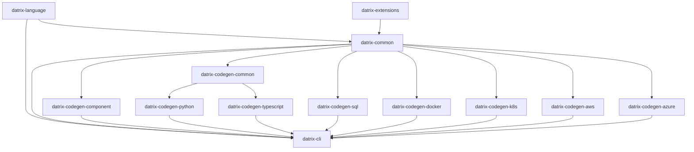

# Datrix Architecture Overview

**Version:** 2.0
**Last Updated:** May 2, 2026

---

## Introduction

Datrix is a code generation system that transforms `.dtrx` domain specifications into production-ready applications across multiple languages and platforms.

### Key Features

✅ **Template-Based Generation** - Jinja2 templates with automatic formatting
✅ **Fail-Fast Error Handling** - Errors caught at generation time, not runtime
✅ **Multi-Language Support** - Python, TypeScript, SQL
✅ **Multi-Platform Support** - Docker, Kubernetes, AWS, Azure
✅ **Type-Safe** - Exhaustive type mappings with validation
✅ **Modular Architecture** - 13 installable packages (core toolchain + optional **datrix-extensions**) plus showcase and projects repos
✅ **Specification-Level Testing** - DSL `test` blocks transpile to pytest under `tests/spec/` (Python) and Jest under `test/spec/` (TypeScript); see the [spec testing documentation](../guide/spec-testing.md)
✅ **Event contracts** - `ensure` clauses on `publish` events enforce publisher-side validation before `dispatch`
✅ **External library interfacing** - `extern service` declarations generate typed HTTP clients and deployment wiring for user-built services

---

## Sub-Documents

This overview was split into focused sub-documents for easier navigation. Each sub-document preserves the original section headings.

- **[Pipeline Flow & Capabilities](architecture/pipeline-and-capabilities.md)** — System architecture, pipeline stages, standard library, phase 01/02/03 capabilities, search engine integration, CDN / content delivery, managed API gateway
- **[Repository Architecture & Plugins](architecture/repository-architecture.md)** — 13 packages, plugin system, domain extension system, extern services, application containers, adding a new language
- **[Builtin Traits & Enums](architecture/builtin-traits-enums.md)** — 10 builtin traits, 2 builtin enums, injection mechanism

### Moved section anchors

The following anchors previously lived in this file and are now in sub-documents. Update links accordingly:

| Old anchor in this file | New location |
|------------------------|--------------|
| `#system-architecture` | [pipeline-and-capabilities.md#system-architecture](architecture/pipeline-and-capabilities.md#system-architecture) |
| `#pipeline-flow` | [pipeline-and-capabilities.md#pipeline-flow](architecture/pipeline-and-capabilities.md#pipeline-flow) |
| `#standard-library` | [pipeline-and-capabilities.md#standard-library](architecture/pipeline-and-capabilities.md#standard-library) |
| `#phase-01-capabilities-python-and-docker` | [pipeline-and-capabilities.md#phase-01-capabilities-python-and-docker](architecture/pipeline-and-capabilities.md#phase-01-capabilities-python-and-docker) |
| `#phase-02-capabilities-python-docker-docs` | [pipeline-and-capabilities.md#phase-02-capabilities-python-docker-docs](architecture/pipeline-and-capabilities.md#phase-02-capabilities-python-docker-docs) |
| `#phase-03-capabilities-python-docker` | [pipeline-and-capabilities.md#phase-03-capabilities-python-docker](architecture/pipeline-and-capabilities.md#phase-03-capabilities-python-docker) |
| `#search-engine-integration` | [pipeline-and-capabilities.md#search-engine-integration](architecture/pipeline-and-capabilities.md#search-engine-integration) |
| `#cdn--content-delivery` | [pipeline-and-capabilities.md#cdn--content-delivery](architecture/pipeline-and-capabilities.md#cdn--content-delivery) |
| `#managed-api-gateway` | [pipeline-and-capabilities.md#managed-api-gateway](architecture/pipeline-and-capabilities.md#managed-api-gateway) |
| `#repository-architecture` | [repository-architecture.md#repository-architecture](architecture/repository-architecture.md#repository-architecture) |
| `#plugin-architecture` | [repository-architecture.md#plugin-architecture](architecture/repository-architecture.md#plugin-architecture) |
| `#domain-extension-system` | [repository-architecture.md#domain-extension-system](architecture/repository-architecture.md#domain-extension-system) |
| `#application-containers` | [repository-architecture.md#application-containers](architecture/repository-architecture.md#application-containers) |
| `#extern-services-external-library-interfacing` | [repository-architecture.md#extern-services-external-library-interfacing](architecture/repository-architecture.md#extern-services-external-library-interfacing) |
| `#adding-a-new-language` | [repository-architecture.md#adding-a-new-language](architecture/repository-architecture.md#adding-a-new-language) |
| `#builtin-traits-and-enums` | [builtin-traits-enums.md#builtin-traits-and-enums](architecture/builtin-traits-enums.md#builtin-traits-and-enums) |

---

## Dependency Graph



**Legend:**
- **datrix-common** (no dependencies) — Foundation and generation framework (AST model, type system, semantic analysis, config resolution, plugin protocols, pipeline)
- **datrix-language** (depends on datrix-common) — Parser + CST-to-AST transformers
- **datrix-extensions** (depends on datrix-common) — Optional domain packs; **not** required by `datrix-cli` or generators unless you declare `use extension` and install the pack
- **datrix-codegen-common** (depends on datrix-common) — Shared codegen intelligence: profile-driven transpiler, language-agnostic algorithms, context models, field analysis, parity checking. Consumed only by language codegen packages.
- **Language Code Generators** (depend on datrix-codegen-common, which depends on datrix-common) — Python, TypeScript
- **Other Code Generators** (depend on datrix-common) — SQL, component
- **Platform Generators** (depend on datrix-common) — Docker, Kubernetes, AWS, Azure
- **datrix-cli** (depends on datrix-common, datrix-language; discovers generator plugins dynamically)

---

## Core Principles

1. **Fail Fast, Fail Loud** — Catch errors at generation time, not runtime. See [Design Principles](./design-principles.md).
2. **Template-Based Generation with Formatters** — Jinja2 templates with ruff format (Python) / Prettier (TypeScript). See [Design Principles](./design-principles.md).
3. **Exhaustive Type Mappings** — All type mappings must be explicit; fail if unmapped. See [Design Principles](./design-principles.md).
4. **Immutable AST Model** — The Application model cannot be modified after creation (thread-safe, predictable). See [Design Principles](./design-principles.md).
5. **Single Responsibility** — Each repository has ONE clear purpose (`datrix-common`: AST + framework; `datrix-language`: parser; each codegen: one language/platform).

---

## Technology Stack

### Languages & Frameworks
- **Python 3.11+** - All implementations
- **Tree-sitter** - Parser generation
- **Pydantic v2** - Data validation

### Code Generation
- **Jinja2** - Template-based code generation
- **ruff format** - Python code formatting
- **Prettier** - TypeScript code formatting
- **ruamel.yaml** - YAML generation
- **Transpiler** — `StagePipeline` + `TranspileContext` + `TranspileResult` + visitor protocols (`datrix_common.transpiler`, `datrix_common.datrix_model.visitor_protocols`); see [datrix-common-api — Transpiler modules](../../../datrix-common/docs/datrix-common-api.md#transpiler-modules)

### Code Quality
- **ruff** - Python linting and formatting
- **mypy** - Type checking (strict mode)
- **pytest** - Testing

### CLI
- **Typer/Click** - CLI framework
- **Rich** - Terminal UI

---

## Key Architectural Decisions

### Decision 1: No Separate IR Layer

**Rationale:**
- The parser produces the Application (AST model) directly
- There is no IR layer; the AST model is the single representation
- Fewer transformations means fewer bugs

**Result:** The AST model (`Application`, `Entity`, `Service`, etc.) lives in `datrix-common`. The parser in `datrix-language` produces `Application` objects but the type is defined in `datrix-common`, making the AST available to all packages without depending on the parser.

---

### Decision 2: `datrix-codegen-*` Naming

**Rationale:**
- Shows family relationship (all codegen)
- They extend/specialize `datrix-common`
- User mental model: "codegen for Python"

**Result:**
- `datrix-codegen-python` (not `datrix-generator-python`)
- `datrix-codegen-typescript`
- `datrix-codegen-sql`

---

### Decision 3: One Repo Per Platform

**Rationale:**
- Independent versioning
- Independent releases
- Clear ownership
- Plugin architecture

**Result:** Separate repos for Docker, K8s, AWS, Azure

---

## Installation

```bash
# Minimal (CLI only)
pip install datrix-cli

# Python + Docker
pip install datrix-cli datrix-codegen-python datrix-codegen-docker

# Full stack
pip install datrix-cli \
 datrix-codegen-python datrix-codegen-typescript datrix-codegen-sql \
 datrix-codegen-docker datrix-codegen-k8s datrix-codegen-aws datrix-codegen-azure
```

**Note:** The CLI automatically discovers installed generators. You only need to install the generators you plan to use.

---

## Usage

Use the CLI to validate and generate:
```bash
# Validate a file or directory of .dtrx files
datrix validate system.dtrx
datrix validate examples/02-features/01-core-data-modeling/rest-api

# Generate (defaults: profile test; language/hosting from YAML for that profile)
datrix generate --source system.dtrx --output ./generated

# Generate for a specific profile
datrix generate --source system.dtrx --output ./generated --profile production

# Override language / hosting / platform for one run (optional short flags)
datrix generate --source system.dtrx --output ./generated --language typescript
datrix generate --source system.dtrx --output ./generated -L python -H docker -P compose
```

**Config-driven generation:** The usual source of truth is YAML: `language` and `hosting` in `system-config.yaml`, and service-level `platform` in each service config (e.g. `compose`, `ecs-fargate`, `lambda`). Use `--language` / `-L`, `--hosting` / `-H`, and `--platform` / `-P` only when you want CLI overrides for a single invocation.

---

## Next Steps

- Read [Design Principles](./design-principles.md) to understand core principles
- Read [Language Reference](../reference/language-reference.md) to learn how to write `.dtrx` files
- See [Getting Started](../getting-started/first-project.md) and the runnable trees under [`examples/`](../../examples/)
