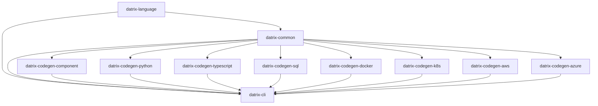

# Datrix Architecture Overview

**Version:** 2.0
**Last Updated:** March 16, 2026

---

## Introduction

Datrix is a code generation system that transforms `.dtrx` domain specifications into production-ready applications across multiple languages and platforms.

### Key Features

✅ **Template-Based Generation** - Jinja2 templates with automatic formatting
✅ **Fail-Fast Error Handling** - Errors caught at generation time, not runtime
✅ **Multi-Language Support** - Python, TypeScript, SQL
✅ **Multi-Platform Support** - Docker, Kubernetes, AWS, Azure
✅ **Type-Safe** - Exhaustive type mappings with validation
✅ **Modular Architecture** - 11 packages plus showcase repo

---

## System Architecture

### Pipeline Flow

```
.dtrx Source Files
 ↓
┌─────────────────────────────────┐
│ Parser (datrix-language) │
│ - Lexical analysis │
│ - Syntax parsing (Tree-sitter) │
└─────────────────────────────────┘
 ↓
┌─────────────────────────────────┐
│ AST (datrix-common) │
│ - Immutable syntax tree │
│ - Source locations preserved │
└─────────────────────────────────┘
 ↓
┌─────────────────────────────────┐
│ Semantic Analysis (datrix-common) │
│ - Symbol collection & imports │
│ - Reference resolution │
│ - Inheritance merging │
│ - Type checking │
│ - Domain validation │
└─────────────────────────────────┘
 ↓
┌─────────────────────────────────┐
│ Config Resolution │
│ - Parse YAML config files │
│ - Select active profile │
│ - Validate against schemas │
│ - Attach resolved_config to │
│ AST blocks │
└─────────────────────────────────┘
 ↓
┌─────────────────────────────────┐
│ Application (datrix-common) │
│ - Language-agnostic AST model │
│ - Service-scoped entities │
│ (service.rdbms_blocks[name]) │
│ - Immutable representation │
│ - Config attached to blocks │
└─────────────────────────────────┘
 ↓
┌─────────────────────────────────┐
│ Code Generators │
│ - datrix-codegen-component │
│ - datrix-codegen-python │
│ - datrix-codegen-typescript │
│ - datrix-codegen-sql │
└─────────────────────────────────┘
 ↓
┌─────────────────────────────────┐
│ Platform Generators │
│ - datrix-codegen-docker │
│ - datrix-codegen-k8s │
│ - datrix-codegen-aws │
│ - datrix-codegen-azure │
└─────────────────────────────────┘
 ↓
Generated Application
```

The `datrix generate` command supports `--language`, `--hosting`, and `--platform` to override config-driven values for a single generation run. In the generation pipeline, overrides run in the `apply_cli_overrides` stage after config resolution and service filtering, and before `platform_validation`.

---

## Repository Architecture

The project is split into 11 packages plus the **datrix** showcase repo (docs, examples, scripts). This structure provides clear boundaries, independent versioning/releases, selective installation, and per-repo CI/CD pipelines.

### Core Repositories (2)

#### 1. datrix-common
**Purpose:** Shared foundation and code generation framework for all Datrix packages — AST model, type system, semantic analysis, config resolution, and generator infrastructure.

**Responsibilities:**
- **AST and types:** AST model (`Application`, `Entity`, `Service`, `RdbmsBlock`, etc.) — the single representation consumed by all generators; type system (`TypeRegistry`, `ScalarType`) and builtin scalar type definitions
- **Semantic analysis:** 6-phase pipeline (symbol collection, import resolution, reference resolution, inheritance merging, type checking, domain validation)
- **Config resolution:** parses YAML config files referenced by AST blocks, selects active profile, validates against schemas, attaches resolved config to blocks
- **Generation framework:** Generator base classes, plugin protocols (`GeneratorPlugin`, `PlatformPlugin`), pipeline orchestration, template rendering (Jinja2), YAML/JSON document builders, file coordination, code formatting integration, testing utilities for generator packages
- **Shared:** Rendering utilities, error classes, configuration models, shared utilities

**Dependencies:** None (zero dependencies on other Datrix packages)

---

#### 2. datrix-language
**Purpose:** Parser and CST-to-AST transformers for .dtrx files

**Responsibilities:**
- Parsing .dtrx files (Tree-sitter grammar, lexer, parser)
- CST-to-AST transformers that produce `Application` objects (defined in `datrix-common`)

**Key Insight:** The parser + transformers produce `Application` directly. There is no separate IR layer. The `Application` model and all AST types are defined in `datrix-common`; datrix-language imports them.

**Dependencies:**
- `datrix-common` (AST model, type system, semantic analysis, config resolution)

---

### Code Generators (4)

These are **specialized extensions** of the generation framework in `datrix-common` for specific languages or platform-agnostic artifacts.

#### 3. datrix-codegen-component
Generates platform-agnostic components: documentation (README, API reference, architecture), configuration (Alembic, pytest, coverage), scripts (entrypoint, dev scripts), and shared templates (Mermaid diagrams)

#### 4. datrix-codegen-python
Generates Python code (FastAPI, Django, Flask)

#### 5. datrix-codegen-typescript
Generates TypeScript code (Express, NestJS, Next.js)

#### 6. datrix-codegen-sql
Generates SQL DDL (PostgreSQL, MySQL)

**Dependencies:**
- `datrix-common` (AST model, type system, template rendering, generation framework)
- `jinja2` (for template rendering)

---

### Platform Generators (4)

Generate infrastructure and deployment configurations.

#### 7. datrix-codegen-docker
Generates Dockerfiles and docker-compose.yml

#### 8. datrix-codegen-k8s
Generates Kubernetes manifests (Deployment, Service, etc.)

#### 9. datrix-codegen-aws
Generates AWS infrastructure (CDK, CloudFormation)

#### 10. datrix-codegen-azure
Generates Azure infrastructure (Bicep, ARM templates)

**Dependencies:**
- `datrix-common` (AST model, configuration, generation framework, YAML/JSON builders)

---

### CLI (1)

#### 11. datrix-cli
Command-line interface for code generation

**Responsibilities:**
- Pipeline orchestration
- Plugin discovery
- Linting and formatting
- Progress reporting
- User interaction

**Dependencies:**
- `datrix-common` (AST model, type system, configuration, semantic analysis, pipeline, generator discovery)
- `datrix-language` (parser, CST-to-AST transformers)
- Discovers installed generator *plugins* dynamically (datrix-codegen-python, etc.)

---

### Showcase (1)

#### 12. datrix
Public repository with documentation, examples, scripts, and tutorials.

---

## Plugin Architecture

Generators are discovered dynamically via a plugin architecture:

1. **Protocol-based plugins** - Generators implement `GeneratorPlugin` or `PlatformPlugin` protocols
2. **Dynamic discovery** - CLI discovers plugins via entry points or explicit registration
3. **Independent packages** - Each generator is a separate package that can be installed independently
4. **Clear interfaces** - Protocols define exactly what generators must implement

### Generator Plugin Protocol

Generators implement protocols (`GeneratorPlugin`, `PlatformPlugin`) defined in `datrix-common` (see `datrix_common.plugin.protocol`). The CLI discovers installed generators at runtime. Users only install the generators they need — no unused dependencies.

---

## Dependency Graph



**Legend:**
- **datrix-common** (no dependencies) — Foundation and generation framework (AST model, type system, semantic analysis, config resolution, plugin protocols, pipeline)
- **datrix-language** (depends on datrix-common) — Parser + CST-to-AST transformers
- **Code Generators** (depend on datrix-common) — Python, TypeScript, SQL, component
- **Platform Generators** (depend on datrix-common) — Docker, Kubernetes, AWS, Azure
- **datrix-cli** (depends on datrix-common, datrix-language; discovers generator plugins dynamically)

---

## Builtin Traits and Enums

Datrix provides a catalog of **ten builtin traits** and **two builtin enums** that are always available in every service and module without user definition.

### Builtin Traits

| Trait | Fields | Purpose |
|-------|--------|---------|
| **Activatable** | `Boolean isActive`, `DateTime? activatedAt`, `DateTime? deactivatedAt` | Enable/disable entities |
| **Auditable** | `UUID createdBy`, `UUID? updatedBy` | Track who created/modified |
| **Publishable** | `DateTime? publishedAt`, `UUID? publishedBy`, `PublishStatus publishStatus` | Draft/publish workflow |
| **Schedulable** | `DateTime? scheduledFor`, `DateTime? executedAt`, `ScheduleStatus scheduleStatus` | Scheduled execution |
| **Sluggable** | `String(200) slug : unique` | URL-friendly slugs |
| **SoftDeletable** | `DateTime? deletedAt`, `UUID? deletedBy`, computed `isDeleted` | Soft deletion |
| **Taggable** | `Array<String> tags` | Tagging |
| **Tenantable** | `UUID tenantId : immutable, indexed` | Row-level tenant isolation |
| **Timestampable** | `DateTime createdAt`, `DateTime updatedAt` | Automatic timestamps |
| **Versionable** | `Int version` | Optimistic locking |

### Builtin Enums

| Enum | Values | Used By |
|------|--------|---------|
| **PublishStatus** | `Draft`, `Published`, `Archived` | Publishable trait |
| **ScheduleStatus** | `Pending`, `Scheduled`, `Executed`, `Cancelled` | Schedulable trait |

### How It Works

1. Builtin traits and enums are **programmatically-constructed AST objects** defined in `datrix_common.builtins.traits` and `datrix_common.builtins.enums`
2. They are **injected into every TypeContainer** (Service, Module) before reference resolution
3. Users reference them with `with TraitName` on entity declarations (e.g., `entity User extends BaseEntity with Tenantable`)
4. They are **opt-in** — no trait is automatically applied to entities
5. User code **cannot redefine** builtin trait or enum names (BLT001 validator enforces this)

---

## Core Principles

### 1. Fail Fast, Fail Loud

**Philosophy:** Catch errors at generation time, not runtime. See [Design Principles](./design-principles.md).

---

### 2. Template-Based Generation with Formatters

**Philosophy:** Generate code using Jinja2 templates with formatting checks (ruff format for Python, Prettier for TypeScript). See [Design Principles](./design-principles.md).

**Benefits:**
- Clean separation of logic and output
- Easy to read and maintain templates
- Automatic formatting ensures valid syntax
- Reusable template macros

---

### 3. Exhaustive Type Mappings

**Philosophy:** All type mappings must be explicit. Fail if unmapped. See [Design Principles](./design-principles.md).

---

### 4. Immutable AST Model

**Philosophy:** The Application model cannot be modified after creation. See [Design Principles](./design-principles.md).

**Benefits:**
- Thread-safe
- Predictable behavior
- Prevents accidental modifications

---

### 5. Single Responsibility

Each repository has ONE clear purpose:
- `datrix-common`: AST model, type system, semantic analysis, config resolution, generation framework, shared utilities
- `datrix-language`: Parser and CST-to-AST transformers
- `datrix-codegen-python`: Python code generation
- Each platform generator: One platform

---

## Technology Stack

### Languages & Frameworks
- **Python 3.11+** - All implementations
- **Tree-sitter** - Parser generation
- **Pydantic v2** - Data validation

### Code Generation
- **Jinja2** - Template-based code generation
- **ruff format** - Python code formatting
- **Prettier** - TypeScript code formatting
- **ruamel.yaml** - YAML generation

### Code Quality
- **ruff** - Python linting and formatting
- **mypy** - Type checking (strict mode)
- **pytest** - Testing

### CLI
- **Typer/Click** - CLI framework
- **Rich** - Terminal UI

---

## Key Architectural Decisions

### Decision 1: No Separate IR Layer

**Rationale:**
- The parser produces the Application (AST model) directly
- There is no IR layer; the AST model is the single representation
- Fewer transformations means fewer bugs

**Result:** The AST model (`Application`, `Entity`, `Service`, etc.) lives in `datrix-common`. The parser in `datrix-language` produces `Application` objects but the type is defined in `datrix-common`, making the AST available to all packages without depending on the parser.

---

### Decision 2: `datrix-codegen-*` Naming

**Rationale:**
- Shows family relationship (all codegen)
- They extend/specialize `datrix-common`
- User mental model: "codegen for Python"

**Result:**
- `datrix-codegen-python` (not `datrix-generator-python`)
- `datrix-codegen-typescript`
- `datrix-codegen-sql`

---

### Decision 3: One Repo Per Platform

**Rationale:**
- Independent versioning
- Independent releases
- Clear ownership
- Plugin architecture

**Result:** Separate repos for Docker, K8s, AWS, Azure

---

## Installation

```bash
# Minimal (CLI only)
pip install datrix-cli

# Python + Docker
pip install datrix-cli datrix-codegen-python datrix-codegen-docker

# Full stack
pip install datrix-cli \
 datrix-codegen-python datrix-codegen-typescript datrix-codegen-sql \
 datrix-codegen-docker datrix-codegen-k8s datrix-codegen-aws datrix-codegen-azure
```

**Note:** The CLI automatically discovers installed generators. You only need to install the generators you plan to use.

---

## Usage

Use the CLI to validate and generate:
```bash
# Validate
datrix validate system.dtrx

# Generate code (language and platform are read from config files, not CLI flags)
datrix generate --source system.dtrx --output ./generated

# Generate for a specific profile
datrix generate --source system.dtrx --output ./generated --profile production

# Generate TypeScript output (override config language)
datrix generate --source system.dtrx --output ./generated --language typescript
```

**Config-driven generation:** The target language (Python, TypeScript) and deployment platform (Docker, K8s, AWS, Azure) are defined in config files, not CLI flags. The `language` and `hosting` fields in `system-config.yaml` determine which generators run. Service-level `platform` fields in each service's config YAML determine the specific runtime flavor (e.g., `compose`, `ecs-fargate`, `lambda`).

---

## Next Steps

- Read [Design Principles](./design-principles.md) to understand core principles
- Read [Language Reference](../reference/language-reference.md) to learn how to write `.dtrx` files
- See [Getting Started](../getting-started/) for tutorials

---

**Last Updated:** March 16, 2026
