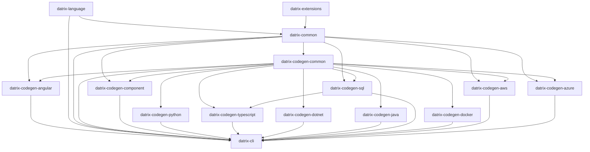

# Datrix Architecture Overview

**Version:** 2.1
**Last Updated:** June 23, 2026

---

## Introduction

Datrix is a code generation system that transforms `.dtrx` domain specifications into production-ready applications across multiple languages and platforms.

### Key Features

✅ **Template-Based Generation** - Jinja2 templates with automatic formatting
✅ **Fail-Fast Error Handling** - Errors caught at generation time, not runtime
✅ **Multi-Language Support** - Python, TypeScript, SQL, .NET, Java — the language set is open
✅ **Multi-Platform Support** - Docker, AWS, Azure
✅ **Type-Safe** - Exhaustive type mappings with validation
✅ **Modular Architecture** - 15 installable packages (14 core toolchain + optional **datrix-extensions**) plus showcase and projects repos
✅ **Specification-Level Testing** - DSL `test` blocks transpile to pytest under `tests/spec/` (Python) and Jest under `test/spec/` (TypeScript); see the [spec testing documentation](../guide/spec-testing.md)
✅ **Event contracts** - `ensure` clauses on `publish` events enforce publisher-side validation before `dispatch`
✅ **External library interfacing** - `extern service` declarations generate typed HTTP clients and deployment wiring for user-built services
✅ **Serverless block code generation** - `serverless` blocks deploy handlers as Lambda functions, Azure Functions, or container processes with platform-specific entry points and infrastructure provisioning
✅ **Centralized runtime config store** - a system-level `configStore` section generates a runtime configuration plane (AWS AppConfig, Azure App Configuration, or self-hosted Consul KV), local JSON defaults, and Python/TypeScript runtime clients for feature flags and operational tuning without rebuilds
✅ **Zero-environment runtime** - deployment-static values (config-store endpoint, secrets-backend URL, region, credential kind) are baked as literal constants at generation time instead of read from the environment. Each language plugin declares whether its generated services realize this contract, and a census gate holds every language to its declaration — python declares it realized with reviewed exemptions; typescript, java and dotnet declare it unrealized with a written reason and a decrease-only pinned count (see [Decision 14](#decision-14-runtime-configuration--secrets--zero-environment-architecture-adopted))

---

## Sub-Documents

This overview was split into focused sub-documents for easier navigation. Each sub-document preserves the original section headings.

- **[Pipeline Flow & Capabilities](architecture/pipeline-and-capabilities.md)** — System architecture, pipeline stages, standard library, phase 01/02/03 capabilities, search engine integration, CDN / content delivery, managed API gateway
- **[Repository Architecture & Plugins](architecture/repository-architecture.md)** — 16 repos (15 installable packages + the showcase repo), plugin system, domain extension system, extern services, application containers, adding a new language
- **[Builtin Traits & Enums](architecture/builtin-traits-enums.md)** — 10 builtin traits, 2 builtin enums, injection mechanism

Related:

- **[Generated Output Stability](generated-output-stability.md)** — why the repo keeps no stored snapshot of generated output and no bless step, which decidable checks hold the output contract instead, and how the artifact-role gate reads the live generated corpus

### Moved section anchors

The following anchors previously lived in this file and are now in sub-documents. Update links accordingly:

| Old anchor in this file | New location |
|------------------------|--------------|
| `#system-architecture` | [pipeline-and-capabilities.md#system-architecture](architecture/pipeline-and-capabilities.md#system-architecture) |
| `#pipeline-flow` | [pipeline-and-capabilities.md#pipeline-flow](architecture/pipeline-and-capabilities.md#pipeline-flow--capabilities) |
| `#standard-library` | [pipeline-and-capabilities.md#standard-library](architecture/pipeline-and-capabilities.md#standard-library-stable) |
| `#phase-01-capabilities-python-and-docker` | [pipeline-and-capabilities.md#phase-01-capabilities-python-and-docker](architecture/pipeline-and-capabilities.md#phase-01-capabilities-stable-python-and-docker) |
| `#phase-02-capabilities-python-docker-docs` | [pipeline-and-capabilities.md#phase-02-capabilities-python-docker-docs](architecture/pipeline-and-capabilities.md#phase-02-capabilities-stable-python-docker-docs) |
| `#phase-03-capabilities-python-docker` | [pipeline-and-capabilities.md#phase-03-capabilities-python-docker](architecture/pipeline-and-capabilities.md#phase-03-capabilities-stable-python-docker) |
| `#search-engine-integration` | [pipeline-and-capabilities.md#search-engine-integration](architecture/pipeline-and-capabilities.md#search-engine-integration-stable) |
| `#cdn--content-delivery` | [pipeline-and-capabilities.md#cdn--content-delivery](architecture/pipeline-and-capabilities.md#cdn--content-delivery-beta) |
| `#managed-api-gateway` | [pipeline-and-capabilities.md#managed-api-gateway](architecture/pipeline-and-capabilities.md#managed-api-gateway-stable) |
| `#repository-architecture` | [repository-architecture.md#repository-architecture](architecture/repository-architecture.md#repository-architecture) |
| `#plugin-architecture` | [repository-architecture.md#plugin-architecture](architecture/repository-architecture.md#plugin-architecture) |
| `#domain-extension-system` | [repository-architecture.md#domain-extension-system](architecture/repository-architecture.md#domain-extension-system) |
| `#application-containers` | [repository-architecture.md#application-containers](architecture/repository-architecture.md#application-containers) |
| `#extern-services-external-library-interfacing` | [repository-architecture.md#extern-services-external-library-interfacing](architecture/repository-architecture.md#extern-services-external-library-interfacing) |
| `#adding-a-new-language` | [repository-architecture.md#adding-a-new-language](architecture/repository-architecture.md#adding-a-new-language) |
| `#builtin-traits-and-enums` | [builtin-traits-enums.md#builtin-traits-and-enums](architecture/builtin-traits-enums.md#builtin-traits-and-enums) |

---

## Dependency Graph


```mermaid
graph TD
 A[datrix-common]
 B[datrix-language] --> A
 L[datrix-extensions] --> A
 A --> CC[datrix-codegen-component]
 A --> CGC[datrix-codegen-common]
 CGC --> CC
 CGC --> D[datrix-codegen-python]
 CGC --> E[datrix-codegen-typescript]
 CGC --> M[datrix-codegen-dotnet]
 CGC --> N[datrix-codegen-java]
 A --> F[datrix-codegen-sql]
 CGC --> F
 F --> E
 CGC --> G[datrix-codegen-docker]
 A --> ANG[datrix-codegen-angular]
 CGC --> ANG
 ANG --> K
 A --> I[datrix-codegen-aws]
 CGC --> I
 A --> J[datrix-codegen-azure]
 CGC --> J
 B --> K[datrix-cli]
 A --> K
 CGC --> K
 CC --> K
 D --> K
 E --> K
 M --> K
 N --> K
 F --> K
 G --> K
 I --> K
 J --> K
```

**Legend:**
- **datrix-common** (no dependencies) — Foundation and generation framework (AST model, type system, semantic analysis, standard library resources + loader protocols, config resolution, plugin protocols, generation framework). Does **not** import `datrix-language` — parser and stdlib-loader implementations are injected via protocols.
- **datrix-language** (depends on datrix-common) — Parser + CST-to-AST transformers, implements `ParserProtocol` and `StdlibParserProtocol` defined in datrix-common
- **datrix-extensions** (depends on datrix-common) — Optional domain packs; **not** required by `datrix-cli` or generators unless you declare `use extension` and install the pack
- **datrix-codegen-common** (depends on datrix-common) — Shared codegen intelligence: profile-driven transpiler, language-agnostic algorithms, context models, field analysis, parity checking, shared Grafana dashboard builder, GenDSL runtime, serverless/replayable-ingestion plans. Consumed by language codegen packages and by **all three** platform generators for its language-agnostic services.
- **Language Code Generators** (depend on datrix-codegen-common, which depends on datrix-common) — Python, TypeScript, .NET, and Java. The set is open: each new target language is one more peer package here, and a language generator never depends on a sibling language package.
- **Other Code Generators** (depend on datrix-common and datrix-codegen-common) — SQL (GenDSL runtime, migration adapter contract, a narrow language-agnostic subtree set) and component (GenDSL runtime, derived domain declarations, serverless plans). **One language generator also depends on the SQL generator:** `datrix-codegen-typescript`'s MikroORM migration adapter renders DDL through `datrix_codegen_sql`'s dialect protocol, index constants, naming, and type map (`datrix-codegen-typescript/src/datrix_codegen_typescript/generators/persistence/mikroorm_migration_adapter.py`). That edge is declared in its manifest and is the only language→SQL edge in the tree; the other language packages render their migration DDL without it.
- **Platform Generators** (Docker, AWS, Azure) — all three depend on **datrix-codegen-common** for its language-agnostic platform services (GenDSL runtime, shared Grafana `DashboardBuilder`, serverless and replayable-ingestion plans, shared enums) as well as datrix-common. They must **not** import the language-specific parts of codegen-common (`transpiler.*`, language-shaped `context_models`/`algorithms`) or any language generator package — see the [platform → codegen-common subtree contract](../../../datrix-common/docs/architecture/import-boundaries.md#platform--codegen-common-subtree-contract).
- **datrix-cli** (depends on datrix-common, datrix-language, and datrix-codegen-common — the migration and generator-inspection commands import the shared migration-state, migration-render, and GenDSL-definition surfaces lazily; owns `GenerationPipeline` orchestration; discovers generator plugins dynamically)

**Every edge above is a declared edge.** `datrix/scripts/test/manifest-import-parity-gate.ps1` compares each package's `[project] dependencies` against the `datrix_*` roots its `src/` tree imports, in both directions, as a hard zero: an undeclared import, a dead declaration, and a test-only extra on a runtime requirement each fail the gate. The shared editable venv makes every package importable from every other, so this gate — not the resolver — is what keeps the manifests honest.

> **`datrix_codegen_common/platform/` subpackage.** A `platform/` subpackage lives **inside the existing `datrix-codegen-common`** — a sibling of `gendsl/`, `dashboards/`, `algorithms/`, and `context_models/`. **No new package or repo is created**: the shared provider seam (the `resolve_runtime_spec` / `runtime_stack_token` helpers and the `PlatformInfrastructure` protocol) is language-agnostic platform code, exactly the layer `datrix-codegen-common` already owns. Because the three platform generators already legally import `datrix-codegen-common`, `platform.*` simply joins the closed list of language-agnostic codegen-common subtrees platforms may import (alongside `gendsl.*`, `dashboards.*`, `algorithms.serverless`, `context_models.serverless`, `context_models.replayable_ingestion`, `enums`) — no new graph node and no new boundary edge. The shared Grafana `DashboardBuilder` **stays in `datrix-codegen-common/src/datrix_codegen_common/dashboards/`** and platforms continue to import it directly; there is no re-home and no `ObservabilityIntegration` facade. See [Shared Provider Library](../../../datrix-codegen-common/docs/architecture.md#shared-provider-library-platform) and [Decision 12: Language-Agnostic Provider Generators](#decision-12-language-agnostic-provider-generators-adopted).

**Import boundary enforcement:** The dependency edges above are enforced by automated tooling — see [Import Boundaries](../../datrix-common/docs/architecture/import-boundaries.md) for the full rule table and scanner usage. The scanner currently reports a known lower-bound caveat: files carrying a UTF-8 BOM are silently skipped (read with `encoding="utf-8"`), so the violation count is a lower bound until the scanner reads with `encoding="utf-8-sig"`. Fixing that is a tracked scanner-robustness follow-up, separate from the boundary-rule reconciliation.

---

## Core Principles

1. **Fail Fast, Fail Loud** — Catch errors at generation time, not runtime. See [Design Principles](./design-principles.md).
2. **Template-Based Generation with Formatters** — Jinja2 templates with ruff format (Python) / CSharpier (.NET) / google-java-format (Java); TypeScript templates emit pre-formatted output validated via `tsc --noEmit`, no separate formatter. See [Design Principles](./design-principles.md).
3. **Exhaustive Type Mappings** — All type mappings must be explicit; fail if unmapped. See [Design Principles](./design-principles.md).
4. **Immutable AST Model** — The Application model cannot be modified after creation (thread-safe, predictable). See [Design Principles](./design-principles.md).
5. **Single Responsibility** — Each repository has ONE clear purpose (`datrix-common`: AST + framework; `datrix-language`: parser; each codegen: one language/platform).

---

## Technology Stack

### Languages & Frameworks
- **Python 3.11+** - All implementations
- **Tree-sitter** - Parser generation
- **Pydantic v2** - Data validation

### Code Generation
- **Jinja2** - Template-based code generation
- **ruff format** - Python code formatting
- **CSharpier** - .NET code formatting
- **google-java-format** - Java code formatting
- **tsc --noEmit** - TypeScript compile validation (templates emit pre-formatted output; no separate formatter)
- **ruamel.yaml** - YAML generation
- **Transpiler** — `StagePipeline` + `TranspileContext` + `TranspileResult` + visitor protocols (`datrix_common.transpiler`, `datrix_common.datrix_model.visitor_protocols`); see [datrix-common-api — Transpiler modules](../../../datrix-common/docs/datrix-common-api.md#transpiler-modules)

### Code Quality
- **ruff** - Python linting and formatting
- **mypy** - Type checking (strict mode)
- **pytest** - Testing

### CLI
- **Typer/Click** - CLI framework
- **Rich** - Terminal UI

---

## Key Architectural Decisions

### Decision 1: No Separate IR Layer (Adopted)

**Rationale:**
- The parser produces the Application (AST model) directly
- There is no IR layer; the AST model is the single representation
- Fewer transformations means fewer bugs

**Result:** The AST model (`Application`, `Entity`, `Service`, etc.) lives in `datrix-common`. The parser in `datrix-language` produces `Application` objects but the type is defined in `datrix-common`, making the AST available to all packages without depending on the parser.

---

### Decision 2: `datrix-codegen-*` Naming (Adopted)

**Rationale:**
- Shows family relationship (all codegen)
- They extend/specialize `datrix-common`
- User mental model: "codegen for Python"

**Result:**
- `datrix-codegen-python` (not `datrix-generator-python`)
- `datrix-codegen-typescript`
- `datrix-codegen-sql`
- Every new target language joins under the same convention — e.g. `datrix-codegen-dotnet` and `datrix-codegen-java`, both now real generators

---

### Decision 3: One Repo Per Platform (Adopted)

**Rationale:**
- Clear ownership — a platform's templates, IaC builders, capability declaration, and tests live in one place
- Plugin architecture — a platform registers through `datrix.platforms` and is installable on its own; nothing in a shared layer names it

**Result:** Separate repos for Docker, AWS, Azure — and one per platform added since.

**Versioning story (what is practised, not aspired to):** every package repo is its own git repository, every package is at version `0.1.0`, no package repo carries release tags, and every inter-package constraint is an unpinned lower bound (`datrix-common`, `datrix-codegen-common>=0.1.0`). Independent versioning and independent releases are therefore **not** how the toolchain is shipped today. The only supported install topology is the shared editable venv (`D:\datrix\.venv`, every package installed with `pip install -e`), so the resolver never arbitrates versions and an undeclared dependency would never fail an install. What stands in for the resolver is the manifest/import parity gate (`datrix/scripts/test/manifest-import-parity-gate.ps1`): every package's declared Datrix dependency set must equal its `src/` import set in both directions, as a hard zero. Tagging and pinning become necessary the day a package is published or installed outside that venv; until then the split is for ownership and plugin isolation, not for release cadence.

---

### Decision 4: One DateTime Type, Always Timezone-Aware (Adopted)

**Rationale:**
- A timezone-aware datetime and a UTC datetime are the same *type* with different *values* for the timezone component — UTC is just one timezone
- Having separate `UDateTime` / `UDate` / `UTime` types implies UTC is structurally different from other timezones, which it isn't
- Naive datetimes (no timezone info) are almost always a bug in server code
- The Python ecosystem is moving away from naive datetimes; JavaScript's `Date` is always aware

**Result:**
- **`DateTime`** is always timezone-aware. There is no naive datetime in the DSL.
- **`Timezone`** is a builtin object that specifies which timezone. `Timezone.UTC` is the default; `Timezone.of("America/New_York")` for arbitrary IANA timezones.
- **`DateTime.now()`** defaults to UTC (no argument needed). `DateTime.now(Timezone.of("US/Eastern"))` for other timezones.
- `UDateTime`, `UDate`, `UTime` and all aliases (`UTCDateTime`, `DateTimeUTC`, `Instant`, `UTCDate`, `UTCTime`) are removed.
- `DateTime.utcNow()` is removed — it's just `DateTime.now()`.
- `Date` and `Time` remain timezone-unaware (calendar dates and wall-clock times don't carry timezone semantics).

---

### Decision 5: Generator Definition DSL (Implemented)

**Rationale:**
- Generator implementations encode structure (file declarations, iteration patterns, feature gates, semantic requirements) as imperative Python — registries, class constructors, context builders, and template rendering paths
- The same structural information is split across multiple locations, making it hard to answer "what does this generator produce?"
- Feature gates are repeated and sometimes implicit; semantic contracts are not declared adjacent to file emission; context dictionaries are often untyped
- Platform generators cannot reuse the language-generator registry model

**Result:**
- A constrained generator-definition DSL (genDSL) embedded in Python docstrings declares generator structure: identity, domains, feature gates, semantic requirements, iteration scopes, context models, file declarations, and cross-domain contributions
- The genDSL compiles in memory at import time into Python IR objects (`GeneratorDefinition`, `DomainDefinition`, `FileDefinition`, etc.) consumed by the existing generator runtime — no generated source files, no checked-in artifacts
- Python remains the implementation language for context builders, type resolvers, transpilers, and complex algorithms; the genDSL declares structure, Python implements computation
- IR foundation types live in `datrix-common`; the parser, validator, and runtime live in `datrix-codegen-common`; each generator package embeds its own genDSL definitions
- When a generator migrates to genDSL, the entire registry moves at once — no partial migration, no mixed sources, no backward compatibility wrappers
- **GenDSL 2 hardening (adopted and complete, 2026-07-08):** compilation closed — `where`/`when` resolve against typed context models and builder references resolve eagerly at registration, so an unknown property or reference is a load-time error instead of a silent `False`; a `FeatureCatalog` derived from AST block presence and plugin capability declarations replaced the hardcoded `_app_feature_*` executor predicates; declared-file rendering became the only render path, with the `render_declared_files` escape hatch removed and each consumer's hand-coded iteration loop deleted; and parity collapsed to a single derived mechanism (`parity/generated_parity_table.py`), retiring the hand-maintained exemptions, feature-gate, and per-package declaration lists.

**Design reference:** [GenDSL Documentation](../../../datrix-codegen-common/docs/gendsl/overview.md) — Complete specification in datrix-codegen-common/docs/gendsl/. GenDSL 2 hardening: [Design Decisions 14–17](../../../datrix-codegen-common/docs/gendsl/design-decisions.md#decision-14-closed-compilation--typed-context-validation-and-eager-reference-resolution) and [Migration Guide Phase 8](../../../datrix-codegen-common/docs/gendsl/migration-guide.md#phase-8-gendsl-2--closed-compilation-declared-rendering-single-parity).

---

### Decision 6: Deployment Target Contract (Stable)

> **Partially superseded by Decision 15 (Multi-Target Plugin Architecture, adopted) and by the adoption of language as a generation target rather than a config field:** `deployment.provider` is no longer a closed enum value set — it is an open, plugin-registry-validated identifier (`ProviderId`; see [datrix-common API — Open identity](../../../datrix-common/docs/datrix-common-api.md#open-identity-languageid--providerid)), and the "Generator orchestration" table below is no longer a fixed lineup — each generator declares a phase and optional `runs_after` names, and the CLI topologically sorts them (`datrix_common.generation.generator_lineup`). `deployment.runtime` is an open, plugin-declared identifier too (`RuntimeId`; each platform declares the runtimes it realizes). Runtime/provider orthogonality is preserved by construction — the two are independently resolved dimensions, and neither resolver takes the other as a parameter. `language` is no longer a config field at all: it is a required generation parameter (`--language`/`-L`) resolved against the registered `datrix.languages` set (`LanguageId`, via `resolve_language_id`) — see Decision 6 below, as amended. The YAML shape and concept matrix below are otherwise unchanged, minus the removed `language` config key.

**Rationale:**
- Legacy models conflated runtime packaging shape, infrastructure provider, and cloud-managed targets into a single dimension
- "Docker Compose" and "ECS Fargate" are runtime/packaging targets, not cloud providers; "AWS" and "Azure" are providers, not runtimes
- One-dimensional models cannot express combinations like "ECS Fargate on AWS" or "Azure App Service on Azure" without overloading terms
- CLI overrides can create partial deployment states where the command line says one target but resolved config still contains values for another

**Result:**
- An explicit deployment target model replaces the single `hosting` dimension with three orthogonal fields:

```yaml
deployment:
  runtime: docker-compose | azure-app-service | azure-app-service-container | ecs-fargate | app-runner
  provider: local | existing | aws | azure
  registry: acr | ecr | ...           # optional, provider-specific
```

- `language` is not part of this config model — it is a required generation parameter (`--language`/`-L`), resolved against the registered `datrix.languages` set via `resolve_language_id`; it selects the generated application implementation. A `language` key in `config/system.dcfg` (base or profile) is a fail-loud error. See the CLI contract below.
- `deployment.runtime` selects the deployable artifact shape (Compose, Azure App Service, ECS Fargate, etc.)
- `deployment.provider` selects the infrastructure provider or substrate owner
- `deployment.registry` is an optional provider-specific refinement
- There is no `target` dimension; cloud deployments use only native runtimes (`ecs-fargate`/`app-runner` for AWS, `azure-app-service`/`azure-app-service-container` for Azure)
- `host` remains a network endpoint concept only — never used to mean AWS, Azure, or Docker

> **Note:** `runtime: azure-container-apps` is **retired**. Use `runtime: azure-app-service` for the native Azure PaaS runtime. Specifying the retired value raises a generation error with migration guidance.

**Construct-mapped realization:** Once a deployment target is resolved, each DSL block maps to the target platform's native primitive. Service deployment shape is derived entirely from declared blocks — no separate per-service runtime selector is needed. See [Design Principles — Construct-Mapped Platform Realization](./design-principles.md#11-construct-mapped-platform-realization-stable) for the full mapping table and rationale.

**Concept matrix:**

| Concept | Examples | Owns |
| --- | --- | --- |
| Language | `python`, `typescript` | Application source code, framework/runtime adapters, language package/dependency files — resolved from the required `--language`/`-L` CLI flag, not deployment config |
| Runtime | `docker-compose`, `azure-app-service`, `azure-app-service-container`, `ecs-fargate`, `app-runner` | Deployable artifact shape and process model |
| Provider | `local`, `existing`, `aws`, `azure` | Provider-managed substrate, registry, identity, networking, managed services |
| Infrastructure flavor | `container`, `external`, `rds`, `flexible-server`, `event-hubs` | Per-block provisioning choice (RDBMS, cache, pubsub, etc.) |
| Host | `db.example.com`, `api.example.com`, `localhost` | Network endpoint |

**Deployment examples:**

```yaml
# Local Docker Compose
deployment:
  runtime: docker-compose
  provider: local

# AWS App Runner
deployment:
  runtime: app-runner
  provider: aws
  registry: ecr

# Azure App Service (native PaaS)
deployment:
  runtime: azure-app-service
  provider: azure
  registry: acr

# AWS ECS Fargate
deployment:
  runtime: ecs-fargate
  provider: aws
  registry: ecr
```

Each example above pairs with a required `--language`/`-L` flag on the `datrix generate` command; language is never read from these config blocks.

**Generator orchestration** becomes multidimensional:

| Deployment | Language generators | Runtime generators | Provider generators |
| --- | --- | --- | --- |
| Python Docker Compose local | `component`, `python`, `sql` | `docker` | none |
| TypeScript Docker Compose local | `component`, `typescript`, `sql`, `python_http_contract_overlay` | `docker` | none |
| Python Azure App Service (code-based) | `component`, `python`, `sql` | none (PaaS, no containers) | `azure` App Service + managed infra |
| Python Azure App Service Container | `component`, `python`, `sql` | `docker` (custom-container delivery) | `azure` App Service + managed infra |
| Python ECS Fargate | `component`, `python`, `sql` | `docker` (containers need Dockerfiles) | `aws` ECS/Fargate/managed infra |
| Python App Runner | `component`, `python`, `sql` | `docker` (image-based PaaS pulls an ECR image) | `aws` App Runner + managed infra |

Provider-native runtimes are produced by their provider generator plus, where the runtime is container-based, the shared `docker` runtime generator supplying Dockerfiles. Container artifacts for the `docker-compose` runtime always come from the `docker` runtime generator, whichever provider is selected: the platform set for a run is the sum of the runtime axis and the provider axis, so the two compose independently. Paired with `local`, no provider generator augments the Compose output, because `local` provisions nothing. Decision 35 adds a second pairing — `azure-vm`, cloud-hosted compute — where the provider emits its own infrastructure alongside unchanged Compose output. For `runtime: azure-app-service` (code-based delivery), the Azure generator produces all infrastructure Bicep and there is no separate runtime generator — no containers are involved. For `runtime: azure-app-service-container`, the Azure generator produces the infrastructure Bicep and the `docker` runtime generator supplies the Dockerfile for the custom-container delivery mode. For `runtime: ecs-fargate`, the AWS generator produces the infrastructure and the `docker` runtime generator supplies per-service Dockerfiles. For `runtime: app-runner`, the AWS generator produces the infrastructure; App Runner's own generated stack pulls an ECR image, so it likewise requires the `docker` runtime generator to supply that image's Dockerfile — App Runner is image-based PaaS, not containerless.

**Explicit config rule:** Defaults are an anti-pattern for deployment generation. Every deployment-relevant field must come from resolved config. Missing required fields must produce explicit errors naming the config path and expected field. Invalid combinations must produce validation errors rather than being corrected silently. No generator may override a user-provided config value.

**Validation rules:** Provider values are scoped by runtime:

| Runtime | Valid providers |
| --- | --- |
| `docker-compose` | `local`; `azure-vm` (Decision 35) |
| `azure-app-service` | `azure` |
| `azure-app-service-container` | `azure` |
| `ecs-fargate` | `aws` |
| `app-runner` | `aws` |

**CLI contract:** Deployment-affecting values are not accepted as one-off CLI overrides. `datrix generate` requires `--language`/`-L` (resolved via `resolve_language_id` against the registered `datrix.languages` set) and reads `deployment` from resolved config. `--hosting` and `--platform` generation-time overrides are removed. Users who need to change deployment target edit config files (or use a `datrix config set-deployment` helper command that writes config explicitly).

**Output path contract:** Generated output paths include language (from the required `--language` flag), runtime, and provider (from resolved deployment config):

```text
.projects/<app>/<language>/<runtime>/<provider>/
```

---

### Decision 7: Extension Naming — PostGIS Split (Adopted)

**Rationale:**
- The current `geo` extension is semantically a PostGIS pack: it owns `Geometry`, `Geography`, `GeoSql`, PostGIS database extension validation, PostGIS migration templates, and PostGIS/geometry runtime dependencies
- Raster helpers (tile grid calculation, GeoTIFF parsing) are database-independent operations that should not inherit PostGIS infrastructure or dependency behavior
- A single `geo` name conflates two distinct concerns: PostGIS-coupled spatial types and database-independent geospatial computation

**Result:**
- The existing PostGIS-backed extension is renamed from `geo` to **`postgis`** with no backward compatibility alias
- The `geo` name is reclaimed for a new generic, database-independent geospatial extension providing raster and tile helpers (`GeoTile`, `GeoTiff`)
- Existing DSL projects that declare `use extension geo;` for PostGIS behavior must update to `use extension postgis;`
- The `DatrixExtension` protocol gains a **`value_struct_definitions()`** surface so extensions can contribute named struct types (e.g., `GeoBounds`, `GeoTileSpec`, `GeoElevationGrid`) in addition to scalars and builtin objects

**Extension ownership after split:**

| Extension | DSL declaration | Provides |
| --- | --- | --- |
| `postgis` | `use extension postgis;` | `Geometry`, `Geography` spatial types, `GeoShape.*` value-level ops, `GeoSql.*` SQL expressions, PostGIS database extension, geoalchemy2/shapely/turf dependencies |
| `geo` | `use extension geo;` | `GeoTile.*` tile grid operations, `GeoTiff.*` raster parsing, `GeoBounds`/`GeoTileSpec`/`GeoElevationGrid` value structs (Python helpers only in Phase 1; TypeScript fails loudly until helper support is added) |

**Core `Geo.*` stdlib** (distance, tile coordinate math) remains unaffected — it is always available without any extension declaration.

---

### Decision 8: Incremental RDBMS Schema Migrations (Adopted)

**Rationale:**
- Generated services with RDBMS entities are deployed with an initial schema migration applied. If a later regeneration rewrites that initial migration to include newly added fields, the live database does not change because migration engines track applied revision IDs, not changed file contents
- Generated application code can then reference columns that do not exist in the deployed database
- Python/Alembic and TypeScript/MikroORM both exhibit this gap: a fixed initial migration file is overwritten on each generation, but once applied, no new migration identity is created for schema changes

**Result:**
- **Canonical schema snapshots** — Language-neutral JSON files (`schema.json`) under `{app_dir}/.datrix/rdbms-migrations/{rdbms_id}/` record the deployed database contract
- **Revision ledger** — An append-only JSON file (`ledger.json`) in the same directory records ordered Datrix revision IDs and database-agnostic canonical migration operations
- **RDBMS UUID identity** — Every `RdbmsConfig` in ConfigDSL requires an `id: UUID` field. This UUID is the canonical migration identity, independent of service name, block alias, profile, engine, platform, or output directory
- **Immutable migration history** — Once generated, a migration revision file is append-only. Later generations append new revisions; they never rewrite previous revisions
- **Append-only file retention** — `GeneratedFile` gains a `retention` field (`"normal"` or `"append_only"`). `FileWriter` and manifest logic preserve append-only files across regenerations and reject content changes
- **Shared diff and safety policy** — Schema changes are classified as `safe`, `risky`, or `blocked` before adapter rendering. Destructive changes (field/table removal, rename, type narrowing, enum removal) are generation errors — no ConfigDSL or CLI override converts them to automatic migrations
- **Target-language adapter protocol** — `RdbmsMigrationAdapter` in `datrix-codegen-common` defines the contract. Python/Alembic, TypeScript/MikroORM, Java/Liquibase, dotnet/FluentMigrator, and SQL are adapters that render target-native migration files from shared canonical state
- **Shared-owned RDBMS migrations** — Shared RDBMS blocks generate migration files under `SharedPaths.rdbms_dir`, not under a consuming service. Platform generators create one migration apply unit per shared `rdbms_id`

**State ownership:** The migration orchestrator owns snapshot/ledger lifecycle. Adapters render target-native files from `MigrationState` but do not load, write, or allocate revision IDs. Canonical state (`schema.json`, `ledger.json`) lives under the application source folder and is target-language/platform/engine agnostic.

**Reference:** [RDBMS Migration Decisions (D1-D23)](rdbms-migration-decisions.md) | [Migration API](../../../datrix-common/docs/architecture/migration.md) | [Adapter Protocol](../../../datrix-codegen-common/docs/migration-adapter.md)

---

### Decision 9: Centralized Runtime Config Store (Adopted)

**Rationale:**
- ConfigDSL (`.dcfg`) resolves configuration at generation/deploy time and bakes it into generated code, env vars, Compose files, and cloud infrastructure. That cannot support operational changes that must happen without rebuilding and redeploying an image: feature flags and kill switches, rate-limit/TTL/retry/timeout tuning, per-environment overrides of the same artifact, and secret-rotation coordination
- Datrix needs to generate the runtime config-store infrastructure, initial values, access permissions, and language-specific runtime clients while preserving the existing static ConfigDSL pipeline
- A runtime config plane must not become a backdoor for secrets — it stores only non-sensitive values and *references* to secrets, never secret values

**Result:**
- A system-level `configStore` section is added to existing **system** ConfigDSL. No application DSL grammar change is introduced — the runtime plane is purely an infrastructure + generated-client capability. The resolved object attaches to `app.system.config.config_store` via `SystemConfigProfileConfig.config_store` (`ConfigStoreConfig | None`)
- `configStore` is **additive and gated**: services receive a generated runtime client only when `configStore` is present; apps without it produce byte-equivalent output (no client files, no new env vars, no config-store infrastructure). It does **not** replace service/system `.dcfg` — ConfigDSL remains the source for generation-time and deploy-time configuration. The config store adds runtime-mutable keys only
- **Supported engines (initial set):** AWS AppConfig (`engine: aws-managed`, `platform: managed`), Azure App Configuration (`engine: azure-managed`, `platform: managed`), and self-hosted Consul KV for Docker (`engine: consul`, `platform: container` or `external`). Parameter Store and etcd are future extensions
- **Centralized compatibility validation:** engine/platform/provider combinations are validated in `datrix-common` during system config resolution, using the resolved deployment runtime/provider plus config-store engine/platform. Unsupported combinations fail loud with diagnostics naming runtime, provider, engine, and platform. Generator-side `GenerationError` guards remain as a defensive backstop. There is no silent fallback from cloud config to local JSON — local defaults are client startup data, not an infrastructure substitute
- **Generated clients** (Python and TypeScript) share one conceptual API: `start/stop/refresh`, typed scalar accessors (`get_bool/get_int/get_float/get_string`), `get_namespace`, and `get_secret_ref`. The dynamic API is the public contract; generators also emit typed namespace/key constants (Python frozen constants, TypeScript `as const` + literal types) but no per-key accessor methods. Behavior: cache seeded from generated defaults, remote values merged over defaults profile-by-profile, unknown namespace/key access raises, single background poll task per process, and explicit fail-open (log-and-continue) vs fail-closed (fail startup / raise on refresh) semantics
- **Secrets boundary:** keys may declare a `secretRef` (provider + name/path + optional version) — a non-sensitive pointer. Scalar accessors raise for `secretRef` keys; only `get_secret_ref` returns reference metadata. Actual secret values resolve through generated secret-manager access code (Vault, Azure Key Vault, AWS Secrets Manager, env). Secret-manager read permissions are generated from declared secret references, not from arbitrary runtime values. Raw secret-looking defaults are rejected using the same placeholder/secret hygiene as extern-service config
- **Feature-flag profiles** (`kind: featureFlag`) may contain only `Boolean` keys and render to provider-native feature-flag shapes (AppConfig feature flags, Azure feature-management content type); non-Boolean runtime values use `kind: freeform`

**Engine compatibility matrix:**

| Deployment target | aws-managed (AWS AppConfig) | azure-managed (Azure App Configuration) | consul container | consul external |
| --- | --- | --- | --- | --- |
| Docker/local | invalid | invalid | supported | supported |
| AWS provider | supported | invalid | invalid | supported |
| Azure provider | invalid | supported | invalid | supported |

**Reference:** [Config Store Schema](../../../datrix-common/docs/config-store.md) — `ConfigStoreConfig` schema and validation rules

---

### Decision 10: Database Drift Detection & Reconciliation (Adopted)

**Rationale:**
- The migration engine is purely source-driven and offline: every revision diffs a **recorded** baseline (`schema.json`) against a **desired** snapshot built from the AST. It never consults the live database — deliberate, so generation runs in CI without DB access, but it leaves the engine blind to the actual deployed schema
- When a database is changed out-of-band (manual hotfix during troubleshooting, restored backup, partially-applied migration, parallel environment), the recorded baseline `R`, the live schema `L`, and the desired schema `D` diverge silently. The engine plans `R → D` and applies it against a database already at `L`, colliding with the out-of-band edits
- This is a generic framework gap, not a per-project problem: any Datrix project whose database drifts from the recorded baseline hits it

**Result:**
- **Live snapshot is a third source of `RdbmsSchemaSnapshot`** — an environment-side exporter (where the DB is reachable) reflects the live catalog into a portable, hash-verified `live-schema-snapshot.json`. Datrix imports the artifact offline; the entire existing diff → classify → allocate → ledger pipeline is reused unchanged
- **Datrix never connects to a live database** — generation and the new `drift`/`reconcile` commands accept only `--live-snapshot <path>`; credentials, connection strings, and reachability stay in the deployment environment
- **Shared canonicalization** normalizes both source-built and imported live snapshots (implicit/backing indexes, PK-derived constraints, default-literal formatting, type aliasing, identifier casing, index column ordering) so equivalent schemas canonicalize to zero drift
- **Read-only drift detection** — `datrix migrations drift --live-snapshot` reports `diff(recorded R, live L)` classified, exits non-zero when drift exists (CI-guard friendly), and never writes the ledger or DB
- **Append-only reconciliation** — `reconcile --adopt` appends an `adopted` revision whose after-state is `L`, sets `R := L`, and records live-snapshot alignment separately (a sibling of the `adapter-alignment.json` precedent), running no DDL; `reconcile --to-desired` emits `diff(L, D)` as a reconciliation revision with destructive entries `blocked` exactly as in source-driven generation — no override flag
- **Adopt records reality; converge generates DDL** — adopting an observed dropped column documents fact (safe); regenerating one away is gated by `change_policy` (blocked). The ledger gains an `"adopted"` classification and an explicit non-DDL `adopt_live_schema` operation (schema version bumped)
- **Policy split** — a per-environment selector (default off) makes production treat drift as a guard (detect & refuse, never auto-reconcile) while pre-prod gains the reconcile loop. First reflector scope: Postgres, MySQL, MariaDB (MariaDB routes through the MySQL-family reflector, matching the existing dialect mapping)

**Reference:** [RDBMS Migration Decisions D24–D29](rdbms-migration-decisions.md#database-drift-detection--reconciliation-d24d29) | [Migration API](../../../datrix-common/docs/architecture/migration.md)

---

### Decision 11: Typed Inter-Service Calls & Dependency Resilience Policy (Adopted)

**Rationale:**
- A cross-service call is an RPC against another service's endpoint contract — the network is where type safety matters most — yet the call surface carried the provider's HTTP **path as a string argument** (or, worse, no route at all), so a typo, stale path, or wrong-typed value became a runtime 404/422/500 instead of a generation error, and a pathless positional call could silently resolve to the wrong endpoint
- Cross-service responses were untyped `JSON`, so every consumer hand-wrote shape validators against the same peer shapes
- Resilience was keyed on the dependency/path rather than the endpoint operation it actually invokes, and was either mechanically tied to the call or expressible only as per-service config repetition — there was no operation-level policy (a failed cache write could fail a route whose source of truth already committed; a rate-limit counter could fail open)
- A single `/health` endpoint conflated process liveness, readiness, and degraded-but-serving states, so deployment probes could not distinguish them

**Result — two coupled pillars that land together:**

**Pillar A — Typed, named inter-service call surface.** Cross-service callability is bound to the explicit internal-API boundary:
- A custom endpoint is cross-service-callable **if and only if** it is marked `access(Service)`. A service-facing custom endpoint **must** carry a name (placed after the HTTP method, like a function name); external-facing endpoints (`public`, `access(authenticated)`, role-gated) carry no cross-service name and are unreachable as RPCs. Exposing an endpoint to peers is the deliberate act of marking it `access(Service)`, never a side effect of naming — so a peer can never invoke a user-facing endpoint and bypass its end-user authorization context
- The cross-service identity is `(HTTP method, name)`. Callers invoke a custom endpoint as `Service.Block.<method>.<name>(args)` and a resource (auto-CRUD) endpoint as `Service.Block.<db>.<Entity>.<op>(args)`, with typed arguments (positional then named) and **no route string**. Endpoint identity is a stable contract; the `@path`/URL is a deployment detail that can change without breaking callers
- The string-path, interpolated-path, and pathless positional forms are removed outright (no backward-compatible alias)
- A named call's static type is the provider's declared return type, surfaced in the caller as a generated, validated **response struct** (transitive type closure; only `-> JSON` endpoints stay untyped), eliminating hand-written boundary validators

**Contract registry.** A cross-service endpoint contract registry — keyed by endpoint identity, not route — is built at generation time as a **complete, consistent, content-pinned snapshot** of every transitive dependency, and is consumed identically by validation and codegen. A missing dependency contract is a distinct, actionable diagnostic (regenerate the dependency first), never confused with a genuinely-absent endpoint; resolution never binds against a stale provider revision.

**Pillar B — Application-level dependency resilience policy.** Resilience is a property of the dependency, declared once and applied everywhere; the generator never synthesizes values and never auto-classifies operations:
- A `dependencyPolicy` section under `resilience` declares per-dependency-kind (`cache`, `rdbms`, `pubsub`, `objectStorage`, `service`, `extern`) availability, health severity, and operation-level `onFailure` behavior. A safe baseline is authored **once at the application level** (a `defaults` block every dependency of that kind inherits); an individual dependency overrides only where it differs
- A policy-managed operation, or a `service` dependency that has inter-service calls, left uncovered at every level is a generation error (`RESILIENCE_POLICY_REQUIRED`) — nothing is invented to fill the gap. Degradation applies only where the author declared it and the operation semantics permit (e.g. a cache write may degrade only when known to run after the source-of-truth commit)
- Every typed inter-service call routes through a generated **per-dependency resilient client** driven by that policy. Timeout, circuit breaker, and bulkhead are non-amplifying and stay on; **retry is off by default** and enabled only when the provider endpoint is marked `idempotent` (HTTP `GET` is not a safe proxy for idempotency), and even then is bounded by a retry budget and suppressed while the breaker is open
- Generated services expose `/live` (process liveness), `/ready` (required dependencies), and `/health` (detailed, including degraded optional dependencies) with distinct semantics; deployment probes point at `/ready`. The prior single-`/health` contract is replaced outright

**Reference:** [Pipeline & Capabilities — Inter-service typed calls and dependency resilience](architecture/pipeline-and-capabilities.md#phase-02-capabilities-stable-python-docker-docs) | [Design Principles — Explicit Over Implicit / Configuration Boundary](./design-principles.md#7-explicit-over-implicit)

---

### Decision 12: Language-Agnostic Provider Generators (Adopted)

> **Widened by Decision 15 (Multi-Target Plugin Architecture, adopted):** the language-agnostic `LanguageRuntimeSpec` consumption pattern described below is now one part of a full `PlatformPlugin` aggregate — bundling descriptor, generator, infrastructure, `PlatformCapabilityDeclaration`, and the new symmetric `PlatformRuntimeSpec`, which lets language generators consume platform-declared runtime facts (trigger bindings, secrets access, startup execution) instead of hardcoding provider branches. The `LanguageRuntimeSpec`/`PlatformInfrastructure` contract described below is unchanged and remains accurate.

**Rationale:**
- Provider generators (AWS, Azure) were coupled to the target language in a way runtime generators (Docker) were not: Docker discover the language via the `LanguageRuntimeSpec` protocol and ask it for language-appropriate commands, while AWS branched on the `Language` enum inline and hardcoded Python idioms (CDK stack language, scheduled-job command), and Azure hardcoded the App Service `gunicorn … uvicorn` startup command and `PYTHON|…` `linuxFxVersion`
- Consequence: a new target language required editing every provider generator independently, and a new provider had to re-derive language handling from scratch instead of inheriting it
- There was no shared home for provider-level, language-agnostic concerns (config resolution, observability integration, networking/auth/managed-service provisioning), so each provider re-implemented them

**Result:**
- **Language is discovered, never branched.** Every platform generator obtains language-specific runtime details from `LanguageRuntimeSpec` via `discover_language_runtime_spec(target_language)`, exactly as Docker do. Zero `Language`-enum branches and zero `language_name == "…"` string comparisons remain in any platform package's application-wiring code (Docker, AWS, Azure)
- **The `LanguageRuntimeSpec` protocol gains language-agnostic methods** (default-free abstract declarations, implemented in `datrix-codegen-python` and `datrix-codegen-typescript`, covered by the parity gate), including: `container_command(service, package_name) -> list[str]` (the single source of truth for how the HTTP service starts — consumed both as Azure App Service's `startup_command` and as the source every `datrix-codegen-docker` Dockerfile `CMD` is rendered from on both clouds, so the same service starts identically regardless of hosting mode), `hosts_consumers_in_process() -> bool` (whether the language runs scheduled-job / event-consumer / queue-worker containers in-process on Compose), and `language_id() -> LanguageId` (the language's own open-identity `LanguageId`, replacing a silent string→enum fallback). Both probe routes are language-declared members — `readiness_probe_path()` (dependency-gated; what container healthchecks, target-group health checks and edge probes consult) and `app_service_liveness_probe_path()` (dependency-free; what a PaaS health monitor consults) — because a probe route is a route the language's generated application mounts. A shared `"/ready"` constant once stood in for the readiness route; one registered language never mounted it, so every platform that assumed it probed a 404, and `app-probe-path-literal-gate.ps1` now holds every platform package free of such literals
- **IaC language ≠ application language.** The language a provider authors its infrastructure artifacts in (AWS CDK Python, Azure Bicep) is independent of the generated application's language. A TypeScript app deployed via AWS still gets Python CDK stacks; the CDK references a TypeScript container command obtained from the runtime spec. AWS collapses its three Python-IaC string constants into one named `_CDK_IAC_LANGUAGE` constant documenting this invariant
- **The `datrix_codegen_common/platform/` subpackage** (inside the existing `datrix-codegen-common`, a sibling of `gendsl/`, `dashboards/`, `algorithms/`, `context_models/` — **not a new package**) is the shared home for provider-level concerns that are language-agnostic and shared by ≥2 platforms: the `resolve_runtime_spec(context)` discovery helper (raises `GenerationError`, never falls back to Python), the `runtime_stack_token(lang_spec, runtime_version)` `LANG|VERSION` composer, and the `PlatformInfrastructure` protocol. The shared Grafana `DashboardBuilder` already lives in `datrix_codegen_common/dashboards/` and platforms import it directly — no re-home, no facade
- **`PlatformInfrastructure` protocol** (`@runtime_checkable`, in `datrix_codegen_common/platform/`) expresses provider-level infrastructure surfaces — `network_topology(app)`, `service_to_service_auth(app)`, and `provision_managed_service(block, block_kind, service)` — exposed as a `platform_infrastructure` property on each `PlatformGenerator` subclass. Every platform implements the **full** protocol: clouds fully; Docker return explicit no-op value objects (`NetworkTopology.none()`, empty `ManagedServicePlan`) — honest "no VPC/IAM" facts, never silent stubs. Value objects (`NetworkTopology`, `ServiceAuthModel`, `ManagedServicePlan`) are frozen Pydantic models in `datrix_codegen_common/platform/`, keeping provider concepts out of the AST model
- **The platform seam is the existing `PlatformGenerator` + `datrix.platforms` entry-point group** — discovered via `discover_platforms`. No new `PlatformAdapter` type is introduced. `PlatformInfrastructure` and the shared `DashboardBuilder` are *consumed by* `PlatformGenerator` subclasses, never a competing discovery contract. A new provider implements a `PlatformGenerator` subclass + a `PlatformInfrastructure` implementation, and *consumes* the shared `DashboardBuilder` (`datrix_codegen_common.dashboards`) and `LanguageRuntimeSpec` — language support is free

**Reference:** [Repository Architecture — Platform Generators](architecture/repository-architecture.md#platform-generators-3) | [Import Boundaries — Platform → codegen-common subtree contract](../../../datrix-common/docs/architecture/import-boundaries.md#platform--codegen-common-subtree-contract)

---

### Decision 13: Managed Identity Provider Integration (Adopted)

**Rationale:**
- Every production application needs authentication, but Datrix previously generated only self-managed JWT validation (a static configured public key) plus role-based `access(role)` checks. Users had to hand-build the rest: a `User` entity with `passwordHash`, password hashing, login/register endpoints, token minting, refresh tokens, and MFA — error-prone, insecure by default, and repeated in every project.
- The generated auth path had concrete foot-guns: a static public key instead of a JWKS endpoint (no key rotation), a transitive `ROLE_HIERARCHY` that implicitly widened authorization, and self-minted tokens — all properties of the local-auth model rather than a managed identity provider.
- Authentication ("who are you") belongs to a managed identity provider (Cognito, Microsoft Entra, Zitadel); the application should validate provider-issued tokens, not own credentials, sessions, or token issuance.

**Result — managed identity replaces manual authentication (no backward compatibility):**

- **DSL is semantic, config is operational.** An `identity { provider <name> config('<path>') { … } }` block declares logical provider names, application-visible identity fields (type-first, e.g. `String company;`), and `group "<provider-local>" as <datrixRole>` mappings. Operational settings (MFA, password policy, social login, token lifetime, callback/logout URLs, tenant/realm/pool, claim paths) live only in the referenced provider `.dcfg` file. The provider *type* lives in config, not `.dtrx`.
- **Unified `auth(...)` protected-surface contract.** Every externally reachable REST/GraphQL/WebSocket/webhook/externally-invokable-serverless surface resolves exactly one effective `AuthContract`. Forms: `auth(public)`, `auth(required, providers: […])`, `auth(optional, providers: […])`, `auth(required, providers: […], roles: […])`, `auth(service, providers: […])`, `auth(webhook)`. `providers: [...]` is a **set** (issuer selects the provider; no fallback order); `roles: [...]` is **any-of** with **no transitive hierarchy**. Non-public, non-webhook modes require an explicit provider list — there is no application default provider and no implicit public default. `auth(webhook)` instead requires a mandatory `verify(...)` contract whose scheme authenticates the external sender: a generic `hmac` scheme covers arbitrary senders, with a provider registry retained as a convenience for well-known signature formats (e.g. Stripe, GitHub, Slack).
- **`AuthContract` replaces `AccessLevel` + `Endpoint.required_roles`/`Endpoint.access_level`.** The legacy `AccessLevel` enum, the `Endpoint.access_level`/`Endpoint.required_roles` fields, and the `is_public`/`is_service_facing`/`is_authorized()` predicates in `datrix-common` are **deleted, not adapted**. The transformer's modifier-string + `@authorize`-decorator access handling lowers to a frozen `AuthContract` (`mode`, `providers`, `roles`, `principalTypes`, `surfaceId`, `delegation`, `profile`, `verify`). The generated auth code drops `ROLE_HIERARCHY`/`_expand_roles` — a deliberate forward-only break: a token previously passing a check only via transitive role inclusion no longer passes unless it carries the literal role.
- **Provider is the source of truth; the stable local id is deterministic by default.** Datrix never mints primary tokens. It validates provider tokens via issuer/audience/client/JWKS. The stable local user id is resolved by an explicit per-provider `localIdentity` strategy carried in the plan: the **default `deterministicUuid5`** computes `userId = uuidv5(c9a255a1-350b-4414-beb9-7f06f7dfd92d, "<provider>:<sub>")` — stateless, uniform across services, UUID-shaped, no tables and no first-auth upsert. The frozen namespace is defined once in `datrix-common` and read from the plan by both codegens (never redeclared). Server-side profile attributes + cross-IdP account linking are an **opt-in** feature: declaring `profileProjection { enabled = true; profileStore = <service>; }` selects `localIdentity = projected` **unless every field the block declares is `owner = "app"`** — such an all-app-owned block stays on its normal local-identity mode (`deterministicUuid5` for a human/customer realm) and injects no `IdentityProfile`/`IdentityLink`. A block with any `owner = "provider"` field, or an enabled block with no fields, resolves to `projected` as before, injecting the Datrix-managed `IdentityProfile` (+ `IdentityLink` keyed `(providerName, providerSubject)`) into the single **explicitly declared** store and upserting on first auth. Store resolution is fail-loud — a `projected` resolution with an unresolvable `profileStore` is a generation error, never a silent runtime disable. **Decision-13 amendment (write-back):** app-owned fields (`owner = "app"`, `syncOnAuth`) instead write the application's values into the provider's user metadata, which the provider re-surfaces as a token claim on the next authentication. Providers on the default path inject no identity tables; per-request attributes come from validated token claims (with `required` identityFields enforced 401-at-the-edge), and tenancy is app-owned via onboarding. Account linking is explicit and verified; weak email-only linking is forbidden.
- **Opinionated per-target providers.** Docker → Zitadel (provisioned with project/organization import, clients, groups/roles, social providers — Google, GitHub, generic-OIDC); AWS → Cognito User Pool (app-level, per-service app client); Azure customer → Microsoft Entra External ID, Azure workforce → Microsoft Entra ID, Azure machine → user-assigned managed identity (app registration via the Microsoft Graph Bicep extension, never a `deploy-identity.sh` stub). `provider self` (`ProviderPlanEntry.mode="self"`) is a Datrix-managed Zitadel issuer realizable on Docker targets — Docker reuses existing Zitadel provisioning; a self-host Zitadel instance on a cloud target (AWS/Azure) raises a `GenerationError` (external mode must be used to consume a remotely-hosted Zitadel). `mode: external` consumes issuer/JWKS/audience/client and provisions nothing. Supported `(providerType, target, feature)` combinations are declared by each platform plugin on its own `PlatformCapabilityDeclaration` and resolved by one generic validator in `datrix-common`; unsupported combinations fail loud. (This originally read "a capability matrix in `datrix-common` is the authoritative source" — that central table was deleted by [Decision 22](#decision-22-open-world-identity-providers-and-infrastructure-flavors-adopted), which moved identity capability into the per-platform declarations.)
- **Structured versioned provider plan.** A `config/generated/identity-providers.json` artifact (schema owned by `datrix-common`, one per application+environment) carries providers, surfaces, role/attribute mappings, revocation mode, and `*_SECRET_REF` names. Runtime guards resolve provider per surface by issuer from `plan.surfaces[surfaceId]` — never a hardcoded provider name. A non-secret public-client metadata artifact (`identity-client-<provider>.<env>.json`) is the only supported input for frontend login config. Secrets are logical secret-handle references only (reusing the declared `secrets` table + raw-secret hygiene), wired to platform-native secret stores; raw secrets never appear in source, manifests, logs, or docs.
- **Security-sensitive defaults fail closed.** Auth/JWKS-refresh failures, authorization-bearing cache reads/deletes (revocation, role mappings, identity links), and revocation checks reuse the existing `dependencyPolicy` model with `onFailure="raise"`/`"deny"` only (the model has no `fallback`). Error bodies are opaque (RFC 7807) and never leak issuer/audience/client/role/claim detail; structured reason codes go to logs only. WebSocket auth uses fixed close codes (4401 auth-failed/expired, 4403 forbidden) and clears membership/`Auth.*` state on expiry.

**Enforcement (managed-only):** Authentication issuance is provider-owned, end to end. The `Auth` issuance builtin (`generateToken`/`verifyToken`/`hashPassword`/`verifyPassword`/`generateOtp`/`generateApiKey`/…) is **removed wholesale** — the only recognized authentication is a provider-issued token validated through `auth(...)`, and a provider (external *or* `provider self`) owns issuance. The Decision-13 `Auth.*` context views (`Auth.isAuthenticated`/`subject`/`identity.*`) are generated runtime, not that builtin, and stay. Non-authentication cryptography (signing, hashing, HMAC, secure random, opaque keys) belongs to the pre-existing `Crypto` builtin — the sanctioned non-auth surface, which produces signed/hashed data and never confers an `Auth.*` principal. Enforcement extends the existing legacy-auth-conflict and identity validators (`LegacyAuthManagedOnlyValidator`, `IdentityDanglingProviderValidator`, etc. — removed-issuance-builtin diagnostics, dangling-provider checks, a best-effort hand-rolled-auth heuristic) — no new validator class. The Python first-party local-validation short-circuit (`_validate_local_issuer_token`, the `iss == JWT_ISSUER` path) is removed; `provider self` tokens validate through the standard provider-plan/JWKS path like any provider (TypeScript never had such a path).

**Runtime libraries (defaults, behavior is the contract):** Python (FastAPI) uses `pyjwt[crypto]` + `PyJWKClient` + `httpx`; TypeScript (NestJS) uses `jose` (`createRemoteJWKSet` + `jwtVerify`). The current Python template already uses PyJWT, so the change is JWKS-based validation with `kid` rotation, not a library swap. Symmetric algorithms and `alg: none` are always rejected.

**External-product caveats (verify before implementing):** Microsoft Entra External ID being the forward consumer-identity path and the Microsoft Graph Bicep extension's availability/API, the provider claim paths (Cognito `cognito:groups`, Zitadel `urn:zitadel:iam:org:project:roles`, Entra `roles`), runtime library maintenance/API surface, the WebSocket private-use close-code range, and platform handshake-header capabilities rest on external product knowledge as of the 2026 cutoff and are not verifiable from the Datrix repo.

**Cross-design boundaries:** The WebSocket design depends on this design for protected-handshake identity and consumes the shared identity plan (it owns transport/routing/rooms). The Config Store (its `secretRef` handle references) and resilience (`dependencyPolicy`) subsystems are reused, not owned here.

**Licensing note (Docker IdP — Zitadel):** Zitadel v3 is licensed under AGPLv3, whereas its predecessor (Keycloak) was Apache-2.0. Datrix deploys Zitadel as an unmodified, standalone server consumed only over standard network protocols (OIDC/OAuth2). AGPLv3's copyleft obligation attaches to *modifications of the Zitadel source code* that are conveyed or served over a network — it does not reach into the separate generated application that merely consumes Zitadel's network API. Because Datrix neither modifies Zitadel nor distributes its source, no copyleft obligation propagates into generated application code. Operators who fork and modify Zitadel itself take on AGPLv3 obligations for their fork; that is outside the scope of Datrix-generated apps.

**Reference:** [API Auth Contracts](../../../datrix-language/docs/reference/access-levels.md) | [Semantic Validators — Identity](../../../datrix-common/docs/architecture/semantic-validators.md)

---

### Decision 14: Runtime Configuration & Secrets — Zero-Environment Architecture (Adopted)

**Rationale:**
- Prior generated services read runtime connection parameters and secret-backend endpoints from environment variables (`DATRIX_CONFIG_STORE_ENDPOINT`, `AZURE_KEY_VAULT_URL`, `AWS_REGION`, `ENVIRONMENT`, `AWS_SECRET_PREFIX`, etc.), creating an implicit contract that endpoints, regions, and credential mechanisms were supplied by the deployment orchestrator at container start.
- Earlier config/secret hardening addressed `.dcfg` path-containment and secret-ref allowlist hygiene at generation time, but assumed this env-injection contract for runtime endpoint delivery.
- Env-based endpoint injection is fragile: a misconfigured env var silently falls back to library defaults (boto3 reads `AWS_REGION`; `DefaultAzureCredential` walks the full credential chain including environment credentials), the deployment manifest and the application code have no shared schema, and environment variable injection cannot be statically verified at generation time.

**Result — a generated service reads no environment variable for a deployment-static value; each language declares whether it realizes this contract, and a census gate holds it to that declaration.** The realization described below is the **python** reference generator's. The contract is portable; its realization is per language, so a `LanguageCapabilityDeclaration.zero_environment_runtime` declaration on every language plugin states whether that language's emitted services keep it (python: realized, with each remaining environment read a reviewed, written exemption) or not (typescript, java, dotnet: unrealized, with a written reason — their runtimes deliver peer-service URLs, broker and cache connection facts, and the identity plan reference through environment variables, and no `_bootstrap`-equivalent module is emitted for them yet). `datrix/scripts/test/zero-environment-runtime-gate.ps1` censuses every registered language's templates against its own declared environment-read idioms: a realized language fails on an unlisted or stale exemption, an unrealized language carries a decrease-only pinned count that can never rise, and a language declaring nothing fails by name. A default region, URL, or credential is never an acceptable substitute for a missing value on any language: every remaining environment read fails loud when the variable is unset.

- **Bootstrap constants (`config/_bootstrap.py`)** are baked at generation time as `typing.Final` literals. They encode every deployment-static value the service needs to reach its config and secrets backends:

  | Constant | Kind | Purpose |
  |---|---|---|
  | `PROVIDER` | `str` | `"LOCAL"` / `"AZURE"` / `"AWS"` |
  | `CREDENTIAL_KIND` | `str` | `"azure-managed-identity"` / `"aws-instance-role"` / `"mounted-file"` |
  | `ENVIRONMENT` | `str` | Deployment environment label |
  | `REGION` | `str \| None` | Cloud region / location; `None` for LOCAL |
  | `CONFIG_STORE_ENDPOINT` | `str \| None` | Azure App Configuration URL or Consul endpoint; `None` for AWS / LOCAL |
  | `SECRETS_STORE_ENDPOINT` | `str \| None` | Azure Key Vault URL; `None` for AWS / LOCAL |
  | `SECRET_PREFIX` | `str` | Prefix applied to logical secret handles |
  | `CONFIG_FILE_PATH` | `str \| None` | Mounted JSON config file path (LOCAL only) |
  | `SECRETS_DIR_PATH` | `str \| None` | Mounted secrets directory path (LOCAL only) |
  | `CREDENTIAL_FILE_PATH` | `str \| None` | Mounted credential file path (LOCAL only) |

  None of these are read from environment variables at service startup. The module imports only `typing`.

- **No-environment credential provider (`config/_credentials.py`)** selects the credential mechanism via the baked `CREDENTIAL_KIND` constant and constructs credentials without consulting any environment variable:
  - `"azure-managed-identity"` → `ManagedIdentityCredential(exclude_environment_credential=True)` — never walks the `DefaultAzureCredential` chain; IMDS only.
  - `"aws-instance-role"` → `boto3.client(service, region_name=REGION)` — always passes the baked region; never reads `AWS_REGION` or `AWS_DEFAULT_REGION`.
  - `"mounted-file"` → reads the baked `CREDENTIAL_FILE_PATH` constant; no env lookup.

- **Config store (`connections` namespace + optional application profiles)** is the runtime source for non-secret scalars (host, port, database name, broker addresses, peer-service base URLs). The backend is selected from `PROVIDER` / `CONFIG_STORE_ENDPOINT`:
  - LOCAL: `FileConfigBackend` reads the baked `CONFIG_FILE_PATH`.
  - Azure: `AzureAppConfigBackend` authenticates via the managed-identity credential and contacts the baked `CONFIG_STORE_ENDPOINT`.
  - AWS: `AppConfigBackend` uses the instance-role boto3 client with the baked `REGION`.
  - Cloud backends receive provisioned config values — including managed-backend hosts assigned at deploy time — via the config store rather than via environment variables. LOCAL deployments receive these values from the mounted config JSON file baked at `CONFIG_FILE_PATH`.

- **Secrets backend (Key Vault / Secrets Manager / file)** resolves credentials by logical handle. The backend, endpoint, and naming policy are baked constants in `config/secrets_resolver.py`:
  - Azure: Azure Key Vault via `SECRETS_STORE_ENDPOINT` + managed-identity credential.
  - AWS: Secrets Manager via the instance-role boto3 client + baked `REGION`. (The `aws-ssm` value no longer exists as a `SecretBackend` member.)
  - LOCAL: file backend reads from `SECRETS_DIR_PATH`; no network, no credentials.
  - The `env` backend is realizable only on the Docker/local platform (declared in that platform's `supported_secret_backends`, rendered as compose `.env` substitution); it is not a member of the AWS or Azure platform's supported backends, so selecting it there **fails at generation time**.
  - Generated services emit exactly **one** secret API — the canonical `config/secrets_resolver.py`. The obsolete `secrets_manager` package (and any provider-specific runtime secret-manager modules) is not emitted; all generated consumers call the canonical resolver directly.

- **`AppSettings` (frozen at startup)** is assembled once during the lifespan `startup` phase by `assemble_settings(config_client, secrets_resolver)`. It composes connection strings from the config-store `connections` namespace (non-secret parts) plus `SecretsResolver` (credential parts). No connection string, endpoint URL, or secret value is baked at generation time; all are composed at startup from the two runtime sources. `get_settings()` raises `RuntimeError` if called before `assemble_settings()` completes — there is no silent default or fallback.

**Canonical resolution stack (from baked constants to running service):**

```
Generation time
  └─ RuntimeBootstrap baked into config/_bootstrap.py (Final literals; no env)

Service startup
  1. _bootstrap.py constants — available at import time; no action required
  2. Config client start — connects to backend using baked PROVIDER / CONFIG_STORE_ENDPOINT
  3. Secrets resolver — backend / endpoint / naming policy baked; no startup fetch
  4. assemble_settings() — reads connections namespace + resolves credential secrets
  5. Engine / client init — uses composed AppSettings fields (URLs already have secrets embedded)
```

**Single planning pipeline (one plan, many renderers).** The deployment-static decisions that feed generation are computed **once** from the resolved ConfigDSL model into an immutable `ResolvedRuntimePlan`, and every renderer translates that plan into target syntax — no renderer decides what is secret, reclassifies config keys, or re-derives secret names:

```
.dcfg ConfigDSL + deployment profile
        └─ ResolvedRuntimePlan  (immutable; built once)
             ├─ SecretReferenceManifest  → Python runtime constants, AWS/Azure/Docker provisioning, IAM/RBAC scopes
             ├─ ConfigSeedPlan           → AWS AppConfig, Azure App Configuration, local config-store artifact
             ├─ RuntimeBootstrap         → baked bootstrap constants + credential factories
             └─ InfraSettingsPlan        → target-specific non-secret infrastructure settings
```

- **`SecretReferenceManifest`** is the single generated list of logical handles and their rendered backend references. Each `SecretReference` carries `logical_handle`, `backend`, `rendered_name`, `runtime_ref`, `provision_ref`, `required`, and value-free `consumer_paths` — and **never** a `value`/`secret_value`/`default`/`example`/`sample`/`plaintext` field. The backend name is built once (handle + deployment policy prefix/separator, composed per service); renderers and IAM/RBAC scopes consume the same reference. For Python it is emitted as data-only constants in `config/_secret_manifest.py` (no I/O, no env reads).
- **`ConfigSeedPlan`** is the single source of truth for what may be written to a config store. Each key is classified once — `ConfigScalarSeed` (non-secret static), `FeatureFlagSeed`, `ConfigSecretMetadata` (points to a handle, no value), `DeploymentExpressionSeed` (resolved by target infra at deploy time), or `OmittedConfigSeed` (no safe generation-time value, with an explicit reason). Renderers must not reclassify; an unrecognized seed type **fails generation**. Config stores carry non-secret values and secret metadata only — never secret values.
- **`InfraSettingsPlan`** holds non-secret infrastructure settings a target platform needs outside the application config model (service name, App Configuration endpoint app setting, Key Vault reference strings, platform routing flags) — distinct from application config, and never an application secret/config source.
- **Generation fails closed** on: an `env` secret backend for service runtime; service-level `secretsStore` runtime-placement fields (non-secret naming/layout belongs in the deployment-profile `SecretBackendPolicy`, not per-service); a missing required handle that cannot be rendered; and an unknown seed/reference type.

**Supersede note:** This supersedes the earlier env-injection contract and the prior `service-config` docs that assumed env-var delivery of endpoints and regions. The generation-time hardening that contract came with (`.dcfg` path-containment, secret-ref allowlist, fail-open default hardening) is unaffected and still holds. The zero-env runtime model — now with a single planning pipeline feeding all renderers — is the canonical Datrix architecture from this point forward, realized today by the python generator and declared unrealized, with a reason and a pinned count, by every other registered language until each lands its own baked bootstrap.

| # | Invariant | Enforcement mechanism |
| --- | --- | --- |
| 1 | Every registered language declares its zero-environment posture; a registered language that declares nothing fails | `ZeroEnvironmentRuntimeDeclaration` on `LanguageCapabilityDeclaration.zero_environment_runtime` (`datrix-common/src/datrix_common/plugin/language_capability.py`); `zero-environment-runtime-gate.ps1` names an undeclared language |
| 2 | A language declaring the contract realized carries environment reads only as reviewed, written exemptions | The gate compares the census against `datrix/scripts/config/zero-environment-runtime-baseline.json` in both directions: an unlisted read and a stale entry each fail |
| 3 | A language declaring the contract unrealized can never grow its environment surface unnoticed | Decrease-only `pinned_count` per language in the same baseline; `-UpdateBaseline` is the only writer and only lowers it |
| 4 | The census idiom is a declared fact of each language, never a table in a shared script | `environment_read_idioms` on the declaration; the gate compiles what the plugin declares |
| 5 | A missing deployment-static value fails loud on every language; no default region, URL, or credential is ever assumed | The MSK IAM region on python (`_bootstrap.REGION`) and typescript (`AWS_REGION`/`AWS_DEFAULT_REGION`) raises when unset, pinned by `test_pubsub_connection_kafka_region.py` and `test_kafka_msk_region.py` |

**Reference:** [Deployment and Runtime Bootstrap](../../../datrix-common/docs/deployment-runtime-bootstrap.md) | [Secret Backend Policy](../../../datrix-common/docs/secret-backend-policy.md) | [Runtime Bootstrap — Python](../../../datrix-codegen-python/docs/runtime-bootstrap.md) | [AppSettings and Startup Assembly](../../../datrix-codegen-python/docs/app-settings.md) | [SecretsResolver](../../../datrix-codegen-python/docs/secrets-resolver.md) | [Config Store Schema](../../../datrix-common/docs/config-store.md)

---

### Decision 15: Multi-Target Plugin Architecture — Open-World Targets, Derived Conformance (Adopted)

**Rationale:**
- Datrix already had the skeleton of an open architecture (entry-point discovery, protocol contracts) but closed-world identity and policy undermined it: target identity lived in central enums (`Language`, `ProjectLanguage`, `DeploymentProvider`) and target policy lived in hand-maintained tables and if-chains across the shared layers — adding a language touched 11 packages, adding a platform touched 8 mandatory shared-layer files before the new package existed
- Language↔platform abstraction was asymmetric: platforms consumed languages through a protocol (`LanguageRuntimeSpec`), so adding a language never touched platform packages, but languages consumed platforms through hardcoded provider branches, so adding a platform edited every language package
- Decision logic ("what to emit") was re-decided per target and duplicated, policed only by hand-authored conformance that had already drifted — structural parity checks silently skipped TypeScript's jobs/cqrs output, and no cross-provider realization conformance existed at all

**Result:**
- One self-describing `LanguagePlugin` aggregate per language, registered once under `datrix.languages`; the five formerly-separate language entry-point groups and every central language registry (`GENERATORS_BY_LANGUAGE`, both `_TARGET_KIND_MAP`s, `_KNOWN_DEFINITION_MODULES`, the CLI migration-adapter factory) are derived from the discovered plugin set and their hardcoded forms deleted. See [datrix-common API — LanguagePlugin](../../../datrix-common/docs/datrix-common-api.md#languageplugin)
- One `PlatformPlugin` aggregate per platform under `datrix.platforms` (the existing group, widened), bundling descriptor, generator, infrastructure, `PlatformRuntimeSpec`, and `PlatformCapabilityDeclaration`
- **Open identity:** `Language`/`ProjectLanguage`/`DeploymentProvider` enums are deleted, replaced by validated `LanguageId`/`ProviderId` resolved against the discovered plugin registry (`datrix_common.plugin.identity`); an unknown target fails loud, listing installed plugins
- **Declared ordering:** each generator declares a phase and optional `runs_after` names on its descriptor; the CLI topologically sorts (`datrix_common.generation.generator_lineup`), replacing the hardcoded lineup tuples; companion generators (e.g. `python_http_contract_overlay`) declare an activation predicate instead of membership in another target's tuple
- **Capability declarations replace every central policy table:** `PlatformCapabilityDeclaration` (`datrix_common.plugin.capability`) replaces the default-secret-backend table, the valid-runtimes-by-provider table, the serverless-compute-model table, the notification-realization table, and the aws/azure flavor-gate twins — each platform owns its column; one generic validator in `datrix-common` asks the selected platform plugin for its realization
- **Symmetric platform contract:** `PlatformRuntimeSpec` (`datrix_common.plugin.platform_runtime_spec`, implemented per platform, consumed by language generators) exposes named capability negotiation, so language packages no longer hardcode provider branches for trigger bindings, secrets access, and startup execution
- **Decision/rendering split completed:** "what to emit" computation lives in `datrix-codegen-common` as data-driven engines over AST + plugin declarations; leaf packages own syntax only; the import-boundary allowlist (`import-boundary-allowlist.toml`) is empty
- **Conformance derived, never hand-authored:** the hand-authored `DomainContract`/`DOMAIN_CONTRACTS` registry is deleted; conformance is derived from per-plugin declarations instead — an absent declaration is an error, and a per-package self-consistency gate verifies declaration ↔ registration ↔ fixture output (see [datrix-codegen-common architecture — Derived Domain Parity Table](../../../datrix-codegen-common/docs/architecture.md#derived-domain-parity-table-structural-verification)); platform `block_realizations` are validated the same way, giving cross-provider drift detection that did not exist before
- The conformance kit ships as `datrix_codegen_common.testkit` behind a `[testkit]` extra, consumed by every target package as a dev-dependency; a target package is "integrated" when the kit passes in its own repo
- `datrix-codegen-sql` is an independent artifact plugin activated by the presence of declared `rdbms` blocks regardless of target language; `python_http_contract_overlay` has its own activation predicate under the same activation-by-declared-need pattern
- Repo topology is unchanged — the one-repo-per-package split stays (fifteen installable packages, the `datrix-vscode` client, and the showcase repo at the time of writing; the count grows with each target); shared-layer changes affecting multiple packages remain coordinated multi-repo trains under the existing cross-surface impact rule

The design's seven end-state invariants (I1–I7) hold today as executable gates — see [Architecture Cheat Sheet — Multi-Target Plugin Architecture](architecture-cheat-sheet.md#multi-target-plugin-architecture) for the invariant table and the exact check commands.

**Reference:** [datrix-common API — LanguagePlugin, Open identity, PlatformCapabilityDeclaration, PlatformRuntimeSpec](../../../datrix-common/docs/datrix-common-api.md#languageplugin) | [Import Boundaries](../../../datrix-common/docs/architecture/import-boundaries.md) | [datrix-codegen-common architecture — Derived Domain Parity Table](../../../datrix-codegen-common/docs/architecture.md#derived-domain-parity-table-structural-verification)

---

### Decision 16: Declaration-Driven Service Ingress (Adopted)

**Rationale:**
- A service's network exposure (public / gateway-fronted / internal / none) was decided by per-platform heuristics, not declarations: Azure force-classified any service whose name contained "ingestion" as internal, overriding an explicit per-service `gateway {}` declaration; Docker decided whether a gateway existed at all from `len(app.services) > 1` and host-published every service unconditionally; AWS published every serverless `@path` handler on its own ad-hoc public API regardless of any declaration
- The declaration this exposure needs already exists one layer down: every REST and serverless HTTP endpoint carries a mandatory, explicit `auth(...)` contract, and `auth(service)` already means "reachable exclusively via the authenticated inter-service call surface, never as an end-user HTTP request" — so exposure is a derivable fact, never a new config key. Exposure is also profile-invariant (a public API is public in every environment), ruling out a `.dcfg` key as the right layer

**Result:**
- **Ingress exposure is DERIVED, never declared, name-inferred, or count-inferred.** A service's network exposure — public, gateway-fronted, internal, or none — is derived from the per-endpoint `auth(...)` contracts on its HTTP surface plus the presence of the system `gateway {}` declaration
- **The classification.** `auth(service)` is the sole east-west (machine-only) mode; `auth(public)`, `auth(optional)`, `auth(required)`, and the new `auth(webhook)` are external-caller (north-south) surfaces. A service whose HTTP surface is entirely `auth(service)` derives `internal`; any external-caller endpoint (or a `graphql_api`) makes it `gateway`-fronted when the system declares a `gateway {}`, else its own `public` edge; a service with no HTTP/GraphQL surface at all derives `none`
- **Resolution-attached, single read path.** The `ServiceIngressExposure` classification is homed in `datrix_common/datrix_model/ingress.py` and attached as `Service.resolved_ingress` during config resolution — the same resolution-attached-derived-attribute pattern as `resolved_tracing_level` — and every platform generator reads `resolved_ingress` and nothing else, replacing Azure's name-based classifier, Docker's service-count heuristic, and AWS's unconditional per-handler public API

**Reference:** [Service Ingress Exposure — concept reference](../../../datrix-common/docs/reference/service-ingress-exposure.md) | [Access Levels — `webhook` mode and `verify(...)`](../../../datrix-language/docs/reference/access-levels.md#mode-webhook) | Per-platform realization: [Azure](../../../datrix-codegen-azure/docs/architecture.md) (§ Derived Service Ingress) | [Docker](../../../datrix-codegen-docker/docs/docker-compose.md) | [AWS](../../../datrix-codegen-aws/docs/aws-generator-api.md)

---

### Decision 17: Documentation Conformance Gate (Adopted)

**Rationale:**
- Architecture documentation accumulates repo-relative path references (to source files, other docs, scripts) that silently rot as the tree is refactored; nothing previously re-verified those references stayed resolvable, so broken documentation links could ship indefinitely unnoticed

**Result:**
- **Two claim families no path check can see are gated too.** Every Markdown anchor link in the curated docs must name a heading that exists in its target doc (by the GitHub slug the heading produces — a heading gaining a status suffix silently breaks every link to it, which is exactly how links to several decisions rotted); and every `### Decision N:` heading carries a status from a closed vocabulary, its `**Status:**` paragraph agrees with the heading when present, an in-progress decision must carry one, and every gate script a decision names exists on disk. A heading that said "in progress" over a paragraph that said everything had landed, and a decision with no status paragraph at all, both shipped before this check existed.
- **Documentation conformance is an executable gate.** A repo-level validation script — of the same class as the other repo-level gate scripts under `datrix/scripts/test/` — extracts repo-path references from the permanent architecture documentation trees and fails when a reference no longer resolves, checked against a committed exceptions baseline for references that are intentionally external or not yet resolvable

---

### Decision 18: Platform Decision-Engine Consolidation and RealizationDSL (Adopted)

**Rationale:**
- Eight decision families were reimplemented per platform package: provisioning dispatch, capability/flavor tables, secret renderers, preflight/runtime-requirements wiring, baseline alarms/alerts, dashboards, zero-environment provisioning context, and pooling. Each platform's dispatch ladder (`if block_kind == "rdbms"/"cache"/"pubsub"/"nosql"/"storage"`, ending in a hard error) was a second, hand-kept copy of the very capability table the platform already declared, so adding a resource type or policy meant editing the same logic by hand in two or three packages, kept in sync only by review discipline
- Roughly half of the platform packages' code sat in a handful of mega-modules: naming, SKU tables, role types, and runtime resolution flattened into single files well past a reviewable single-concern size, and one platform's capability declaration was embedded inside its general-purpose context-bag generator instead of living with its own type
- Two `language_id.value == "python"/"typescript"` branches survived in the Azure platform package (App Service runtime-stack selection, server-side-build requirement) even though the same decisions were already expressed the right way — as capability queries — by the Docker platform package via `LanguageRuntimeSpec`; the branch-free path already existed and simply hadn't been generalized to every platform
- Infrastructure-as-code authoring had drifted into three different styles across the platform packages: untyped Python source rendered through Jinja templates, a typed builder facade over declarative templates, and a hand-indented YAML template — despite the same package already building the equivalent structure natively elsewhere. Nothing constrained which style a future platform would adopt

**Result:**
- **RealizationDSL: capability cells drive provisioning dispatch.** Each platform's `(block_type, flavor)` capability cell — built on the existing typed `PlatformCapabilityDeclaration`/`BlockRealization` types, which continue to live one layer below in `datrix-common` and are consumed, never owned, by the platform layer — gains a plan-builder binding. One generic dispatcher in `datrix_codegen_common/platform/` replaces every platform's `if block_kind ==` ladder; an undeclared cell fails loud with that platform's own declared reason string, and bindings resolve and signature-check at plugin registration, so compilation stays closed. RealizationDSL is a typed-data mini-DSL, not a textual grammar — its authoring unit is a table cell, so no new parser or grammar is introduced; the loader and dispatcher live in `platform/`, one layer above the base cell types they consume
- **The eight duplicated decision families become provider-parameterized engines** in `datrix_codegen_common/platform/`: provisioning dispatch, capability tables, secret renderers, preflight/runtime-requirements wiring, baseline alarms/alerts, dashboards, zero-environment provisioning context, and pooling each collapse into one engine that every platform parameterizes with its own tables (SKU/engine maps, resource-type strings, metric names and thresholds, backend enums) and templates — never with re-derived scaffolding. This follows the standing rule that shared layers ask and target plugins answer
- **Zero language-name branches survive in any platform package.** Two new parity-gated `LanguageRuntimeSpec` capabilities — an App Service runtime-stack composer and a server-side-build-requirement query — are implemented by every language plugin, so a platform package asks the language plugin instead of branching on a language name
- **Mega-modules are decomposed along the domain taxonomy generator definitions already use** (managed database, cache, pub/sub, document store, storage, observability, identity, pooling, gateway), and each platform's capability declaration moves to live with its own type instead of inside a general-purpose context-bag module
- **Infrastructure-as-code authoring converges on one style: declarative modules behind a typed builder facade.** Azure's existing `BicepBuilder` pattern — typed `build_*` call sites over declarative per-resource templates — becomes the target for every platform. AWS migrates its CDK stacks off untyped Python-source-through-Jinja to typed data serialized into CDK Python source, with the generated project's `cdk bootstrap && cdk deploy` deploy contract left unchanged; Docker's compose file switches from a hand-indented Jinja template to structured YAML serialization of the dict it already builds. No future platform may introduce another authoring style
- **Rejected alternatives:** keeping the per-platform dispatch ladders as a "defensive backstop" once capability cells drive dispatch was rejected — two copies of one truth is the defect being fixed, not a safety net. A textual realization grammar for RealizationDSL was rejected because the authoring unit is a table cell, not free text; a validating loader over typed data gives the same closed-compilation guarantee with far less surface. Platform-side per-language lookup tables were rejected in favor of the two new `LanguageRuntimeSpec` capabilities, because language facts belong with the language plugin, not the platform layer. A new shared package for the eight consolidated engines was rejected because the platform layer already owns language-agnostic provider concerns and every platform package already imports it legally. For the AWS migration specifically, dropping the CDK toolkit in favor of an in-process, typed CloudFormation object model was rejected: it would change the generated project's visible deploy contract and would require building a typed CloudFormation object model that does not exist anywhere in the codebase today — the existing deploy contract was treated as a hard constraint, so the migration changes only how the CDK source is produced (typed data serialized to source, replacing template-driven source generation), never the deploy step itself

---

### Decision 19: Language Decision-Engine Consolidation and EmitDSL (Adopted)

**Rationale:**
- Each language package reimplements the same decision logic in its Stage-3 transpiler tree — dozens of structurally identical functions (builtin-category preference, entity-query dispatch, special-call classification, NoSQL-chain parsing, statement/control-flow dispatch) differing only in type-name literals — because the transpiler skeleton lives entirely inside each language package instead of a shared, data-parameterized layer; the one place this was already fixed (endpoint orchestration collapsed onto a shared orchestrator for one language package while the other still re-implements it locally at nearly eight times the line count) proves the shared-skeleton pattern works everywhere it hasn't been applied yet
- Provider knowledge — which notification/search/other provider maps to which template, dependency list, or field-type schema — is embedded as name conditionals inside the language packages instead of being queried from the platform plugin that actually provisions the resource, so the same cloud-SDK schema (a search service's field-type map, for example) ends up hand-duplicated across multiple packages with an in-source comment admitting it "mirrors" the real owner
- The shared transpiler seam types lie about their own neutrality: the shared result type carries a language-specific type field and boolean flags shaped for one language's runtime primitives, and the shared context type carries fields named for one specific cache backend — so every future language package inherits dead, wrongly-shaped fields, and a shared visitor skeleton cannot be built honestly on a seam that still names one language's runtime
- Templates duplicate the same structural blocks — import banners, guard clauses, pagination and error envelopes — inline across hundreds of per-language templates with almost no shared macro library, and a large slice of the identically-named generator-file pairs across the language packages are per-domain test generators reimplementing the same decision logic once per language

**Result:**
- **One shared Stage-3 transpiler visitor/dispatch skeleton, N emit-table sets.** The shared traversal and decision core — call classification, builtin-category preference, entity/NoSQL-chain parsing and dispatch selection, gateway-profile dispatch, statement/expression walking — moves into `datrix_codegen_common/transpiler/`, parameterized by the existing `LanguageProfile` plus EmitDSL's emit tables. A language package supplies emit-string tables, a type-name adapter, ORM call shapes, and import synthesis — and no `visit_*` control flow of its own. Import boundaries are unaffected: platform packages remain barred from `transpiler.*`
- **EmitDSL: typed per-language emit-table declarations.** The per-language builtin/operator emit decisions the skeleton consumes — which builtin category, which chain step, which emit function — are declared as typed data validated against the closed builtin registry at plugin registration, extending the existing language-profile/builtin-mapping declarative seam with the family discipline: closed compilation (an unmapped builtin or a dangling emit reference fails at registration, never at generation time) and declarations drive execution. EmitDSL is a typed-data mini-DSL, not a textual grammar — its authoring unit is a table row
- **Language-neutral transpiler seams.** The shared transpile-result type loses its language-specific type field and boolean runtime flags in favor of a generic artifact-flags mapping that each language plugin declares and populates, merged through the existing artifact-merge machinery; the shared transpile-context type gains a generic context-extension slot that a language plugin populates with its own per-language extension state (a cache extension, for example) instead of the shared type carrying another language's fields by name. Neither shared seam type may carry a field shaped for one language's runtime or one backend's naming — the shared types become true to their contract before the skeleton is built on them
- **Provider knowledge exits the language packages.** Every provider-name conditional in a language package is replaced by a query to the resolved platform plugin through the existing platform-capability/realization-context seam: notification-provider choice drives template and dependency selection, search-index context, secrets-access shape, and trigger bindings as platform-provided data that language templates consume — never a provider-name branch inside a language package. A cloud-SDK schema such as a search service's field-type map gets exactly one owner: the platform package that provisions that resource, never re-derived inside a language package
- **Shared test-generator generators and a shared macro library.** The parallel per-domain `*_test_generator` pairs collapse into shared generators in `datrix-codegen-common` — decision logic lives once, the template stays per language. A shared Jinja macro library (import banners, comment headers, guard clauses, pagination and error envelopes) starts absorbing the inline template conditionals, and outsized templates split along the same domain lines as their generators. Template *bodies* stay per-language — this is factoring, not sharing
- **Rejected alternatives:** a per-language visitor base-class hierarchy was rejected — inheritance re-creates the exact drift this consolidation fixes; data parameterization matches the already-landed `LanguageProfile` pattern instead. A textual emit grammar for EmitDSL was rejected — the authoring unit is a table row, not free text, and typed data is mypy-checked and diff-friendly in a way a grammar would not be. A shared "integrations" package owning provider maps was rejected — the platform plugin that provisions a resource owns its facts, the same standing division of ownership every platform package already follows. Sharing template bodies across language packages was rejected — bodies are genuinely language-specific; only their decision logic and structural macros are shared

---

### Decision 20: Sealed, Generated AST Model (Adopted)

**Rationale:**
- The AST model is documented as immutable ("frozen (Pydantic v2), generators are read-only") but `Node` is a plain mutable class wired via `setattr`, with no `__slots__`, `__setattr__` guard, or freeze step; semantic analysis mutates the tree in place (owner wiring, FK synthesis, inheritance merge, replay synthesis) with no boundary marking when mutation must stop. The result is no defense against accidental generator-side mutation, silent phase-ordering bugs, and hashing/caching that cannot be trusted
- Node classes are generated at runtime through `_meta.py`'s `model_class(...)` factory and `@model` decorator machinery, checked only because a hand-maintained `mypy_plugin.py` re-implements the generated `__init__`/`add_*`/`get_*` signatures as a second, manually-synced source of truth; every model module additionally duplicates `if TYPE_CHECKING` stub classes for the same generated shapes, degrading IDE navigation and refactoring across the node graph
- `Service` is a god object — accessors, a dozen-plus `add_*` mutators, a dozen `_merge_*` methods, and hashing all on one class — and the package carries hundreds of function-level imports (concentrated in the same container module) and hundreds of `TYPE_CHECKING` blocks used as circular-import workarounds that obscure the real dependency graph

**Result:**
- **Build-then-sealed AST (D1).** Parse/transform and semantic analysis operate on a mutable build view of the tree; `SemanticAnalyzer.analyze()` ends by **sealing** it through a recursive `__setattr__` guard on `Node` (cheap — one flag check per assignment). Every generator receives a sealed `Application`, and any post-seal mutation raises immediately — a hard error from the start, not a warning, since every surfaced mutation site is a latent phase-ordering bug being fixed rather than a case to relax the guard for. The documented principle changes from "frozen Pydantic v2" (false) to the seal contract (true and enforced); see [Design Principles — Immutability](design-principles.md#4-immutability-adopted-build-then-sealed)
- **Checked-in generated node classes retire runtime metaprogramming (D2).** The `_meta.py` spec declarations become inputs to a code generator whose output — real, readable node-class source carrying the seal guard — is committed to the tree, checked by `mypy --strict` directly. A regenerate-and-diff drift gate, the same staleness-detection pattern already used for the tree-sitter grammar hash, keeps the committed source and the spec in lockstep and fails any hand edit. `mypy_plugin.py` and every `if TYPE_CHECKING` stub duplication in the model package are deleted
- **Container god-object decomposition (D3).** `Service` splits into a thin data node holding block collections, a `ServiceMerger` owning the `_merge_*` methods (multi-file service merging is an assembly concern, not a node concern), and a query/lookup facade for the accessor surface; `Application` receives the same treatment where its own method surface warrants it
- **Structural layering fails CI on regression (D4).** Once D2/D3 land, the intra-package layering (types → `datrix_model` → semantic → config → generation/transpiler) is encoded in the existing import-linter contract, and the deferred function-level imports move back to module top under a ratchet: a frozen baseline that may only monotonically decrease, the same pattern already used for the provider-conditional-literal baseline
- **Rejected alternatives:** full frozen-dataclass reconstruction was rejected — it would rewrite every semantic phase to get the same enforced guarantee the seal gets far more cheaply. Documenting the model as mutable instead of fixing it was rejected — immutability past analysis is the property the whole generation layer relies on. Keeping runtime metaprogramming and improving the mypy plugin was rejected — the dual source of truth is the defect, not the plugin's fidelity; tooling should check real code. A one-shot cycle refactor across the whole package was rejected in favor of the import ratchet, which lets each area migrate with the work that already touches it

**Reference:** [Design Principles — Immutability](design-principles.md#4-immutability-adopted-build-then-sealed) | [datrix-common architecture — AST Parent Containment](../../../datrix-common/docs/architecture/ast-parent-containment.md) | [datrix-common architecture — Import Boundaries](../../../datrix-common/docs/architecture/import-boundaries.md)

---

### Decision 21: Declarative Semantic Pipeline (Adopted)

**Rationale:**
- `SemanticAnalyzer.analyze()` ran roughly 20 analysis phases (register stdlib symbols → collect symbols → resolve imports → resolve references → field types → storage → inheritance → FK synthesis → replay synthesis → type check → code bodies → domain validators → annotate calls) as a hardcoded call sequence. Ordering was implicit in source order: no phase declared its prerequisites, prerequisites could not be introspected or tested, and adding a phase meant finding the right line to insert it
- Domain validators sat in a fixed positional list whose correctness depended on comment-documented order; reordering could silently break an inter-validator dependency, and a validator's prerequisites could not be verified in isolation
- The orchestrator reached into one validator's private method to build the cross-service contract registry and hand it to later consumers — a hidden side product of one validator rather than a declared artifact of the pipeline
- The largest domain validators had grown size-imbalanced and low-cohesion, well past a reviewable single-concern size
- Generator ordering had already been migrated from a hardcoded lineup to declared phases plus `runs_after` with a topological sort (Decision 15's "Declared ordering," `datrix_common.generation.generator_lineup`); the semantic pipeline had the identical shape of problem with no equivalent fix

**Result:**
- **Phases declare `requires`/`produces`; order is derived.** Each analysis phase becomes a registered phase object declaring the artifacts it requires and the artifacts it produces — the symbol table, resolution tables, storage bindings, the inheritance closure, the cross-service contract registry, and the other intermediate structures the phases already pass today. A topological sort derives execution order — the same mechanism as the landed generator topo-sort (Decision 15) — and a missing producer or a dependency cycle is a load-time error naming the phases involved, never a silently wrong order
- **A typed, keyed artifact store carries the intermediate structures between phases.** Phases read and write declared artifacts through the store instead of passing them ad hoc; in test mode the store gates reads by declaration, so a phase reading an artifact it never declared as a requirement fails the test rather than silently working because of accidental ordering
- **Per-validator declarations replace the positional `_VALIDATORS` list.** Each domain validator declares its required artifacts, plus `runs_after` only where a genuine validator-to-validator ordering exists. Registration order is derived from the declarations, and comment-encoded ordering is deleted
- **The cross-service contract registry becomes a declared phase artifact.** It is built by its own phase and consumed by validators and later stages through the artifact store; the orchestrator no longer reaches into a validator's private method to obtain it
- **God validators split along their declared artifacts.** The largest validator modules decompose into per-concern validators, each with its own declaration. Splitting follows the declared artifact graph, not line count
- **Non-goals:** no change to diagnostics shape, validator semantics, or analysis results — this is a structural migration of ordering and artifact flow, not a behavior change. Parallel execution becomes possible once every phase declares its artifacts explicitly, but this decision does not turn it on
- **Rejected alternatives:** keeping the imperative call sequence with better comments was rejected — comments are already the mechanism this replaces, and they are untestable. A numbered priority field per validator was rejected — a number re-encodes position without stating *why* a validator must run where it does; a declared dependency states the reason. Promoting the private registry-building method to a public validator method was rejected — building the cross-service contract registry is not validation, it is producing an artifact, and the artifact store is where produced artifacts belong. Splitting the god validators by line count alone was rejected — cohesion follows the declared artifact graph, not file size

**Reference:** [datrix-common architecture — Semantic Validators: Declarative Semantic Pipeline](../../../datrix-common/docs/architecture/semantic-validators.md#declarative-semantic-pipeline-adopted)

---

### Decision 22: Open-World Identity Providers and Infrastructure Flavors (Adopted)

**Rationale:**
- The open-identity migration landed for languages and providers, but the identity subsystem, the six infrastructure `*Flavor` value sets, and the deployment-runtime axis remained closed-world: central enums plus a hand-maintained capability matrix indexed by `(provider type, deployment target)`, so adding a target, identity provider, flavor, or runtime meant editing foundation-package enums and a central table — exactly the add-a-target-touches-shared-layers coupling the plugin migration removed everywhere else
- Two contradictory target-modeling philosophies lived in one package, so every contributor had to learn which pattern applied where

**Result:**
- Identity capability moves into each platform's capability declaration (a declared `(identity provider type, feature)` support set — its own section, not forced into the block-realization cell shape); one generic validator asks the selected platform plugin, and the central `CAPABILITY_MATRIX`/`_MATRIX_INDEX`/`_SET_FEATURES` table and the hardcoded self-host-IdP-on-cloud special case are deleted (that rule becomes an ordinary undeclared cell with a reason string)
- `ProviderType`, `DeploymentTarget`, the six `*Flavor` enums, and the deployment runtime become registry-validated open identifiers resolved against the installed plugin set (the language/provider identifier pattern); a deployment target is derived from the resolved provider, and unknown values fail loud listing installed plugins and their declared support. The identity planner consumes declarations and identifiers instead of enum-keyed tables and decomposes along provider-plan concerns
- Language/platform separation is preserved: the closed `.dcfg` identity-config enums are unchanged (a non-goal), with their translators retyped only at the boundary where they meet the now-open capability types
- **Rejected alternatives:** a dedicated identity-capability registry separate from platform declarations (re-fragments the established mechanism); generating the enums from plugins at build time (still a central artifact that regenerates on install); per-kind flavor registries (the cells already exist in the platform declarations — one source)

---

### Decision 23: Generation Pipeline and Plugin Coherence (Adopted)

**Rationale:**
- The generation pipeline's `run()` threaded a mutable result through stages of which only a subset ran through the uniform timing/error harness; six logically-equal stages ran inline with three different termination shapes, stage names were scattered string literals, and one registered stage was a timed, logged no-op
- The orchestrator pulled private attributes off generators with `getattr` (an untyped contract invisible to type-checking and plugin authors), plugin discovery ran through two separate paths with two caches and two error families, and correctness-dense god modules (manifest/retention writes, a multi-subcommand migrations module, a dual adapter/legacy migration orchestrator) concentrated the highest-risk logic

**Result:**
- The pipeline becomes an ordered registry of `Stage` objects with uniform timing, error wrapping, and declared skip conditions; `run()` reduces to walking the registry; the three termination semantics collapse to raise-or-complete plus one typed `EarlyExit` outcome; the no-op stage is deleted
- Generators return a typed `GeneratorOutput` carrying what the side-channels smuggled (migration artifacts, prune prefixes, audit tracker, bootstrap consumption); the `getattr` probes are deleted and the contract appears in the plugin protocol. All plugin groups discover through one registry with one cache and one error family; the dead language-hooks entry group, the CLI-local scanner, and the descriptor-less platform default are removed (every platform plugin carries a real descriptor)
- The retention/manifest logic extracts into a dedicated subsystem with its own unit suite landed before the move; the multi-subcommand modules split per subcommand; the migration orchestrator's legacy non-adapter paths are deleted once an audit confirms the adapter path is total, and it splits along its state/render/policy seams — no generation-layer module over 1,000 lines
- **Rejected alternatives:** refactoring `run()` into smaller private methods (keeps string-literal stages and three termination shapes); documenting the `getattr` names as a convention (still invisible to type-checking); keeping the CLI-local scanner for locality (two caches is the defect); indefinite dual-path migration retention

---

### Decision 24: Parser Dispatch Registry and Transformer Decomposition (Adopted)

**Rationale:**
- The language front-end solved CST-node-to-handler dispatch three different ways in one package (pre-filled handler dicts, name-based reflection the code itself flagged as an anti-pattern, and large if/elif ladders including a near-duplicate service/shared member ladder), with no executable contract tying a grammar rule to a transformer handler
- The transformers were god modules that also carried semantic lowering (auth/HMAC/verify/webhook resolution, a removed-temporal-type policy) belonging to analysis; state was fanned out through closures poking private attributes; an exported validator was never called in the parse pipeline yet locked in by tests; and a ~59k-line generated parser artifact was committed, burying every grammar review

**Result:**
- One declarative `node.type → handler` registry replaces all three mechanisms, checked bidirectionally against the grammar's node types (a named node with no handler or a handler for a nonexistent node fails); the duplicate member ladders merge into one registry-driven dispatch with a per-container allowed-member set stated as data
- The god transformers split by block family behind the registry (no transformer module over 800 lines); semantic lowering relocates to the semantic layer (behavior-preserving — diagnostics keep their codes, messages, and locations), consolidating a previously three-way-duplicated invariant into one owner; state passes through an immutable transform context; the one bare-exception swallow narrows to typed errors and the dead validator is removed
- The generated parser artifacts leave version control and build from the grammar source through the existing build machinery (in wheel packaging and the local autobuild path — not via hosted CI actions), with a suite-level staleness hash gate replacing the committed files
- **Rejected alternatives:** unifying on the reflection dispatcher (name-based reflection is the silent-failure shape being removed everywhere); splitting transformers by file size rather than family (family boundaries match the registry keys); keeping lowering in the syntax layer (semantic rules there are unreachable by semantic-phase tooling); committing the generated artifacts with only a hash gate (large diffs bury real grammar review)

---

### Decision 25: .NET / ASP.NET Core Language Generator (Adopted)

**Rationale:**
- Datrix ships Python (FastAPI) and TypeScript (NestJS) as language generators today, with the language set explicitly open; .NET/ASP.NET Core is a top-tier enterprise server target that started from an empty repo (`datrix-codegen-dotnet` held only LICENSE + README at the time of this decision — see Status below for what has since landed)
- "At feature parity with `datrix-codegen-python`" is a large, enumerable surface (~50 GenDSL domains, ~277 templates, a full Stage-3 transpiler, an incremental migration adapter, a conformance-gated plugin aggregate); every genuine ecosystem constraint — in particular EF Core 10's runtime migration-guard behavior and the state of MariaDB support among EF Core providers — is resolved up front rather than discovered mid-implementation

**Result:**
- A third language generator, `datrix-codegen-dotnet`, targets parity with `datrix-codegen-python`. Like every `datrix-*` package it is itself a Python 3.11 package (generators, transpiler, Jinja2 templates); its *output* is C#
- **Language id is `dotnet`, not `csharp`** — the runtime/platform is the deployment identity (runtime specs, docker images, platform tokens), C# is only the emitted syntax; mirrors naming `python`/`typescript` by runtime ecosystem rather than output syntax
- **Runtime stack:** .NET 10 (LTS, support to Nov 2028); attribute-routed MVC controllers + `[ApiController]`, not minimal APIs, because generated services carry per-route auth policies, filters, validation, and RFC 7807 wiring — the same structural reason NestJS controllers are used on the TypeScript side. OpenAPI via the first-party `Microsoft.AspNetCore.OpenApi`; builds are SDK-style `.csproj`
- **The ORM does not own schema.** EF Core 10 handles data access (POCO entities + explicit generated `IEntityTypeConfiguration<T>` fluent configuration; no `EnsureCreated`, no runtime model diffing); schema is owned by **FluentMigrator**, rendered from Datrix's own canonical migration ledger
- **Engine boundary:** PostgreSQL (Npgsql) and MySQL (Oracle's `MySql.EntityFrameworkCore`, the only EF Core 10-ready MySQL provider today) are supported. **MariaDB fails loud in v1** — the only EF Core 10 MariaDB path is an unreleased Pomelo line, and claiming support on an unverified provider would violate the no-silent-fallback rule; a deliberate, documented sub-par capability, un-gated when Pomelo ships a stable EF Core 10 line
- **Other stack decisions:** Quartz.NET for jobs (the APScheduler role); a generated CQRS bus (Datrix generates its own bus in every language); CSharpier for formatting (the ruff-format role — TypeScript ships no formatter, only pre-formatted templates validated via `tsc --noEmit`); `prometheus-net` for direct Prometheus exposition with OpenTelemetry retained for tracing; SignalR for the identity websocket; a self-probe `--datrix-run healthcheck` mode because the `mcr.microsoft.com/dotnet/aspnet` base image ships neither wget nor curl
- **Single-image runtime dispatch:** generated `Program.cs` inspects `--datrix-run <mode>` before building the web host (migrate / seed / search-init / job-runner / healthcheck; default = web service); `hosts_consumers_in_process()` is `True` (separate worker containers, the Python pattern)
- **The increment 7/8 stack:** cache: `StackExchange.Redis` (Redis/Valkey) + `EnyimMemcachedCore` (Memcached); NoSQL: `MongoDB.Driver` + `AWSSDK.DynamoDBv2` for the document model, mirroring python's `persistence/nosql_*` module family; storage: `AWSSDK.S3` + `Azure.Storage.Blobs` + local filesystem, one client per provider as python already splits it; search: `Elastic.Clients.Elasticsearch` + `Azure.Search.Documents`, adding a `search-init` bootstrap dispatch mode to the `Program.cs` `--datrix-run` switch that already carries `elasticsearch_init_command`; remote config: four backends — file, Consul (a raw typed `HttpClient`, no SDK), AWS AppConfig, Azure App Configuration — behind one `IRemoteConfigBackend` seam so the generated client stays backend-agnostic; secrets: a resolver plus generation-time manifest reconciliation, fail-closed with no opt-out on an initial cache miss (design principle 15); resilient clients: `IHttpClientFactory` + `Microsoft.Extensions.Http.Resilience` (first-party Polly v8) for inter-service and extern typed clients, and the substrate the `@retry` decorator lowers onto; observability: `prometheus-net` for direct Prometheus exposition (par with python's `prometheus_client`, not an OpenTelemetry-metrics substitute), OpenTelemetry for tracing only, and the built-in `AddJsonConsole` for structured logging; GraphQL: Hot Chocolate **16.5.0** (v15 was superseded 2026-05-11, after the original figure was written); identity websocket: SignalR, which ships inside the ASP.NET Core shared framework and needs no package; geo: `NetTopologySuite` + `NetTopologySuite.IO.GeoJSON4STJ`, with hand-rolled `Geo`/`GeoTile`/`GeoTiff` helpers ported line-for-line from python's pure-stdlib implementations
- **Rejected alternatives:** EF-native migrations (EF Core 9+ makes runtime `Migrate()` throw on pending model changes vs. the migrations' `ModelSnapshot`, which would force Datrix to render and perpetually synchronize a `ModelSnapshot` or suppress the guard — a workaround by definition); DbUp (no down/rollback execution, below the Alembic/MikroORM downgrade bar); Hangfire (storage/dashboard assumptions Quartz.NET doesn't need); MediatR (2025 commercial relicensing disqualifies it as a generated-code default); `dotnet format` (full-project analysis per run, not project-context-free like CSharpier)
- **Rejected alternatives (increments 7-8):** OpenTelemetry-metrics-only instead of `prometheus-net` — python (the reference generator) ships direct Prometheus exposition, and matching the reference generator's shape is the parity bar, not adopting a different observability philosophy for one language; `NetTopologySuite.IO.GeoJSON` (the Newtonsoft-based sibling of `.GeoJSON4STJ`) — would introduce a second JSON library where the STJ variant already matches dotnet's canonical JSON type; a GDAL/raster binding for the geo helpers — a heavyweight native-binding dependency for a handful of call sites when the reference implementations are pure-stdlib; a community Consul .NET SDK — the reference generator uses a plain typed HTTP client for Consul's KV/health API, so dotnet does the same; per-provider SMS/push SDKs (Twilio/Vonage/FCM) — N provider SDKs would carry N independent version risks for what are plain authenticated REST APIs, and the observable contract is the provider interface, not the HTTP library beneath it

**Status:** Adopted — every planned increment has landed and the heading says so; nothing about this decision is still in progress. Increments 0-3 (scaffold/transpiler/entities/REST) and increments 4-6 (persistence & migrations, identity & auth, messaging & workers) have landed and are proven: full suite 1347/0/0, docker 1650 + cli 1207 pass unchanged, all G1-G8 conformance checks green. Increments 7-8 (data & integrations, GraphQL/websockets/geo) have also **landed**. dotnet is now a real generator for persistence, migrations, seeds, identity/JWT-JWKS/auth, gateway, trusted-caller, webhook, rate-limit, tenancy, pubsub, queue, CQRS, jobs, and data & integrations (cache/nosql/storage/search/remote-config/secrets/resilience/inter-service HTTP clients) plus GraphQL/websockets/geo — joining python, typescript, and java in the supported-languages table and package count. Increments 9-10 (test generation, package docs, serverless cloud wiring) have also **landed**: `TestSpecGenerator` renders xUnit specs from DSL `test(...)` blocks, `readme.md.j2` renders package docs, and the Lambda (`_lambda_adapter.py`), Azure Functions (`_azure_functions_adapter.py`), and container (`_container_broker_entrypoints.py`, `_container_http_entrypoint.py`) serverless adapters wire cloud hosting. Serverless handler realization is complete on all three platforms: `micro_generators/serverless.py` emits one platform-agnostic handler class per handler with its transpiled body, and `generators/serverless/hooks.py` emits the per-platform adapter that binds it — a `{Handler}LambdaFunction.cs` per handler on **LAMBDA** (plus one assembly-level serializer registration per service), a `{Handler}TriggerFunction.cs` per non-HTTP handler into the `.Functions` project on **FUNCTIONS**, and no adapter file on **CONTAINER**, whose standalone entrypoints already carry the transpiled body inline. The container-hosting platform work (Azure Container Apps / ECS Fargate best-native targets) is a separate, language-agnostic effort; it does not own dotnet's serverless authoring.

**End-state invariants (G1–G10)** the implementation must satisfy: type-map exhaustiveness, builtin-group obligations, migration parity, worker containers, and cross-surface safety across every touched package. The best-native worker/job execution model is realized language-side by the dotnet generator and per-cloud by the language-agnostic container-hosting platform work (Azure Container Apps / ECS Fargate) — that work owns platform realization only, not any language generator's serverless authoring.

---

### Decision 26: Best-Native Worker/Job Execution (Adopted)

**Rationale:**
- Worker, consumer, and scheduled-job execution needs both a runtime shape every language can implement uniformly and a schedule/scale mechanism that varies legitimately by deployment target (local Compose vs. Azure vs. AWS); collapsing these into one cross-language scheduler would force either a lowest-common-denominator dependency in every generated service or a platform-specific runtime baked into language code
- Python already established the pattern (APScheduler locally, cloud-native scheduling in deployed environments); dotnet needed the same split, making this a general cross-language/cross-platform architectural pattern rather than a dotnet-local detail

**Result:**
- **Language-owned:** each language generator contributes the job handler, the consumer `BackgroundService` (or language-equivalent long-running consumer loop), and a one-shot scheduler-invocable entrypoint (`--datrix-run job-runner` / equivalent dispatch mode). This is best-native per platform — no cross-language scheduling library is imposed on generated code
- **Platform-owned:** the deployment platform owns schedule and scale, not the language runtime. Quartz.NET is dotnet's local/Compose scheduler and the fallback where no cloud scheduler is present; Azure Container Apps Jobs and AWS EventBridge Scheduler own cloud-native scheduling; KEDA (Azure) and SQS-depth-based scaling (AWS) own cloud-native scaling. The cloud realization of this split belongs to the companion container-hosting platform work, not to the language generator

**Status:** Adopted. Language-side realization landed for python (APScheduler) and dotnet (Quartz.NET — job handler, `BackgroundService` consumers, `job-runner` dispatch, Quartz.NET registration; the worker container itself is the G7 conformance obligation). Cloud-side realization (ACA Jobs/EventBridge Scheduler/KEDA/SQS-depth scaling) belongs to the container-hosting platform work and remains future.

---

### Decision 27: Native-Only Observability Providers per Target Platform (Adopted)

**Rationale:**
- Every deployment target has a first-class native observability stack — LOCAL/docker: self-hosted Prometheus/Jaeger/Loki/Grafana/Alertmanager; AWS: CloudWatch (+ X-Ray); Azure: Azure Monitor + Application Insights. The former cross-platform portable overlay (AWS/Azure Managed Grafana over managed-Prometheus) duplicated the native stack and only worked when metrics were Prometheus.
- With the deployment-target axis open (Decision 22), a non-native provider on a cloud (e.g. `metrics.provider = prometheus` or `visualization.provider = grafana` on AWS/Azure) had no boundary rejection — it was silently accepted with nothing native to render it.

**Result:**
- **Native-only rule:** each platform emits only its platform-native observability providers; the portable Managed-Grafana overlay is removed from the AWS and Azure generators. LOCAL/docker keeps its self-hosted stack — the native option for a provider-less deployment.
- **Plugin-declared allow-list:** each platform declares its own native provider set (metrics / tracing / logging / visualization / alerting) on `PlatformCapabilityDeclaration.native_observability_providers` — never a shared `{target -> providers}` table, which would trip the I1 target-literal ratchet.
- **Generic boundary validator:** one shared validator asks the resolved platform's declaration at the `validate_deployment` stage and raises `GenerationError` for any non-native provider — mirroring `unrealizable_surfaces` / `native_notification_vendors` (Decision 22; design principle 10, "Shared Layers Ask, Target Plugins Answer").
- **Language-agnostic:** the rule is enforced at the platform boundary in `datrix-common`, independent of target language (Python / TypeScript / Java / .NET). Per-language native-provider *instrumentation* coverage stays each language generator's own concern.
- **Dead `datadog` metrics provider removed** — non-native on every platform and unreferenced by any generator.
- **Rejected alternatives:** a hardcoded per-platform allow-list matrix in `datrix-common` (it references the deleted `DeploymentProvider`/`DeploymentRuntime` enums and violates principle 10 / the I1 gate); silently dropping non-native providers on a cloud (fail-loud is required).

**Reference:** [datrix-common API — PlatformCapabilityDeclaration.native_observability_providers](../../../datrix-common/docs/datrix-common-api.md#platformcapabilitydeclaration) | [datrix-common — Observability: Native provider resolution](../../../datrix-common/docs/observability.md#native-provider-resolution-platform-boundary) | [AWS architecture — CloudWatch Dashboards](../../../datrix-codegen-aws/docs/architecture.md#cloudwatch-dashboards) | [Azure architecture — Azure Monitor Workbooks](../../../datrix-codegen-azure/docs/architecture.md#azure-monitor-workbooks).

---

### Decision 28: Cross-Target Parity Enforcement — Derived Gates and Declared Capability Holes (Adopted)

**Rationale:**
- Language-target and platform-target discrepancies were being caught only when a person happened to notice them: most example-by-language pairs had never been generated at all, no repo-level check compares platform capability declarations against each other, and builtin-claim equality rests on independently hand-maintained per-language literals instead of derivation.
- Hand-authored gate inventories already exclude newly registered languages by construction, and a parked example with no baseline is skipped without even attempting generation, so a fixed defect has no way to announce itself.

**Result:**
- **Every discrepancy class becomes a red check.** Each class of language-target and platform-target drift is closed by a gate that fails in the drifting package or at the repo level, rather than depending on a reviewer noticing.
- **New repo-level gates follow one house pattern.** Target sets are enumerated from entry points at runtime rather than hardcoded; every gate carries a built-in non-vacuity self-test (a synthetic pass and a synthetic forced failure) on each invocation; and no gate is permitted to pass vacuously against fewer than two targets.
- **Gate inventories derive from registration, never hand lists.** Where a gate previously iterated a literal module or package tuple, it instead derives its target set from the same plugin registration every other target-agnostic mechanism already reads.
- **Known gaps land as typed, reviewed exemptions, never silence.** A gate that would be red today against a catalogued capability hole lands anyway, backed by an exemption file whose entries each carry coordinates and a reason; remediation work removes the entry. The reviewed list is the review — no count is pinned beside it, since a pin turns every edit into two edits and catches nothing the diff of the list does not show. A hole that is a language-level fact is declared once on the plugin, never restated per example. A gate is never blocked on its own remediation, and a hole is never silent.
- **New gate concepts:** platform block-realization/capability parity (the first repo-level consumer of the platform capability declaration), builtin-claims parity (derived comparison of claimed builtin groups across every registered language), cross-language artifact-role parity (presence of each domain role compared across languages, read from the pipeline's own manifests in the live generated corpus at zero additional generation cost and with no stored snapshot — see [Generated Output Stability](generated-output-stability.md)), example-universe registry consistency, a parked-pair staleness check (a parked pair that has a generated tree fails by name, so a fixed defect surfaces as "unpark me" instead of staying parked indefinitely), and a standing committed conformance-spec corpus so a design-acceptance negative check outlives the change that landed it.

**Status:** Landed. `block-realization-parity-gate.ps1` (D1) passes with zero unexempted gaps across all 5 registered platforms (aws/azure/azure-vm/docker/local); `standing-conformance-gate.ps1` (D10) passes all 8 committed specs. See `datrix/scripts/test/quick-reference.md` for the full gate roster and mechanics.

---

### Decision 29: Language-Target Capability Parity to the Reference Surface (Approved — Implementation In Progress)

**Rationale:**
- Python is the most complete language surface Datrix generates from, and every other registered language had accumulated its own untracked capability gaps against it — some visible only as a language silently emitting nothing for a construct another language realizes, the same emit-nothing-report-success defect class as a silent narrowing rather than a fail-loud boundary that would at least be noticed.
- Claimed builtin groups, extension type-map coverage, and provider-name handling had each drifted per language with nothing forcing them back into agreement.

**Result:**
- **Python is the reference surface; every other registered language is brought to it** for each catalogued capability gap — python's own capability surface does not change as part of this work.
- **The messaging builtin group becomes claimed by every registered language**, with its full method-by-provider matrix mapped per language rather than left partially wired against runtime clients that already ship.
- **Extension type-map keys become exhaustive.** Every installed extension pack gets a corresponding type-map key in every registered language, closing the defect class where an extension generates on some languages and is rejected before generation on others.
- **Provider-name string literals leave the language packages.** Facts that used to live as string comparisons against a provider name move onto the platform and realization seams that already declare those facts, so a language package asks a declaration instead of branching on a provider's name.
- **The example-by-language matrix is driven to total coverage.** Every registered example either generates in every registered language or is parked with a recorded reason — no pair is left silently ungenerated, and the artifact-role gate refuses to run on an incomplete corpus.

**Status:** Approved — Implementation In Progress. Landed and held by executable gates: claimed builtin groups compared across every registered language (`builtin-claims-parity-gate.ps1`), every registered language's stance over the full shared domain universe compared the same way (closure, completeness, divergence reported with its declared reason) (`supported-domain-parity-gate.ps1`), extension type-map completeness per language (`type-mapping-completeness.ps1`), provider-name conditionals in language packages held at an empty ratchet baseline (`check-import-boundaries.ps1` with `-CheckProviderConditionals`), and cross-language artifact-role presence over the live generated corpus (`artifact-role-parity-gate.ps1`; the stored byte-baseline matrix it once read was retired — see [Generated Output Stability](generated-output-stability.md)). This decision moves to Adopted when every result bullet above is named here with the check that holds it and no example-by-language pair is parked without a recorded reason; until then the heading says in progress.

---

### Decision 30: Platform-Target Validation Floor and Realization Parity (Adopted)

**Rationale:**
- The registered platform targets had drifted along three independent lines: pre-generation validation ran on some platforms and not others, config surfaces existed that no platform actually consumed, and capabilities realized on one platform were silently absent on the others with no record of whether the absence was a genuine impossibility or an oversight.

**Result:**
- **A uniform pre-generation validation floor runs on every registered platform.** Every silent skip becomes either fail-loud or realized, and the same validation gates run regardless of target — a config accepted on one platform and silently dropped on another is the defect class being closed.
- **Config surfaces no platform consumes are deleted, not deprecated.** Dead configuration that still parses is a lie to the person who wrote it; there is no backward-compatibility shim. Reintroducing a deleted surface is reserved for a future design that ships together with a real consumer.
- **A capability realized on one platform is realized on the others or declared unsupported with a reason.** Genuine platform impossibilities become explicit declarations carrying a reason, never silence — the same declare-or-realize discipline the capability declaration already establishes for block realization.
- **Provider-shaped facts move onto platform declarations.** Gateway type, TLS termination posture, and injected test identity providers become facts each platform declares and that generic shared validators consult, so no provider name enters a shared layer to express what used to be a per-platform special case.

**Status:** Landed across `datrix-common`, `datrix-language`, and the aws/azure/docker platform packages. `platform-capability-holes.json` carries zero exemptions. `block-realization-parity-gate.ps1`'s `block_realizations` surface — the declare-or-realize bar this decision established — is green across all 5 registered platforms (`aws`, `azure`, `azure-vm`, `docker`, `local`) with nothing catalogued as an outstanding hole. The gate's own completeness self-check had been raising an assertion before any comparison ran, because four fields added to `PlatformCapabilityDeclaration` after this decision landed (`rdbms_login_principal_is_per_service`, `published_host_ports`, `edge_origin_host_port`, `edge_path_routed_origins`) were never triaged into its field buckets; fixing that crash surfaced 20 real gaps on two scalar surfaces (those four fields plus `platform_allowed_host_patterns`) that the crash had been masking. All 20 are now closed — each by a real declaration or a `declared_capability_reasons` entry naming the specific technical fact, none by an exemption entry — and the gate passes with zero unexempted gaps across every surface. The dead-surface deletions (`network {}`, `serviceDiscovery {}`, `gateway.port`, `gateway.circuitBreaker`, `TracingProvider.ZIPKIN`, `SecretBackend.AWS_SSM`) are each pinned by a committed spec in `standing-conformance-gate.ps1`, which passes all 8. Two surfaces investigated as dead proved to have real consumers and were deliberately kept rather than deleted: `gateway.transform` (realized in-service by the language generators' gateway transform rendering, not by platform infrastructure) and `SecretBackend.ENV` (declared supported by the local docker target, realized as Compose `.env` substitution).

---

### Decision 31: Mini-DSL Consolidation — Declared Surfaces Replace Imperative Bypasses (Adopted)

**Rationale:**
- Repeated parity drift traces back to a structural cause: per-target behavior is hand-written once per language or platform instead of declared once and realized generically, so the same behavior can silently diverge every time a target is added or a branch is edited on only one side.
- The existing mini-DSL layers already prevent this class of drift wherever they are actually used — the surfaces where they are bypassed by imperative branches are exactly where drift keeps recurring, so the structural cause is attacked directly rather than patched per instance again.

**Result:**
- **The emit-table schema gains typed predicate columns** — receiver shape, arity, literal-argument, receiver-type restriction, and a flag guard resolved against a closed per-language flag registry — so declared rows can replace imperative branches they previously had no way to express, with validation staying closed at construction time.
- **Shared test-generator emission plans cover every test kind**, leaving each language's per-kind file as a thin naming/path/template/render adapter over one shared decision surface instead of a second, independently drifting implementation.
- **The seed surface becomes a real, closed pipeline surface.** Seed documents load into the application and are validated once during semantic analysis, before any generator runs, with one deterministic-identifier implementation and shared plan writers consumed by every language; the parallel, untyped YAML seed path is deleted.
- **Declared-file coverage plus a shared emission-path gate make the declaration the only emission path** in every language package, so an output path can no longer be produced by an undeclared imperative site alongside its declared one.
- **Queue and serverless block realization join normal table dispatch**, and provisioning-artifact patterns move onto the realization declaration itself, so the declaration and the conformance check that verifies it can no longer drift apart.
- **Non-goal:** template bodies are never shared across languages. Decision logic and structure are what get consolidated; each language's rendered output stays that language's own.

**Status:** Landed across `datrix-codegen-common` and the python/typescript/java/dotnet language packages.
1. Emit-table typed predicate columns — held by a documented **non-zero floor**, not a zero: `EmitDecl`'s typed predicate fields (`receiver_shape`, `arity`, `literal_arg`, `restrict_to`, `flag_guard`) let `emit_tables.py`'s declared rows replace imperative branches wherever the routing decision is single-step (python's `Arity`-guarded `instance_call` rows and its `builtin_category_preference` table are declared today), but what a row cannot yet express is not zero — it sits on the `visit_*` floor `visit_adapter_ratchet.py` pins per language (python 62, typescript 60, dotnet 61, java 66), a floor that gate itself documents as a MONOTONIC ratchet over a justified non-zero terminal count, never a countdown to zero.
2. Shared test-generator emission plans — held by a documented **non-zero floor**: `test_generator_orchestrator.py`'s module docstring records real residual divergence — five kinds (`enum`, `gateway`, `integration`, `jobs`, `lifecycle_hook`) with a suspected unintentional cross-language feature gap, explicitly pending a human reconciliation decision rather than folded; seven more (`api`, `entity`, `deployment`, `computed_field`, `entity_function`, `module_function`, `struct`) with a legitimately per-language-owned decision input. Adoption is gated per language package; python's own `test_adapter_conformance_gates.py` currently confirms at least 15 of its 21 per-kind adapters have adopted a shared plan — not literally every kind, and not claimed as such here.
3. The seed surface becoming a closed pipeline surface — held by a documented **zero**: `SeedGeneratorHooks`/`DefaultSeedHooks` and the untyped YAML seed path are deleted, leaving no surviving consumer in any package's source or tests.
4. Declared-file coverage plus a shared emission-path gate — held by a documented **zero** on the invariant this bullet names: the shared `emission_path` testkit gate is wired into all four shipping language packages' own suites (`test_python_satisfies_the_shared_emission_path_gate.py` and its typescript/java/dotnet equivalents) and enforces that every domain is declared or F2-exempt with a named reason — there is no third "not migrated yet" bucket for any of them.
5. Queue and serverless block realization joining normal table dispatch — held by a documented **zero** on the surface this bullet names: `block-realization-parity-gate.ps1`'s `block_realizations` surface (the union of every `block_type:flavor` coordinate, including queue and serverless) reports zero unexempted gaps across all 5 registered platforms (`aws`, `azure`, `azure-vm`, `docker`, `local`). The gate as a whole also passes: the 20 gaps it briefly reported on two unrelated scalar surfaces, once a crashing completeness self-check stopped masking them, are closed (see Decision 30's Status); none of them ever touched `block_realizations`.
6. The template-body non-goal — a stated **boundary, not a gap**: nothing measures this because there is nothing to close. Shared plan modules consolidate decision logic; each language's rendered template output stays that language's own by design.

---

### Decision 32: Portable Telemetry-Volume and Platform-Diagnostics Contracts, with Realization Conformance (Adopted)

**Rationale:**
- Three telemetry-cost defects were each closed as a point patch inside a single language or platform package. `observability.tracing.samplingRate` was accepted by the DSL but never realized for AWS/X-Ray until a reviewer noticed and patched it. The identical defect then recurred on Azure/Application Insights and cost a pilot environment $94.56 of Log Analytics ingestion — 56% of that environment's running cost, roughly $1.05 per uptime-hour — before a human reading a bill caught it. A third live instance surfaced on the dotnet target during an unrelated investigation: its tracing generator never receives the tracing config at all, so both the declared provider and `samplingRate` are inert, and unlike python and typescript, dotnet does not fail loud either — it silently emits unconditional OTLP.
- Each patch was correct at the target it touched but sat at the wrong altitude: it realized a portable concept inside one target, leaving every other registered target free to keep the same defect and every future target free to reintroduce it. The defect class is recurrence, not any one bug — two of the three instances were caught only by a human reading a bill or a docstring, the third by an investigation aimed at something else entirely. Nothing in the repo would have caught a fourth.
- Point-patching also produced a structurally incomplete fix: bounding the trace signal alone leaves the log and metric exporters running at 100%, so the log stream becomes the new dominant cost term. The trace patch could not finish the job because the portable model had nowhere to express the other two signals.

**Result:**

- **D1 — Portable telemetry-volume contract (`datrix-common`).** Export volume for every OpenTelemetry signal is modeled at the portable layer, so no target has to invent it and no signal is unreachable from the DSL:

```
observability {
  tracing { provider = "..."; samplingRate = 0.1; }
  logging { provider = "..."; level = "info"; exportLevel = "warning"; }
  metrics { provider = "..."; exportIntervalSeconds = 60; }
}
```

  - `samplingRate` stays exactly where it is on the tracing config — already portable and realized by five targets today; relocating it would be churn with no gain.
  - `logging.exportLevel` is the severity floor for records shipped to the aggregation backend, distinct from `level` (what the application emits). It is meaningful on every backend — Log Analytics, CloudWatch Logs, Loki.
  - `metrics.exportIntervalSeconds` is the portable spelling of metric export cadence.
  - Every new field defaults to today's effective behavior, so no existing profile changes a single generated byte. Verified state behind those defaults: no target has any log-export severity filter today, so the emit floor is the export floor; and every application-side metrics path is a pull-based scrape endpoint, so cadence lives on the scraper today (the LOCAL Prometheus scrape interval and the AWS CloudWatch-agent sidecar interval are generation-time literals). The defaults are therefore "no export floor" and "the target's current cadence" — the mechanism ships, the cost decision stays with the config owner.

- **D2 — Portable platform-diagnostics contract (`datrix-common`).** One shared model for platform-collected telemetry, distinct from D1's application-emitted telemetry, projected by each platform package onto its native mechanism. It lands on the shared platform-config base so a newly added platform package inherits the surface rather than inventing one:

```
platforms {
  <target> {
    diagnostics { verbosity = "all"; retentionDays = 30; dailyBudgetGb = 5; }
  }
}
```

  | Field | azure projection | aws projection | local/docker projection |
  | --- | --- | --- | --- |
  | `verbosity` (`all`\|`audit`\|`none`) | diagnostic-settings category group / empty log selection | log-collection scope on the emitted CloudWatch surface | projects onto the emitted log-shipping pipeline, or is declared unsupported with a reason |
  | `retentionDays` | Log Analytics workspace retention | log-group retention | same |
  | `dailyBudgetGb` | workspace daily-quota capping | declared unsupported with a reason | same |

  Consequences, each resolving an open defect rather than adding surface:
  - The azure-only log-selection field a prior point patch added becomes the projection of the portable `verbosity`, not its own field.
  - The AWS platform config's log-retention field folds into `diagnostics.retentionDays` as a straight rename — the old field is deleted outright, not kept alongside the new one.
  - The azure diagnostics retention field stops being accept-and-ignore. Verified current state: it is validated fail-loud and threaded into the render context, but the diagnostic-settings template never emits it — Azure rejects per-setting retention policies on new diagnostic settings, and workspace retention is actually fed from a second, separately named Application Insights retention field. Two names for one concept, one of which is validated and discarded. The portable `diagnostics.retentionDays` becomes the single feed for workspace retention, and the duplicate Application Insights retention field is removed.
  - Every registered platform is in scope: a platform either projects each field onto its native mechanism or declares it unsupported with a reason. Both are honest; accepting and ignoring is not.

- **D3 — Realization conformance: no knob may be silently inert.** A knob is realized when perturbing it changes the emitted artifact in a functional position, checked mechanically at two tiers:
  - **Tier 1 — inert field.** Perturb one field, regenerate, diff. Byte-identical output means the knob is dead.
  - **Tier 2 — cosmetic-only.** Output changed, but only inside comments or strings, so the value reached the text and not the behavior — exactly the Azure sampling defect, where the declared rate appeared in a docstring and a log line while export ran at 100%. Tier 1 cannot see it, and neither can a substring assertion.
  - Home is per-package, not a repo-level sweep: each generator package asserts realization for the config surface it consumes, honoring the rule that each package tests only its own surface and avoiding a full-pipeline run per field across every package at once. The conformance surface per package is the platform configuration model that package receives plus the portable observability profile configuration.
  - Mechanics: perturbation is derived from the models, never hand-listed — the config models expose annotation, default, and constraint metadata, are frozen, and support producing a perturbed copy. Emission uses each package's existing whole-output seam. The perturb/diff engine is shared in the codegen-common conformance kit; each package supplies only its own significant-text normalizer (which spans are comments and strings in the language it emits) — the one genuinely per-target piece, and it lives in the owning package. Legitimately-inert fields go in a hand-reviewed exemption baseline owned by the package, each entry carrying a written reason, with a pinned expected count enforced so an entry cannot be added or removed without updating the count in the same change. A non-vacuity self-test runs every time: feed the comparator a knob known to be realized (must pass) and a deliberately severed one (must fail).

- **D4 — Provider × target realization matrix.** Generalizes the fail-loud gate python and typescript already implement, and makes the matrix a single queryable fact instead of divergent per-package literals.
  - Each target declares the provider set it realizes, per observability category, covering the same five categories the platform capability declaration already uses — metrics, tracing, logging, visualization, alerting. The specifics stay in the package that owns the knowledge; a category a target declares empty means it realizes none.
  - The matrix is never materialized as a table in shared code. Its rows are the per-target declarations themselves, each read from the registered entry points through one resolver (`datrix_common.plugin.capability_resolution.declaration_for_language` / `declaration_for_provider`) at the moment a validation needs it — so a newly added generator package is covered with no edit to shared code, and there is no second, assembled copy of the fact that could drift from the declarations. A standalone matrix-assembly module once existed beside this resolver, reachable only from its own tests; it was deleted rather than wired in, because every live consumer asks one resolved target and the only cross-target question is answered by the axis-parity gate below.
  - Declaring a provider the resolved target does not realize is a loud config error, raised uniformly on every target (language axis: `validate_language_provider_realization`, called from the deployment plan; platform axis: `validate_native_observability_providers`, called from system-config resolution).
  - Each target's own declaration is what D3's conformance iterates inside that target's package, so "declared supported" and "actually realized" cannot drift: claiming support obliges passing realization.
  - **The declaration is two axes, not one, and they are not policed identically.** Visualization, alerting, and logging-*provider* are realized by the resolved PLATFORM's infrastructure (a shipped Grafana container, an Alertmanager service, a Loki/CloudWatch Logs/Log Analytics backend) — no language generator branches on them. Every language declares those three categories empty for exactly that reason, and the LANGUAGE-axis validator must skip them rather than reject a provider the PLATFORM natively realizes; only metrics and tracing (where the language emits provider-specific exporter/SDK wiring) stay policed on both axes. This was not obvious from the platform-axis precedent alone and cost two live defects to learn: an early language declaration realized every logging provider ("log-shipping destination is a platform-layer concern") while other languages declared none of the identical fact ("backend routing is a platform-axis concern") — the same portable config generated cleanly on one language and failed generation on another — and a first cut of the language-axis validator policed all five categories uniformly, which rejected `visualization.provider = "grafana"` (a platform-provisioned, framework-example-blessed config) on every language. Both are now fixed; the cross-target discovery in the next bullet is what proved it and is what keeps it fixed.

**Invariant table:**

| # | Invariant | Enforcement mechanism (planned) |
| --- | --- | --- |
| 1 | Every OpenTelemetry signal has a portable export-volume field | Volume fields on the portable observability models; a profile declaring each one produces a functionally different artifact on every target that realizes it |
| 2 | Adopting the new fields changes no existing generated byte | Every new field defaults to today's effective behavior |
| 3 | No platform package defines its own retention or verbosity field | A scan of the platform configs finds the portable `diagnostics` block and zero surviving per-platform retention/log-selection declarations |
| 4 | A knob a target accepts is a knob it realizes | Per-package perturb/regenerate/diff conformance, Tier 1 (inert) and Tier 2 (cosmetic-only) |
| 5 | A legitimately-inert field is a reviewed exemption, never silence | Package-owned exemption baseline, each entry carrying a written reason and no field named twice |
| 6 | The conformance gate proves its own non-vacuity every run | A known-realized knob must pass and a deliberately severed one must fail, checked before the real comparison |
| 7 | (provider × target) realization is one fact per target, read from the registered target set | Each target declares its realized provider set once; every consumer reads it through the one resolver over the language/platform entry-point groups (no assembled table, no second copy); every pair marked supported must pass that package's realization check; declaring an unsupported pair is a loud validation error on every target |
| 8 | The language axis and the platform axis agree about which of the two realizes a given observability category | Repo-level cross-target parity gate: every registered language declares the empty set for every platform-only category, and every provider a registered platform declares native validates cleanly against every registered language — target sets from entry points, non-vacuity self-test every run |

**Scope boundaries:** Not a change to any provider's semantics or to which providers exist. Not a new telemetry backend, dashboard, or alerting surface beyond the log-collection scope `verbosity` requires on AWS. Not a value choice — this ships mechanisms with behavior-preserving defaults; what a deployment sets stays the config owner's call. It does not attempt to detect a hardcoded constant that should have been a knob, which is not mechanically decidable and stays a design and review concern — stated so the conformance work is not credited with coverage it lacks.

**Builds on and overlaps with** [Decision 27](#decision-27-native-only-observability-providers-per-target-platform-adopted) (native-only observability providers per target platform) and the cross-target parity program spanning [Decision 28](#decision-28-cross-target-parity-enforcement--derived-gates-and-declared-capability-holes-adopted) through [Decision 31](#decision-31-mini-dsl-consolidation--declared-surfaces-replace-imperative-bypasses-adopted). This decision's conformance engine and derived matrix are the first concrete instances of that program's house pattern — runtime target discovery from entry points, a mandatory non-vacuity self-test, pinned-count exemption files, "declared cannot diverge from realized" — seeding the pattern rather than duplicating it. The axis differs, though: the parity program addresses capability-presence parity between targets, while this decision addresses field-level realization within a target.

**Status:** Adopted. `logging.exportLevel`, `metrics.exportIntervalSeconds`, and the `diagnostics` platform block are live on the portable config models; the perturb/diff conformance kit (`datrix_codegen_common.testkit.gates.config_realization`) is landed and every consuming package (aws, azure, docker, python, typescript, java, dotnet, component) carries its own exemption baseline and passing conformance suite — see [datrix-codegen-common architecture — Config-Realization Conformance Engine](../../../datrix-codegen-common/docs/architecture.md#config-realization-conformance-engine). The provider × target realization matrix is assembled from the registered `datrix.languages`/`datrix.platforms` entry points — see [datrix-common API — LanguageCapabilityDeclaration](../../../datrix-common/docs/datrix-common-api.md#languagecapabilitydeclaration) — and invariant 8's cross-target gate is `datrix/scripts/test/observability-axis-parity-gate.ps1`.

---

### Decision 33: Self-Hosted Compute with Managed State on the Compose Target (Adopted)

**Rationale:**
- The docker-compose target realizes an infrastructure block one of two ways: as a container it provisions, or as an `external` flavor it connects to without provisioning. Two flavors naming a cloud-managed service — object storage as blob storage, and pub/sub as a managed broker — are declared unsupported there, with the reason that a cloud-managed service cannot be provisioned on a self-hosted host.
- That reason conflates two separate questions: *can this target provision the resource*, and *can this target realize a block that consumes it*. The already-supported `rdbms/external` and `storage/minio-external` cells answer them separately — the target connects and does not provision — so the compose target already has the shape; only these two cells are missing it.
- The consequence is a deployment topology the generator cannot express at all: containers on a single self-hosted host, with the three stateful components that dominate disk and memory — relational storage, object storage, message broker — held by managed services the host reaches using its platform-assigned workload identity, with no connection strings or account keys authored anywhere. Running those three as containers is what forces a large host; running the whole stack on a cloud provider's managed compute is what makes an always-on environment expensive. The hybrid sits between the two and is unreachable today.
- The gap is a single platform package's realization, not a missing capability. The language-side clients for both flavors already exist and are exercised by the cloud platform target, dispatching on engine and provider rather than on deployment platform; nothing in the language layer needs to change.

**Result:**

- **D1 — Both cells become supported connect-don't-provision realizations** on the compose target, carrying the same structural pattern as the existing external cells. The generic `(block_type, flavor)` capability gate stops rejecting them, and the platform's managed-realization dispatch returns the same empty provisioning plan every other locally-realizable cell returns: the target realizes the block, just not as a resource it creates.

- **D2 — The container-suppression predicate is local to the platform package.** The shared skip-provisioning set is left unchanged. It is defined as the complement of cloud-managed provisioning, so adding a cloud-managed flavor to it would switch that same flavor's provisioning *off* on the cloud platforms that do provision it — a cross-target regression from an edit that looks local. Per design principle 16, "does this target provision a container for this block" is the target's own question to answer in its own package, alongside the existing storage-side predicate that already answers it for the external object-storage flavor.

- **D3 — Connection values come from authored configuration, never from a resolved container.** A managed pub/sub block takes the same connection branch as an external one, so the authored broker endpoint carries the namespace FQDN the generated client consumes; a blob-storage block's account URL is seeded from its authored endpoint. A key that is neither authored nor provisioned stays unseeded, and the local preflight fails loud naming it rather than emitting an empty placeholder. (Decision 35 supersedes this rule for its own provider only, where the value is resolved from provisioned infrastructure instead of authored configuration; it still governs the compose target's own `local` realization.)

- **D4 — Suppression is total across the emitted tree, not just the compose file.** For a block realized as managed state the target emits: no container, no init container, no init or bootstrap script, no host-gateway extra-host, no `depends_on` edge to a container that is not emitted, and no credential environment or secret surface for a client that authenticates by workload identity. Each of those is a separate emission site and each is a separate check — a suppression that covers the compose file while an init script survives in the generated script tree is a half-realized cell.

**Invariant table:**

| # | Invariant | Enforcement mechanism (planned) |
| --- | --- | --- |
| 1 | A cloud-managed flavor a target can connect to is supported there, not rejected for being unprovisionable | The two cells are declared supported; the capability gate admits them and the flavor-gate test proves the pair no longer raises |
| 2 | Marking a flavor non-provisioning on one target never changes provisioning on another | The shared skip-provisioning set is untouched; suppression lives in the platform package, and the cloud platforms' own cells are unchanged |
| 3 | Every supported cell has a fixture that exercises it | The package's existing kit-CI check already fails loud, naming any supported cell with no fixture service |
| 4 | Suppression covers every emission site, not just the compose file | One check per site — container, init container, init script, extra-host, `depends_on`, credential surface — over real generated output |
| 5 | A connection value is authored or the preflight refuses to start | Unseeded required keys fail loud naming the key; no empty placeholder is ever seeded |

**Scope boundaries:** These two boundaries held for the compose target's own realization cells and have since been superseded by Decision 35: the compose target itself still emits no cloud infrastructure templates for these resources and still provisions them out of band, and the topology described here is still a set of realization cells on the existing target rather than a new one — but Decision 35 introduces a distinct provider that does emit infrastructure-as-code for the equivalent resources on cloud-hosted compute. Not a change to any other target's cells, to the language-side clients, or to which flavors exist. Realization ships on the Python language target; other language targets are unchanged and may declare the same shape independently.

**Status:** Adopted. Both cells are declared supported and registered on the compose target, the platform-local suppression predicate exists, and the realization is exercised by the package's own integration and unit tests covering managed-state generation, managed pub/sub realization, managed storage wiring, and docker validation.

---

### Decision 34: Codegen Shared-Layer Consolidation — Target-Agnostic Logic Leaves the Language Packages (Adopted)

**Rationale:**
- The four language generator packages carry 4,216 physical lines of exactly-duplicated code — 3,767 in duplicated function bodies and 449 in duplicated module-level constant tables. None of it is language-specific emission: it is AST/contract analysis, config-driven predicates, fail-loud AST lookups, and DSL vocabulary tables. Four independent copies of one fact drift at four independent rates, and because cross-language parity tests are prohibited by design, a divergence produces wrong generated code rather than a red suite.
- The packages already know they are copying and cite the import boundary as the reason — a language package may depend only on `datrix-common` and `datrix-codegen-common`, never a sibling. That boundary is real; the conclusion drawn from it is not. `datrix-codegen-common` exists for exactly this, and all four language packages already declare it as a runtime dependency, so every hoist is a relocation with no new edge in the dependency graph.
- The pattern has already shipped a defect. One language package's response-struct generator hand-rolls a service-body walk that omits CQRS, serverless, service-level enqueue, test, and entity-`validate` bodies; another package's twin of that file was repaired to consume the canonical enumerator and the first was not. The consequence is generated code that imports a response module the generator then declines to materialize.
- It is a regression against a decision already taken. The shared enum module was created to centralise DSL string literals that had been scattered across language packages; two packages have since re-scattered the exact literals it holds, and one shared vocabulary has zero consumers while a package hardcodes its members.
- The shared layer's own surfaces block the next language. The struct-slice builder is a closed union of exactly three shipped languages with an `isinstance` ladder over it, and the fourth language's slice lives outside the shared package *because it could not join that union* — invariant I2 ("add-a-language = one package") failing in practice.

**Result:**

- **D1 — Target-agnostic logic lives at the most target-agnostic layer that can own it, parameterized by value.** A helper whose body reads only `datrix-common` AST/config models and `datrix-codegen-common` primitives belongs in `datrix-codegen-common`. Where copies differ, the difference is passed in as an argument (a provider-language identifier, a casing callable) — never a `dict[language, policy]` and never an `if target == X` in the shared layer.

- **D2 — A pure AST accessor belongs in `datrix-common`, not `datrix-codegen-common`.** A helper that only walks the AST and carries no codegen concept is placed alongside the other service accessors; `datrix-common` has zero Datrix dependencies, so nothing is inverted by that placement.

- **D3 — Each DSL vocabulary has exactly one definition, in the shared enum module.** A language package may not redeclare a member set that module already declares, and a vocabulary duplicated across two or more packages with no canonical home gains one there. Cross-language contracts — the DSL exception-to-HTTP-status mapping and the alert metric-name sets — are covered: an HTTP status and a metric name must agree across targets, and a taxonomy guaranteed by independent copies is guaranteed by nothing.

- **D4 — No type, field, or type alias in the shared codegen package carries a target name.** An AST scan found 76 such declarations across 12 files, of which 71 are genuine: the struct context models (21), the CQRS context models (34), the GraphQL context models (10), and six singles. The struct-slice closed union and its `isinstance` ladder become a Protocol plus an emit-slot key supplied by the language's hooks, with each language owning its own slice dataclass. The CQRS models are the systemic case — they carry paired per-language field sets written when only two generators existed, so the later two already write their own content into fields named for other languages; those pairs are re-modelled as single fields keyed by language id, since merely dropping the suffix would re-create the closed set under new names. **One** declaration becomes a reviewed exemption with a written reason rather than a rename: a genuine target name that the out-of-scope docker package consumes in production, which therefore needs a follow-up design. The four `sql`-substring identifiers considered while specifying this decision are **not** exemptions — the ratchet derives its vocabulary from the registered language set, `sql` is not a registered language, and so they never match; the ratchet's self-test proves each as a non-match rather than baselining it. A vocabulary rule and a hand-counted exemption list can disagree, and when they do the vocabulary rule governs: an exemption entry that can never be reached is a silent hole, not a review.

- **D5 — The canonical service-body enumerator is the only enumeration of a service's DSL bodies.** No package hand-rolls a body walk. The accessor's own docstring already declares this and records that every hand-rolled copy has drifted, each omitting a different body kind.

- **D6 — Scope fence (since retired for both packages).** At the time of this decision the SQL and component codegen packages were out of scope: neither shared a duplicated body with a language package, and neither *declared* `datrix-codegen-common` at runtime. The fence has since been retired for both: Decision 42 gave `datrix-codegen-sql` a real declared dependency, and `datrix-codegen-component` — whose plugin entry point runs on the GenDSL executor, derived domain declarations, and the shared serverless plan — declares the dependency it always imported (twelve production modules; the manifest had simply never said so). The dependency graph and `manifest-import-parity-gate.ps1` now record both edges as declared.

- **D7 — The thin delegating micro-generator classes are deliberately not consolidated.** Their bodies are a dependency tuple, a constructor that stores its arguments, and a `render` that forwards. The variation in constructor arity and forwarded keyword arguments means a shared factory would have to model that variation, plausibly costing more than the boilerplate it removes. This is an explicit exclusion, not an unexamined gap.

- **D8 — Guards land before the migrations they police.** Two ratchets ship first with baselines pinned at current counts, so nothing new can be added while existing entries are removed; each migration decrements its baseline in the same change, reaching zero at the end. This follows the existing ratchet-plus-baseline precedent and the pinned-count exemption model.

**Invariant table:**

| # | Invariant | Enforcement mechanism |
| --- | --- | --- |
| 1 | Exactly one definition of each hoisted helper exists across the language packages | Duplicate-body scan reports zero exact-duplicate groups for the consolidated symbol set; the only surviving per-package definitions are pure pre-binding adapters — a docstring and a single `return` delegating to the shared builder — not duplicated bodies |
| 2 | No language package redeclares a shared-enum member set | Shared-vocabulary ratchet passes at a zero baseline; each package's own suites exercise the imported enum |
| 3 | No symbol in the shared codegen package carries a target name | Shared-layer target-name ratchet passes at a baseline holding exactly one reviewed exemption, 70 genuine declarations fixed (down from 76 matched, of which the four `sql`-substring identifiers are provably outside the ratchet's language-derived vocabulary); the closed-world drill's fixture language plugin supplies a struct slice and builds a struct context with no edit to the shared package |
| 4 | No package hand-rolls a service-body walk | Zero private body-enumeration helpers survive in the language packages; a regression test proves a typed cross-service call inside a CQRS handler materializes its response module — written first and observed red against the shipped defect |
| 5 | Every hoist is behavior-preserving | Each affected package's targeted suites pass unchanged; no generated-output diff on the hoisted paths |
| 6 | Every hoist lands inside an already-declared dependency edge | No hoist adds a new edge: the language packages already declared `datrix-codegen-common`. The D6 scope fence was later retired for both `datrix-codegen-sql` (Decision 42) and `datrix-codegen-component` (which declares the dependency its production modules always carried); `manifest-import-parity-gate.ps1` holds every package's manifest equal to its import set |

**Scope boundaries:** Not a merge of language-specific emission — type maps, extension maps, per-language capability declarations, genDSL domain declarations, per-target realization declarations, and the language hook bodies all stay where they are. Not a consolidation of the delegating micro-generator classes (D7). Not a change to the SQL, component, docker, AWS, or Azure packages (D6). Not a removal of target-named declarations from the foundation or CLI packages: those are platform config-schema models, whose relocation into the platform packages is a Decision-22-shaped question of its own, and documented canonical-import API whose renaming is a breaking change to a published surface — so the new target-name ratchet is scoped to the shared codegen package. It also matches registered *language* names only, because one registered platform name is a common English word and including platforms returns hundreds of spurious hits; widening the ratchet requires solving that collision first. Not a cross-language parity or matrix test: each package tests its own surface, and the cross-cutting checks are repo-level scripts, never a test suite in the showcase repo. Not an endpoint-handler body-method parity change — two same-named constants encode genuinely different concepts (a cross-service call body versus request parameter binding), and the capability question that separates them belongs to the Cross-Target Parity Program.

**Status:** Adopted. Both ratchets ship in the import-boundary checker with frozen decrease-only baselines and their own non-vacuity self-tests; the named helper clusters are hoisted; the shared codegen package's target-named surfaces are down to a single reviewed exemption; and the shipped body-walk defect is fixed with a regression test that was observed red first.

Three things surfaced during implementation that the approved shape did not anticipate, and each is recorded above rather than quietly absorbed: the exemption count is one rather than five (a language-derived vocabulary cannot match `sql`); a fourth copy of the replay-plan resolvers existed in a package the duplication measurement had not attributed them to, and it carried a fail-loud guard the shared copies lacked, so consolidation was resolved as a union rather than a deletion; and language-named fields written with an abbreviation rather than the registered name are invisible to an identifier ratchet whose vocabulary is the registered set — those were found by review, not by the guard, and the packages that did not emit them had been filling them with silent-default placeholders.

---

### Decision 35: The azure-vm Provider — Azure-Hosted Containers with Provider-Emitted Infrastructure (Adopted)

**Rationale:**
- A container stack running on a cloud VM, backed by cloud-managed state and authenticated by a platform-assigned workload identity, has no truthful provider identity today. It is declared `local`, which means self-hosted infrastructure the generator neither provisions nor knows the shape of — and which is also the identity assumed when no deployment is declared at all. Calling a cloud-hosted deployment `local` forces every cloud resource out of band and leaves the generator unable to state anything true about the target.
- Widening `local` is not available. `local` is the no-declaration default; it declares `owns_provider_platform_generator = False`, which is the fact the shared deployment plan reads to decide whether a provider-owned generator runs at all; and its capability declaration is shared verbatim with the container runtime generator. A `local` that sometimes provisions cloud infrastructure means nothing, and leaves no name for the equivalent on other clouds.
- The framework already composes the two axes independently. The platform set for a run is the sum of the runtime axis (which platform contributes container scaffolding for this runtime) and the provider axis (which provider owns a generator). The pairing of a container runtime with a cloud provider is therefore a supported composition, not a special case — per-platform configs are already built per platform name, so the container runtime generator receives its own config even when the primary provider config belongs to a cloud provider.

**Result:**

- **D1 — A distinct provider identity, not a widened one.** The provider is registered under the platform entry-point group from the Azure platform package, declares the container runtime as its only supported runtime, and declares that it owns a provider platform generator. The container runtime generator is unchanged and continues to own all container artifacts.

- **D2 — Its capability declaration is its own, derived from the self-hosted target's.** Values mirror the self-hosted container target — container-secret backend, password RDBMS connection identity, nginx gateway with no TLS termination, container serverless model, the file-backed config store set — and diverge only where the topology genuinely differs. It declares its own runtime spec rather than importing the container target's, so the two can diverge later without coupling the packages.

- **D3 — Managed state is provisioned, not merely connected.** Under this provider the managed relational, object-storage and messaging flavors are supported AND provisioned by emitted infrastructure templates, rather than connect-only. Container flavors remain supported for what genuinely stays self-hosted on the VM.

- **D4 — Connection values are resolved from provisioned infrastructure at deploy time.** The emitted infrastructure declares its endpoints as outputs; the deploy path resolves them into each service's config store, not the container environment file — the generated runtime config client is file-backed and performs no environment reads, so a value written only to the environment file is consumed by nothing. The environment file remains the destination for a value a third-party container image's compose entry interpolates; everything the generated application itself reads goes to the config store. This supersedes the compose target's authored-configuration rule for this provider only.

- **D5 — The declaration stays inside the existing coordinate union.** A repo-level parity gate unions every capability surface across all installed platforms and fails when any platform has no opinion on a coordinate a peer declares; the reviewed-holes file stands at zero. A new provider that introduces a novel coordinate breaks not only that gate but the per-package capability tests of every peer, which resolve their required set against the live registry. The new declaration is therefore constrained to coordinates the union already carries, or it adds the peer exclusions in the same change.

**Invariant table:**

| # | Invariant | Enforcement mechanism (planned) |
| --- | --- | --- |
| 1 | A cloud-hosted container deployment has a provider identity that truthfully states what it provisions | The provider is registered and resolvable; the no-declaration default is unchanged |
| 2 | Pairing the container runtime with this provider selects both the container scaffolding generator and the provider's own generator | Asserted directly on the resolved platform set for that runtime/provider pair |
| 3 | Every capability field is a declared fact with a written reason where excluded | The declaration's own construction rejects a set-shaped surface with undeclared, unexcluded coordinates |
| 4 | Adding this provider leaves every peer platform's suite green | The repo-level parity gate and each peer package's capability test pass unchanged |
| 5 | Emitted infrastructure authors no connection string or account key | A negative check over the emitted infrastructure templates |

**Scope boundaries:** Confined to one provider on one cloud; the equivalent on other clouds is deliberately unbuilt but not designed out. The container runtime generator is unchanged. The per-profile platform configuration block gains one field for this provider rather than becoming an open plugin-keyed map — that larger refactor is explicitly out of scope. Does not change any other provider's cells, the language-side clients, or which flavors exist.

**Status:** Adopted. The provider is registered in the tree: the plugin class, capability declaration, platform config model, and infrastructure template for the compute resource all ship.

---

### Decision 36: One Fact, One Home — Residual Duplication and Standard-Library Adoption (Adopted)

**Rationale:**
- Decision 34 hoisted the exactly-duplicated bodies out of the four language packages and shipped two ratchets. A fresh measurement on top of it finds the sharpest remaining class: **shared code already exists, and a package keeps a private copy of it anyway.** A language package's cache generator restates ~311 lines the shared cache-method-spec algorithm already owns; the NoSQL DSL-concept table is declared in the shared codegen package and redeclared verbatim in two language packages; the GraphQL string-scalar set is declared shared and redeclared in two more. The DSL-concept table is the worked example in the prohibited-patterns catalogue, whose stated failure mode is generated NoSQL repositories silently using one engine's terminology for another — three copies means adding a fifth engine can produce exactly that, on one language only.
- **The shared-vocabulary ratchet cannot see any of them, by construction.** It fires only when a language package redeclares a member set already declared in the shared *enum* module. Every table above lives in the shared package's `algorithms` subtree, outside that vocabulary. The ratchet is passing at zero and is correct to; its scope is narrower than the rule it enforces, which also covers a vocabulary duplicated across two or more packages with no canonical home. Nothing checks that half.
- **The exact-duplicate metric goes quiet exactly as the problem gets worse.** 123 function names are defined in precisely the four language packages and nowhere else; only 18 still have a byte-identical pair, and 105 have already drifted apart. Four identical copies are cheap to fix and harmless today; four drifted copies are expensive to fix and already wrong on at least three targets. A scan keyed on identical bodies is blindest where the risk is highest — the divergence Decision 34's own rationale identifies as the failure mode.
- **A parallel emission layer survives in one language package.** Production generation routes the GraphQL, function, and integration domains through their micro-generators, but the older generator classes remain: two are referenced by no production module at all and are kept green solely by their own tests, and a third survives only so one method can be called. Tests that prove things about a path production no longer runs are worse than absent — they are false confidence.
- **Six hand-written Kahn topological sorts and four hand-written cycle detectors exist across five packages, while `graphlib` is imported zero times.** It has been in the standard library since 3.9 and every package declares a 3.11 floor. Each site re-derives in-degree bookkeeping and infers a cycle from a length comparison rather than reporting which nodes form it.
- **Three declared runtime dependencies are never imported**, and a property-based testing library sits in a foundation package's runtime dependency list, so every install of that package — and transitively every generated-project toolchain install — pulls it for one module consumed only by that package's own tests.

**Result:**

- **D1 — A private copy of code that already has a shared home is deleted, not reconciled.** Every consuming package already declares the shared codegen package as a runtime dependency, so each removal is deletion, not relocation, and adds no edge to the dependency graph. A shared symbol that consumers must import is public: a private name cannot be a shared vocabulary. The credential-position classification lands first — it decides whether an integration value position is treated as credential material, and its canonical declaration carries a written promise that the classifications will not diverge which a third uncoordinated copy already breaks.

- **D2 — Duplicate-vocabulary detection stops being source-keyed.** A new ratchet asks "is this member set declared in two or more packages?" rather than "does this duplicate a designated source module?". That subsumes both halves of the rule — a table with a shared home and a language copy is a duplicate group, and so is a homeless table with three copies — and needs no notion of which copy is canonical. It carries a decrease-only baseline and a non-vacuity self-test that plants a duplicate, sees the exact count delta, reverts, and sees it clear. The existing enum-scoped ratchet is untouched at its hard zero: it enforces something strictly stronger on a narrower surface, and folding it into a baselined form would weaken it. **A duplicate a design *requires* is a baseline entry with a written reason, never silence** — the per-platform capability declarations, the per-target realized-provider sets, and the per-adapter migration-operation sets are all of that kind. A container assembled entirely from a shared enum's members is consumption, not duplication, and is exempt in both ratchets.

- **D3 — The standard library owns topological ordering; the hand-rolled bookkeeping goes.** `graphlib` is stdlib, so this adds no dependency to the zero-dependency foundation or to any shared layer. The swap is **not** the obvious one: the group-based ready-set loop is not equivalent to a loop that re-sorts its ready list after every single pop, because a node freed by the current pop can jump ahead of an already-ready node with a later key. The sorter is therefore driven one node at a time with the caller's own tie-break key preserved. **Order equivalence is proven by a test authored against the current implementation and observed green first, then the implementation changes beneath it** — one site pins its diagnostics to byte-identical output, so any reordering there is observable. The seed dependency graph migrates its ordering half only: it returns a partial order plus *all* cycles and deliberately continues past one, which a stdlib exception that reports a single cycle and aborts cannot express.

- **D4 — Two identical GraphQL type sorts become one, and a reference cycle fails loud.** The shared and language copies share algorithm, name, tie-break, and an O(V²) inner rescan that no reverse-edge index avoids; they differ only in cycle handling. One raises with the involved types named and a remediation hint; the other logs at ERROR, appends the unordered remainder, and emits code its own docstring says may fail at runtime. Emitting knowingly-broken output with a log line is the silent-fallback shape principle 1 forbids: generation fails instead. Only cycle inputs change behaviour, so no valid-input byte moves.

- **D5 — A parallel emission layer is removed, coverage first.** The declared surface is the only emission path for the concern it owns; a residual imperative path emitting the same artifacts is a bypass to be closed. Because most of the behaviour proven against the dead classes has no equivalent assertion against the live micro-generators, **coverage migrates before deletion, in the same change** — deleting a module and its tests together silently deletes whatever those tests were the only proof of. The structural guard is a package-owned check that no generator module is reachable only from tests, landed with a pinned baseline ahead of the deletions it polices so the next instance cannot appear silently.

- **D6 — Intra-package consolidation needs no boundary decision and is ranked by duplicated lines per unit of coordination.** It reaches surfaces nothing else will: the SQL package was fenced out of Decision 34 at the time this decision shipped and gained no shared-codegen dependency then, so package-local extraction was the only lever available to its two dialect reflectors at that point -- that fence was later retired for `datrix-codegen-sql` by Decision 42 and for `datrix-codegen-component` when its manifest was brought in line with its imports. Where two packages independently grew the same internal duplication between the same pair of concerns, that is evidence the missing abstraction belongs in the shared layer rather than being fixed locally three times — and only decisions and structure move there, never template bodies.

- **D7 — One implementation per fact in the foundation layer, and no new third-party dependency to get there.** A dependency added to the zero-dependency foundation is paid for by every package and every generated-toolchain install, so the bar is correspondingly high: deep-merge, duration parsing, and semantic-version validation are consolidated in place rather than delegated to a library. Duration is the sharpest case — the accepted unit set is currently two different facts, so whether a configuration value may say `"1d"` is answered differently depending on which code path reads it. Version validation adopts the official published grammar as a named, sourced constant rather than a hand-written approximation that accepts a trailing prerelease separator as valid. The C-style string escaper is deliberately **not** replaced by a JSON serializer: it escapes the two Unicode line separators that are statement terminators in one target language, making it more correct than the library, and a marker in the source already records that intent.

- **D8 — A declared dependency that is never imported is deleted, and a test-only library leaves the runtime list.** A dead dependency is also a false signal that the capability it implies exists. A testing library moves to an optional extra mirroring the existing testkit-extra pattern; because the environment bootstrap installs base dependencies only and then each package's declared dev specs, the extra must be named in that package's own dev list to remain installed.

- **D9 — What is deliberately not consolidated is recorded, with the invariant that requires it.** Per-platform capability declarations and per-target realized-provider sets are near-identical *because* their governing decisions require each target to declare its own column and forbid a shared table; merging them would delete the invariant. Per-adapter expressible-operation sets stay independent — but where one adapter's comment asserts a rule its code cannot enforce ("must never widen" the orchestrator's policy), the rule gains a check: the orchestrator declares the policy set once and validates every registered adapter against it. Also excluded: the thin pre-binding adapters Decision 34 already names as the consolidated state; four naming conventions that share a spelling rule today but would become a breaking edit if merged; a deliberate two-form API already delegating to shared code; and a duplicate whose own docstring records the import cycle it exists to avoid.

- **D10 — The drift measurement is replaced with one that does not go quiet as drift sets in, and it now serves two axes with one scanner.** *(Historical.)* The original scanner grouped functions by bare name across the registered `datrix.languages` or `datrix.platforms` packages. **The comparison unit was the package, not the registered target name**: on the platform axis five registered names resolve to three packages (`azure` and `azure-vm` both live in `datrix_codegen_azure`; `docker` and `local` both in `datrix_codegen_docker`), so names sharing a package folded into one entry labelled with both (`azure+azure-vm`); on the 1:1 language axis the fold was a no-op. Exclusion was axis-relative: on the platform axis the language packages were part of the exclusion set and vice versa. It was a **report, not a gate** — a name-keyed check cannot distinguish an intentional per-language emission difference from an unreconciled divergence. It once carried a decrease-only count baseline per axis and a per-name classification ledger; both were retired once the bodies had been read and every surviving entry was `none`. **Superseded and deleted (Decision 47):** the role-keyed behaviour-parity gate reproduced this scanner's platform-axis output, and the name-keyed scanner and its wrapper script were deleted from the tree; see Decision 47 for the current mechanism on both axes.

**Invariant table:**

| # | Invariant | Enforcement mechanism |
| --- | --- | --- |
| 1 | A member set declared in two or more packages is a baseline entry with a written reason, never silence | Cross-package duplicate-vocabulary ratchet (`check-import-boundaries.ps1 -CheckCrossPackageVocabulary`), decrease-only baseline, with a plant/observe/revert non-vacuity self-test; the enum-scoped ratchet (`-CheckSharedVocabulary`) stays at its hard zero |
| 2 | Code that has a shared home has exactly one definition | Per-symbol negative check that the private declaration is gone from every consuming package, plus a positive test that the shared value drives behaviour — required especially where the deleted copy had no test at all |
| 3 | A topological order is preserved across the migration to the standard library | Per-site order test authored against the current implementation and observed green BEFORE the swap, asserting full sequences rather than index inequalities; a cycle then reports its members instead of being inferred from a length comparison |
| 4 | A reference cycle fails generation rather than emitting code that breaks at runtime | One shared sort; a cycle fixture raises on every consuming target, with the degrade path's test rewritten red-first |
| 5 | A generator module is never reachable only from tests | Package-owned reachability check with a pinned decrease-only baseline, landed before the deletions it polices and decremented to zero by them |
| 6 | Consolidation is behaviour-preserving unless it is declared otherwise | Duplicate-block count strictly dropped per package (before/after pasted) and each consolidated symbol's rendered output is pinned by a test beside its shared home; the single intended exception (azure's pooled-group hash) is declared and pinned by its own test, never reported as a no-op |
| 7 | One implementation per fact in the foundation, with no new third-party dependency | Negative grep for the second implementation, plus a test proving the union of previously-divergent accepted inputs now resolves through one path |
| 8 | A declared dependency is an imported dependency | Absent from the manifest; a clean editable install of each affected package succeeds and the moved test-only library still resolves in the shared environment |
| 9 | An adapter cannot widen an orchestrator-owned policy set | `MigrationOrchestrator` validates every registered adapter against the declared policy and fails loud on a widening; both per-adapter sets survive independently |
| 10 | Parallel implementations across language packages, and separately across platform packages, are measurable by a signal that survives divergence | Superseded and deleted (Decision 47): the role-keyed `behaviour-parity-gate.ps1` compares behaviour skeletons grouped by role on both axes; it reproduced the retired name-keyed report's platform-axis output before that report and its wrapper were deleted |

**Scope boundaries:** No item adds an edge to the dependency graph, and Decision 34's scope fence held at the time this decision shipped — the SQL and component packages gained no shared-codegen runtime dependency then; their consolidation stayed package-local. The SQL package's fence was later retired by Decision 42, and the component package's when its manifest was brought in line with the dependency its modules already carried. No new third-party dependency was taken anywhere, and specifically not in the foundation layer: the merge, version, duration, email-validation, retry, quantity-parsing, and case-conversion libraries were each considered against a named site and each rejected. The two hand-written DSL parsers were not replaced — their error messages carry the source-location data the fail-fast contract depends on. The cron dialect translators, which translate between vendor dialects rather than validating a single one, were not touched, nor was the fixed-size batching primitive that landed in a Python release above the declared floor. No cross-language parity or matrix test was added: each package tests its own surface, and the two repo-level items here are scripts, never a test suite in the showcase repo. The C-style string escaper was deliberately left unreplaced.

**Status:** Adopted. All ten invariants hold today as executable gates: the cross-package vocabulary ratchet ships and passes; every private copy of shared code is gone; `graphlib` drives topological ordering at every migrated site with order-equivalence tests proven against the prior implementation first; the two GraphQL sorts are one, and a reference cycle fails generation instead of emitting code that breaks at runtime; the residual generator layer is gone with its coverage migrated first and a reachability guard landed to catch the next instance; intra-package duplication dropped in every targeted package; the foundation layer's hygiene set landed with no new third-party dependency; the three dead dependencies are gone and the test-only library moved to an extra; the migration-adapter policy set is enforced by the orchestrator rather than asserted in a comment; D10's own drift measurement is superseded and deleted per Decision 47, whose role-keyed behaviour-parity gate carries the live signal forward on both axes.

Two things surfaced during implementation that the approved shape did not anticipate. First, the live drifted population the scanner reported was roughly five times the design-time estimate (626 groups, not the ~105 estimated), because the scanner correctly counts class methods as well as module-level functions — several of the design's own named review candidates are class methods. The broader population was adjudicated design-faithful rather than the scanner narrowed to match the estimate, and reviewing it at full scope found 25 real production bugs an exact-duplicate scan could never have surfaced — among them a batch-lookup optimization that silently never fired on one target (an unconditional `return None` stub with no call site), a missing type-unwrap producing a reachable runtime `TypeError` on nullable Decimal fields, and a cache-engine mapping gap that would have failed real generation outright. This is the direct empirical confirmation of this decision's own rationale: an exact-duplicate metric goes quiet exactly where the risk is highest. Second, one function-level-import ratchet baseline needed a reviewed increase of one, in a file that already carried four deferred imports dodging the same documented package-init cycle; the new site is a fifth instance of that same reviewed pattern, not a new class of debt, and the alternative — restructuring the foundation package's root import order — was judged out of this decision's scope.

---

### Decision 37: Zero-Inbound VM Deployment and the Deploy-Time Binding Invariant (Adopted)

**Rationale:**
- A provider that emits infrastructure must also own deploying it. When the runtime axis (containers) and the provider axis (cloud infrastructure) each emit their own artifacts and neither owns the deployment step, the generated tree's entrypoint assumes infrastructure that nothing in the tree ever creates.
- Values that only become knowable at deploy time are a recurring defect class of their own: one artifact produces a value, another consumes a different value for the same fact, and nothing compares them. A resolved endpoint, a generated key, a derived port — each needs exactly one producer, a consumer that reads the same value the producer wrote, and a check that catches the case where either side is silent or where both sides disagree.

**Result:**

- **D1 — Two deploy scripts, two owners.** The runtime generator owns the on-machine container deploy script — build images, bring the stack up — and needs no cloud knowledge to do it. The provider generator owns an outer deployment CLI that creates the resource group, deploys the infrastructure, uploads the generated tree, and triggers the inner script. Neither generator overwrites the other's file.

- **D2 — Deployment opens no inbound port.** Artifacts travel to blob storage; execution happens through the cloud's managed run-command channel using the VM's system-assigned identity; output streams back through append blobs. Shell access is break-glass, never the deploy path, and the generator authors no inbound SSH rule.

- **D3 — Deploy-resolved values land where the consumer reads them.** For a file-backed config store that performs no environment reads, that is the config store, not an environment file — the same binding this decision's Decision 35 correction states for that provider.

- **D4 — Every deploy-resolved key has exactly one producer.** A key produced by nothing is a hole; a key produced by two artifacts is a race between whichever wrote last.

- **D5 — A deploy-resolved key carries no compile-time default.** A plausible-looking wrong value is worse than an absent one: the absent one fails loud at first read, and the plausible one runs quietly against the wrong target.

- **D6 — No generated value equals the config key that holds it.** Emitting a key's own name as its value is a silent fallback wearing the shape of a real one; a generator that cannot resolve a value raises instead of writing a placeholder.

- **D7 — Every network-security allow rule's port is a port some artifact actually publishes.** The rule set is derived from the real port bindings the generated tree publishes, never authored as a constant alongside them.

- **D8 — A managed edge may terminate TLS in front of a self-hosted gateway without becoming the gateway.** Routing, CORS, and rate limiting stay with the self-hosted gateway; the platform's declared supported gateway types are unchanged by the presence of a TLS edge in front of one. Origin restriction pins the edge's own deploy-time public address, because the cloud's service tag for that managed service does not contain any one instance's egress address.

**Invariant table:**

| # | Invariant | Enforcement mechanism |
| --- | --- | --- |
| 1 | The runtime generator's deploy script and the provider generator's deploy script never collide | The two generators emit different file paths; each package's own tests assert its script's contents |
| 2 | Deployment opens no inbound shell port | No inbound rule for the shell port is emitted; an acceptance check asserts the emitted rule set contains no wildcard/Internet source and no shell port |
| 3 | A deploy-resolved value is written to the config store its consumer actually reads | A generation-time binding check running after every generator has produced its files and before anything is written to disk — the one point with complete cross-target content — fails generation on a mismatch |
| 4 | Every deploy-resolved key has exactly one producer, no compile-time default, and no value equal to its own key name | The same binding check |
| 5 | Every emitted allow rule's port is a real published binding | The rule set is derived from the published port bindings; the binding check compares them |
| 6 | A managed TLS edge does not change the platform's declared gateway capability | The platform capability declaration's supported gateway types stay unchanged, and its written exclusion entry states what the managed edge does and does not realize |

**Scope boundaries:** Confined to the deployment path this provider's infrastructure requires; does not change the runtime generator's container artifacts or any other provider's deployment mechanics. Does not introduce a new managed gateway type — the TLS edge fronts the existing self-hosted gateway rather than replacing it.

**Status:** Adopted. The generation-time binding check runs after every generator has produced its files and before anything is written to disk; the outer deployment CLI, the managed-Run-Command bootstrap, the deploy-time config-store seeder, and the APIM-derived NSG rules all ship. Verified end to end against a live deployment: a first deploy from an empty subscription, idempotency on a second run, the security posture (no wildcard/Internet NSG source, no inbound port 22), the config seams (every deploy-resolved key matches its deployment output byte for byte), runtime health across all migration jobs, a managed-identity data-plane round trip, and frontend cutover with sign-in all passed, with a recorded steady-state cost.

---

### Decision 38: Lowering the Declarative Floor on Both Axes — Collapsibility Classification and Declared Dependency Tables (Adopted)

**Rationale:**
- Decision 36's per-name drift classification records whether a divergence is *legitimate* — intentional or tracked — with a written reason. It does not record whether the pair is *collapsible, and by what mechanism*, and the two questions come apart badly: a large fraction of the written intentional reasons already name the parameter that would collapse the pair. One is a shared statement-walk whose two copies differ only in which casing convention each language's generated identifier space uses; another is an identical loop body whose only duplicated part is a per-class dict-accumulation wrapper. Both reasons are legitimate. Neither divergence is irreducible.
- The platform axis had no measurement instrument at all until the two-axis scanner landed — no baseline, no ratchet, and no worklist for platform-dependent code existed to classify in the first place.
- "Which packages does this feature require, in this language, at what scope" is a distinct decision family with no declarative home today: it is hand-written per language across roughly forty sites, and it has already shipped a reachable defect — a TypeScript service declaring a memcached cache block gets no memcached client package in its generated manifest, because the live selection path emits one hardcoded package name regardless of the declared engine.

**Result:**

- **D1 — Both axes carry a collapsibility classification alongside the existing legitimacy classification.** Each classification entry carries a `mechanism` field naming which collapsing mechanism would remove the divergence, or `none`; a `none` entry carries a one-line reason distinct from the existing legitimacy reason, so "legitimate and irreducible" becomes a stated claim rather than an inference from "legitimate."
- **D2 — Classification completeness is a checked invariant, not a comment.** No such check exists before this decision — the requirement that every drifted group be classified lived only as a comment inside the classification file. Each axis's classification entry count must equal that axis's live drifted count, with zero entries unclassified on either field, verified by an executable check run alongside the drift gate.
- **D3 — The largest mechanically-collapsible families are collapsed with mechanisms that already exist, before any new surface is designed.** The casing family is served by the already-declared `LanguageProfile.naming` casers (`identifier_caser`, `type_name_caser`, `constant_caser`); inventing a casing surface to collapse it would be a second home for a declaration that already exists. A mechanism label is a hypothesis about the code, not a fact about it: a per-body read of every name labelled collapsible-by-casing found roughly half carried a divergence beyond casing — an absent branch, a different return arity, a missing parameter — and reclassified those to their real mechanism before any hoist touched them, so the eventual casing pass worked from a worklist that was right before it started. One name (`event_block_directory_caser`) remains labelled but unreached: two of its four legs need a role `NamingProfile` doesn't declare (snake_case for build-tool package segments, kebab-case for directory names) — collapsing it would mean inventing a declaration, which this same decision forbids without a decision family to justify it.
- **D4 — A new declarative surface is added only where a decision family has no declarative home.** The mini-DSL family clauses govern this directly: they forbid folding a new concern into an existing surface, and forbid a new surface where a declaration already exists.
- **D5 — Pure predicates over the sealed model live once, in the shared layer, not once per platform.** The shared home is `D:\datrix\datrix-codegen-common\src\datrix_codegen_common\generation\service_predicates.py`; a predicate carrying no target specificity gets exactly one definition. Where a predicate genuinely differs per platform, the difference becomes a declared per-platform set read by one shared predicate — the same "shared layers ask, target plugins answer" move already made for provisioning dispatch — never a per-platform copy of the algorithm. Applying this move to Azure's own `_service_has_deployable_block` surfaced a live defect, not just duplication: Azure's predicate omitted `enqueue_consumers` from its counted deployable-construct set even though three sites in Azure's own generators realize it, so a service whose only deployable block was an enqueue consumer was rejected at Azure validation despite Azure being able to generate it. The declared set now includes `enqueue_consumers` for Azure — a deliberate behavioural correction, declared and pinned by its own test rather than landed silently, per D7.
- **D6 — Both drift ratchets move monotonically down, per workstream, with the decrease pinned in the same change as the hoist.** A hoist that does not move the number did not remove a parallel implementation.
- **D7 — Behaviour preservation is proven by a test that renders the hoisted construct and asserts its output, not by a green suite alone.** A deliberate behavioural change is declared and pinned by its own test, never landed silently. (The stored output snapshot this decision originally relied on was retired — see [Generated Output Stability](generated-output-stability.md).)
- **D8 — The one new declarative surface, per-language dependency tables, carries no version constraint.** Versions already have a declarative home — the dependency catalog (`D:\datrix\datrix-common\src\datrix_common\config\project\catalog.py`, fed from each generator's `defaults.yaml` and `.dcfg` project dependencies) — so a row carrying its own version would create a second home for versions on day one. A row is shaped as feature (plus a typed qualifier) → package name + scope, and the version resolves through the existing catalog. The feature key alone cannot express every selection: a language may select between two client packages by infrastructure engine or flavor, and engines/flavors are open, registry-validated identifiers belonging to no closed catalog, so the schema carries a typed predicate qualifier column validated against the registered flavor declarations — never free text.
- **D9 — Feature keys validate against the union of two closed vocabularies, not one.** The app-level presence catalog at `D:\datrix\datrix-common\src\datrix_common\generation\feature_catalog.py` (13 entries, raising with the full valid list on an unknown name) and the service-level feature getters on `ServiceOrchestrator` at `D:\datrix\datrix-common\src\datrix_common\generation\orchestrator.py:204-246` (19 keys) are both closed and both importable; a dependency table validates against their union and raises on an unknown key from either side.
- **D10 — Schema, homes, and the sole-source rule.** The schema and validating loader live at `D:\datrix\datrix-codegen-common\src\datrix_codegen_common\generation\dependency_dsl.py`, mirroring the emit-table module's adopted mechanics — frozen typed rows, validation in constructors at module import (which is plugin-registration time), closed compilation, and a mutation gate in each language package's own suite. It belongs under `generation/`, not `transpiler/`: emit tables sit in the transpiler because Stage-3 emitters consume them, while dependency selection is a generation-manifest concern. Rows live per language at `D:\datrix\datrix-codegen-<lang>\src\datrix_codegen_<lang>\generation\dependency_tables.py`, mirroring the existing per-language emit-table modules. The authoring unit is a table row; no grammar is added — text is earned, and this does not earn it. The declaration is the only source of a generated manifest's dependency set: no language package computes a dependency name set outside its table.
- **D11 — Shared raise sites are parameterized by the caller's own already-raised exception class, never a new declared-exception-type hook.** The original sketch for this family was a language-plugin hook a shared body would read to pick its exception type. That hook was never built, and none was needed: every collapsed name has exactly one production call site per package, so the raised class is supplied there, beside the table or vocabulary it belongs to — the same shape `NoSqlFilterSyntax.error_type` already used for the NoSQL filter skeleton. The classes are deliberately not unified where a caller's choice is load-bearing: python's `transpile_where_comparison` raises a bare `ValueError` because python's own entity-query chain catches that exact class to trigger a pattern-fallback; forcing it to a shared exception type would silently change which fallback runs. Shared homes: `datrix_codegen_common.algorithms.declared_table_lookup` (lookup-or-raise over a caller's own table — the `_geosql_spec` and `_hmac_digest_name` family), `datrix_codegen_common.algorithms.entity_query_chain.transpile_where_comparison` (the `field.lt(value)`-shaped `where()` comparison body, parameterized by the caller's own cased receiver), `datrix_codegen_common.transpiler.skeleton.nosql_dispatch.nosql_sort_direction` (folded out of every target's own `orderBy(...)` sort builder, reading `NoSqlFilterSyntax.error_type` the same way the filter skeleton does), `datrix_codegen_common.transpiler.skeleton.nosql_dispatch.validate_nosql_sort_positional_arity` (the same treatment for the arity rule those builders share — an empty positional `orderBy()` and an odd argument count, refused in one wording rather than once per target; it had been written four times and drifted, with two targets silently DROPPING an unpaired trailing sort key, a third refusing in different words, and the fourth carrying no empty-list guard at all), and `datrix_codegen_common.generation.raise_site_guards.reject_unrealizable_gateway_fields` (the platform-axis analogue: aws/azure/docker each declare which gateway rate-limit fields they cannot realize and what to write instead, read by one shared raise site).
- **D12 — A classification entry cannot claim `intentional` while its own reason describes a capability or emission gap.** An exhaustive per-entry read of the language-axis classification file found five entries shaped exactly that way — soft-delete cascade gating on a trait instead of the DSL's declared `onSoftDelete` cascade, `Entity.update()` silently bypassing lifecycle hooks, a statement-position stub, a cache-pooling placeholder that silently realized every declared config unpooled, and a spec-placeholder gap that could violate a field's own regex constraint. Each was ruled a defect, not a capability difference, with a reference target naming the language that already does it correctly, and fixed at the source rather than reclassified to `tracked` and left. The premise behind the cache-pooling fix — that every language is meant to support pooled cache connections — was resolved affirmatively: pooled-cache realization now ships across every registered language and platform, not just declared unsupported. The shared test-generator orchestrator's docstring heading that had called this class "suspected unintentional feature gaps, pending reconciliation by the repo owner" was itself stale — the kinds it named were already reconciled onto shared plans in every language package — and was rewritten to a historical record in the same change. The collapsibility-classification gate now rejects `mechanism: capability-gap-defect` paired with `status: intentional` outright, so this class cannot recur silently.

**Invariant table:**

| # | Invariant | Enforcement mechanism |
| --- | --- | --- |
| 1 | Both axes carry a collapsibility classification, so "how much target-dependent code is left, and what would remove it" is a query rather than an investigation | Each classification entry carries a `mechanism` field (which collapsing mechanism would remove it, or `none`), and for `none` a one-line reason distinct from the existing legitimacy reason |
| 2 | Each axis's classification entry count equals that axis's live drifted count, with zero entries unclassified on either field | An executable check over both classification files, run alongside the drift gate — no such check existed before this decision; the requirement lived only as a comment inside the classification file |
| 3 | The largest mechanically-collapsible families are collapsed with mechanisms that already exist, before any new surface is designed | The casing family is served by the already-declared `LanguageProfile.naming` casers (`identifier_caser`, `type_name_caser`, `constant_caser`) |
| 4 | A new declarative surface is added only where a decision family has no declarative home | The mini-DSL family clauses, which forbid folding a new concern into an existing surface and forbid a surface where a declaration already exists |
| 5 | Pure predicates over the sealed model live once in the shared layer, not once per platform | Shared home `service_predicates.py`; a predicate carrying no target specificity has exactly one definition; where it genuinely differs per platform, the difference is a declared per-platform set read by one shared predicate, never a per-platform copy of the algorithm |
| 6 | Both drift ratchets move monotonically down, per workstream, with the decrease pinned in the same change as the hoist | The baseline decrease is reviewed alongside the hoist that produced it; a hoist that does not move the number is not accepted as a hoist |
| 7 | Behaviour preservation is proven by the rendered output of the hoisted construct, not by a green suite alone | A test beside each shared builder renders the construct for a fixture and asserts its output; a deliberate behavioural change is declared and pinned by its own test, never landed silently |
| 8 | Shared raise sites are parameterized by the caller's own exception class, never forced onto a new declared-exception-type hook | `datrix_codegen_common.algorithms.declared_table_lookup`, `.entity_query_chain.transpile_where_comparison`, `transpiler.skeleton.nosql_dispatch.nosql_sort_direction`, `transpiler.skeleton.nosql_dispatch.validate_nosql_sort_positional_arity`, and `generation.raise_site_guards.reject_unrealizable_gateway_fields` each take the exception class as a parameter; a per-body read confirmed no caller could be unified without changing which exception a caller-side `except` clause catches |
| 9 | No classification entry claims `status: intentional` while its own written reason describes a capability or emission gap | The collapsibility-classification gate hard-rejects `mechanism: capability-gap-defect` paired with `status: intentional`; the five entries this class was ever true for are fixed, each against a named reference target |

**Scope boundaries:** Not inventing a surface where a declaration already exists — the casing family is served by `LanguageProfile.naming`, not a new casing table. Not sharing template bodies across languages: only decision logic and structure move to the shared layer. Not driving either floor to zero; the visit-floor is a documented, audited non-zero terminal floor. Not folding multi-step lowering into predicated rows — their consolidation path is shared plan modules. Not merging coincidental name collisions: unrelated functions that happen to share a name are metric overcount, and the correct response is a rename, not a fold.

**Status:** Adopted.

Landed: the two-axis measurement instrument and both count baselines; the collapsibility field on **both** axes, populated on every entry, with its own enforcement check and unclassified-count ratchets; the platform-axis classification file; the shared-predicate hoists (D5), including the declared per-platform deployable-block set that replaced the divergent per-platform predicate (and closed the Azure `enqueue_consumers` gap it exposed) and the adoption of the shared endpoint enumerator in place of a hand-rolled service/api/endpoint walk; the dependency-table surface (D8-D10) — schema, per-language row modules in all four language packages, and the out-of-table decision-site ratchet at zero; the casing family's collapse onto the already-declared `LanguageProfile.naming` casers (D3), reclassifying the mislabelled names to their real mechanism first; the shared raise sites (D11), parameterized by each caller's own exception class rather than a new plugin hook; and the capability-gap-defect reclassification (D12), with the stale orchestrator heading it depended on rewritten in the same change.

**Retired after adoption (D1, D2, D6 and invariants 1, 2, 6, 9):** the collapsibility classification ledger, the classification-completeness check, the two decrease-only drift baselines and the reason-symbol-existence gate that policed the ledger's prose. At retirement the ledger held 550 entries: 21 still carried a collapsibility mechanism other than `none`, and 28 entries' own written reasons said the bodies were byte-identical yet were ruled `intentional`; byte-identical groups had never been in scope of the ledger or either baseline, because both counted only drifted groups. The ledger's verdicts were written by where a copy lived — a private helper local to one language's own file — rather than by whether the target language required the difference. Decision 47 replaces both the text-keyed instrument and this classification approach with a role-keyed behaviour-skeleton gate and a reconciliation rule that takes the best copy on each axis, privileging no language. The drift scanner was superseded by Decision 47's role-keyed behaviour-parity gate and was deleted once that gate reproduced its platform-axis report; behaviour preservation (D7) and the per-symbol negative checks beside each shared builder are what hold the hoists in place. The D3/D11/D12 outcomes stand as landed code and tests; only the bookkeeping about them is gone.

One name was labelled collapsible-by-casing but unreached, by design rather than oversight: `event_block_directory_caser` needs a `NamingProfile` role for path-segment/kebab-case conventions the profile does not declare, and D4 forbids inventing that declaration without a decision family to justify it. `NamingProfile.structural_rule` itself is still populated as identity by every language, so the same boundary applies to any future structural-rather-than-case-based convention (a leading-underscore private-field prefix, a reserved-word escape).

---

### Decision 39: DSL Comment Preservation and Two-Channel Generated Documentation (Adopted)

**Rationale:**
- The DSL has always accepted `//` and `/* */` comments and authors use them densely, but **every one is discarded at parse time.** Comments are tree-sitter `extras`, so they surface as siblings anywhere in the CST, and the transformer registry registers them as explicit SKIP entries. Nothing about a comment reaches the AST; `Node` carries `parent` and `location` and no documentation surface at all. Consequently no generated artifact and no API documentation surface has ever carried a word the author wrote.
- The scale is not marginal. One 58-file production corpus carries **10,347 comment tokens** forming 3,891 contiguous runs: 1,808 immediately precede a construct, 1,541 trail one on the same line — the large majority of those on entity fields, which is the form that maps most directly onto a JSON-Schema field description — and 542 are detached from any construct. Zero of the 3,891 use a doc-marker form today.
- Exactly one language target emits any operation text, and it is **synthesized** from route metadata rather than authored, so even where documentation appears the generator is describing itself. The others emit route handlers with no summary, description, or docstring.
- Publishing every author comment into a public API document would be an information-exposure default. A leading comment in the DSL is written for the next engineer reading the DSL and routinely carries internal engineering history — why a default was changed, which downstream view a filter was hiding. That is not API-consumer text, and a generator that emits other people's public documents must not export it by default.

**Result:**

- **D1 — Comments become attached AST data, captured with no grammar change.** `line_comment` / `block_comment` already carry exact text and byte ranges. Whether a comment is a *doc* comment is a pure function of its text, so it is classified in a capture pass rather than in the lexer: no `token(prec(…))` disambiguation, no parser regeneration, and the whole change stays inside Python covered by the existing suites. Both marker forms are already legal and already meaningless — the seed parser skips everything after `//` with no special case — so adopting them reserves nothing and changes the meaning of no existing file.
- **D2 — Two channels, and publication is opt-in.** Every attached comment becomes a **source comment** in the emitted artifact, in that language's comment syntax. Only a **doc-marked** comment (`///`, `/** … */`) becomes **published documentation** — OpenAPI `summary`/`description`, JSON-Schema field `description`, GraphQL type/field descriptions, generated README. This is fail-closed by construction: an unmarked note cannot reach a public document. A language whose natural doc form is itself published — a Python docstring, which the web framework surfaces as the operation description — must therefore emit unmarked notes as ordinary comments, never as a docstring; inverting that would silently publish everything and defeat the split.
- **D3 — Attachment happens once, per file, at the single transform seam.** The comment index is built from that file's own CST and applied to that file's own `Application` before any include merge, at the one per-file transform point every parse path routes through. Attachment keys on the position each node already records, outermost claimant first. This removes any dependency on matching source paths across a merged multi-file application.
- **D4 — The target-agnostic half lives in the foundation, not in the codegen shared layer.** Normalization and the summary/description split are pure functions over the model that carry no codegen concept, so by Decision 34 D2 they belong beside the other model accessors in `datrix-common`, reachable by every generator through the foundation dependency alone. `datrix-codegen-common` owns only the emission half: the per-language doc/note block emitters on `LanguageProfile`, and the single template-context shape every language generator injects.
- **D5 — Doc text is untrusted-shaped input to a code emitter.** Author text lands inside generated string literals and generated comment blocks, where a comment terminator, a triple quote, a lone backslash, or a line separator can terminate the construct it sits in and change the meaning of the emitted file. String-literal destinations route through each language's existing string-literal emitter; comment destinations route through a per-language sanitizer that neutralizes that language's comment terminator. Hostile text is planted in a test, not guarded by convention.
- **D6 — A documented construct documents on every target, or the target declares the surface unsupported with a reason.** A repo-level parity gate enumerates language targets from the entry-point group at runtime, refuses to pass with fewer than two, self-tests its own non-vacuity, and asserts the author's text reaches each target's declared published and source surfaces. A genuine hole is a typed exemption entry with coordinates, a written reason, and a pinned count — never silence.
- **D7 — A documentation edit must invalidate the incremental cache.** Service serialization covers entities, subscriptions and uses-directives but not endpoints, so a doc-only edit would not move the service hash and incremental generation would skip the service — the author would edit a comment and see no change. A service-level documentation digest closes this without touching entity or field serialization, so migration diffing is unaffected.
- **D8 — Unattached comments are counted, never silently dropped.** The index knows how many runs it produced and the attachment pass knows how many it consumed; the difference is reported per file and asserted zero over a fixture that documents every documentable construct. A run that attaches but reaches no artifact is a separate, per-target question, because emission is per target: the documentation-realization gate re-parses its own fixture with the shipped capture pipeline, counts the runs each target's generated tree does not carry anywhere, and holds those counts in a decrease-only baseline. The comparison normalizes comment markers and whitespace, so a formatter rewrapping a comment across lines is not mistaken for lost documentation, and it matches paragraph-by-paragraph, because the summary/description split deliberately puts one run's paragraphs in two different fields.
- **D9 — A published comment on a table or column is DDL, and is diffed like one.** `COMMENT ON TABLE` / `COMMENT ON COLUMN` text lives in the database catalog: an existing database keeps the old text until a forward revision changes it, so a comment edit is a schema change, not metadata. Table and column comments are therefore part of the diffed schema state — the one place a documentation edit legitimately reaches migration diffing — and render as a single `set_comment` canonical operation across every migration adapter. The channel split keeps the exposure narrow: only a `///` comment reaches a catalog every client can read, so an unmarked internal note still changes nothing anywhere. Recording comments bumps the snapshot format, and a snapshot below that version has UNKNOWN comments rather than absent ones: comparison is suppressed while either side predates it, so neither an older recorded snapshot nor a reflector that does not read comments can be misread as a wholesale removal.

**Invariant table:**

| # | Invariant | Enforcement mechanism |
| --- | --- | --- |
| 1 | A comment attached to a construct is never silently lost between parse and emission | Produced-runs minus consumed-runs asserted zero over a fixture documenting every documentable construct (datrix-language); attached-but-unemitted runs measured per target by the documentation-realization gate's coverage census and held at `datrix/scripts/config/documentation-coverage-baseline.json`, a decrease-only ratchet whose non-vacuity self-test proves it can report both a hole and a non-hole |
| 2 | An unmarked comment never reaches a published documentation surface | Channel is decided once at capture; published surfaces read only the doc-marked channel, and a test asserts an unmarked comment is absent from the emitted API document while present as a source comment |
| 3 | Documentation capture requires no grammar change and no parser regeneration | Classification is a function of comment text; the grammar's comment rules are untouched |
| 4 | The summary/description split has exactly one definition | It lives in `datrix-common` (a pure function over the model, Decision 34 D2), reachable by every generator through the foundation dependency; no package computes its own |
| 5 | Author text cannot break or escape the construct it is emitted into | Per-language sanitizer plus a planted-hostile-text test covering comment terminators, triple quotes, backslashes, CR, and line/paragraph separators on every target |
| 6 | A capability realized on one language target is realized on the others or declared unsupported with a reason | Runtime-derived, self-testing documentation-realization parity gate with typed, counted exemptions |
| 7 | A documentation-only edit regenerates the service that contains it | Service-level documentation digest participates in the incremental hash; it is a sibling key the schema differ never reads, so no documentation edit plans a migration on its account |
| 8 | A published table/column comment reaches the database, and an unmarked one never does | Entity/field serialization and the RDBMS snapshot carry `comment` for the PUBLISHED channel only; `ENTITY_COMMENT_CHANGED`/`FIELD_COMMENT_CHANGED` classify non-destructive and render as one `set_comment` operation on every adapter; comment comparison is version-gated so an unrecorded side never reads as a removal |

**Scope boundaries:** Detached comments (separated by a blank line from any construct) attach to nothing: attaching them anyway would make a blank line meaningless and would pull section-divider comments into API descriptions. Marking existing corpus comments for publication is per-comment editorial judgement belonging to the product author, not generator work.

**Status:** Adopted — all eight invariants hold today as executable checks. The
documentation-realization parity gate reports parity across every registered language
target with **zero unexempted holes and zero exemptions**: every construct kind
(endpoint, entity, field, enum value, struct field, function) reaches both its published
and its source surface on every target. Entity-level published documentation, which
earlier carried three exemptions claiming no target defined a landing site for it, is
realized on all four — a Pydantic model docstring (python), `@ApiSchema` (typescript), a
class-level `@Schema` (java), a class-level `/// <summary>` (dotnet) — each of which that
target's own OpenAPI stack publishes as the component's description. The same gate's
coverage census reports zero attached-but-unemitted runs on every target.

---

### Decision 40: Enum Keyword Classification and Generated Classifiers (Adopted)

Mapping an external string to an enum is written today as a linear `if`-ladder inside a function, so the keyword vocabulary — which is data *about* the enum — lives divorced from the type, duplicated per call site and re-typed as control flow. Neither `switch` nor `match` fixes this: both key on value equality against a single subject, so neither expresses substring classification, and neither lets the vocabulary live on the enum. This decision moves the vocabulary onto the enum value and generates the scan.

**Adopted** — the model field, validator family, profile sub-profile, generated classifiers, and conformance gate below are all landed and passing.

A new enum-value attribute `keywords('K1', 'K2', …)` sits alongside the existing `value('…')`. The grammar already admits it — `enum_value_attrs` is a generic modifier list — so there is no grammar change. Every enum that declares keywords gains two generated static classifiers, `E.equalsKeyword(s[, fallback])` (exact match) and `E.containsKeyword(s[, fallback])` (the first value in declaration order whose keyword is a substring of `s`). They are generated members of the enum type rather than `BUILTIN_REGISTRY` entries, because that registry is keyed by fixed category names (`String`, `Validator`, `Array`) and a user enum is not a category. Omitting the fallback selects fail-loud behaviour; the fallback is a call-site argument rather than an enum-level default marker, because the surveyed no-match value varies by call site and a single marker would bake one policy into the type.

Two facts shape the realization. First, the classifier is emitted by a template into the enum's own file, so it never passes through the transpiler's `throw` lowering — and the DSL's `ValidationError` has no single realization across targets (python raises a generated `ValidationError`, typescript a NestJS `BadRequestException`, java a scope-dependent `ResponseStatusException`/`IllegalStateException` with no class of that name generated at all, dotnet a `ValidationException`). The exception a generated classifier raises is therefore a **required per-language declaration** on `LanguageProfile`, following the precedent of the required `docs: DocProfile` sub-profile, and a generation-time validator fails closed when a language declares none or declares one its own generator does not emit. Second, the thrown message is a constant naming only the enum type: the generated exception handler serializes the message into the RFC 7807 `detail` field of the HTTP response, so echoing the received value or enumerating the declared keywords would reflect untrusted input back to the caller and publish that field's complete accepted-input set.

| # | Invariant | Enforcement mechanism |
|---|---|---|
| 1 | Declared keyword metadata survives parse → model → render losslessly | Round-trip test over a `keywords('a','b')` enum in datrix-language and datrix-common; the renderer re-emits the attribute after `value('…')` |
| 2 | Enum-value attributes are a closed set and fail loud | New `ENUM*` code family: `ENUM001`/`ENUM002`/`ENUM004`/`ENUM005` at the declaration site, `ENUM003`/`ENUM006` at the call site. An unrecognized attribute is rejected rather than silently dropped, which is what happens today |
| 3 | Every enum-emitting target realizes both classifiers identically, or declares the surface unsupported with a reason | Runtime-derived conformance gate under `datrix/scripts/test/` that enumerates its targets from the `datrix.languages` entry-point group, self-tests its own non-vacuity every run, and refuses to pass with fewer than two targets |
| 4 | A no-match error discloses neither the received value nor the declared vocabulary | Negative assertion per target: the generated message contains no interpolation and no keyword literal |
| 5 | The exception a classifier raises is declared per language and provably emitted | Required `LanguageProfile` sub-profile plus a fail-closed generation validator; each language's error-class emission predicate counts a keyword-bearing enum as a reference |
| 6 | Author-supplied literals cannot break out of emitted source | One string escaper per language applied to `value()` and `keywords()` alike — java and dotnet have one today, python and typescript do not — with `ENUM005` rejecting empty and control-character keywords before emission |
| 7 | Keywords never reach the storage or DDL layer | SQL and Docker output byte-identical for a keyword-bearing enum versus the same enum without keywords |
| 8 | A classifier call routes ahead of enum-member access on every language | Per-language routing at each property-access seam, with a unit test per target proving the member-access path no longer claims `EnumName.equalsKeyword` |

---

### Decision 41: Datrix Language Server — Editor Intelligence over LSP (Adopted)

Every diagnostic a Datrix author sees today is CLI-only: they leave the editor and run a validation command to learn about a syntax or semantic error, and there is no completion, hover, go-to-definition, or outline anywhere. The foundations already exist — tolerant parsing, located diagnostics with suggestions, a symbol table, resolved typed references, a type-name registry — but nothing serves them to an editor. This decision adds a Language Server Protocol server built entirely on the shipped parser and semantic layer, which never invokes generation, generator discovery, platform discovery, or a formatter.

**Adopted** — the server, launcher command, keyword manifest, and editor client are shipped and verified against a real multi-file project fixture. `datrix lsp` starts the server over stdio behind the optional `datrix-language[lsp]` extra; every `textDocument/*` request the design specifies — completion, hover, definition (including cross-language config-path navigation), references, and document symbols — is registered and advertised, not merely implemented as an unreachable service class. The VS Code client publishes from `datrix-vscode`, a private source repository whose packaging CI proves the published `.vsix` bundles no framework file.

The server core lives in `datrix-language`, which already owns parsing and must work without generator discovery; `datrix-cli` gains one launcher command that imports the server lazily so users without the optional protocol dependency pay no import cost; the editor client is a separate repository that is not one of the framework packages and never bundles framework code. `datrix-common` takes exactly one change — a keyword set promoted from private to public — and no AST, model, or parser structure is touched.

**The two authored languages get deliberately unequal support, and the asymmetry is a property of their parsers rather than an oversight.** The `.dtrx` path has a tolerant parser and a fully located AST, so it gets the whole feature set. The `.dcfg` (ConfigDSL) path has a fail-fast parser (`datrix-common/src/datrix_common/config/dcfg/parser.py`) and an AST whose nodes carry no source location at all, so nothing inside a `.dcfg` file is position-addressable: it gets one syntax diagnostic per file, cross-file navigation inbound from the `.dtrx` declaration that references it, and highlighting. Closing that gap requires giving the ConfigDSL AST locations — a foundation change with its own migration and consumers beyond the editor, deferred to its own decision.

Three shipped facts shape the whole realization. Semantic analysis mutates the application in place and then seals it unconditionally, so an application can never be re-analyzed: every re-analysis is a fresh parse producing a fresh sealed snapshot. That is treated as an asset rather than an obstacle — a sealed tree is deeply immutable by enforcement, so any number of concurrent read-only editor requests share one snapshot without locks. Incremental parsing does not exist, so every accepted change is a full re-parse plus a full analysis; the cost is managed by debounce, a worker boundary, and discarding results for superseded document versions rather than by claiming an incrementality the parser does not have.

| # | Invariant | Enforcement mechanism |
|---|---|---|
| 1 | The editor path never runs generation, platform/generator discovery, or a formatter | Negative import assertion on the launcher command path, run in a fresh subprocess so the check cannot pass or fail on test ordering |
| 2 | An application is analyzed at most once; no analysis result is cached across text versions | Snapshot construction test proving a fresh application per analysis; index construction runs against a sealed tree, so any write raises rather than corrupting shared state |
| 3 | Semantic analysis runs only on a structurally complete parse | Errored parses publish parse diagnostics and build indexes over the unsealed salvage tree, guarding every reference access on its resolved flag |
| 4 | A diagnostic is published against the file it belongs to, never the file that happened to be analyzed | Diagnostics bucketed by their own source path and published per URI; a URI whose diagnostics are fixed receives an empty list rather than silence |
| 5 | Each language's vocabulary and lexical syntax have exactly one home | A generated keyword manifest feeds both the completion provider and the editor client's syntax grammars. Keywords come from the grammar and the public ConfigDSL keyword set; comment and string delimiters come from the constants each parser declares beside itself, each held against that parser's real behaviour by its own package's tests. The `.dtrx` doc-comment markers are part of that home and are consumed by the Decision 39 channel classifier, so the channel the generator publishes on and the channel the editor colours cannot diverge; a language with no published channel declares none, and its manifest entry states that rather than omitting it. A hand-written keyword literal or delimiter in a provider module, or a hand-edited generated grammar, is a build failure |
| 6 | The server has no network surface and executes no workspace-supplied code | Standard input/output transport only, no listening socket; the one import path that loads plugins resolves installed entry points, so a source file can name an extension but cannot introduce one |
| 7 | Untrusted input is bounded and the server refuses rather than hangs | Named document-size and nesting-depth ceilings enforced in the server layer, each derived from measured corpus maxima; an exceeded bound is a diagnostic and the server stays responsive to other documents |
| 8 | Cross-file navigation cannot escape the workspace | A resolved config path outside the workspace root yields no location and no existence probe, proven by a traversal fixture whose target genuinely exists |
| 9 | Neither logs nor diagnostics carry document content | Config keys can name secret references, so diagnostic text is the parser's own message plus a location and never an echo of the buffer; logs never reach standard output, which is the protocol transport |
| 10 | The launched executable is never workspace-configurable | The client resolves its server from the user's environment only; no workspace- or folder-scoped setting can influence which binary starts, asserted against the client's contributed configuration |

---

### Decision 42: genDSL Engine Hardening — Output-Path Containment, Sanitized Path Attributes, One Escaping Home, and the Interpolation Rule (Adopted)

**Rationale:**
- `datrix-codegen-common` is the shared engine every language/platform generator consumes, so a
  flaw at this boundary is replicated everywhere downstream. A source security review of the
  package found genDSL's file emitter building output paths from unsanitized DSL-derived scope
  values, seed SQL escaping that only doubled quotes (defeated by a trailing backslash under
  MySQL), and a DSL `#{...}` interpolation rule that — once written — was violated by a copy
  into a second generator package citing the first violation as precedent.
- Two of the three findings are shadow paths bypassing already-correct machinery, not missing
  machinery: the disk-write sink already enforced output containment, and the DSL grammar already
  parsed interpolation into validated expression AST nodes (`FStringNode`/`InterpolationNode`)
  with a correct transpile path (`visit_fstring`). The fixes promote existing-correct patterns to
  documented, reusable contracts and close the two remaining shadow/hand-rolled paths.

**Result:**

- **D1 — Output-path containment is validated at construction, on both genDSL render sinks, by
  one shared guard.** `_render_file` and `_render_collected_file` in
  `datrix_codegen_common.gendsl.executor` both call a wrapper in
  `datrix_codegen_common.gendsl.paths` immediately after path-template resolution and before a
  `GeneratedFile` is constructed. The wrapper delegates its containment math to the canonical
  `datrix_common.fileops.path_containment.resolve_contained_path` — no second containment
  implementation exists anywhere in the tree. Because no output root exists in the genDSL engine
  (both sinks emit a relative `GeneratedFile.path`), the wrapper validates against a synthetic
  containment root — catching NUL-byte, UNC, drive-letter, absolute, and `..`-escape paths, all
  of which are root-independent — and returns the original relative path unchanged; the
  real-root containment check remains at write time in `datrix-common`'s file writer. A malformed
  path is rejected at the point of construction, naming the offending path template.
- **D2 — Path attributes resolve through sanitizing case forms; raw names are display-only.**
  `_resolve_path_attribute`'s raw `getattr` fast-path and its `original` case form no longer
  return separator-bearing raw names for path attributes; a value containing a path separator or
  `..` is rejected. The plugin-contributed `{entity.table}` branch — a discovered gendsl target's
  `path_attribute_resolver` return value — receives the identical treatment, because it is
  DSL-derived data from the engine's point of view. The `Service` → `ServicePaths` branch is
  unchanged: every value it produces already comes from `ServicePaths` and is safe by
  construction.
- **D3 — Generic cross-target literal escaping has one home, and it already existed; no second
  home was created.** The canonical SQL-literal encoder is
  `datrix_common.utils.sql_text.sql_string_literal(value, *, escape_backslashes: bool = False) -> str`
  in `datrix-common` — carrying an `@canonical(sql/string-literal)` marker and already consumed
  by four packages before this design landed. It returns the literal INCLUDING its surrounding
  quotes. No `datrix_codegen_common.escaping` module is created: a second encoder would have been
  a duplicate canonical differing only in whether the return value carries its own quotes, and
  the dialect mode-switch this design needs (`escapes_backslashes_in_literals()`) was already on
  the `SQLDialect` Protocol. SQL literal quoting is `SQLDialect.quote_literal` on
  `datrix-codegen-sql`'s dialect Protocol — `DialectBase.quote_literal` is pure delegation to
  `sql_string_literal`, passing `escape_backslashes=self.escapes_backslashes_in_literals()`, with
  a PostgreSQL-correct default (`False`, matching `standard_conforming_strings` on) and a MySQL
  override (`True`). Ad-hoc `.replace(...)` literal escaping at call sites is prohibited; the seed
  writer and every downstream literal-emitting site route through the dialect method or the
  canonical `datrix-common` encoder instead of hand-escaping. Shell-argument quoting
  (`quote_shell_arg`) is deferred until a first real consumer exists; its future home, when
  built, is a sibling module under `datrix_common/utils/`, never `datrix_codegen_common.escaping`.
- **D4 — A dialect that cannot encode a literal fails closed.** A dialect missing `quote_literal`
  raises a `GenerationError` naming the dialect class and the missing method. There is no
  fallback to quote-doubling — that would silently reinstate the MySQL backslash-break-out
  vulnerability the design closes.
- **D5 — DSL `#{}` interpolation flows only through the validated expression visitor, and the
  rule now has a mechanical enforcer.** The binding rule — `#{}`/template interpolation MUST
  flow through `FStringNode`/`InterpolationNode` → `transpile_expression`, never through regex
  extraction and string-pasting of raw DSL text into generated code — was violated *after* it was
  first written: a second generator package copied an existing regex shadow path, citing the
  first package's function as precedent. Prose could not stop that copy, so the rule is now backed
  by a runtime-derived, self-testing conformance test in `datrix-codegen-common` that enumerates
  every registered generator package from the `datrix.languages` entry-point group at runtime
  (never a hardcoded list), fails on a regex literal matching `#\{` or an interpolation-parsing
  regex in any transpiler module, proves its own non-vacuity every run (a planted violation must
  make it fail; a clean sample must pass), and refuses to pass with fewer than two discovered
  targets. Known, pre-existing violations are pinned in a reviewed exemption baseline with a file,
  line, and written reason each, pointing at the designs that own their removal — they are not
  silently ignored, and an exemption baseline whose count does not equal the live violation count
  is itself a failure.
- **D6 — The Decision 34 SQL scope fence is retired.**
  `datrix-codegen-sql` now takes a real runtime dependency on `datrix-codegen-common` — its
  `src/` already imported `datrix_codegen_common` in three production modules before this
  declaration made the dependency honest. The runtime dependency is on the shared engine, not on
  an escaping module: the generic SQL-literal encoder these dialects use lives in
  `datrix_common.utils.sql_text` per D3 above, reached through `datrix-common`, which
  `datrix-codegen-sql` already depended on. The declared dependency is the bare distribution;
  the `[testkit]` extra belongs to the package's `dev` list, never to its runtime requirements.
  `datrix-codegen-component`'s fence was not touched by this decision and was retired
  afterwards on the same reasoning — its production modules had imported the shared engine
  all along.

**Invariant table:**

| # | Invariant | Enforcement mechanism |
| --- | --- | --- |
| 1 | Every genDSL output path is validated at construction, on both render sinks, by one shared guard delegating to the single canonical containment helper | `datrix_codegen_common.gendsl.paths` wrapper called from both `_render_file` and `_render_collected_file`; negative test rejects a `..`/absolute/drive/UNC path through both render paths, naming the offending template; `resolve_contained_path` has exactly one definition, in `datrix-common` |
| 2 | Path attributes resolve through sanitizing case forms; raw/`original` names and plugin-contributed path attributes are all display-only for path purposes | Negative test: a model whose `.name` contains a separator or `..`, referenced through the raw fast-path, `original`, or the plugin `{entity.table}` branch, is rejected; positive test: `{entity.snake}`/`{service.kebab}`/`{service.package}`/`{rdbms_block.snake}` resolve unchanged |
| 3 | Generic cross-target literal escaping has one home (`datrix_common.utils.sql_text.sql_string_literal`, pre-existing); no second home was created in `datrix_codegen_common.escaping`; dialect-specific encoding lives behind the owning package's Protocol method; no ad-hoc `.replace(...)` escaping at call sites | `replace("'", "''")` appears zero times in `datrix-codegen-common/src`, `datrix-codegen-sql/src`, `datrix-codegen-python/src`, and `datrix-codegen-java/src`; no `datrix_codegen_common/escaping/` module exists; every concrete `SQLDialect` implements `quote_literal` |
| 4 | A dialect that cannot encode a literal fails closed | A dialect lacking `quote_literal` raises `GenerationError` naming the dialect class and the missing method, rather than falling back to quote-doubling |
| 5 | DSL `#{}` interpolation flows only through the validated expression visitor (`FStringNode`/`InterpolationNode` → `transpile_expression`), never regex extraction plus string-pasting | Runtime-derived, self-testing conformance test in `datrix-codegen-common` enumerating registered generator packages from the `datrix.languages` entry-point group; non-vacuity proven every run (plant/detect, clean/pass); refuses to pass with fewer than two discovered targets; known violations are a reviewed, counted exemption baseline pointing at the designs that own their removal, never silent |
| 6 | The Decision 34 scope fence retires for `datrix-codegen-sql`, which now takes a real `datrix-codegen-common` runtime dependency | `datrix-codegen-sql`'s `pyproject.toml` declares the bare `datrix-codegen-common` in `[project] dependencies` (the `[testkit]` extra only under `dev`); a clean editable install and import of `datrix_codegen_sql.generator` succeeds; `manifest-import-parity-gate.ps1` holds the declaration equal to the import set |

**Scope boundaries:** Does not touch the unread bulk of the engine (`algorithms/*`,
`context_models/*`, most `orchestration/*`, `dashboards/`, `pooling/`) — pure AST-to-context
mapping, out of scope. Does not change the two `jinja2.Environment` constructions — confirmed
correct (`autoescape=False` for code, `StrictUndefined`, static module-level templates). Does not
remove the interpolation-rule violations that already exist in `datrix-codegen-python` and
`datrix-codegen-dotnet` — those are owned by their own hardening designs and are pinned as
reviewed exemptions in the rule-(c) enforcer's baseline, not silently ignored. Does not touch
`datrix-codegen-component`'s manifest (its own fence was retired separately). Namespace
allow-listing before `importlib.import_module` in `gendsl/target_registry.py` and
`datrix-common`'s `migration.state_store.RdbmsMigrationStateStore` adopting the shared
containment helper for its `block_dir`/`_legacy_block_dir` joins (the persisted-state path;
`datrix-codegen-common`'s `orchestration/migration_state.py` stateless branch already routed
through the same helper before this design) are optional-hardening / uniformity items from the
source design's lower-confidence observations, landed alongside the above for defense in depth.

**Status:** Adopted. Both genDSL render sinks validate output paths through the shared
containment guard; path-attribute resolution treats raw and plugin-contributed names as
display-only; the generic SQL-literal escaper and the `SQLDialect.quote_literal` Protocol method
ship with a fail-closed dialect contract; the rule-(c) conformance test enumerates every
registered generator package and enforces the interpolation invariant with a reviewed, counted
exemption baseline; the Decision 34 SQL scope fence is retired.

---

### Decision 43: Frontend API Client Generation — Browser Clients Emitted from the Same DSL as the Backend (Approved — Implementation In Progress)

An application whose backend Datrix generates still hand-transcribes the wire contract into its frontend. Every response interface, every path literal, every query-parameter name, and every "is this endpoint reachable from a browser at all" judgement is retyped by a human against a backend the generator already fully describes — and nothing checks the transcription. A frontend type system type-checks the *declaration*, not the *wire*: an interface field that does not exist on the response compiles cleanly and yields an undefined value at runtime, which a downstream error handler then converts into an empty list. The class is invisible to the frontend's own toolchain by construction, so it is invisible to review as well: a snake_case field name in a frontend interface is either a mis-transcription or a correct transcription of an endpoint that genuinely emits snake_case keys, and only reading the DSL tells the two apart.

This decision makes Datrix emit a **frontend backend-access layer** — request/response types, enums, per-`rest_api` client services, and a route/provider manifest — from the same validated `Application` that emits the backend, inside the same generation pass. Components, pages, templates, forms, validation schemas, routing, guards, view-model state and layout are **not** generated; they stay hand-written. Error responses are deliberately not typed here: a `exceptions { }` block does make the error channel generatable, but it is a second contract with its own gate obligations, and folding it in would double the surface before a single application consumes the success path.

**Two layers, because "frontend" is not one target.** A framework-neutral **client contract** — routes, parameters carrying both their DSL name and their wire name, response type references, provider sets, body encoding, pagination flags — is computed once in `datrix-codegen-common`, which knows the backend's language plugin and nothing about any frontend. A **renderer** — files, types, imports, HTTP calls, dependency injection — is one package per frontend target, which knows its own framework and nothing about any other. This mirrors how gateway realizations already work (one shared route enumeration, one renderer per platform, no platform named in the shared code) and it keeps the multi-target invariant intact on a third axis: adding a second frontend target is one new package and nothing else.

**The renderer is an artifact-phase `datrix.generators` plugin, not a language plugin, and it is activated by a declared configuration fact rather than by a language guess.** A `LanguagePlugin` is an aggregate of six backend contributions and a browser client has none of the last four; `--language` also selects deployment resolution, so running the client as a second pass would re-parse and re-analyze the whole application to produce artifacts the first pass already held in memory, and land a second generation stamp that can disagree with the first. Emitting the client from the existing backend language package that happens to share its file language is rejected for the same reason in reverse: that package targets backend services, its transpiler profile is server-shaped, and selecting it as the language would *replace* the backend rather than accompany it — while tying every frontend target to one backend language package.

**Generating the client from the emitted API specification instead is also rejected, and the reason is the whole point of the decision.** A generated spec loses the two DSL-only facts the client depends on — the auth provider list per endpoint, and the hidden / service-to-service / webhook classification — which is exactly the information needed to know that a browser can never reach a given endpoint. It would also make the client a function of an artifact rather than of the source of truth, and drag a second language toolchain into a generation path that needs only the one it already has. Instead the system config declares which frontend targets it wants, in the **base block only**, under keys that are open identifiers validated against the installed client-target plugin set — the same open-world, registry-validated pattern Decision 22 established for identity providers, flavors and runtimes. Activation is not a CLI flag either: because manifest reconciliation is per target, an invocation that omitted the flag would not clean up, and would silently leave the previous client tree on disk, stale.

**The emitted client's language is a property of the target package, not a separate axis.** There is no second language flag and no central target-to-language table: the renderer declares the file language it emits in its own GenDSL target contribution and ships the type-mapping table for it. The application names a *target*, never a language, and the run's `--language` selects the **backend** only — read by the contract builder for query-parameter casing and by nothing else. Where a framework genuinely admits more than one emission language, that choice belongs in that target's own configuration block, declared and validated by the package that offers it; it never becomes a shared axis, because a shared axis would have to enumerate which (framework, language) pairs are legal, which is exactly the closed-world table the multi-target architecture exists to prevent.

**One wire rule is corrected rather than encoded.** Response and request bodies are camelCase on every registered language target — Python serializes through a camel alias generator, and the others are camelCase natively — so a DSL field name already *is* the body wire name. One response kind violated that rule: a CQRS view response schema was emitted with no alias generator, so it serialized snake_case while every other response on the same service serialized camelCase. A client generator could special-case it; it must not, because that would freeze an inconsistency into a second artifact and make the wire rule un-stateable. The template is fixed instead, and a conformance gate makes the next such divergence a red test in the package that introduced it. **This is a breaking wire change for any existing consumer of a CQRS view endpoint**, decided here rather than discovered by an implementer.

**One asymmetry is encoded faithfully rather than fixed.** Query-parameter names are cased by the *backend's* language plugin, so bodies are camelCase and query strings carry the backend language's identifier casing in the same request, and that casing changes when the backend's target language changes. Correcting it would break every deployed API and belongs in its own decision. The client therefore derives each query key from the same shared helper the backend used, given the run's resolved backend language: the emitted method signature uses the DSL's parameter name, the emitted query key is whatever that helper returns, and a client generated for one backend language differs correctly from one generated for another without a single conditional naming a language.

| # | Invariant | Enforcement mechanism |
|---|---|---|
| 1 | The client and the gateway can never disagree about what is publicly reachable | Two-directional set comparison against the shared public-route enumeration. Containment (every client route is a gateway route) alone would pass a client that emitted nothing, so the load-bearing half is the reverse — every browser-reachable gateway route is either a client method or a declared, counted exemption, which is what catches a whole route family being silently missed |
| 2 | A machine-only surface is never emitted into a browser client | Classification branches on the endpoint's auth mode with a fail-loud default, **never** on whether its provider tuple is empty: public, webhook, and a route with no declared list contract all carry an empty tuple, and only the first is a legitimate reason to skip authentication. Hidden, service-to-service, and sender-verified webhook endpoints appear in no emitted client; an unclassified mode raises naming the endpoint rather than silently emitting or silently dropping a method |
| 3 | A response body's wire naming is one declared rule, not one realization per language | Runtime-derived cross-target gate that enumerates its targets from the `datrix.languages` entry-point group, self-tests its own non-vacuity, and refuses to pass with fewer than two targets. It compares **effective wire names**, not the presence of an alias generator, so a schema whose field names are all single words is not reported as a divergence |
| 4 | Query-parameter names are derived from the backend's own plugin, never hardcoded | The contract resolves every query parameter through the same shared wire-name helper the backend emitter uses, from the run's resolved backend language; proven against two backend profiles whose identifier casers differ, so a hardcoded casing fails |
| 5 | Client method names and backend handler names cannot drift apart | Both call the one shared handler-name helper — including its collision guard and its resource-endpoint case — and each renderer applies only its own target's caser |
| 6 | No secret, token, credential, tenant identifier, environment URL, or per-profile value reaches any generated client file | The base URL is *injected* through a declared token rather than emitted; pagination emits an optional skip/limit pair with no default, no bound, and no value-bearing comment, because both values are profile- or language-resolved and belong to the server. Proven by regenerating the client against every declared profile and requiring byte-identical manifest hashes, not by convention |
| 7 | A caller-supplied value never reaches a URL by concatenation | Every path parameter is percent-encoded at the call site by each renderer's own encoder. Building a path from external input by concatenation is a prohibited injection surface, and an unencoded interpolation in a template ships once per generated project, forever — so it is gated with a parameter valued `a/b?c=d`, which must round-trip as a single path segment |
| 8 | A request body's encoding is decided, never assumed | A request struct carrying a file-upload-typed field binds as multipart form data rather than JSON, decided by the same detection the backend uses; an encoding the builder cannot decide raises instead of defaulting to JSON |
| 9 | Every type the client emits is mapped, and every type it references is emitted | A complete map over the canonical builtin scalar set and every collection kind, plus the renderer's own extension maps, with a generation-time completeness check that fails naming the unmapped type — no default mapping, no permissive any-type, no silent string. A declared extension with no map raises. Models are emitted over the transitive type closure reachable from the emitted routes rather than over an AST collection, so an unresolvable type reference is a generation error and not a dangling import |
| 10 | Two frontend targets over one backend can never disagree about what exists | The contract builder is a pure, deterministic function of its inputs with explicitly ordered iteration — no I/O, no registry mutation, no ambient state — so renderers cannot disagree whatever order they run in. The consequence is gated rather than trusted: every activated renderer's manifest carries the same route key set, proven with a fixture client target in the testkit the way the closed-world drills already use fixture language and platform plugins |
| 11 | Adding a frontend target is one new package | The shared contract carries no frontend-target name in any type, field, or alias, and the emitted file language is declared by the target package itself — so a frontend target never requires the backend language package that happens to share its file language to be installed |
| 12 | The provider manifest is metadata, not an authorization control | It ships in a bundle the user controls, and the server remains the only enforcement point. Its purpose is to turn a call to a route the caller's realm may not reach into a build-time failure at the call site; a client that omits a route does not make that route safe, and one that names a route does not make it reachable. Narrowing a client per consuming application is therefore rejected — that would read as an access control and is not one |

**What is out of scope, and why each exclusion is a partition rather than a preference.** GraphQL is a different artifact with a different contract; websockets are not request/response; the gateway-synthesized families (health probe, discovery, spec) are routes no backend serves as declared DSL surface; and an external service's REST contract is generated per consuming *service*, not for the browser. Together with the emitted families these form the complete partition of the shared public-route enumeration, and invariant 1 gates the partition in both directions so a family added later cannot be silently missed. An endpoint declared as returning free-form JSON still gets a correct path, correctly typed and correctly *named* parameters, and correct provider metadata — everything except the response body, which is emitted as an unknown type carrying an explicit untyped marker. That is strictly better than a hand-written client, where nothing is checked.

**Consuming the emitted tree is the application's own release concern.** What the generator owes it is a contract that makes the move checkable: a manifest listing every emitted relative path with its digest, so a consumer can verify before copying and abort naming a hand-edited file. Copying is delete-then-copy rather than merge — an endpoint removed from the DSL must vanish from the frontend, or a stale client compiles forever against a route the gateway no longer serves.

**Two residual properties are recorded so nobody "fixes" them.** Method names are unique *within* a client class by the shared handler-name helper's own guard, but two different API blocks may each expose a method of the same name; since each block is its own injectable class that is harmless, and flattening the per-block clients into one service to "resolve" it would create the collision it claims to prevent. And a frontend target is a new consumer of the AST, so every construct the contract builder does not classify must raise rather than skip: the failure mode of a silent skip is a *missing* client method, which no test asserts the absence of — the single most invisible outcome available here, and the reason the fail-loud default in invariant 2 is not negotiable.

**Status:** Approved — Implementation In Progress. Landed: the framework-neutral client contract in `datrix-codegen-common` (`generation/client_contract.py`); the `datrix-codegen-angular` renderer as an artifact-phase `datrix.generators` plugin with its own genDSL target contribution, declared-config activation, complete type map, identifier-collision allocation, hostile-text escaping, manifest emission and models-domain emission, each held by that package's own suites (`tests/unit/`, `tests/integration/`); and two repo-level gates — `body-wire-naming-conformance-gate.ps1` (invariant 3, effective wire names across every registered language) and `wire-shape-round-trip-gate.ps1` (the emitted client exercised against a live backend). This decision moves to Adopted only when every invariant in the table above is named here with the executable check that holds it; until then the heading says in progress, and a status paragraph that claims less than the table is the drift this line exists to prevent.

Decision 48 extends this decision from the backend-access layer to complete generated applications; as it lands, the statements above that components, pages, forms, routing, guards and view-model state are not generated, and invariant 11's wording, are superseded by Decision 48.

---

### Decision 44: Parity by Construction — Declared Universes, Shared Plan Modules, and Declared Routing on the Language Axis (Adopted)

**Rationale:**
- Parity **measurement** on the language axis is mature — two-axis drift ratchets, collapsibility classification, derived cross-language gates, typed exemption files with pinned counts — though Decision 47 later found that this measurement compared text, not behaviour. Parity **prevention** is not. A feature still lands once in the shared model and then once by hand in every language package, and the gates report the resulting drift only after it exists. The exemption files are where that drift legally accumulates.
- **Two declaration universes are open on one side, so a target can silently opt out.** The shared GenDSL domain universe was seeded from `COMMON_GENERATOR_REGISTRATIONS` — documented as the sub-generators registered the same way in Python and TypeScript codegen — and never re-derived from what the registered languages actually declare. The four language plugins declare 62 distinct domain ids; 23 are outside the shared registry, and twelve of those are declared by **all four** languages: realized everywhere, compared nowhere. The self-consistency gate scopes itself to `registered ∩ SHARED_CONTEXT_TYPES` (correct for its own purpose — declaration ↔ registration ↔ fixture) and the supported-domain gate compares derived supported sets over the same ids, so a domain declared outside the registry is invisible to both, and two languages that both fail to register one agree perfectly.
- **"Optional everywhere" is where capability silently diverges.** 314 of 522 `BUILTIN_REGISTRY` rows carry `group=None`, so no language is obligated to map them and no declaration says which language does. Claiming a group is a positive assertion only: there is no way to declare *"this language does not realize Cache builtins, because …"* other than a per-method entry in a JSON exemption file, of which there are 475.
- **The largest single class of hand-written divergence is the input to the templates, not the templates.** Template bodies are per-language by design (Decision 19, Decision 31's stated non-goal); the context each body consumes was never meant to be. 201 of the 596 language-axis drifted groups are context builders each language writes for itself, and 32 of the 39 shared domains carry only a fingerprint digest, so the parity registry can say "same digest" but never "same input".

**Result:** four workstreams in dependency order. Everything in A is a gate or a fail-loud declaration and lands **before** anything it governs; A and B are output-preserving by construction, each proven by the per-role and per-symbol tests in the affected packages, so neither changes a generated byte.

- **A1 — the shared domain universe is the union of every domain any registered language declares.** `SHARED_CONTEXT_TYPES` gains every id the four language plugins declare, added as ordinary `COMMON_GENERATOR_REGISTRATIONS` entries with their `domain_id`, `deps` and `requires_feature`; the twelve all-four domains go first, since each already has four registered sub-generators. Every language then carries a `supported` or `unsupported(reason)` declaration for **every** universe id, through the existing per-domain `unsupported_reason` callback — never a blanket string. `derive_domain_declarations` gains a second fail-loud case: a **registered domain id that is not in the universe**, today's silent third state. The supported-domain parity runner computes the union of every registered language's compiled GenDSL domain ids before comparing supported sets and requires it to equal the registry — a name in the union but not the registry fails by naming the declaring languages, and a registry id no language declares fails as a dead entry (Decision 28 invariant 6). Where two languages spell one emission with two ids, the collision is resolved by **rename to the shared id** (Decision 38's "a coincidental name collision is a rename, not a fold", and its converse: one emission, one id), each rename proven output-neutral by byte identity. A stance whose reason describes a missing capability rather than a different realization is a Decision 29 work item with a filed task, never a parked entry — Decision 38's rule that a reason describing an emission gap cannot claim `intentional` applies unchanged.
- **A2 — every builtin is grouped, and every language declares a stance per group.** `BuiltinGroup` is extended so `group=None` no longer exists: the ungrouped rows cluster into capability groups by category family (collection, validation, cache, microservice, serialization, crypto, storage, queue, log, seed, auth, config, rendering), so a language's stance is over a cluster rather than a method, and `BuiltinDecl.group` becomes non-optional with the constructor rejecting `None`. The hand-typed per-plugin `CLAIMED_BUILTIN_GROUPS` frozenset is replaced by a **stance mapping on `LanguageCapabilityDeclaration`** — `supported` or `unsupported(reason)`, the same two-state shape as `DomainDeclaration` — which is the home this decision family already has (Decision 38 D4: widen the existing declaration rather than open a new surface). Because `datrix-common` must not import `datrix-codegen-common`, the mapping is keyed by group **name**, exactly as the existing `GeneratorPlugin.claimed_builtin_group_names` contract is; the declaration validates its own shape at construction, and **completeness against the group set is enforced in `datrix-codegen-common` at plugin registration**, which is where builtin obligation checks already belong. `claimed_builtin_group_names` is derived from the mapping, so every existing reader — including the generators that transpile no builtins and answer with an empty set — keeps working through the same name. A `supported` group with an unmapped row fails **when the package loads**, listing the missing keys, instead of only in that package's test suite. An application that uses a builtin from a group the selected language declares `unsupported` fails in a new pre-generation pipeline stage placed directly after `validate_type_completeness`, which walks every callable body through `Service.iter_callable_bodies()` (Decision 34 invariant 4's only sanctioned enumeration) and raises **once**, listing every offending use with its group's declared reason, its service and its source location — before any file is written, instead of one builtin at a time mid-generation. The transpile-time unmapped-builtin error stays as the fail-closed backstop. The per-method exemption file is deleted in the same change that lands the stances, because a hole is now a stance on the plugin.
- **B — a shared context builder per per-item context and a typed context model per domain that is compared by input; per-language difference becomes a declared parameter, never a branch.** A domain compared by input has one `build_<domain>_context` per per-item context in the shared algorithms layer, each returning a frozen dataclass, registered in `_RICH_CONTEXT_TYPES` as that domain's tuple of parity context types and each held to a real production constructor by a hard-zero AST census; a domain whose micro-generator renders several per-item contexts registers the tuple of them (`cqrs`: six types, six shared builders); every other domain resolves to `None` and compares by artifact presence through the artifact-role gate — there is no digest fallback (the fingerprint context is deleted) and no pending ledger. Where a genuine per-language **fact** enters a shared builder (one language collecting imports eagerly through its type resolver, another's fixed foreign-key column convention, each ORM's spatial API name), it becomes a `LanguageProfile` value the shared builder reads, a typed parameter the language's thin adapter passes (Decision 38 D11's "caller supplies its own exception class" is the precedent), or a per-language render step over the shared context. It never becomes a target-name branch in the shared layer. **This is the rule for new work and the remedy for an observed defect, not a retroactive count target.** The retroactive application to the existing population is Decision 47, which brings every language to the best behaviour on each axis before hoisting. A new cross-language feature is authored once as a shared plan; an existing per-language divergence is hoisted when it produces a defect, each hoist an output-preserving refactor proven by a test beside the shared builder that renders the construct and asserts its output, with a per-symbol negative test that no language package redefines the private name. The original programme to hoist every group the collapsibility ledger had labelled with a mechanism was run to its end: reading the bodies showed most carried a per-language *rendering* (SQLAlchemy columns versus JPA annotations versus EF Core POCOs share a name and an input, not an algorithm), the ledger's arithmetic did not survive the audit, and folding four implementations through one function with a parameter for every difference would have been the four implementations again with a wider signature.
- **C — every single-step routing decision is a declared row, and the table is the first dispatch stop, not a fallback.** Of the six known chain steps, three are single-step dispatch and three are multi-step lowering excluded by design. At the three single-step steps, every branch keying on a `(category, method)` pair plus a receiver shape, arity, literal argument, receiver type or flag becomes an `EmitDecl` row whose emit function carries the `@emit_adapter` marker; the predicate columns are used as they exist, and no new column is added without a measured branch no existing column can express, with that measurement recorded in the row module's docstring. At every call site the order is `emit_function_for` → declared adapter, else the ordinary mapping path, and a `visit_*` branch that duplicates a row's predicate is **deleted in the same change** — the emission-path gate's rule for GenDSL, applied here: a declaration replaces the branch, it never joins it. Each language's non-adapter visit floor is then lowered to its live count, and the transpiler-floor documentation names every remaining function for **all four** languages, so the dotnet/java addendum stops being tracked separately. Every row is stance-checked at registration and the check fails closed (an unresolvable group or an absent stance denies); an `unsupported` stance itself does not reject a row, because a group is `unsupported` the moment one member is unrealized and the rows for the members a language does realize are exactly what the declared table exists to hold — the contradiction is caught in the other direction, where a `supported` stance obligates full realization. The marker and the rows are one fact: a table refuses an emit function without `@emit_adapter` and a marked function no row references, and the testkit's emit-adapter census proves no marked function in a package escapes registration.
- **D — what A–C made unnecessary is retired, and what is kept is a declaration, not a count.** The per-method builtin mapping exemption file is deleted. The language-axis drift baseline, its classification file, the platform-axis twins and the gates that policed them are deleted outright rather than pinned: once the bodies had been read, every surviving entry was `none`, and a ledger of why four generators differ — one that every rename in any language package had to touch — guards nothing the per-symbol tests beside each shared builder do not. The drift scanner stays as an on-demand report. The non-adapter visit-count baselines become the four documented structural sets. The artifact-role exemption file empties: every entry it held restated one language-level fact per example (dotnet emits `Support/*.cs` and `Clients/*.cs` only on demand; python, java and dotnet emit a `function` file only from the service's own `fn` declarations; python, typescript and java emit an errors folder only for an `exceptions { }` block), and each is now declared once on that language's `LanguageCapabilityDeclaration.on_demand_domains`, read by the gate exactly as an `unsupported` stance is — a declared absence, never a per-example exemption, with the gate refusing an exemption that duplicates a declaration. The pending-domain ledger in the parity registry is gone with it: the rich map is the whole declaration. And `expected_count` pins are removed from every exemption file and baseline: the reviewed list is the review, a pin only turns each edit into two edits, and every gate still refuses a stale entry by matching it against the live tree.

| # | Invariant | Check |
|---|---|---|
| A1-1 | The union of declared GenDSL domain ids across registered languages equals the shared domain registry | Supported-domain parity gate, self-tested, **zero** tolerance and no exemption file |
| A1-2 | Every language carries a `supported`/`unsupported(reason)` declaration for every universe id | Domain self-consistency gate, extended with an undeclared-universe-id diagnostic, in each package's own suite |
| A1-3 | No two languages spell one emission with two domain ids, and every rename is output-neutral | Negative: the union report lists zero ids whose stance reason names another id as the same emission. Positive: every renamed language's domain self-consistency gate (declaration ↔ registration ↔ fixture output) stays green with the same fixture output |
| A1-4 | A registered domain id outside the universe is a registration-time derivation error | Unit test in `datrix-codegen-common` planting one |
| A2-1 | The builtin registry has zero ungrouped rows, and the declaration cannot express one | Registry unit test; constructor test |
| A2-2 | Every language plugin declares a stance for every builtin group; an absent group fails construction or registration | Declaration unit test in `datrix-common`; per-package plugin test |
| A2-3 | A `supported` group with an unmapped row fails at plugin registration, naming the rows | Per-package plant/observe/revert mutation test |
| A2-4 | An application using a builtin from an `unsupported` group fails before any generator runs, listing every offending use | CLI pipeline test over a fixture application and the testkit fixture language plugin |
| A2-5 | The per-method builtin mapping exemption file does not exist; the claims gate reads stances and self-tests both directions | Gate run plus a negative path check in the gate's own self-test |
| A2-6 | No error message discloses application source text beyond the builtin key and location | Negative assertion in the A2-4 test (Decision 41 invariant 9's rule applied to this stage) |
| B-1 | Every domain compared by input maps to a typed context model production actually constructs; every other domain resolves to `None`; the fingerprint context has zero consumers | Registry test; hard-zero AST construction census over every registered `_RICH_CONTEXT_TYPES` model; negative scan for the fingerprint context landed as a test |
| B-2 | A hoisted builder has one definition: no language package redefines the private name, and every package that carried a copy reaches the shared one | Per-symbol negative check plus AST call-graph proof beside each shared builder in `datrix-codegen-common`'s own suite |
| B-3 | A field added to a shared context reaches a language's rendering through one edit | The testkit fixture language renders its entity template over the shared `EntityContext` with a field census derived from the dataclass; a widened context renders its new field with no template change |
| B-4 | Every hoist preserves each affected language's rendered output | A test beside the shared builder renders the construct for a fixture and asserts its output, per affected language; the affected packages' suites green |
| B-5 | No target name enters the shared layer | Import-boundary target-literal and shared-target-name ratchets, baselines unchanged |
| C-1 | At every chain-step call site the declared table is consulted before any hand-written branch | Per-package structural test over the dispatch module's AST |
| C-2 | Every marked emit adapter is referenced by at least one row, and every row's emit function carries the marker | Emit-table validation extension; per-package test |
| C-3 | Each language's visit floor equals the count of functions its floor documentation names | Floor-doc completeness gate, over all four languages |
| C-4 | Every row is stance-checked at registration and the check fails closed: a builtin whose group cannot be resolved, or whose group has no declared stance, is refused | Unit tests in `datrix-codegen-common` over both denying shapes. An `unsupported` stance does not reject a row — a group is `unsupported` the moment one member is unrealized, so a row for a member the language does realize is required, and truthfulness is enforced where it belongs: a `supported` stance obligates full realization at plugin registration (A2-3) |
| C-5 | Migration preserves each language's rendered output | Per-package tests rendering each migrated routing row's construct and asserting its output; the affected packages' suites green |

**Security posture:** no authentication, secret, transport, permission, or emitted runtime default is touched. Two surfaces are in scope and stated: the new pre-generation stage reports the builtin key, the service name and the source location and **never** echoes the surrounding expression or a literal argument, because DSL bodies can carry configuration references (asserted negatively by A2-6); and every new declaration surface **fails closed** — an absent group stance is a construction or registration error, an unregistered domain id is a derivation error, and a row for an unsupported group is a registration error. No fallback, no default stance. GenDSL path containment (Decision 42) is unaffected: no new file-clause form and no new path attribute are introduced, and the renames re-use existing computed-collection resolvers.

**Non-goals:** sharing template bodies across languages (Decision 19, 31); driving the visit floor to zero, which terminates at a documented structural set; adding GenDSL syntax; hoisting per-language builders that differ in decision rather than in a declared fact; the platform axis, which remains Decision 38 D5's worklist; and closing Decision 29's capability gaps themselves — this decision makes each gap a declared, generation-time-visible stance with a filed task, while realizing the runtime integration is that task.

**Status:** Adopted. A1, A2 and C landed in full with their gates. B is adopted as its mechanism and as the rule for new work (B-1 through B-5 hold as executable checks); the retroactive programme it originally described — hoist every group the collapsibility ledger labelled with a mechanism, drive the drift count to a predicted floor — was run until the audit falsified its premise and then retired along with the ledger and the count, per D above.

---

### Decision 45: A Generated Service Must Be Able to Reach Its Database — Probe Transport, Migration Readiness, and Chain-Owned Schema (Approved — Implementation In Progress)

Generating a service that compiles is not the same as generating a service that runs. Three of the four registered backend language targets emit an application that builds its container image successfully and then fails during startup, before serving anything: one blocks for its pool's full connection timeout against a database the compose file has already declared healthy, one aborts on its first migration revision naming a PostgreSQL type that no statement in the emitted tree creates, and one fails before any SQL asking for an environment variable that no emitted deployment sets. One target boots. That asymmetry is the useful part: for each defect a target that works sits beside a target that does not, generated from the same source by the same pipeline, so the divergence is readable rather than inferred.

**None of the three is visible to a unit test of the package that contains it, and that is the property this decision is really about.** In each case the emitted artifact is *internally* consistent and disagrees only with an artifact emitted by a different package, or with the runtime behaviour of a dependency. The migration that names a missing type is valid C# that compiles. The database module that reads unset environment variables is valid TypeScript that type-checks. The migration entrypoint that opens its first connection too early is a correct application that starts cleanly. Each is a **seam** — one artifact produces a set of names or guarantees, another consumes a set, and nothing compares the two — which is the dominant defect class in a generator and the one a green suite is structurally unable to report. Each rule below therefore lands as an executable comparison in code, not as prose, and each comparison is required to be non-vacuous by construction: red against the state that motivated it, green after.

**A readiness probe exercises the same transport its dependents use.** A probe that answers over a local socket while every dependent connects over TCP cannot establish readiness for them, and `depends_on: service_healthy` releases those dependents on its word. The window is narrow and real: a database image initialising an empty data directory serves a temporary local-socket-only server while it runs its initialisation hooks, so a socket probe reports ready throughout a phase in which no TCP client can connect — which is why the same container, image and credentials connect on a warm volume and fail on a fresh one. The correction does not depend on that attribution: a probe on a different transport from its dependents is wrong regardless of which image is behind it. A probe command for a component the generator gates dependents on has **one home**; a probe registry that no target consumes is deleted rather than left in place to disagree with the value actually emitted, and the transport property is asserted over every registry that survives so an engine added later is covered without anyone remembering to.

**Every language target's migration entrypoint owns a bounded database-readiness contract, and it is one contract rather than several accidentally-similar ones.** A compose health check is a container-platform mechanism; a managed relational instance on a cloud platform has none, so per-runner readiness is the only mechanism there and correcting a probe does not remove the need for it. Two targets independently grew a bounded retry loop around this missing guarantee and never wrote the guarantee down; a third did not, and is the one that fails. The attempt count and the delay between attempts are therefore a single declaration in the shared codegen layer, consumed by every target's migration renderer — not re-spelled once per language, which is how two independent spellings of the same two values came to exist without either being wrong. **A readiness failure carries the driver's own exception as its cause**, and the entrypoint that reports it prints the exception chain: a pool timeout with the real error discarded is an outage with no diagnosis, and the emitted connection URL a failure names must be built without the credential, never "improved" by interpolating a resolved one.

**Schema creation belongs to the migration chain, which every platform runs.** A database container's initialisation script exists only for a container-hosted database; a managed instance has no such hook, so a target that depended on one would work on a single platform and fail on the others. Schema DDL emitted outside the chain is therefore not merely redundant, it is unrealizable as a general mechanism — and it is deleted rather than deprecated, on the same rule that governs every other config surface no target consumes. The corollary is the enforceable half: **every type an emitted migration references is created by that same migration chain.** Collect the set of type names the emitted revision references and the set it creates, require the difference empty, and compute it by parsing the artifact rather than by reading it — a contract recorded in a docstring and enforced by nothing is exactly how a resolver and the migration generator that was supposed to match it shipped years apart and disagreed silently. A native type also needs its language-runtime mapping registered wherever the emitted service constructs its data source; creating the type while leaving every query on those columns failing is not a fix. The type's name and its member labels have **one home per language package** — the persisted literal is a per-language fact, so the resolver and the migration builder call one function rather than two conventions that agree today.

**Connection facts and credentials resolve through the config store and the secrets backend on every language target.** Decision 14 established that generated services read zero environment variables for their runtime resolution plane and is the canonical architecture from that point forward; this decision states it as a **per-target conformance obligation** rather than a property one target happens to have. A target that resolves a host, port, database name, user, or credential from the process environment is not conforming, whatever its own tests say — those environment variables are supplied by nothing the generator emits, and the platform's config store already carries the same facts under the `connections` namespace for the targets that read it. Two consequences are not optional. Every such lookup **fails closed**: a value the config store does not carry raises, naming the namespace, the key, and the file it was sought in — no default host, no default port, no default database, no default credential, because a silent fallback here produces a service that quietly connects somewhere wrong instead of failing. And **the emitted service must be able to read the secret backend the platform actually declares**: emitting an environment-variable secret reader while the platform mounts secrets as files is a fail-open credential path wearing a working service's appearance, and selecting the environment reader *because* no renderer exists for the declared backend is that same failure with a warning attached. Removing the environment credential path is a security improvement and that settles it — a credential in a container's environment is readable by every process in the container, exposed by container inspection, and routinely captured by crash and telemetry collectors — so no environment fallback is retained "for compatibility": a fallback that accepts a credential from the weaker source reintroduces the weaker source.

| # | Invariant | Enforcement mechanism |
|---|---|---|
| 1 | Every emitted readiness probe exercises the transport its dependents connect over | Asserted over each surviving probe-command registry as a whole rather than over the one corrected entry, so an engine registered later is covered without anyone remembering to extend it. Non-vacuous by construction: the values that motivated the rule fail it and their already-correct siblings pass |
| 2 | A probe command has one home, and a registry no target consumes does not survive | Zero-consumer registries are deleted rather than left to disagree with the value actually emitted; the surviving home is the one the emitters call. A second spelling of the same probe is a duplicate to remove, not a variant to reconcile |
| 3 | Every target's migration entrypoint waits for the database over a bounded retry before running any DDL | Per-target test that the emitted runner retries a bounded number of times and then fails; required on every target because a managed instance has no compose health check, so correcting a probe does not discharge it |
| 4 | The readiness bound is one declaration, not one per language | Attempt count and delay live once in the shared codegen layer and are consumed by each target's migration renderer; a target spelling its own copy is a duplicate the drift ratchet reports |
| 5 | A migration failure reports the driver's diagnosis, not the pool's timeout | The raised failure carries the last driver exception as its cause, and the entrypoint dispatch prints the chain — paired assertions, since either alone still truncates the cause at the outermost frame |
| 6 | Every type an emitted migration references is created by that same migration chain | Parse the emitted revision; collect the set of non-builtin type names referenced by a column declaration and the set created by a type-creation statement; require `referenced − created` empty. Computed over the artifact, not eyeballed, so it holds for any type added later |
| 7 | A native type's name and its member labels have one home per language package | The emitted column configuration's type name equals the emitted creation statement's type name, and the labels equal the persisted literals the language-runtime mapping registers. Proven with an enum whose members are multi-word, so a casing divergence cannot pass |
| 8 | Schema DDL is never emitted outside the migration chain | The generated database initialisation script contains no type-creation statement. Pins the deletion so a platform-local schema mechanism cannot return through the one platform that has a hook for it |
| 9 | An emitted migration operation the renderer does not recognise fails loudly | The operation-rendering macro raises on an unrecognised operation kind instead of rendering nothing, proven by rendering a deliberately unknown kind and observing the failure. Landed **before** any new operation kind is added to that macro, never after |
| 10 | No generated service resolves a connection fact or a credential from the process environment | Per-target scan of the emitted service source: every connection fact resolves through the config-store client and every credential through the secrets resolver, with no default host, port, or database literal. Legitimate container-runtime keys are a typed, counted exemption entry, never silence |
| 11 | The emitted service can read the secret backend its platform declares | The renderer for the platform's declared backend exists and is selected; a declared backend with no renderer raises naming the backend, rather than falling back to an environment reader. A missing secret raises rather than resolving to an absent value |

**Two conformance holes are declared rather than left silent, because invariants 3, 10 and 11 are stated over every registered target and are not yet enforced on all of them.** The .NET target has no bounded readiness loop in its migration entrypoint, and its emitted service still resolves several connection facts — and, on the identity client, a token — from the process environment across its cache, document-store, discovery and identity surfaces. Neither is in this decision's scope: this decision closes the boot path to the *relational database* on the targets that fail it, and bringing .NET to zero-environment conformance spans four unrelated infrastructure surfaces and belongs to its own decision with its own migration. They are recorded here with their coordinates, as counted holes rather than as absence, on the standing rule that a known gap is a typed, reviewed entry and never silence — so the invariants above read as "enforced where this decision reaches, with these two exceptions named", not as a claim about the whole matrix. A target that is silently non-conforming is exactly the state the seam class produces, and writing an invariant broader than its enforcement would reproduce it in the documentation.

**These are behaviour changes and are intended.** Dependents wait longer on a first start because they now wait for a condition that is actually true, so a project whose probe timing was tuned against a permissive probe may need a longer start period; that is the correct cost of a probe that means what it says, not a regression. And fixing a boot-path defect reveals whatever the same startup path was masking rather than promising a clean boot: a migration that fails on its first revision cannot report a query-time defect behind it. The invariants above prove the named seams are closed; the first full run after them is new information, not confirmation.

**Status:** Approved — Implementation In Progress. Landed: the TCP probe correction and dead probe-registry deletion in `datrix_common.generation.health_check`, asserted over the whole surviving registry (invariants 1, 2); the single readiness declaration in `datrix_codegen_common.orchestration.migration_readiness`, consumed by the python, typescript and java migration renderers with driver-cause propagation and chain printing (invariants 3–5 on those three targets); the .NET baseline creating every native enum type its columns reference, the CLR-to-native mapping registered at data-source construction, and the fail-loud branch on an unrecognised operation kind (invariants 6, 7, 9); the init-script enum DDL deleted and pinned in `datrix-codegen-docker` (invariant 8); and the typescript database configuration resolving through the config store and the platform-declared secrets backend, held by that package's emitted-service zero-environment conformance test (invariants 10, 11 on typescript, alongside python). Remaining: the two declared holes above — the .NET migration entrypoint has no bounded readiness loop (invariant 3), and the .NET emitted service still resolves connection facts and an identity token from the process environment (invariants 10, 11) — both outside this decision's scope and awaiting their own decision.

---

### Decision 46: AI Agents — Model-Driven Tool Loops as a Declared Service Block (Approved — Implementation In Progress)

Datrix generates request-and-data systems, and nothing in the language can call a model. A team that wants a document-intake pipeline (scan → OCR → extraction → validation against the database → write) or a support agent that decides which lookups to run writes it by hand outside the specification, in whatever framework the author knows — with no shared tool contracts, no declared budgets, no fail-closed approvals, provider wiring by hand, credentials in environment variables, and nothing the parity gates can see. This decision brings that work inside the specification as one new service block, so that the model step gets the same treatment every other declared block gets: typed, bounded, authorized, observable, and reproducible under test.

**An agent is a loop, and the author declares it while the generator emits it.** Observe (assemble context from the prompt, the arguments, and every prior tool result in this run) → decide (call the model with that context and the schemas of the declared tools; it returns a final answer or one or more tool calls) → act (validate each requested call and run the tool body) → update (append results, advance step and token counters) → stop on a final answer that parses to the declared result type, on a limit (steps, tokens, wall clock), or on an unrecoverable error. The block is `agents <alias> { … }`, a `service` member only, holding three member kinds: a **model handle** (`model <h>;` — provider, model id, sampling, timeout, key handle and budget are bound under the block alias in the service ConfigDSL, never in the `.dtrx`), a **tool** (a typed function with a mandatory `description('…')`, a body transpiled like any `command`, and leading `ensure` preconditions on the model-supplied arguments), and an **agent** (a typed input, a typed result `T`, a required `model(h)`, a closed `tools(…)` list with a required `steps(N)` ceiling when tools are present, optional `attachments(…)` naming `Bytes` parameters sent as documents, and a required `prompt { … }` statement block returning a `String`). An agent with no tools is a one-step loop: one prompt, one typed answer. `T` is a declared struct, enum, entity, array of those, or constrained scalar — the schema the model is asked to fill and the shape its answer is parsed against or rejected. The block's members are reached through the alias like every block member's, and the alias is an ordinary name in the service scope, so a parameter of the same name shadows it.

**The grammar is copied from what exists, and the three rules it cannot copy are new rules rather than stretched ones.** A tool's attribute list is a new rule because the existing service-attribute rule carries `description('…')` but cannot spell a bare marker, and the existing bare-marker rule cannot carry a string literal; a tool's body is a new rule — preconditions first, statements after, an `ensure` after the first statement is a syntax error — so "validated before the body runs" is a property of the grammar rather than of an emitter; and spec tests gain an optional attribute list so a test can bind a replay scenario. The new member keys (`agents`, `agent`, `model`, `tool`, `tools`, `steps`, `attachments`, `prompt`) are quoted grammar literals and therefore published keywords in the editor manifest (`datrix-language/src/datrix_language/lsp/keywords.py`), the `job_member` precedent; the grammar's `word` declaration makes them keywords only in a parse state that admits them, so a field named `model`, a parameter named `prompt` and a struct named `Tool` keep parsing as identifiers, pinned by a parser test.

**The model chooses among declared actions and nothing else, and everything it supplies is untrusted input.** `tools(…)` is closed at generation: a requested name outside it is a policy violation raised as a server fault, never a dynamic lookup — `access(Service)` callability applied to the model as caller. Model-supplied arguments are parsed to the declared types and checked by the tool's `ensure` clauses before the body runs; inside the body they reach queries, commands, paths and markup only through the parameterized paths the generator already emits. Tools run with the identity of the caller that invoked the agent (endpoint caller, job identity, queue consumer identity) — no ambient authority, no client-supplied identity. A model result is data: parsed against `T`, then checked against the database and against patterns in ordinary DSL before anything is written. Values interpolated into `prompt` text are rendered through a per-language prompt sanitizer that escapes delimiters and places them in bounded segments — the Decision 39 pattern applied to a new surface; this reduces prompt injection and does not eliminate it, and the design claims no guarantee. Every limit is enforced before the call that would exceed it, and a limit that does not change emitted code fails the perturb-and-diff conformance kit (Decision 32). A model call is never retried by the client; a tool is retried only under its own `@retry`.

**Provider realization is platform-declared, on two independent axes.** A handle's `provider` names the API family the generated client speaks — an open identifier validated against the installed platform plugin set (Decision 22) — and its `flavor` names where the model runs, the same placement axis every infrastructure block already resolves: `container` (a compose-provisioned model server, pulled on first start, endpoint baked), `external` (an already-running server at a fixed URL, valid on every deployment target because it names no cloud service), `managed` (the deployment provider's model service), or `direct` (the vendor's hosted API). Each platform declares, per provider, the flavors it realizes and the capability cells the loop needs — whether the API samples (so `temperature` is required exactly when it is meaningful and rejected when the API would return an error for it), returns structured tool calls, accepts an output schema and on which requests, which attachment media types it accepts, and whether the platform can price a call. That declaration is a **required** member of the platform capability declaration (`datrix-common/src/datrix_common/plugin/capability.py`), so every registered platform states its set — an empty set is a statement, absence is a construction error — and a `(provider, flavor)` pair no installed platform declares fails loud naming what is installed. No provider name appears in a shared layer; the target-literal ratchet stays at its empty baseline. Docker realizes two providers in the first phase — one hosted vendor API and one self-hostable server API — which together exercise every flavor it declares; a third provider is one more declaration in the platform package and one more client template in the language package, and nothing shared changes.

**The security posture is settled here, not in a template.** Credentials are logical secret handles from the service's `secrets { }` table (`datrix-common/src/datrix_common/config/secrets/models.py`), referenced by name exactly as an identity provider's client secret is, resolved through the existing handle census — ConfigDSL gains no secret-valued expression. An `external` handle declares its `auth` explicitly, `"none"` included; a `url` whose host is not a loopback address must be `https`, and `http` across a network is a configuration error with no override — a model server lacking TLS is a fact about that server, not a reason to emit a plaintext client, since prompt and result text would be readable on the segment. The generated client never disables certificate verification and no key exists that does. Endpoints are baked at generation under the zero-environment runtime contract. Logs and telemetry carry identity and counts — block, agent, handle, provider, model id, tool name, step, token counts, latency, outcome class — and never prompt text, arguments, results or responses; content capture is an explicit per-profile declaration to a declared sink, never a default. Configuration has no defaults: a handle missing a required key is an error, there is no vendor default and no default flavor, and profiles that change a handle's flavor or provider `replace` the block section rather than inherit the other flavor's keys through the deep merge.

**Tests never reach a live model.** `replay` is a framework-reserved provider: the `test` profile may bind a handle to `replay` only, and `replay` may appear in no other profile. A replay handle carries exactly its fixtures directory, its budget, and — when an attachment-bearing agent binds to it — the media-type set it accepts; every transport and sampling key is rejected on it. A fixture is an authored file of model turns, one per scenario per handle, and a spec test selects its scenario with `: replay('<scenario>')`. Each recorded turn is validated exactly as a live one — a fixture naming an undeclared tool is denied, an ill-typed argument is rejected, a final answer that does not parse is invalid — and the tool bodies then run for real, which is what makes the workflow's mechanics testable while the model's decisions stay a script. A replay handle with no bound scenario raises; there is no default scenario and no fall-through to a live provider. Decision quality is measured, not proven — a labelled-set evaluation with a threshold is a later phase and a release gate, deliberately separate from `test`, which stays exact.

**Language and platform obligations follow the parity-by-construction rules of new work (Decision 44).** A `MODEL` builtin capability group joins the closed group set and every language declares a stance for it; because an agents block is a declaration rather than a builtin call, the pre-generation realization stage also censuses declared block kinds against a declared block-kind-to-group table, so an application declaring an `agents` block on a language whose stance is `unsupported` fails before any file is written — the same moment a builtin call on an unsupported group fails today. The agents domain has one shared context builder and one typed frozen context model; each language declares it supported or unsupported with a reason; the four new framework problem types (budget exceeded, output invalid, tool denied, attachment not accepted) are realized or declared per language under the existing problem-type parity gate. Python is the first realization and the other registered languages declare the group and domain unsupported with a reason. Additional language realizations are staged after the first phase; in the first phase the `approval` marker is rejected outright so nothing irreversible ships before its gate exists.

**The settled second phase makes `approval` a fail-closed marker on a tool, resumed only by an explicit decision.** Marking a tool `approval` suspends the run behind two entities the generator injects into the application, never authored: a request row carrying the tool's validated arguments, the run's correlation id, the deciding subject, and its timestamps, and a separate run-context row holding the loop's transcript so a resumed run can pick up where it left off. The transcript row is exposed by no generated surface and cannot be named by an author; it is deleted in the same transaction that delivers the outcome. The request row, not the message on the generated queue that notifies a decider, is the contract: every state transition — pending, approved, denied, expired, resuming, completed, failed — is a compare-and-set against that row, so a duplicate queue delivery observes a state that has already moved and cannot run an irreversible tool twice. A generated queue, its consumer, and a sweep job that expires stale requests are injected alongside the entities; no author declares this plumbing by hand.

Four endpoints — approve, deny, read one, list — are injected and role-gated, and each refuses a decision whose deciding principal is the run's own requester, a fail-closed separation-of-duties check rather than a convention. Whether those endpoints are reachable through the gateway is a required declaration with no default, so an approval surface is never silently exposed or silently unreachable. A denial or an expiry never resumes the loop; like an approval, it is delivered to a continuation declared on the agent — never on the tool, because a tool is shared across agents whose result types differ — whose signature carries that agent's own declared result type. The resumed run rebinds the subject of the original caller, never a token and never the approving principal, so a resumed loop runs with the same identity it would have carried had the tool never suspended.

AWS and Azure each declare a managed placement for the hosted Anthropic API family, authenticated by the workload's own platform identity — a per-request signature on one cloud, a managed identity token on the other — so a managed handle carries no credential key at all; neither cloud declares a managed placement for the self-hostable server API, since neither offers one, so that provider stays external-only on both. Capability cells move from per-provider to per-placement, because the hosted family's schema-constrained output support genuinely differs by placement rather than by provider; nothing is inherited from the provider level. Cost budgets stay rejected on both clouds, since neither publishes a per-model price through a source readable without guessing. Model calls become a first-class dependency kind for the resilient client, one dependency per handle, with the handle as the timeout's sole owner — a policy that also declares a timeout is rejected, as are retry (a model call is never retried) and any health-probe key, since a model endpoint has no probe to bind one to. Agent signals ride the five existing observability categories rather than adding a sixth, and the metric and span names become one declared set shared between the language runtime that emits them and the platform generators that consume them in alerts and dashboards, held by a set comparison on each side; the approval-backlog gauge is required to name the sweep job as its producer, so the series is never one nothing writes. Capturing live model turns into fixtures for replay is explicitly out of this phase, left as a content sink whose shape is unsettled.

| # | Invariant | Enforcement mechanism |
|---|---|---|
| 1 | Every agent's tool list is closed at generation | The generated loop contains no dynamic tool lookup; a replay fixture requesting an undeclared tool raises the tool-denied fault in a spec test |
| 2 | Every tool argument is validated before the body runs | Grammar places `ensure` clauses ahead of every statement in a tool body; planted-fixture tests show an out-of-type argument and an `ensure`-violating argument each raise before any side effect (no row, no dispatch) |
| 3 | An attachment outside the handle's declared media types never reaches the wire | The media type is sniffed from the bytes' leading signature by one shared classifier and checked against the declared set before a request is built; a spec test with bytes outside the set raises with zero requests recorded |
| 4 | Every budget field changes emitted code | Perturb/regenerate/diff conformance entries for the per-run token budget, wall clock and step ceiling (Decision 32 kit) |
| 5 | No provider name in a shared layer | Target-literal ratchet at its empty baseline (`datrix/scripts/dev/check-import-boundaries.ps1` `-CheckTargetLiterals`) |
| 6 | Every language declares a `MODEL` stance and an agents-domain stance; every platform declares its model realizations | Supported-domain and builtin-stance gates hold the language side; a runtime-derived model-realization parity gate under the repo test scripts enumerates platforms from entry points, refuses to pass with fewer than two, and fails a platform whose declaration is absent |
| 7 | New tokens stay usable as identifiers | Parser test declaring a field `model`, a variable `agent`, a parameter `prompt`, a struct `Tool`, and an `ensure` after a statement in a tool body (must fail); keyword-manifest test asserting the eight names are published |
| 8 | An application declaring no `agents` block generates exactly as before | Per-package tests over a fixture without an `agents` block (`datrix-codegen-docker`'s `agents-system-none.dtrx` / `agents-service-none.dtrx`: no model-server compose entry is emitted, the rest of the compose output is unchanged); the affected packages' suites green |
| 9 | `test` never reaches a live provider | The replay-only rule is a semantic validation error at generation, and a standing integration test in each realizing language package generates the reference scenario under the test profile and asserts no live-provider client is emitted while the replay client is |
| 10 | Logs carry no content | Negative assertion per language: generated log statements interpolate no prompt, argument, result or response variable |
| 11 | Credentials are handles and transport is verified TLS off-loopback | A credential-bearing key holding anything but a declared logical handle is rejected by the existing handle census; an `external` `http` URL on a non-loopback host is a validation error with no override; the emitted client carries no certificate-verification switch, proven by a negative scan of the generated client source |

**Status:** Approved — Implementation In Progress. **Landed:** the first phase in full — grammar
and transformers, AST and validators, the ConfigDSL section with `replay` handles, the shared
loop plan and schema derivation, the python realization with two docker-declared providers
(`anthropic`, `ollama`), the platform declaration surface, the reference example (a certificate-intake
workflow and a two-tier support agent) with its fixtures, and the gates in invariants 1, 2, 4–10.
The settled second phase has also landed: the fail-closed `approval` marker with its injected
request/transcript entities, queue, consumer and sweep job; the four role-gated endpoints and the
self-approval refusal; `onDecision` and the `ApprovalOutcome`/`ApprovalState` builtin enums; the
`model` resilience dependency kind; the declared agents metric/span name set with its
producer/consumer comparisons on every platform, the Agents dashboard row, and the three
framework alert rules (denied-tool rate, limit-exceeded rate, approval-backlog age); and AWS and
Azure both declaring a `managed` placement for the hosted Anthropic API (Bedrock Mantle,
authenticated by a per-request SigV4 signature; Azure AI Foundry, authenticated by the workload's
managed identity) and `external`-only for the self-hostable one — invariant 3 now holds. **Remaining
(Phase 3):** `eval` and its runner; `typescript`/`java`/`dotnet` realization of `MODEL`; `ollama`
image attachments, once its accepted formats are pinned from the server source; the fixture
capture switch; and `cost` budgets on whichever `managed` placement first has a per-model price
readable from a stable published source — neither cloud publishes one today.

---

### Decision 47: Language-Axis Behaviour Parity — Roles, Behaviour Skeletons, and the Best Realization as Reference (Approved — Implementation In Progress)

**Vocabulary:** every language generator consumes the same validated `Application`; what it does with that model — which facts it reads, which conditions it branches on, which validations it enforces, which artifacts and fields it emits — is the generator's **behaviour**, and there is exactly one correct behaviour per source construct. A language package that behaves differently over the same construct carries a **defect**, with as many copies as there are languages that disagree; the same holds for platform packages. Nothing about a target ever justifies behaving differently over the same source — a target only justifies **rendering** differently. This entry therefore speaks of behaviour, behaviour skeletons, divergent roles (a defect) and rendering (the legitimate per-target leaf). An earlier draft called the measured differences "decisions", which misled readers into asking whose choice should win; there is no such choice, and the instrument, its bucket labels and every document naming them were renamed accordingly. The numbered entries of this log ("Decision 44", "Decision 47") are this document's numbering and are unaffected.

**Rationale:**
- The retired text-keyed drift scanner compared verbatim source: byte-equal decorators, docstrings and bodies, which answers "does the text match" rather than "do the generators behave the same." The per-name classification ledger built on top of it held 550 entries — 547 `intentional`, 529 with collapsibility mechanism `none` — but at retirement 21 entries still carried a mechanism other than `none`, and 12 of those names still drift today. 28 entries' own written reasons said the bodies were byte-identical, yet were still ruled `intentional`, and 0 byte-identical groups were ever in the ledger or either baseline, because both counted only drifted groups. The ledger's verdicts were written by where a copy lived, not by whether the target language required the difference.
- Re-parsing the drifted population confirms text similarity is the wrong axis in both directions: 26 of 541 previously-drifted groups differ only in a docstring, a type annotation, or a local variable name, and were written up as intentional divergence anyway. Grouping by bare name also hides parallelism: stripping each language's own name tokens (`build_java_cqrs_command_context` and `build_ts_cqrs_command_context` becoming one role) exposes 195 further cross-language groups invisible to a name-keyed scan. Comparing **behaviour skeletons** — control flow, predicates and model-attribute chains, with every literal collapsed — over the resulting 774 role groups finds 31 with an identical body, 137 with the same behaviour under different rendering, and 554 (a proxy-extractor upper bound) that behave differently over the same source construct. Re-measured by the landed gate after steps 1–4: 587 roles — 11 identical (all pre-binding adapters, exempt by shape), 37 same behaviour, 539 divergent.
- The CQRS command-handler role was the worked instance at the time of writing: the four per-language `build_<language>_cqrs_command_context` builders all consumed the same `Command` node and construct the same frozen `CqrsCommandContext`, and diverged on five concrete behaviours: an empty command body made java raise `GenerationError`, python transpile a `pass` handler, and typescript substitute a stub body; python alone inserted a completion log line before the last `return`; typescript alone injected null guards after a `findOne`; python alone derived a block-scoped session name from `command.block_name`; and typescript alone derived constructor dependencies from the entities the body used, while python returned them empty. None of these was a choice: each was one copy being right and the others being wrong, and the reconciliation took the best on each axis — java's fail-closed raise, python's completion log and block-scoped session, the shared result-field extractor with every import, typescript's derived constructor dependencies. The one difference that survived is typescript's null guard after `findOne`, which is rendering (the generated `tsconfig.json` sets `strictNullChecks: true`, so the same behaviour needs a guard statement in that language's text) and lives as a typed hook leaf. All four builders have since been hoisted into `datrix-codegen-common/src/datrix_codegen_common/algorithms/cqrs_command_context.py`; no per-language copy remains. The `cqrs` domain, compared by artifact presence only at the time of writing, is now compared by input across its six per-item contexts (see the Status paragraph below).

**Result:** the comparison instrument is replaced first, then every divergent role is reconciled to the best behaviour on each axis, then each reconciled behaviour is hoisted so it exists exactly once.

- **D1 — The comparison unit is the role, not the name; the comparison is the behaviour skeleton, not the body.** The scanner (`datrix/scripts/library/test/behaviour_parity.py`, built on the skeleton extractor `datrix/scripts/library/test/behaviour_skeleton.py`, wrapped by `datrix/scripts/test/behaviour-parity-gate.ps1`) AST-walks every registered `datrix.languages` package's `src/` tree and groups functions into **roles** by two keys in order: a *signature role* — the tuple of parameter and return types drawn from `datrix_common`/`datrix_codegen_common`, with language-private parameter types dropped from the key — and, for functions with no shared-typed parameter, a *normalized-name role*, the bare name with underscore-delimited language tokens stripped. It then extracts each function's behaviour skeleton (`if`/`for`/`while`/comprehension/`return`/`raise` structure, model-rooted predicates and calls preserved, every literal and every other operand collapsed to a placeholder) and emits one verdict per multi-package role — `identical`, `same-behaviour`, or `divergent` — naming every member by `package:file:line`. The scanner proves its own non-vacuity every run against a synthetic tree covering all four buckets plus a token-split pair and a signature-unified pair, asserts its bucket labels are exactly those three spellings, and refuses to run against fewer than two targets. The skeleton also renders `try`/`except`/`else`/`finally` and `with`/`async with` as structure rather than transparent pass-through, and the classifier combines the statement-line skeleton with the function's behaviour arity (its real parameter count, language-private parameter types dropped) — two members whose skeletons match but whose arity differs are `divergent`, never `same-behaviour`. Arity is measured PER ROLE: the plumbing parameter set dropped is the union of every member's own language-private-plumbing names (`plumbing_parameter_names`), so a parameter name any member drops as language-private plumbing is dropped for every member — a language whose own file-scope subclass happens to live inside the shared layer no longer counts a parameter its sibling languages drop.
- **D2 — Two gates, both hard-zero, with one shape-exempt and one declared-hole path.** `identical` and `same-behaviour` roles fail the gate outright; the exempt shapes are the pre-binding adapter (a body that is a single `return` of a call into `datrix_codegen_common`, passing through its own parameters plus this package's language id and casing callables) and the rendering leaf (a body with no branch, loop, `try`, `with`, comprehension or `raise`, no attribute chain rooted at `self`, at a shared-typed or unannotated parameter, or at a derived root sourced from one of those — a chain rooted at a language-private-typed parameter, or at a derived root sourced only from such reads, is exempt, by the same rule the arity count applies — and every call resolving to the shared codegen layer, the standard library, or nothing in the function's own import table), each recognized by AST shape, never by a written exemption. `divergent` roles are judged without a reference language: the role's member packages are partitioned into **skeleton groups** (two packages share a group when the sets of behaviour skeletons their members contribute are equal), every package that declares the construct `unsupported(reason)` on its `LanguageCapabilityDeclaration` — read through the existing capability-resolution surface — is set aside, and the role passes iff at most one group remains; otherwise it fails with one reason naming every remaining group, because the gate cannot know which group carries the correct behaviour. A role every member of which declares the construct unsupported passes (a declared hole everywhere) and is still reported. The declaration records a capability hole, never a reason to behave differently. Holes are keyed by role, never by name, so a rename never touches one. During migration the gate runs with a scope list of the domains already brought to parity, held in the gate's own config file (`datrix/scripts/config/behaviour-parity-scope.json`); the list only grows, and is deleted once every domain is in scope and the gate runs unscoped. The same config file's `buckets` list independently gates every role of a named verdict (`identical`, `same-behaviour`, `divergent`) across every domain regardless of the domains list, and it too only grows.
- **D3 — Reconciliation rule: the best realization is the reference.** For every `divergent` role, every copy is read before anything is written, and the shared implementation takes the strongest behaviour on each of four axes where the copies differ: (1) **fails closed** — a copy that rejects an input the others silently accept or paper over wins (java's empty-body `GenerationError` over python's `pass` fallback and typescript's stub body); a silent fallback never wins; (2) **reads everything the DSL declares** — a copy that honours a model attribute, block, or declared capability another copy ignores wins on that attribute (python's `command.block_name` session scoping; typescript's constructor dependencies derived from the entities the body used), so the shared behaviour reads the union of what any copy read; (3) **most secure** — a guard, an escaping step, a narrower permission, a smaller disclosure that one copy applies and another does not is adopted by all; (4) **most correct output** — where copies emit different artifacts or fields over the same source, the one whose output is complete and compiles and runs on its target wins, and a copy that drops an import, a field, or an event the source implies loses. Where copies differ in none of these — same behaviour, different structure or idiom — any one is taken (prefer the simplest skeleton) and the difference is rendering, not a port. **No language is privileged:** Python is the reference only when it is the best copy, which it often is because it is the most complete generator, never by default. Where a language forces a rendering difference to express the shared behaviour (a null guard under `strictNullChecks`, a `using`/`import` line, a typed accessor), that difference is a declared leaf on the language's hooks or profile, never a branch in the shared builder. When one package carries two internal variants of one behaviour, the variant reached from the production plugin path is the one compared and the other is deleted.
- **D4 — Port, then hoist: every reconciled skeleton gets exactly one home.** Once every language in a role behaves alike, context builders move to `build_<role>_context` in `datrix_codegen_common/algorithms/`, with the per-language leaf passed in as a `LanguageProfile` value, a typed callable from the language's thin adapter, or a per-language render step over the shared context — never a target-name branch. Pure predicates and lookups move to `service_predicates.py` or the owning `algorithms` module, parameterized by the caller's own exception class where they raise. Every hoist lands inside an already-declared dependency edge (`manifest-import-parity-gate.ps1`), registers the role's context type in `_RICH_CONTEXT_TYPES` when the micro-generator consumes it — `cqrs` moves from artifact-presence comparison to input comparison across its six per-item contexts — and carries the per-symbol pair of tests already used for prior hoists (no language package redefines the private name; every consuming package reaches the shared function) plus a positive test that the shared builder drives behaviour.
- **D5 — Rename in the same change.** A ported member whose name carries its own package's language token is renamed to the token-free name (`build_java_cqrs_command_context` → `build_cqrs_command_context`) and then deleted as the hoist replaces it; the per-language module keeps only the adapter, named for the role. The shared-target-name ratchet stays at its existing hard zero; this decision adds an own-target-name check scoped to each language package, holding it to zero functions whose name carries that package's own registered language id or declared alias, with a decrease-only baseline seeded from today's count and driven to zero across the migration.
- **D6 — Proof of a port is a test on the emitted surface, in every owning package.** Every port changes what some language emits. In each language package whose behaviour changed, a test over a real parsed fixture asserts the reconciled behaviour on the rendered artifact — the negative form (the old behaviour — the stub, the silent fallback, the dropped import, the missing log line — is absent) and the positive form (the new behaviour is present); the fixture exercises the construct directly, and a role vacuous on the shared fixtures gets a fixture that exercises it. The gate (`-Scope <domain>`) then reports the role as one skeleton or gone. The subsequent hoist changes no test: every rendered-surface test, in every package, passes unchanged against the shared builder, and the per-symbol pair tests land (D4). A green package suite alone is not a proof, and neither is a stored output snapshot — the repo keeps none (see [Generated Output Stability](generated-output-stability.md)); the former proof by re-blessed reference-example baselines is retired with that machinery.
- **D7 — The platform axis is measured, not reconciled, by this decision.** The same scanner runs with a platforms axis as a report only; the one cross-axis defect it finds (`_resolve_handler_fn_name_ts` duplicated in the aws and azure packages from a datrix-codegen-typescript private) is a platform-to-language protocol-seam problem for a separate decision. Nothing here touches the aws, azure, or docker codegen packages.
- **D8 — The runtime discovery symbols four repo gates share move to the surface that already owns registered-target enumeration.** `AXIS_LANGUAGES`, `AXIS_PLATFORMS`, `WORKSPACE_ROOT`, `DATRIX_DIR`, `discover_target_package_src_dirs`, `fold_names_by_src_dir`, `discover_all_other_package_src_dirs` and `entry_point_module_roots` moved out of the retired name-keyed drift scanner into `datrix/scripts/library/shared/registered_targets.py`, and the zero-environment runtime gate, the framework-header-parity check, the dependency-declaration ratchet, the problem-type-parity check and the behaviour-parity scanner all import them from there. The old scanner and its wrapper were deleted in the instrument step, after a before-deletion comparison proved the new gate's platform-axis report carried every name-and-member-set the old report emitted (16 groups, each a subset of one new role).
- **D9 — `name_tokens` are declared per language, and two candidate tokens are deliberately excluded.** python declares `{python, py, pydantic, sqlalchemy, sa, alembic, ruff, pip}`; typescript `{typescript, ts, js, nest, nestjs, mikroorm, mikro, jest, tsc, npm}`; java `{java, spring, jpa, maven, jackson}`; dotnet `{dotnet, net, cs, csharp, efcore, fluentmigrator, nuget, quartz}`. `node` (the AST-node sense used inside every package) and `orm` (a shared architectural term spelled identically in all four) are not tokens: stripping either would fold unrelated roles together. A census over the live corpus found every short token unambiguous inside its own package (`ts` resolves to TypeScript in 157 of 157 occurrences, `py` in 41 of 41, `sa` in 14 of 14).
- **D10 — A role resolves to a domain id by a closed ladder, first hit wins.** The shared context type is reverse-looked-up in `_RICH_CONTEXT_TYPES` when it maps to exactly one non-test id; failing that, the context type's owning module basename (with a `_contexts`/`_context`/`_render_contexts` suffix or a `persistence_` prefix stripped) is checked against the universe ids; failing that, every member's source module (`micro_generators/<id>.py`, `hooks/<id>_hooks.py`, `orchestration/<id>_context_builders.py`/`<id>_frozen_builders.py`, `generators/<id>/`) must equal one universe id with every member agreeing; otherwise the role is `undomained`. Scoping accepts universe ids plus the literal `undomained`. A member package is set aside from a divergent role's skeleton groups only when its own `DomainDeclaration` for that domain is `unsupported`, the domain is in its `on_demand_domains`, or every member it contributes is an `@emit_adapter` function whose emit-table rows resolve to builtin groups whose stance is `unsupported` — an `undomained` role admits only the last of the three. A member the resolver cannot parse or resolve is a failure naming that member, never a silent skip.

| # | Invariant | Check |
|---|---|---|
| I1 | Two language packages never carry the same behaviour skeleton | The behaviour-parity gate: `identical` and `same-behaviour` roles fail; pre-binding adapters and rendering leaves exempt by AST shape only |
| I2 | Two language packages never behave differently over the same source construct unless a package declares `unsupported(reason)` — a capability hole, never a choice | Same gate, `divergent` bucket: skeleton groups minus the declaring packages must number at most one, read against `LanguageCapabilityDeclaration` |
| I3 | Grouping is by role, so a language token in a name cannot hide a parallel implementation | Signature-role and normalized-name grouping; self-test plants a token-split pair and requires one role |
| I4 | No function in a language package carries its own language's name | Own-target-name check, decrease-only baseline driven to zero, then hard zero |
| I5 | The best copy is the reference: every port names the behaviour adopted, which copy carried it, and the D3 axis on which it was strongest; no port says "follows <language>" as its reason | Each port's record carries that statement per reconciled difference; the design-conformance gate rejects a port without it |
| I6 | A hoist follows parity, never precedes it | Every hoist depends on its role's port; every rendered-surface test passes unchanged on the hoist commit |
| I7 | Every hoisted context builder is compared by input from then on | `_RICH_CONTEXT_TYPES` gains the role's context type; the rich-context construction census holds it to a production constructor |
| I8 | Every hoist removes every private copy and every former copy's package reaches the shared one | Per-symbol negative and reachability tests beside each shared builder |
| I9 | A port is proven on the emitted surface | A rendered-surface test in each changed package, negative and positive, over a fixture that exercises the construct (D6) |
| I10 | The gate proves its own non-vacuity every run | Five-bucket synthetic self-test, single-target refusal |
| I11 | No written reason ever records why two languages behave differently | No classification file exists; the only exception surface is the typed `unsupported(reason)` declaration on the plugin |
| I12 | The vocabulary never calls a behaviour difference a decision | No script, config, bucket label, doc or docstring in the repo describes the measured differences that way; the gate's own self-test asserts its bucket labels |

**Security posture:** this decision touches no trust boundary, secret, transport, or permission directly. Where a reconciled role sits on one — an auth-index builder, a sensitive-field collector, a hash-from-plaintext helper and a credential-resolution helper are all in the measured population — D3's third axis binds: the behaviour that enforces more, guards more, or discloses less is the one every language adopts, whichever copy carried it. The gate itself fails closed: a role it cannot classify (an unparseable member, an unresolvable annotation) is reported as a failure naming the member, never skipped. No generated default changes except toward the stricter behaviour.

**Non-goals:** restoring the classification ledger (it recorded location as justification, was keyed by name so renames churned it, never covered identical bodies, and its "all `none`" conclusion was already false when written); Python as a fixed reference with an exception list (the first draft's rule — it framed the differences as choices to be adjudicated against one language, put the burden on justifying a deviation from Python rather than on finding the correct behaviour, and its three "exception cases" were in fact the definition of "best", which D3 now states directly); a body-similarity threshold as the gate (it would penalize exactly the rendering differences the architecture requires — similarity is used once, to order the migration worklist, never as a verdict); hoisting before reconciliation (it would freeze one language's drift into the shared layer); folding four implementations through one function with a parameter per difference (that is the four implementations with a wider signature, rejected here as it was previously); and proving ports by re-blessed reference-example baselines (a whole-tree hash manifest could not be blessed for one change without absorbing every unrelated pending delta, and it proved a tree once rather than an invariant forever). Also out of scope: the platform axis and the platform-to-language protocol seam (D7); template bodies, which stay per language — only behaviour and structure move to the shared layer; any new `LanguageProfile` role beyond what a specific port requires; and the SQL, component, and Angular codegen packages, which are not `datrix.languages` plugins.

**Migration order:** enforcement lands before what it governs.
1. The scanner, the gate and its self-test, `name_tokens` on every registered declaration, and the own-target-name check with its seeded baseline land first, wired with an empty scope — nothing fails yet, but every later step is measured by it.
2. The 31 identical-body roles are hoisted with a per-role rendered-output test and the per-symbol tests; scope gains each role's domain as it lands.
3. The 137 same-behaviour roles are hoisted the same way, with rendering differences becoming declared parameters.
4. The CQRS role is ported to the best behaviour on each axis — java's fail-closed raise, python's completion log and block-scoped session, typescript's derived constructor dependencies, the shared extractor with every import; python's fallback and typescript's stub are deleted — proven by per-role tests, then hoisted as six shared builders, and `cqrs` enters `_RICH_CONTEXT_TYPES`.
5. The instrument is renamed to the behaviour vocabulary (scanner, gate, scope file, bucket labels, every doc and docstring naming them), then the divergent roles at skeleton similarity 0.75 or above are reconciled one at a time: every copy read, the best behaviour taken on each D3 axis, the others ported, proven on the emitted surface, hoisted, renamed.
6. The remaining divergent roles follow the same read-port-test-hoist-rename cycle; a role whose target genuinely cannot realize the construct gets an `unsupported(reason)` declaration and a filed capability work item instead, expected to be rare.
7. The migration-scope list is deleted and the gate runs unscoped and hard-zero; the own-target-name baseline reaches zero and is deleted; the old text-keyed scanner and its wrapper are deleted.

**Status:** Approved — implementation in progress. The instrument landed first; the identical
bucket is now gated repo-wide via the behaviour-parity scope file's `buckets` key -- every
surviving `identical`-verdict role is a declared pre-binding adapter, none a genuine
duplicate. **Step 3 has also landed:** the 68 same-behaviour roles named for this step are
hoisted into `datrix-codegen-common`, every rendering difference realized as a declared
parameter, and the 7 behaviour-free roles now read `rendering-leaf-exempt`. Of the 24 roles the
sharpened instrument still misfiled, 8 now classify `divergent` and 3 more read
`same-behaviour rendering-leaf-exempt` by shape; the remaining 13 stay `same-behaviour` and
carry into steps 5-6, together with every remaining divergent role's reconciliation, each
reconciled to the best behaviour on each axis and hoisted one at a time, proven on the emitted
surface. Step 4 has landed: the CQRS role was ported to the best behaviour on each axis and
hoisted as six shared builders under `datrix_codegen_common/algorithms/cqrs_*_context.py` —
java's empty-body raise adopted as the shared behaviour, Python's fallback body and typescript's
stub body deleted; `cqrs` is the first domain compared by input across six per-item contexts,
its former per-language builders and bus-row hooks are gone, and every remaining per-language
difference is realized as a declared rendering leaf. The instrument rename (step 5's first
task) has landed: the scanner is `behaviour_parity.py` over `behaviour_skeleton.py`, the gate is
`behaviour-parity-gate.ps1`, the scope file is `behaviour-parity-scope.json`, the buckets are
`identical` / `same-behaviour` / `divergent`, and the verdict logic names no reference
language — a divergent role is judged by its skeleton groups (D2). The first step-5 slice has
also landed: the seventeen file-level families in the ≥0.75-similarity divergent bucket —
geo query predicates, pub/sub contract-test violation arguments, extern-client model/error
contexts, spec belongs-to-FK parent specs, response-struct dependency contexts, service-constant
value renderers, dev-scripts command plans, jobs domain renderers, transpiler special-call
skeletons, entity-query transpiler steps, computed-field and lifecycle test analysis,
expression-visitor helpers and call validation, entity generator skeletons, serverless container
entrypoints, the gateway generator, persistence and infrastructure singles, and API scaffolding /
genDSL declaration singles — are each reconciled to the best behaviour on every D3 axis, ported,
proven on the emitted surface, and hoisted into `datrix-codegen-common`, with every surviving
per-language name renamed token-free. The second step-5 slice has also landed: webhook signature
verification and mTLS, tenant resolution and query scoping, transpiler identifier-type and
builtin-category resolution, serverless container entrypoints, the API gateway and identity
write-back, dev scripts, entity generators, computed-field test leaves and spec test names, jobs
render leaves, pub/sub operator bodies, persistence and infrastructure singles, endpoint-API
decorator and nested-route handling, and service miscellany are each reconciled to the best
behaviour on every D3 axis, ported, proven on the emitted surface, and hoisted into
`datrix-codegen-common`, with every surviving per-language name renamed token-free.

### Decision 48: Complete Applications in Datrix — Web and Mobile Frontends from the Same DSL as the Backend (Approved — Implementation In Progress)

**Rationale:**
- Decision 43 stops at the backend-access layer — typed models, per-endpoint client classes, a route/provider manifest — and everything above that line is hand-written in another language: components, pages, forms, validation, routing, guards, view-model state, hosting configuration, and mobile manifests. Nearly all of it restates a fact the specification already holds — field presence and constraints, enum members, which operations a resource exposes, which endpoints require which roles — and nothing checks the restatement, so a form that omits a required field or a page that calls a route the gateway does not expose compiles cleanly in its own language and fails only at runtime.
- Origins are hand-listed in three unrelated places today — the identity public client's base URLs, the gateway's CORS origin list, and the gateway's own custom domain — with no shared declaration tying them together, so a mismatch between what a hand-written client is built against and what the gateway or the identity provider actually accepts surfaces at runtime rather than at generation.
- A declared gateway custom domain is realized on one cloud platform and silently dropped on two others: the value is accepted by the configuration schema, parsed, and then never read by those platforms' own resource mapping, so the deployed edge quietly serves the platform's default hostname instead of the one the application declared, with no error anywhere in the pipeline.

**Result:**
- One grammar, one AST: a new top-level `app` container joins the existing top-level element choice, written in the same statement and expression language a service already uses. A source file that declares an `app` may declare only `app`, `module`, `include`, `import`, and `use extension` — never a `system`, `service`, `shared`, or `extern service` block in the same file, so backend and frontend never share a file.
- One body language, realized through the shared transpiler: no new statement or expression grammar exists for the UI. What is UI-specific is a closed set of builtin capability groups, each with its own transpiler profile per client target — the same mechanism a backend language already uses to declare what it realizes. A behaviour difference between two client targets over the same construct is a defect under the language-axis behaviour-parity decision above, never a legitimate rendering choice.
- One app, many targets: an application declares its client targets once in its own configuration, and the deployable unit is the (application, target) pair. A member only some targets realize is scoped to them explicitly; nothing is silently dropped for a target the application lists.
- Derivation is the default, and a declaration is either new information or a tightening of a derived fact: a declaration equal to a derived fact is a restatement error, and one that loosens a derived fact is also an error. This is the single-home-of-every-fact rule, applied across the whole application rather than only the backend-access layer Decision 43 covers.
- Endpoints are addressed through the existing cross-service call form, and an application must declare the services it calls before it can reach them — the same dependency requirement a service already has to satisfy.
- UI capability is a closed set of builtin groups; each client target declares a supported or unsupported-with-reason stance per group, checked before generation, so a capability a target cannot realize fails before any file is written rather than at runtime.
- A closed element library realized identically by every target, named holes a view's caller fills in its own scope, single inheritance for the containers that support it, and typed styling over a closed set of tokens and property names — no raw CSS or platform styling language is ever hand-authored.
- User-visible text lives only in per-locale strings configuration files, resolved against typed message keys at analysis time; a documentation comment is never read as product text, so the two channels never collide.
- Formatting and plural selection come from one pinned CLDR data extract shared by every target, so a date, a number, or a plural form renders to the identical string regardless of which client target produced it.
- Device capabilities are declared through the same builtin-group mechanism, and the permissions a build requests are derived from which capabilities the application's own bodies use — never declared by hand and never wider than what is actually used.
- Persisted client-side state has a stated security posture: it is never a token, a credential, or a type carrying a sensitive or hidden field; a stored value that fails validation on load is discarded and the initializer used instead.
- A push device registry is injected into the one owning service exactly the way the existing identity and approval system entities are injected — the application author never hand-declares the registry, the queue, or the consumer.
- Login is hosted OpenID Connect, Authorization Code with PKCE only; there is no generated credential form, and exactly one public client is registered per (provider, application, client kind).
- Runtime configuration fails closed: an absent, malformed, non-absolute, or (off loopback) non-HTTPS value is a fatal configuration screen and nothing else — never a default origin.
- A field-level validation error reaches the form through one declared path form, realized or explicitly declared unrealized by every registered backend language — a wire-format decision settled here rather than left to whoever implements it.
- UI behaviour is exercised with the same test-block construct a service already uses; the generator emits a real per-target test suite from it, and the same test body is expected to pass on every target the application declares.
- Hosting and mobile packaging are realized by the existing platform packages, under the same per-platform capability-declaration pattern the rest of the generator already follows for every other deployment concern.
- Every custom domain is realized with a certificate by its platform's declared rule, or rejected outright at generation when the platform cannot realize it — never silently accepted and then ignored, which is the defect on two platforms today.
- Emitted web security headers are one declared set consumed by every platform, including a derived Content-Security-Policy that never carries an unsafe directive.

| # | Invariant | Check |
|---|---|---|
| G1 | The targets of one app agree on which screens exist | A computed screen manifest compared per app across its own client targets, over the members in scope for each |
| G2 | Every UI endpoint reference resolves to a real client route | Set containment against the client contract's route set, enforced at build and caught earlier by semantic validation |
| G3 | Derived form fields equal the bound struct's create/update fields minus explicit exclusions | Two-directional set comparison per form in the shared codegen layer's own test suite |
| G4 | No sensitive or hidden field is ever derived, named, or persisted | Negative assertion over the built UI contract for a fixture exercising each kind |
| G5 | No secret, URL, tenant id, or per-profile value in the client tree | Byte-identical-across-profiles manifest check over the whole generated client tree, every target, with a planted-value variant proving the check is non-vacuous |
| G6 | The generated workspace compiles | The web targets' TypeScript compiler in no-emit mode and the mobile target's static analyzer, run in each owning package's suite and at the pipeline's post-processing stage |
| G7 | Backend language post-processing hooks never see a client tree | A pipeline test plants a client-only file and proves the backend hooks never receive it |
| G8 | No fact has two homes | A restatement-error fixture for every row of the single-home-of-every-fact table, with the derived identity, CORS, bundle-id and activation values each asserted from one declaration only |
| G9 | A field-level error path has one form on every backend language | A dedicated cross-language parity gate, in the shape of the existing problem-type parity gate |
| G10 | Every UI keyword is registered, every new construct has a transformer entry, and a word that is also a common field name still parses as a field | A keyword-manifest drift test, the grammar's node-kind registry contract, and a parse test over the ambiguous field names |
| G11 | A block of UI code behaves identically on every client target | The language-axis behaviour-parity gate extended to every package that contributes a transpiler profile, including the client targets |
| G12 | Backend and frontend containers never share a source file | Positive and negative fixtures for the file-mixing validation rule |
| G13 | Adding a client target is exactly one new package | The existing shared-target-name and target-literal ratchets stay at their empty baselines with the UI contract in place |
| G14 | A surface a target cannot realize fails before any file is written | A fixture per stance kind — builtin group, element, style property, push, native redirect — proving the failure happens at generation, not at runtime |
| G15 | Derived redirect URIs reach the identity provider verbatim | A per-platform identity test asserting each (provider, app, kind) registration lists exactly the derived browser or native URIs, over every registered platform, refusing to pass under two |
| G16 | A UI-only capability never reaches a backend body, and a server-only capability never reaches a client body | Pipeline tests planting each violation and asserting the failure names the capability group, the reason, and the location |
| G17 | The targets of one app realize the same behaviour, not just the same screen list | A computed behaviour manifest compared across targets, plus per-target rendered-output tests over one shared fixture app exercising every statement kind and every UI builtin |
| G18 | Formatting and plural selection are identical on every target | A shared formatting fixture over the pinned CLDR extract, asserted by every target's emitted formatter test |
| G19 | Emitted web security headers are one declared set on every platform | A dedicated cross-platform header parity gate, in the shape of the existing framework header parity gate, with the derived Content-Security-Policy asserted free of unsafe directives |
| G20 | Every derived permission is used and every used capability is permitted | A set comparison per target between the capability groups the app's bodies use and the emitted platform permission declarations |
| G21 | The same UI test passes on every target of an app | Each target's emitted test suite is asserted statically to contain one test per in-scope test block, under the same name |
| G22 | A declared custom domain is realized with a certificate on every platform that declares it realized, and rejected on every platform that declares it unrealized — never silently ignored | A per-platform test over a fixture declaring both the gateway and web custom domains, asserting the emitted infrastructure binds the domain and a certificate by the platform's declared rule, run over every registered platform and refusing to pass under two |
| G23 | The generated DNS-records artifact lists exactly the records the realized domains need | A per-environment set comparison between the domains realized in the emitted infrastructure and the domains listed in the artifact, each with its endpoint record and its platform's validation record kind |

**Security posture:** Login is hosted Authorization Code with PKCE only, through maintained OIDC libraries and the system browser — no password grant, no implicit flow, no embedded web view — with tokens held in memory on the web targets and in the platform keychain or keystore on the mobile target, and exactly one public client per (provider, application, kind). Route guards and navigation visibility are UX metadata only; the server enforces every request, and a guard that cannot evaluate denies and redirects to login. Sensitive and hidden fields are never derived, named, or persisted, and a client-side error surface shows only the localized exception label, never a problem body, a stack trace, or a URL. Navigation targets are page references with percent-encoded arguments, text is rendered as text nodes, the one markup-from-data path is sanitized before insertion, and styles compile from validated tokens into static stylesheets — there is no string-built markup or styling surface. Every custom domain carries a certificate by its platform's declared rule, and certificate references are logical handles, never inline material. Transport is HTTPS with HSTS off loopback, the derived Content-Security-Policy carries no unsafe directive, and the derived permission policy grants only the device capabilities the application actually uses. Runtime configuration fails closed and never carries a secret — public client identifiers are the only values it emits. Persisted client-side state is never a token or a sensitive type, is validated on load, and is cleared on logout when it depends on the session. Mobile signing material is resolved only through logical secret handles, never written into the generated tree. Every third-party dependency each target pulls in is pinned in that target's own dependency catalog.

**Status:** Approved — Implementation In Progress. Nothing has landed yet; the decision moves to Adopted when every invariant above is held by the executable check it names.

---

### Decision 49: Declared Cross-Tenant Bodies and Tenant Parameters on Service Routes (Approved — Implementation In Progress)

**Rationale:**

Tenant scoping gives every body that reaches a `Tenantable` entity exactly one tenant, or fails
generation (`datrix-codegen-common/src/datrix_codegen_common/algorithms/tenant_resolution.py`).
That default is right, but on 2026-09-24 it could not express three things real systems need,
and it had one latent defect.

- **Service GETs had no tenant source.** An `auth(service)` route read its tenant only from a
  request-body struct field. A GET cannot declare a struct parameter (API004), and a
  path/query parameter was never a tenant source, so `GET /service/usage/:orgId` failed
  generation.
- **Deliberately cross-tenant work had no expression.** Four kinds of body need to reach
  every tenant's rows:
  - consumers of events that carry no tenant, which sweep rows;
  - jobs whose first query finds work across tenants;
  - trusted lookups by a globally unique id;
  - staff console routes.

  These either failed generation or were silently re-scoped to the caller's tenant. A census
  of one real system found 5 service routes, 16 consumers and 6 jobs failing, and its
  workforce console routes re-scoped.
- **Most sweeps live in service `fn`s**, so a declaration on handlers alone is not enough.
- **The latent defect was in the job rule.** Its "innermost `foreach` row" pushed every
  non-map loop variable in all four languages, including JSON arrays, so a query inside such a
  loop scoped to a field the row does not have.

**Result:**

- **D1 — `@crossTenant` is a per-callable declaration.** It is a decorator on endpoints,
  service and `rest_api` `fn`s, `on` handlers, `enqueue` consumers and `job`s. The grammar gains
  a decorator prefix on `event_handler`, `enqueue_declaration` and `job_declaration`, and those
  slots accept only `@crossTenant`. The transformer consumes it into a `cross_tenant: bool`
  model fact, so it never reaches `decorators` or the closed endpoint-decorator set.
- **D2 — Legal only where the caller is trusted** (`TenancyValidator`, TEN003–TEN008).
  - Legal: `auth(service)` routes; role-gated `auth(required)` routes whose every provider has
    `audience = "workforce"`; `fn`s; pub/sub and queue consumers; jobs.
  - Rejected:
    - public, optional, webhook and serverless HTTP endpoints;
    - CQRS projections and agent tools;
    - any route that also accepts a `customer` provider;
    - a call to a cross-tenant `fn` from an undeclared body;
    - a declaration whose body reaches nothing tenant-scoped;
    - a body with two tenant sources.

  Roles are never trusted to mark staff routes. The provider's `audience`, a closed framework
  fact, is.
- **D3 — A service route may name its tenant with a declared path or query parameter**
  (`tenantId`/`organizationId`, required UUID). The caller is authenticated and chooses a path
  value exactly as it chooses the body field already trusted.
- **D4 — `CROSS_TENANT` resolution, with reads and writes separated.**
  - Top-level reads are unscoped.
  - Mutating a loaded row (`row.save()`/`row.delete()`) is allowed; the row carries its own
    tenant.
  - Top-level static writes (`create`, `update(id, …)`, `delete(id)`, batch, upsert) fail
    generation. So do calls to tenant-scoped `fn`s at top level.
  - Inside a `foreach` over tenant-bearing rows, everything is scoped to the row.
  - Query emitters pass `QueryAccess.READ`/`WRITE` to `resolve_query_tenant`.
- **D5 — Cross-tenant `fn`s carry no synthesized tenant parameter** and are excluded from the
  tenant-scoped call-graph fixpoint.
- **D6 — A `foreach` row carries a tenant only when its element is an entity declaring
  `tenantId`.** That covers a Tenantable entity or a tenant registry. Each language classifies
  the row from the element type it already resolves. Scalar, JSON, struct and map rows are
  skipped. A row of unknown element type fails generation when a tenant must be read through it.
- **D7 — Every cross-tenant body logs `cross_tenant_access handler=<label> kind=<kind>` on
  entry.** The line carries nothing else.
- **D8 — The declaration reaches the service hash** (`serialize_service`), so a
  decorator-only edit regenerates.
- **D9 — An author-supplied `tenantId` in create/insert/upsert data is rejected on every
  language.** Python already rejected it. The rule moves to the shared layer.
- **D10 — The pure tenancy reach predicates live in `datrix-common`**
  (`datrix_model/tenancy_reach.py`), so the semantic validators and codegen share one home.
- **D11 — A cross-tenant route keeps the tenant middleware.** No exemption is added. A
  request with no tenant passes on with a `None` request tenant. A cross-tenant route never
  reads that tenant. Every other route stays fail-closed for such a request: its reads match
  no rows, because the tenant column is required, and its writes raise.
- **D12 — `tenant(<expr>) { … }` scopes a region of a cross-tenant body to one named tenant.**
  Migrating a real system left bodies that know the tenant they act for only as a value: a
  staff route writing for a row it loaded across tenants, a staff create for an organisation
  named in the request, a consumer or job looping over organisation ids. The block is a
  statement (`TenantScopeStatement`); `tenant` is a contextual keyword, so a variable named
  `tenant` stays an identifier.
  - Legal only inside a body declared `@crossTenant` (TEN009), over an identifier or a
    property-access chain rooted at one (TEN010): the value is one the trusted body already
    holds, never a computed or literal tenant.
  - Each language binds the expression once to a generator-owned local declared with its UUID
    type (`_tenant_scope1` / `_tenantScope1`, depth-suffixed so a nested block never shadows)
    and pushes a tenant frame on the same stack as `foreach` rows. The innermost row or frame
    wins, so inside the block reads are filtered, creates stamped and tenant-scoped `fn` calls
    passed the local.
  - The block narrows scope and never widens it: it can appear only where every read was
    already unscoped. It writes no second audit line; the body's D7 line already recorded the
    unscoped surface.

| # | Invariant | Check |
|---|---|---|
| I1 | No emitted query over a Tenantable entity lacks a tenant predicate unless its body declares `@crossTenant` and the query is a top-level read | per-language tenant-query-scoping coverage tests with a cross-tenant fixture |
| I2 | `@crossTenant` appears only where D2 allows | TEN003–TEN008 tests, including a dual-realm route rejected |
| I3 | A customer route cannot reach an unscoped sweep through a helper | TEN005 test over a `fn` call chain |
| I4 | A loop over values that are not tenant-bearing entities never becomes a tenant row | per-language nested JSON-loop / unknown-row tests; the existing `Array<Store>` fixtures still scope to the row |
| I5 | Every cross-tenant body logs `cross_tenant_access` first, with handler and kind only | per-language rendered-surface test |
| I6 | A service route resolves its tenant from a declared path/query parameter | shared and per-language tests |
| I7 | No language accepts an author `tenantId` in create data | per-language negative test |
| I8 | A decorator-only edit changes `Service.hash()` | serialization test |
| I9 | The tenant rule stays one shared fact | the tenant-resolution hoist test |
| I10 | Every Tenantable access inside a `tenant(x)` block is scoped to `x` | per-language rendered-surface tests: in-block read filtered, create stamped, tenant-scoped `fn` passed the bound local; top-level read in the same body unscoped; nested block uses the next depth's local |
| I11 | A `tenant(…)` block outside a `@crossTenant` body, or over a non-reference expression, fails analysis | TEN009 / TEN010 tests in `datrix-common` |
| I12 | `tenant` stays an identifier outside statement-start position | `datrix-language` statement-transformer test |

**Rejected:**

- **Unscoped-by-default staff routes.** They make a fail-closed default fail-open.
- **Trusting role names.**
- **Inferring cross-tenancy from body shape.** It is implicit, and it turns a missing tenant
  into an approval.
- **Excluding cross-tenant routes from the tenant middleware.** It would let tenant-less
  tokens reach a route.
- **A per-system redesign** (per-tenant fan-out events, POST-only reads). It still leaves staff
  routes inexpressible.

**Status:** Approved — Implementation In Progress (approved 2026-09-24).

---

## Installation

```bash
# Minimal (CLI only)
pip install datrix-cli

# Python + Docker
pip install datrix-cli datrix-codegen-python datrix-codegen-docker

# Full stack
pip install datrix-cli \
 datrix-codegen-python datrix-codegen-typescript datrix-codegen-sql datrix-codegen-java \
 datrix-codegen-docker datrix-codegen-aws datrix-codegen-azure datrix-codegen-angular

# Additional language generators
pip install datrix-cli datrix-codegen-dotnet datrix-codegen-java
```

**Note:** The CLI automatically discovers installed generators. You only need to install the generators you plan to use.

---

## Usage

Use the CLI to validate and generate:
```bash
# Validate a file or directory of .dtrx files
datrix validate system.dtrx
datrix validate examples/02-features/01-core-data-modeling/rest-api

# Generate (defaults: profile test; deployment from ConfigDSL for that profile; --language is required)
datrix generate --source system.dtrx --output ./generated --language python

# Generate for a specific profile
datrix generate --source system.dtrx --output ./generated --profile production --language python

# Short flag
datrix generate --source system.dtrx --output ./generated -L typescript
```

**Config-driven generation:** `language` is a required generation parameter — pass `--language`/`-L`, resolved against the registered `datrix.languages` set via `resolve_language_id`; there is no config fallback and no silent default. `deployment` (runtime, provider, target, registry) is the source of truth in `config/system.dcfg`. Infrastructure flavor for individual blocks (e.g. `flexible-server`, `event-hubs`, `blob-storage`) is set in each block's `.dcfg` config file. Generation reads deployment settings from resolved config — there are no deployment-affecting CLI overrides. See [Decision 6: Deployment Target Contract](#decision-6-deployment-target-contract-stable) for the full deployment model.

> **Note:** The `--hosting` and `--platform` CLI overrides have been removed. Deployment target is configured in ConfigDSL files, not CLI flags. `--language`/`-L` is required and is the sole source for the language target — a `language` key in ConfigDSL is a fail-loud error at generation time.

---

## Next Steps

- Read [Design Principles](./design-principles.md) to understand core principles
- Read [Language Reference](../reference/language-reference.md) to learn how to write `.dtrx` files
- See [Getting Started](../getting-started/first-project.md) and the runnable trees under [`examples/`](../../examples/)
