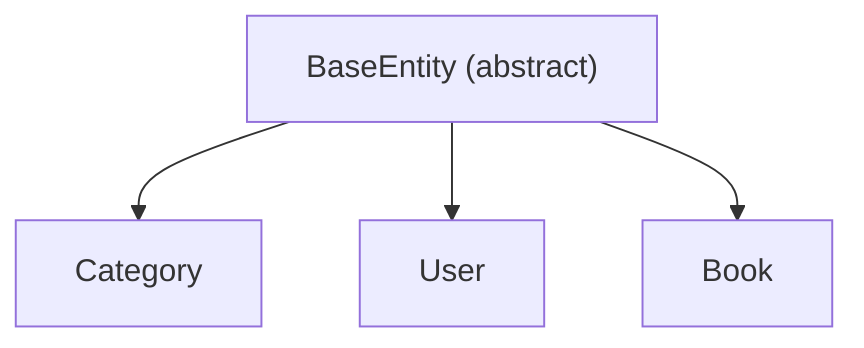

# Entity Inheritance Tree

```mermaid
graph TD
    base_entity["BaseEntity (abstract)"]
    category["Category"]
    base_entity["BaseEntity (abstract)"]
    base_entity --> category
    user["User"]
    base_entity --> user
    book["Book"]
    base_entity --> book
```
