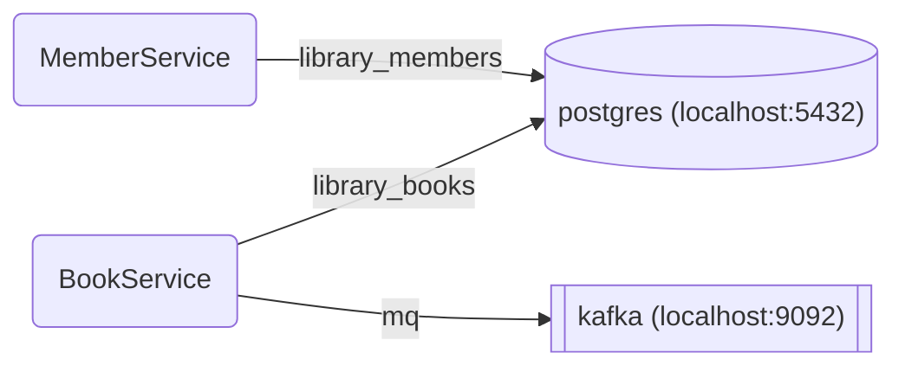

# Service Map with Infrastructure

```mermaid
graph LR
    book_service("BookService")
    member_service("MemberService")
    rdbms_1[("postgres (localhost:5432)")]
    book_service -->|library_books| rdbms_1
    member_service -->|library_members| rdbms_1
    mq_2[["kafka (localhost:9092)"]]
    book_service -->|mq| mq_2
```
