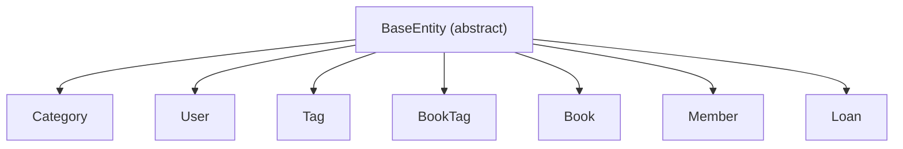

# Entity Inheritance Tree

```mermaid
graph TD
    base_entity["BaseEntity (abstract)"]
    category["Category"]
    base_entity["BaseEntity (abstract)"]
    base_entity --> category
    user["User"]
    base_entity --> user
    tag["Tag"]
    base_entity --> tag
    book_tag["BookTag"]
    base_entity --> book_tag
    book["Book"]
    base_entity --> book
    member["Member"]
    base_entity --> member
    loan["Loan"]
    base_entity --> loan
```
