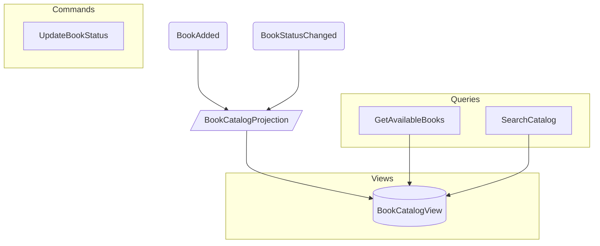

# CQRS Data Flow

```mermaid
graph TD
    subgraph "Commands"
    cmd_update_book_status["UpdateBookStatus"]
    end
    subgraph "Views"
    view_book_catalog_view[("BookCatalogView")]
    end
    subgraph "Queries"
    query_get_available_books["GetAvailableBooks"]
    query_search_catalog["SearchCatalog"]
    end
    proj_book_catalog_projection[/"BookCatalogProjection"/]
    evt_book_added("BookAdded")
    evt_book_added --> proj_book_catalog_projection
    evt_book_status_changed("BookStatusChanged")
    evt_book_status_changed --> proj_book_catalog_projection
    proj_book_catalog_projection --> view_book_catalog_view
    query_get_available_books --> view_book_catalog_view
    query_search_catalog --> view_book_catalog_view
```
