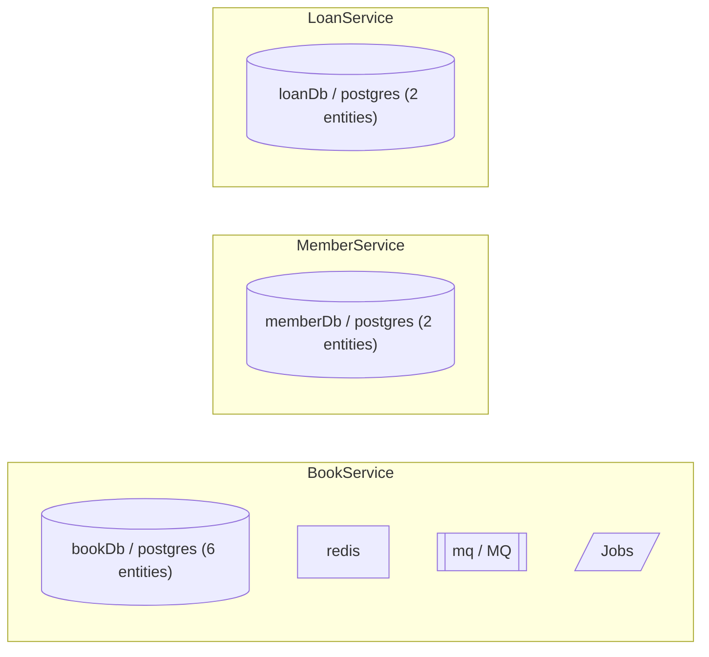

# Data Store Topology

```mermaid
graph LR
    subgraph "BookService"
    book_service_rdbms_book_db[("bookDb / postgres (6 entities)")]
    book_service_cache["redis"]
    book_service_mq_mq[["mq / MQ"]]
    book_service_jobs[/"Jobs"/]
    end
    subgraph "MemberService"
    member_service_rdbms_member_db[("memberDb / postgres (2 entities)")]
    end
    subgraph "LoanService"
    loan_service_rdbms_loan_db[("loanDb / postgres (2 entities)")]
    end
```
