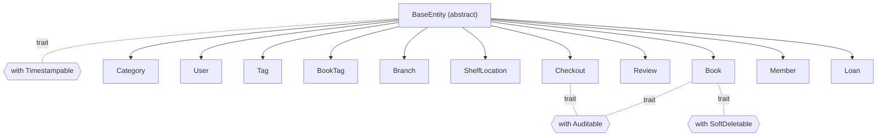

# Entity Inheritance Tree

```mermaid
graph TD
    base_entity["BaseEntity (abstract)"]
    trait_timestampable{{"with Timestampable"}}
    base_entity -.-|trait| trait_timestampable
    category["Category"]
    base_entity["BaseEntity (abstract)"]
    base_entity --> category
    user["User"]
    base_entity --> user
    tag["Tag"]
    base_entity --> tag
    book_tag["BookTag"]
    base_entity --> book_tag
    branch["Branch"]
    base_entity --> branch
    shelf_location["ShelfLocation"]
    base_entity --> shelf_location
    book["Book"]
    base_entity --> book
    trait_auditable{{"with Auditable"}}
    book -.-|trait| trait_auditable
    trait_soft_deletable{{"with SoftDeletable"}}
    book -.-|trait| trait_soft_deletable
    review["Review"]
    base_entity --> review
    checkout["Checkout"]
    base_entity --> checkout
    checkout -.-|trait| trait_auditable
    member["Member"]
    base_entity --> member
    loan["Loan"]
    base_entity --> loan
```
