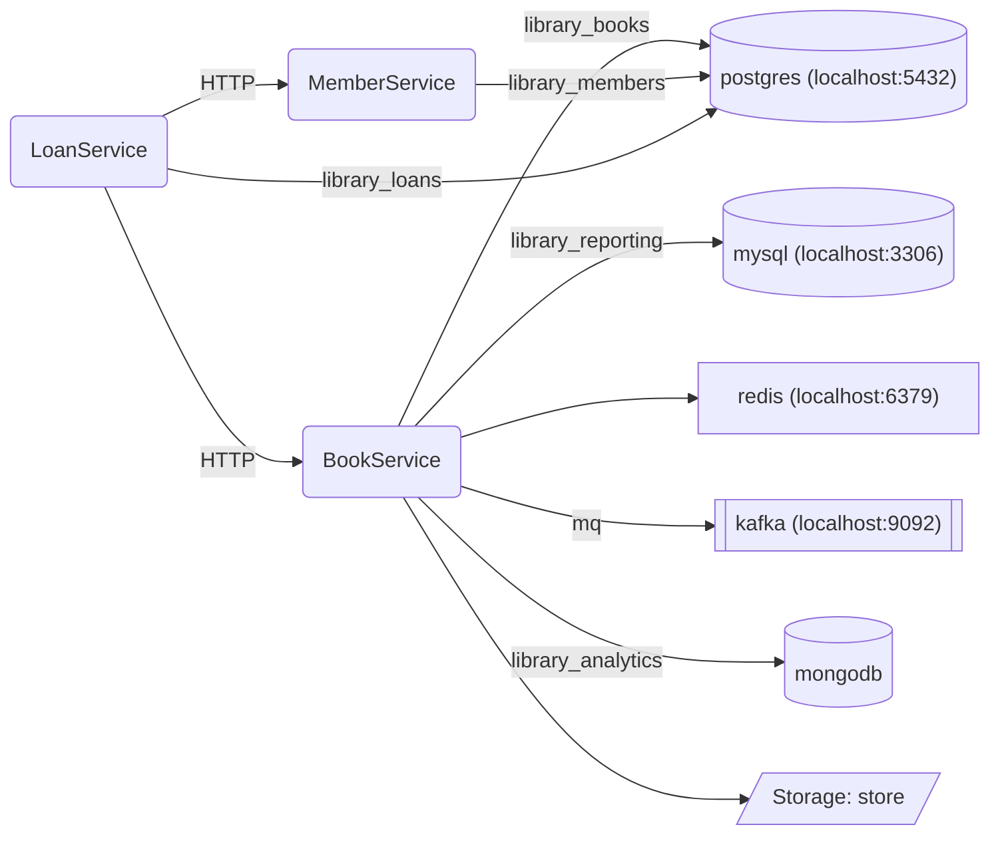

# Service Map with Infrastructure

```mermaid
graph LR
    book_service("BookService")
    member_service("MemberService")
    loan_service("LoanService")
    rdbms_1[("postgres (localhost:5432)")]
    book_service -->|library_books| rdbms_1
    member_service -->|library_members| rdbms_1
    loan_service -->|library_loans| rdbms_1
    rdbms_2[("mysql (localhost:3306)")]
    book_service -->|library_reporting| rdbms_2
    cache_3["redis (localhost:6379)"]
    book_service --> cache_3
    mq_4[["kafka (localhost:9092)"]]
    book_service -->|mq| mq_4
    nosql_5[("mongodb")]
    book_service -->|library_analytics| nosql_5
    storage_6[/"Storage: store"/]
    book_service --> storage_6
    loan_service -->|HTTP| book_service
    loan_service -->|HTTP| member_service
```
