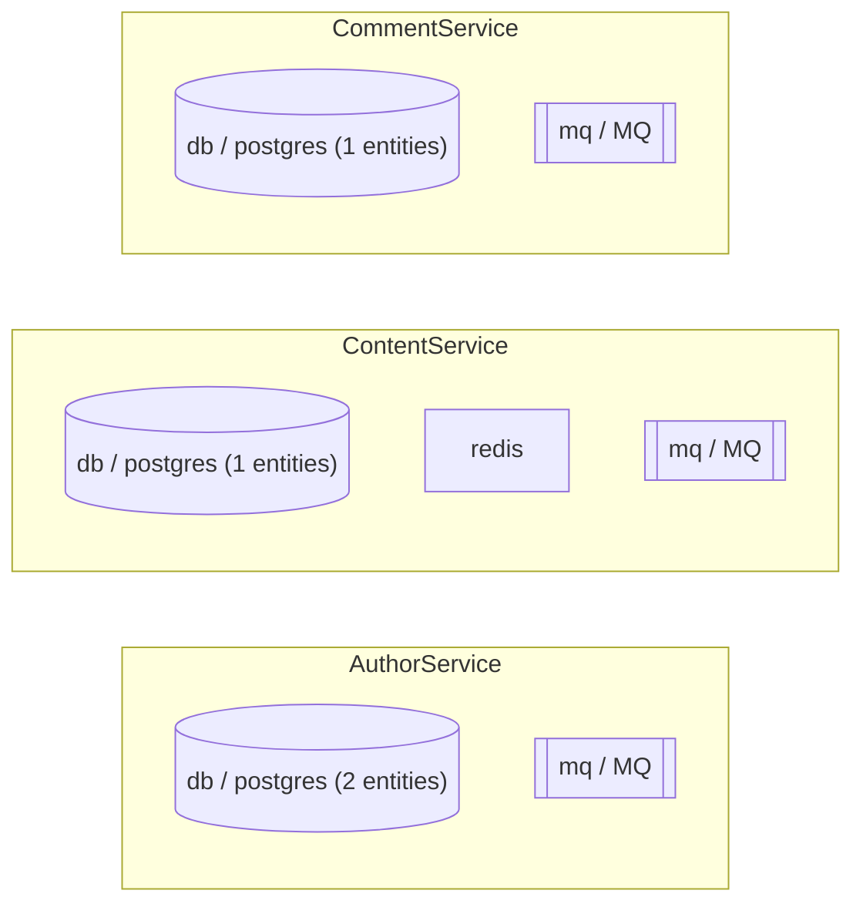

# Data Store Topology

```mermaid
graph LR
    subgraph "AuthorService"
    author_service_rdbms_db[("db / postgres (2 entities)")]
    author_service_mq_mq[["mq / MQ"]]
    end
    subgraph "ContentService"
    content_service_rdbms_db[("db / postgres (1 entities)")]
    content_service_cache["redis"]
    content_service_mq_mq[["mq / MQ"]]
    end
    subgraph "CommentService"
    comment_service_rdbms_db[("db / postgres (1 entities)")]
    comment_service_mq_mq[["mq / MQ"]]
    end
```
