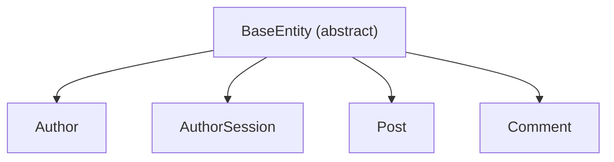

# Entity Inheritance Tree

```mermaid
graph TD
    author["Author"]
    base_entity["BaseEntity (abstract)"]
    base_entity --> author
    author_session["AuthorSession"]
    base_entity --> author_session
    post["Post"]
    base_entity --> post
    comment["Comment"]
    base_entity --> comment
```
