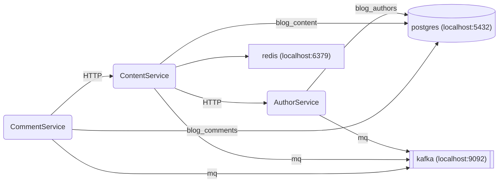

# Service Map with Infrastructure

```mermaid
graph LR
    author_service("AuthorService")
    content_service("ContentService")
    comment_service("CommentService")
    rdbms_1[("postgres (localhost:5432)")]
    author_service -->|blog_authors| rdbms_1
    content_service -->|blog_content| rdbms_1
    comment_service -->|blog_comments| rdbms_1
    cache_2["redis (localhost:6379)"]
    content_service --> cache_2
    mq_3[["kafka (localhost:9092)"]]
    author_service -->|mq| mq_3
    content_service -->|mq| mq_3
    comment_service -->|mq| mq_3
    content_service -->|HTTP| author_service
    comment_service -->|HTTP| content_service
```
