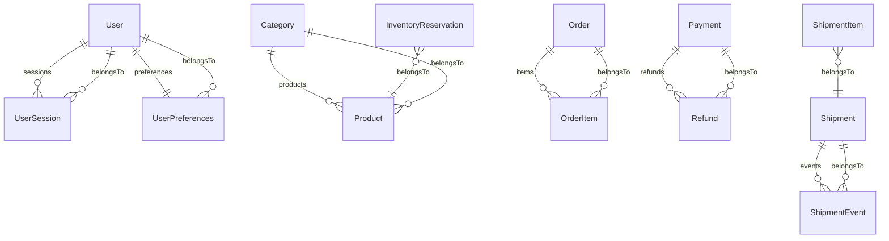

# Entity-Relationship Diagram

```mermaid
erDiagram
    User ||--o{ UserSession : "sessions"
    User ||--|| UserPreferences : "preferences"
    UserSession }o--|| User : "belongsTo"
    UserPreferences }o--|| User : "belongsTo"
    Category ||--o{ Product : "products"
    Product }o--|| Category : "belongsTo"
    InventoryReservation }o--|| Product : "belongsTo"
    Order ||--o{ OrderItem : "items"
    OrderItem }o--|| Order : "belongsTo"
    Payment ||--o{ Refund : "refunds"
    Refund }o--|| Payment : "belongsTo"
    Shipment ||--o{ ShipmentEvent : "events"
    ShipmentEvent }o--|| Shipment : "belongsTo"
    ShipmentItem }o--|| Shipment : "belongsTo"
```
