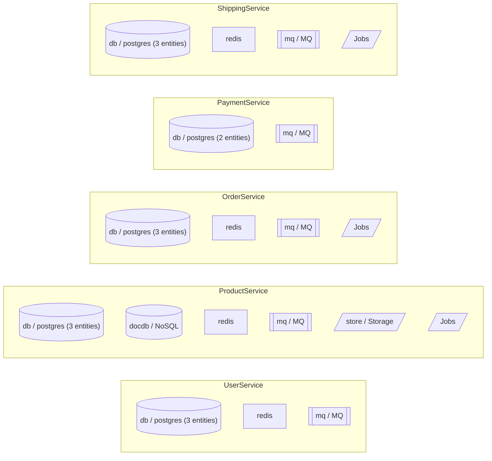

# Data Store Topology

```mermaid
graph LR
    subgraph "UserService"
    user_service_rdbms_db[("db / postgres (3 entities)")]
    user_service_cache["redis"]
    user_service_mq_mq[["mq / MQ"]]
    end
    subgraph "ProductService"
    product_service_rdbms_db[("db / postgres (3 entities)")]
    product_service_nosql_docdb[("docdb / NoSQL")]
    product_service_cache["redis"]
    product_service_mq_mq[["mq / MQ"]]
    product_service_storage_store[/"store / Storage"/]
    product_service_jobs[/"Jobs"/]
    end
    subgraph "OrderService"
    order_service_rdbms_db[("db / postgres (3 entities)")]
    order_service_cache["redis"]
    order_service_mq_mq[["mq / MQ"]]
    order_service_jobs[/"Jobs"/]
    end
    subgraph "PaymentService"
    payment_service_rdbms_db[("db / postgres (2 entities)")]
    payment_service_mq_mq[["mq / MQ"]]
    end
    subgraph "ShippingService"
    shipping_service_rdbms_db[("db / postgres (3 entities)")]
    shipping_service_cache["redis"]
    shipping_service_mq_mq[["mq / MQ"]]
    shipping_service_jobs[/"Jobs"/]
    end
```
