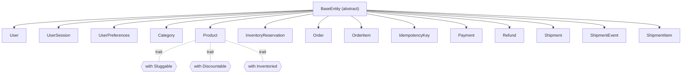

# Entity Inheritance Tree

```mermaid
graph TD
    user["User"]
    base_entity["BaseEntity (abstract)"]
    base_entity --> user
    user_session["UserSession"]
    base_entity --> user_session
    user_preferences["UserPreferences"]
    base_entity --> user_preferences
    category["Category"]
    base_entity --> category
    product["Product"]
    base_entity --> product
    trait_sluggable{{"with Sluggable"}}
    product -.-|trait| trait_sluggable
    trait_discountable{{"with Discountable"}}
    product -.-|trait| trait_discountable
    trait_inventoried{{"with Inventoried"}}
    product -.-|trait| trait_inventoried
    inventory_reservation["InventoryReservation"]
    base_entity --> inventory_reservation
    order["Order"]
    base_entity --> order
    order_item["OrderItem"]
    base_entity --> order_item
    idempotency_key["IdempotencyKey"]
    base_entity --> idempotency_key
    payment["Payment"]
    base_entity --> payment
    refund["Refund"]
    base_entity --> refund
    shipment["Shipment"]
    base_entity --> shipment
    shipment_event["ShipmentEvent"]
    base_entity --> shipment_event
    shipment_item["ShipmentItem"]
    base_entity --> shipment_item
```
