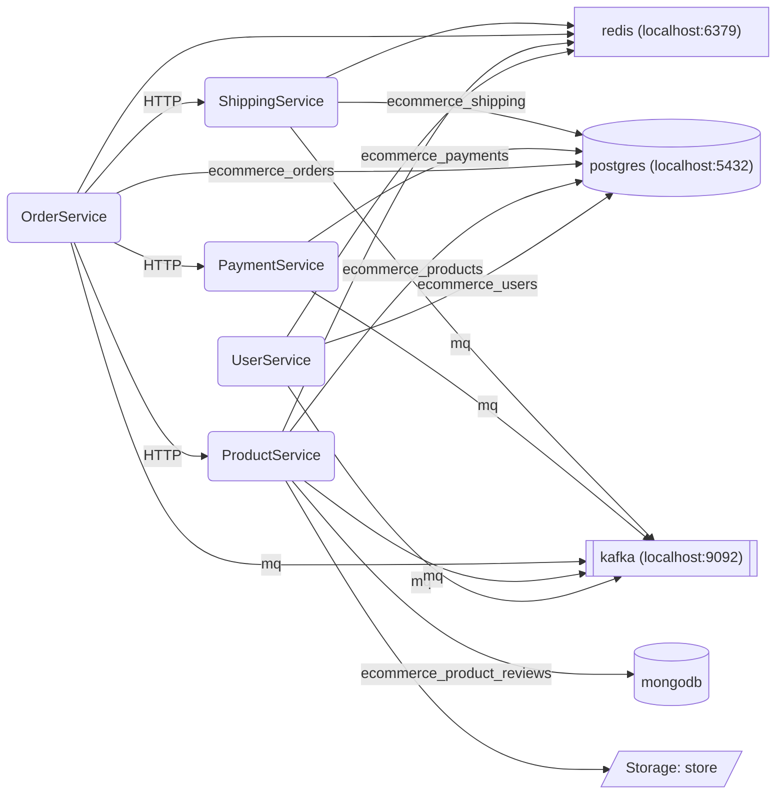

# Service Map with Infrastructure

```mermaid
graph LR
    user_service("UserService")
    product_service("ProductService")
    order_service("OrderService")
    payment_service("PaymentService")
    shipping_service("ShippingService")
    rdbms_1[("postgres (localhost:5432)")]
    user_service -->|ecommerce_users| rdbms_1
    product_service -->|ecommerce_products| rdbms_1
    order_service -->|ecommerce_orders| rdbms_1
    payment_service -->|ecommerce_payments| rdbms_1
    shipping_service -->|ecommerce_shipping| rdbms_1
    cache_2["redis (localhost:6379)"]
    user_service --> cache_2
    product_service --> cache_2
    order_service --> cache_2
    shipping_service --> cache_2
    mq_3[["kafka (localhost:9092)"]]
    user_service -->|mq| mq_3
    product_service -->|mq| mq_3
    order_service -->|mq| mq_3
    payment_service -->|mq| mq_3
    shipping_service -->|mq| mq_3
    nosql_4[("mongodb")]
    product_service -->|ecommerce_product_reviews| nosql_4
    storage_5[/"Storage: store"/]
    product_service --> storage_5
    order_service -->|HTTP| product_service
    order_service -->|HTTP| payment_service
    order_service -->|HTTP| shipping_service
```
