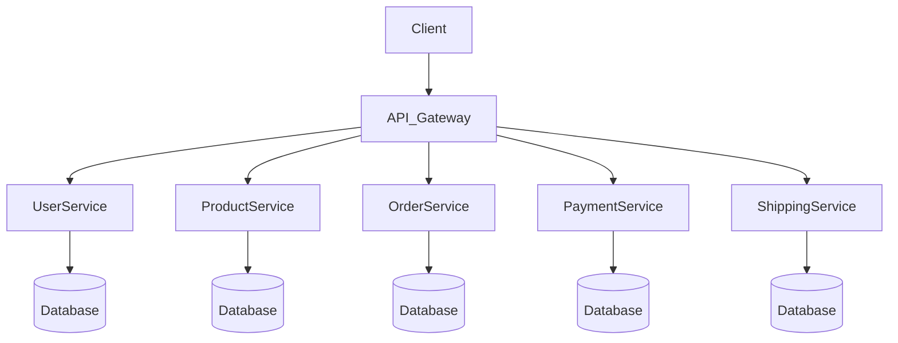

# ecommerce

Generated by [Datrix](https://datrix.dev).

## Quick Start

1. Copy `.env.example` to `.env` and configure values
2. Start services: `docker compose up -d`
3. Run tests: `python tests/run_tests.py`

## Services

| Service | Port | Description |
|---------|------|-------------|
| UserService | 8000 | FastAPI service (3 entities) |
| ProductService | 8001 | FastAPI service (3 entities) |
| OrderService | 8002 | FastAPI service (3 entities) |
| PaymentService | 8003 | FastAPI service (2 entities) |
| ShippingService | 8004 | FastAPI service (3 entities) |

## Development

```bash
# Start all services
python scripts/dev/start.py

# Stop all services
python scripts/dev/stop.py

# Run tests
python tests/run_tests.py

# Run unit tests only
python tests/run_tests.py --unit

# Run with coverage
python tests/run_tests.py --coverage
```

## Architecture



## API Documentation

Each service exposes interactive API docs at:
- **UserService**: http://localhost:8000/docs
- **ProductService**: http://localhost:8001/docs
- **OrderService**: http://localhost:8002/docs
- **PaymentService**: http://localhost:8003/docs
- **ShippingService**: http://localhost:8004/docs

## Environment Variables

See [ENV.md](ENV.md) for the complete list of environment variables.

---

*Generated by datrix-codegen-python*
