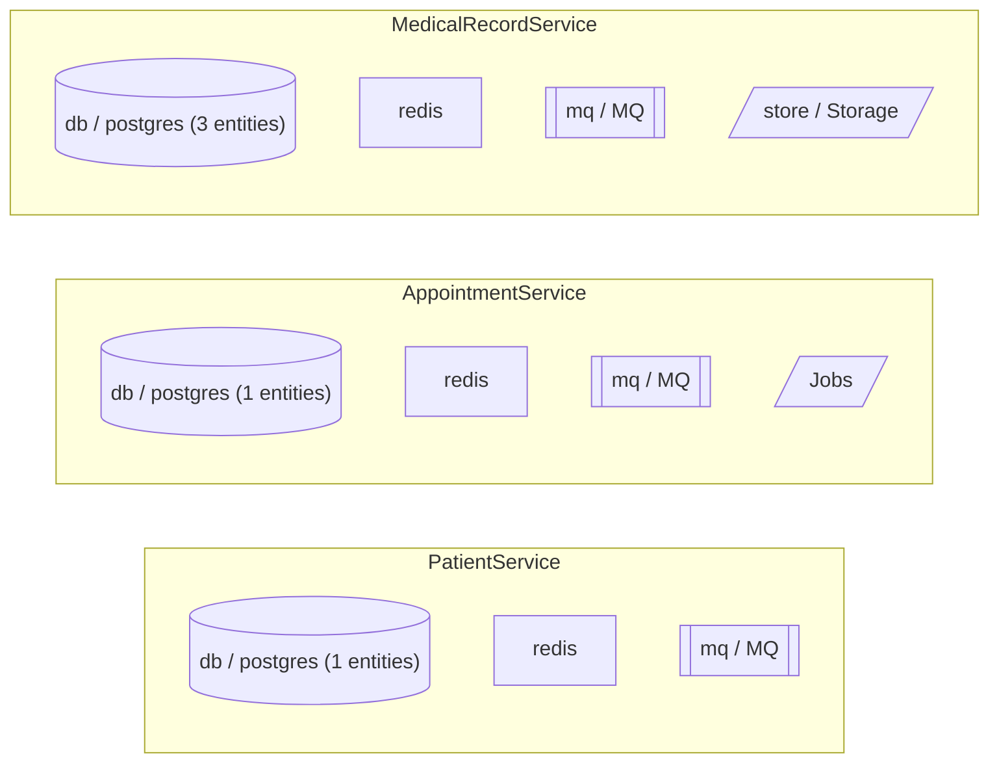

# Data Store Topology

```mermaid
graph LR
    subgraph "PatientService"
    patient_service_rdbms_db[("db / postgres (1 entities)")]
    patient_service_cache["redis"]
    patient_service_mq_mq[["mq / MQ"]]
    end
    subgraph "AppointmentService"
    appointment_service_rdbms_db[("db / postgres (1 entities)")]
    appointment_service_cache["redis"]
    appointment_service_mq_mq[["mq / MQ"]]
    appointment_service_jobs[/"Jobs"/]
    end
    subgraph "MedicalRecordService"
    medical_record_service_rdbms_db[("db / postgres (3 entities)")]
    medical_record_service_cache["redis"]
    medical_record_service_mq_mq[["mq / MQ"]]
    medical_record_service_storage_store[/"store / Storage"/]
    end
```
