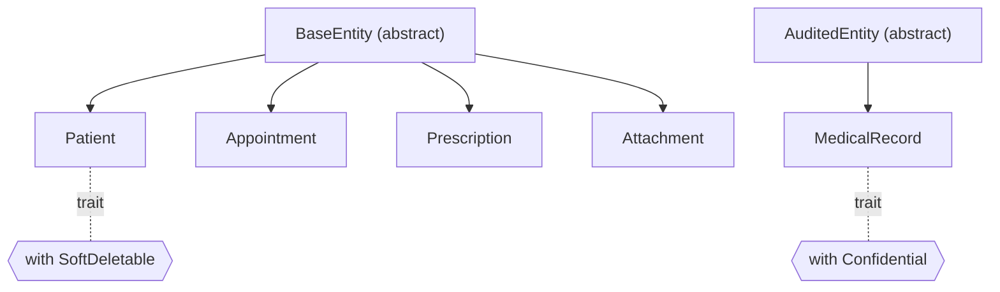

# Entity Inheritance Tree

```mermaid
graph TD
    patient["Patient"]
    base_entity["BaseEntity (abstract)"]
    base_entity --> patient
    trait_soft_deletable{{"with SoftDeletable"}}
    patient -.-|trait| trait_soft_deletable
    appointment["Appointment"]
    base_entity --> appointment
    medical_record["MedicalRecord"]
    audited_entity["AuditedEntity (abstract)"]
    audited_entity --> medical_record
    trait_confidential{{"with Confidential"}}
    medical_record -.-|trait| trait_confidential
    prescription["Prescription"]
    base_entity --> prescription
    attachment["Attachment"]
    base_entity --> attachment
```
