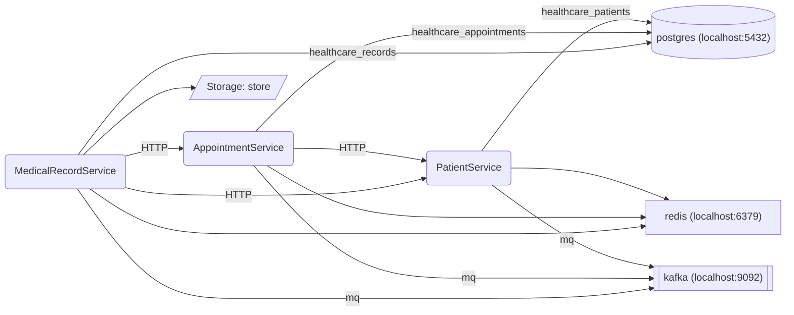

# Service Map with Infrastructure

```mermaid
graph LR
    patient_service("PatientService")
    appointment_service("AppointmentService")
    medical_record_service("MedicalRecordService")
    rdbms_1[("postgres (localhost:5432)")]
    patient_service -->|healthcare_patients| rdbms_1
    appointment_service -->|healthcare_appointments| rdbms_1
    medical_record_service -->|healthcare_records| rdbms_1
    cache_2["redis (localhost:6379)"]
    patient_service --> cache_2
    appointment_service --> cache_2
    medical_record_service --> cache_2
    mq_3[["kafka (localhost:9092)"]]
    patient_service -->|mq| mq_3
    appointment_service -->|mq| mq_3
    medical_record_service -->|mq| mq_3
    storage_4[/"Storage: store"/]
    medical_record_service --> storage_4
    appointment_service -->|HTTP| patient_service
    medical_record_service -->|HTTP| patient_service
    medical_record_service -->|HTTP| appointment_service
```
