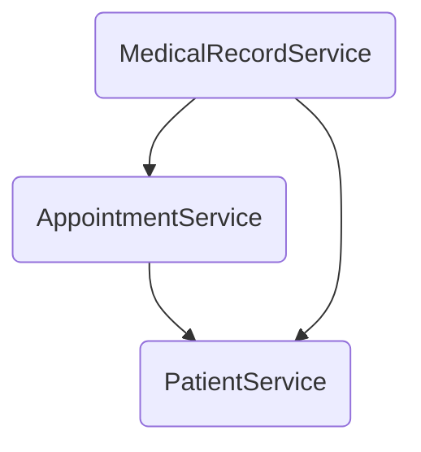

# System Context Diagram (C4-inspired)

```mermaid
graph TD
    patient_service("PatientService")
    appointment_service("AppointmentService")
    medical_record_service("MedicalRecordService")
    appointment_service --> patient_service
    medical_record_service --> patient_service
    medical_record_service --> appointment_service
```
