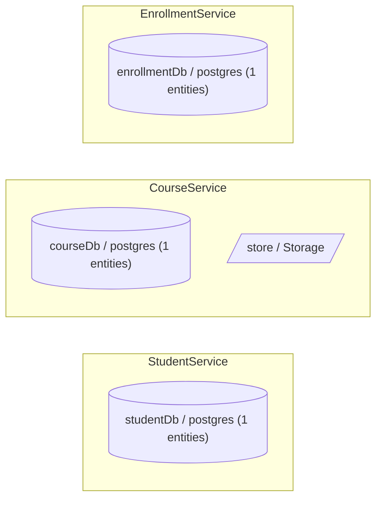

# Data Store Topology

```mermaid
graph LR
    subgraph "StudentService"
    student_service_rdbms_student_db[("studentDb / postgres (1 entities)")]
    end
    subgraph "CourseService"
    course_service_rdbms_course_db[("courseDb / postgres (1 entities)")]
    course_service_storage_store[/"store / Storage"/]
    end
    subgraph "EnrollmentService"
    enrollment_service_rdbms_enrollment_db[("enrollmentDb / postgres (1 entities)")]
    end
```
