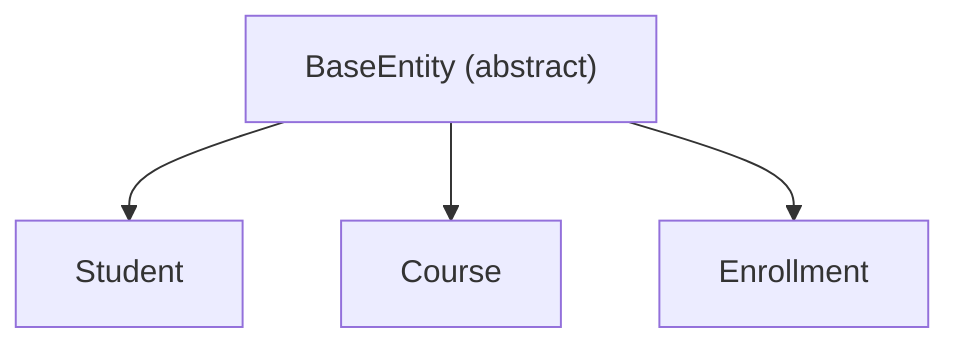

# Entity Inheritance Tree

```mermaid
graph TD
    student["Student"]
    base_entity["BaseEntity (abstract)"]
    base_entity --> student
    course["Course"]
    base_entity --> course
    enrollment["Enrollment"]
    base_entity --> enrollment
```
