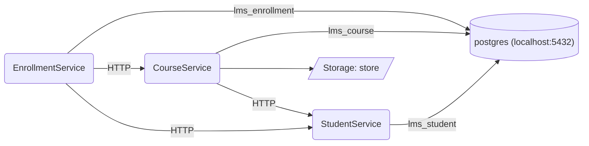

# Service Map with Infrastructure

```mermaid
graph LR
    student_service("StudentService")
    course_service("CourseService")
    enrollment_service("EnrollmentService")
    rdbms_1[("postgres (localhost:5432)")]
    student_service -->|lms_student| rdbms_1
    course_service -->|lms_course| rdbms_1
    enrollment_service -->|lms_enrollment| rdbms_1
    storage_2[/"Storage: store"/]
    course_service --> storage_2
    course_service -->|HTTP| student_service
    enrollment_service -->|HTTP| course_service
    enrollment_service -->|HTTP| student_service
```
