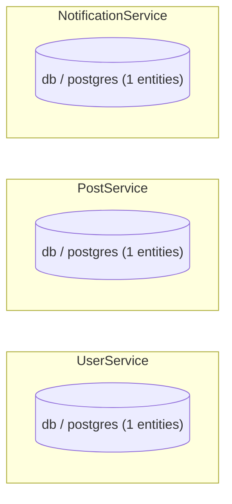

# Data Store Topology

```mermaid
graph LR
    subgraph "UserService"
    user_service_rdbms_db[("db / postgres (1 entities)")]
    end
    subgraph "PostService"
    post_service_rdbms_db[("db / postgres (1 entities)")]
    end
    subgraph "NotificationService"
    notification_service_rdbms_db[("db / postgres (1 entities)")]
    end
```
