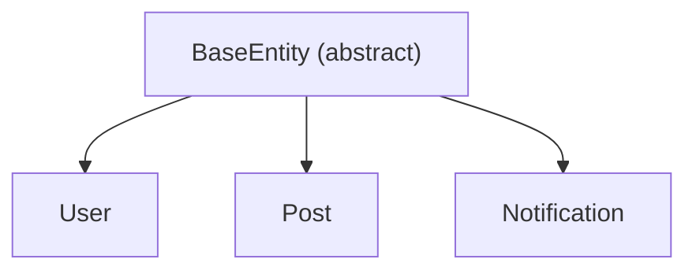

# Entity Inheritance Tree

```mermaid
graph TD
    user["User"]
    base_entity["BaseEntity (abstract)"]
    base_entity --> user
    post["Post"]
    base_entity --> post
    notification["Notification"]
    base_entity --> notification
```
