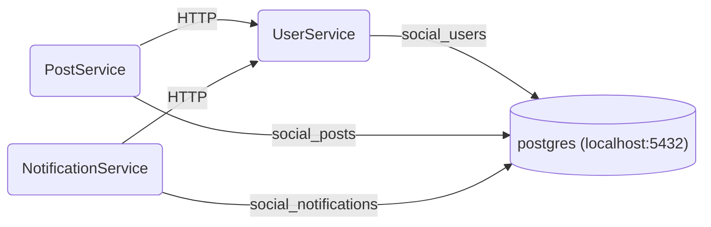

# Service Map with Infrastructure

```mermaid
graph LR
    user_service("UserService")
    post_service("PostService")
    notification_service("NotificationService")
    rdbms_1[("postgres (localhost:5432)")]
    user_service -->|social_users| rdbms_1
    post_service -->|social_posts| rdbms_1
    notification_service -->|social_notifications| rdbms_1
    post_service -->|HTTP| user_service
    notification_service -->|HTTP| user_service
```
