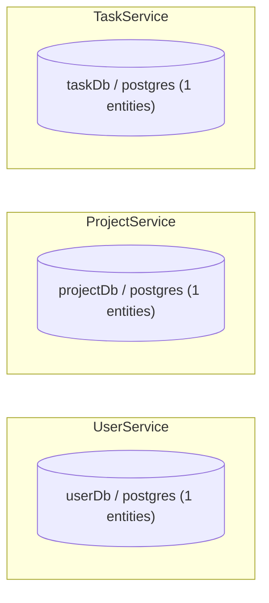

# Data Store Topology

```mermaid
graph LR
    subgraph "UserService"
    user_service_rdbms_user_db[("userDb / postgres (1 entities)")]
    end
    subgraph "ProjectService"
    project_service_rdbms_project_db[("projectDb / postgres (1 entities)")]
    end
    subgraph "TaskService"
    task_service_rdbms_task_db[("taskDb / postgres (1 entities)")]
    end
```
