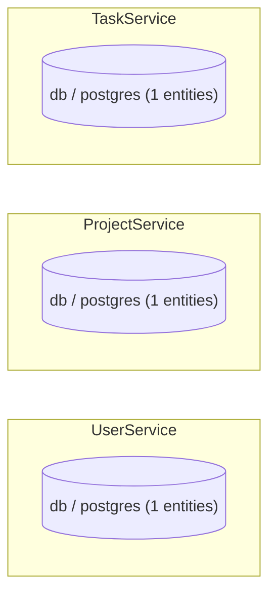

# Data Store Topology

```mermaid
graph LR
    subgraph "UserService"
    user_service_rdbms_db[("db / postgres (1 entities)")]
    end
    subgraph "ProjectService"
    project_service_rdbms_db[("db / postgres (1 entities)")]
    end
    subgraph "TaskService"
    task_service_rdbms_db[("db / postgres (1 entities)")]
    end
```
