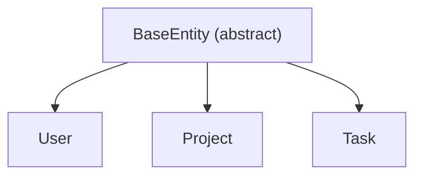

# Entity Inheritance Tree

```mermaid
graph TD
    user["User"]
    base_entity["BaseEntity (abstract)"]
    base_entity --> user
    project["Project"]
    base_entity --> project
    task["Task"]
    base_entity --> task
```
