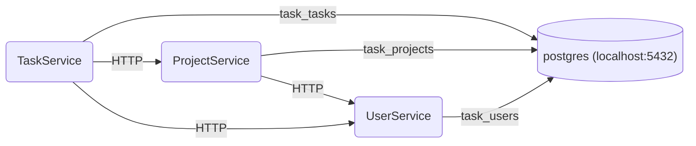

# Service Map with Infrastructure

```mermaid
graph LR
    user_service("UserService")
    project_service("ProjectService")
    task_service("TaskService")
    rdbms_1[("postgres (localhost:5432)")]
    user_service -->|task_users| rdbms_1
    project_service -->|task_projects| rdbms_1
    task_service -->|task_tasks| rdbms_1
    project_service -->|HTTP| user_service
    task_service -->|HTTP| project_service
    task_service -->|HTTP| user_service
```
