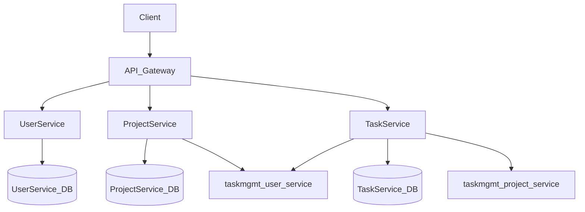
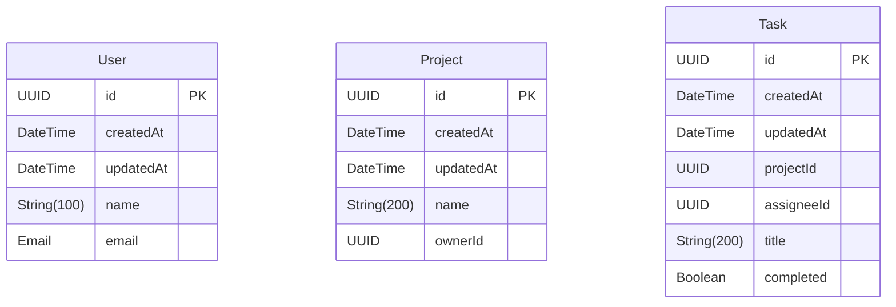
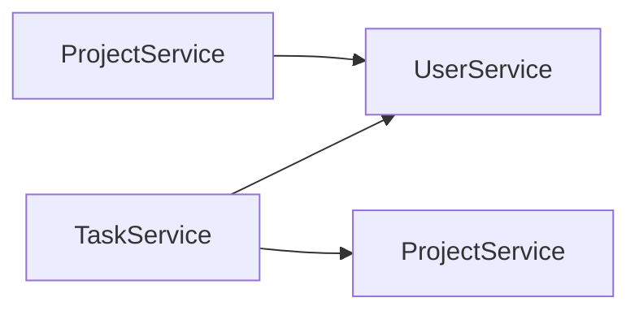

# Architecture

## Overview

taskmgmt is a microservice-based application built with FastAPI and Python 3.11+.

## System Overview

| Property | Value |
|----------|-------|
| Services | 3 |
| Entities | 3 |
| Database | PostgreSQL (async) |
| Framework | FastAPI |
| Language | Python 3.11+ |
| Architecture | Clean Architecture |

## Architecture Diagram

## Services

### UserService

- **Port:** 8010
- **Directory:** `taskmgmt_user_service/`
- **Entities:** User
- **REST API:** Yes

### ProjectService

- **Port:** 8011
- **Directory:** `taskmgmt_project_service/`
- **Entities:** Project
- **REST API:** Yes

### TaskService

- **Port:** 8012
- **Directory:** `taskmgmt_task_service/`
- **Entities:** Task
- **REST API:** Yes

## Database Schema

### Entity Relationships

### Entity Details

#### User

| Field | Type | Optional | Description |
|-------|------|----------|-------------|
| `id` | UUID | No | Id |
| `createdAt` | DateTime | No | Createdat |
| `updatedAt` | DateTime | No | Updatedat |
| `name` | String(100) | No | Name |
| `email` | Email | No | Email |

#### Project

| Field | Type | Optional | Description |
|-------|------|----------|-------------|
| `id` | UUID | No | Id |
| `createdAt` | DateTime | No | Createdat |
| `updatedAt` | DateTime | No | Updatedat |
| `name` | String(200) | No | Name |
| `ownerId` | UUID | No | Ownerid |

#### Task

| Field | Type | Optional | Description |
|-------|------|----------|-------------|
| `id` | UUID | No | Id |
| `createdAt` | DateTime | No | Createdat |
| `updatedAt` | DateTime | No | Updatedat |
| `projectId` | UUID | No | Projectid |
| `assigneeId` | UUID | No | Assigneeid |
| `title` | String(200) | No | Title |
| `completed` | Boolean | No | Completed |

## Infrastructure Components

| Component | Description |
|-----------|-------------|
| FastAPI | ASGI web framework with auto-generated OpenAPI docs |
| Structured Logging | JSON logging in production, console logging in development |
| Health Checks | `/health` endpoint with service status |
| Middleware | CORS, request logging, error handling |
| Prometheus Metrics | `/metrics` endpoint for scraping |
| OpenTelemetry | Distributed tracing with OTLP export |

## Service Dependencies

- **ProjectService** -> **UserService**: HTTP client communication
- **TaskService** -> **ProjectService**: HTTP client communication
- **TaskService** -> **UserService**: HTTP client communication

---

*Generated by datrix-codegen-python*
