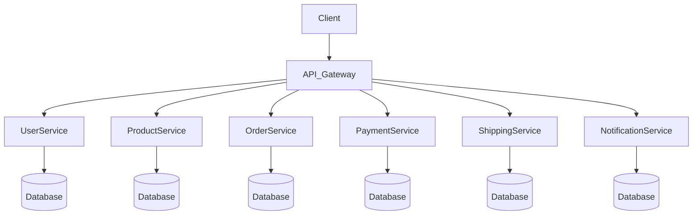

# ecommerce

Generated by [Datrix](https://datrix.dev).

## Quick Start

1. Copy `.env.example` to `.env` and configure values
2. Start services: `docker compose up -d --build`
3. Run unit tests: `dotnet test`

## Services

| Service | Port | Description |
|---------|------|-------------|
| UserService | 8006 | ASP.NET Core service (3 entities) |
| ProductService | 8004 | ASP.NET Core service (3 entities) |
| OrderService | 8002 | ASP.NET Core service (3 entities) |
| PaymentService | 8003 | ASP.NET Core service (2 entities) |
| ShippingService | 8005 | ASP.NET Core service (3 entities) |
| NotificationService | 8001 | ASP.NET Core service (1 entities) |

## Development

```bash
# Start all services locally
docker compose up -d --build

# Stop all services
docker compose down

# Run unit tests
dotnet test
```

## Architecture



## API Documentation

Each service exposes its OpenAPI document at:
- **UserService**: http://localhost:8006/openapi/v1.json
- **ProductService**: http://localhost:8004/openapi/v1.json
- **OrderService**: http://localhost:8002/openapi/v1.json
- **PaymentService**: http://localhost:8003/openapi/v1.json
- **ShippingService**: http://localhost:8005/openapi/v1.json
- **NotificationService**: http://localhost:8001/openapi/v1.json

No interactive Swagger/Scalar UI is generated in this phase — only the raw OpenAPI JSON document is served.

## Environment Variables

See [ENV.md](ENV.md) for the complete list of environment variables.

---

*Generated by datrix-codegen-dotnet*
