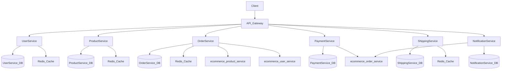
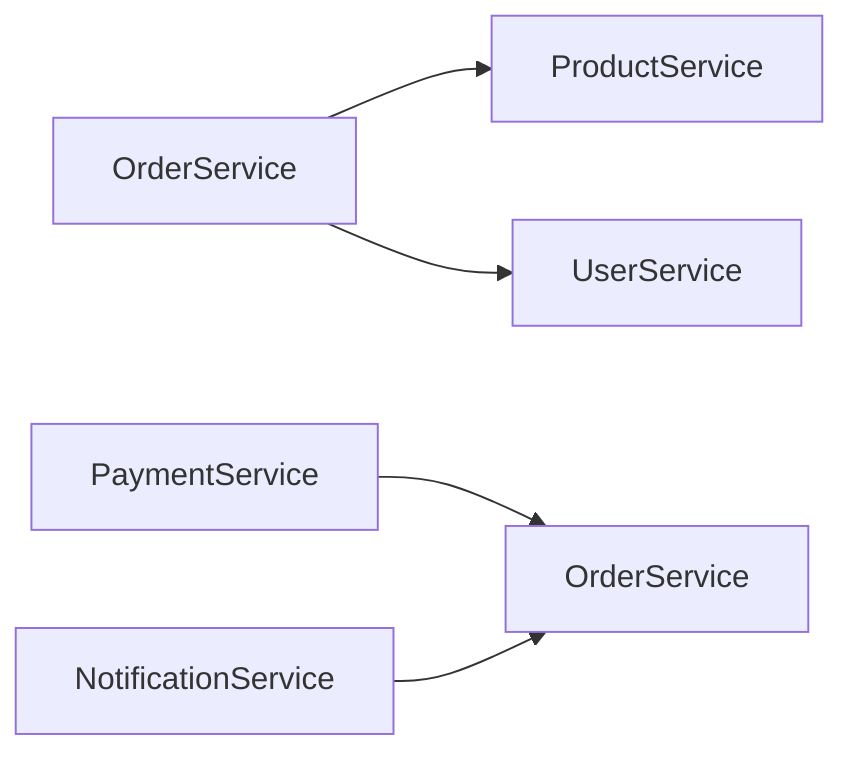

# Architecture

## Overview

ecommerce is a microservice-based application built with NestJS and TypeScript.

## System Overview

| Property | Value |
|----------|-------|
| Services | 6 |
| Entities | 15 |
| Database | PostgreSQL |
| Framework | NestJS |
| Language | TypeScript |
| Architecture | Modular Architecture |

## Architecture Diagram



## Services

### UserService

- **Port:** 8006
- **Directory:** `ecommerce_user_service/`
- **Entities:** User, UserPreferences, UserSession
- **REST API:** Yes

### ProductService

- **Port:** 8004
- **Directory:** `ecommerce_product_service/`
- **Entities:** Category, InventoryReservation, Product
- **REST API:** Yes

### OrderService

- **Port:** 8002
- **Directory:** `ecommerce_order_service/`
- **Entities:** IdempotencyKey, Order, OrderItem
- **REST API:** Yes

### PaymentService

- **Port:** 8003
- **Directory:** `ecommerce_payment_service/`
- **Entities:** Payment, Refund
- **REST API:** Yes

### ShippingService

- **Port:** 8005
- **Directory:** `ecommerce_shipping_service/`
- **Entities:** Shipment, ShipmentEvent, ShipmentItem
- **REST API:** Yes

### NotificationService

- **Port:** 8001
- **Directory:** `ecommerce_notification_service/`
- **Entities:** NotificationAudit


## Database Schema

### Entity Relationships

```mermaid
erDiagram
    User {

        DateTime createdAt
        DateTime updatedAt
        UUID id PK
        Email email
        Password passwordHash
        String(100) firstName
        String(100) lastName
        Phone? phoneNumber
        UserRole role
        UserStatus status
        DateTime? lastLoginAt
        DateTime? emailVerifiedAt
        String? emailVerificationToken
        String? passwordResetToken
        DateTime? passwordResetExpiry
        Address? shippingAddress
        Address? billingAddress
    }

    UserSession {

        DateTime createdAt
        DateTime updatedAt
        UUID id PK
        String(255) token
        String(500)? deviceName
        IPAddress? ipAddress
        String(255)? userAgent
        DateTime expiresAt
        DateTime? lastActivityAt
        UUID userId
    }

    UserPreferences {

        DateTime createdAt
        DateTime updatedAt
        UUID id PK
        String(10) language
        String(50) timezone
        Boolean emailNotifications
        Boolean smsNotifications
        JSON preferences
        UUID userId
    }

    Category {

        DateTime createdAt
        DateTime updatedAt
        UUID id PK
        String(100) name
        Text? description
        Slug slug
    }

    Product {

        DateTime createdAt
        DateTime updatedAt
        UUID id PK
        String(200)? slug
        Money price
        Money? compareAtPrice
        Integer inventory
        String(200) name
        Text description
        ProductStatus status
        JSON? productMetadata
        JSON images
        JSON tags
        UUID categoryId
    }

    InventoryReservation {

        DateTime createdAt
        DateTime updatedAt
        UUID id PK
        UUID reservationId
        Integer quantity
        ReservationStatus status
        DateTime expiresAt
        UUID productId
    }

    Order {

        DateTime createdAt
        DateTime updatedAt
        UUID id PK
        UUID customerId
        String(20) orderNumber
        OrderStatus status
        Money subtotal
        Money tax
        Money shippingCost
        Money discount
        Address shippingAddress
        Address billingAddress
        UUID inventoryReservationId
        UUID? paymentId
        UUID? shipmentId
        String? cancellationReason
    }

    OrderItem {

        DateTime createdAt
        DateTime updatedAt
        UUID id PK
        UUID productId
        String(200) productName
        Integer quantity
        Money unitPrice
        UUID orderId
    }

    IdempotencyKey {

        DateTime createdAt
        DateTime updatedAt
        UUID id PK
        String(100) key
        String(50) operation
        UUID? resourceId
        JSON? response
        DateTime expiresAt
    }

    Payment {

        DateTime createdAt
        DateTime updatedAt
        UUID id PK
        UUID orderId
        UUID customerId
        Money amount
        PaymentMethod method
        PaymentStatus status
        String(100) transactionId
        String? gatewayResponse
        String? errorMessage
        DateTime? processedAt
    }

    Refund {

        DateTime createdAt
        DateTime updatedAt
        UUID id PK
        Money amount
        String(500) reason
        PaymentStatus status
        String? refundTransactionId
        String? errorMessage
        DateTime? processedAt
        UUID paymentId
    }

    Shipment {

        DateTime createdAt
        DateTime updatedAt
        UUID id PK
        UUID orderId
        String(50) trackingNumber
        ShippingCarrier carrier
        ShipmentStatus status
        Address destination
        Decimal(10, 2) weight
        DateTime? estimatedDelivery
        DateTime? actualDelivery
        String? failureReason
    }

    ShipmentEvent {

        DateTime createdAt
        DateTime updatedAt
        UUID id PK
        DateTime timestamp
        ShipmentStatus status
        String(200) location
        Text? description
        UUID shipmentId
    }

    ShipmentItem {

        DateTime createdAt
        DateTime updatedAt
        UUID id PK
        UUID productId
        Integer quantity
        UUID shipmentId
    }

    NotificationAudit {

        DateTime createdAt
        DateTime updatedAt
        UUID id PK
        UUID orderId
        Email recipientEmail
        String(64) orderNumber
    }

    User ||--o{ UserSession : "sessions"

    User ||--|| UserPreferences : "preferences"

    UserSession }o--|| User : "belongsTo"

    UserPreferences }o--|| User : "belongsTo"

    Category ||--o{ Product : "products"

    Product }o--|| Category : "belongsTo"

    InventoryReservation }o--|| Product : "belongsTo"

    Order ||--o{ OrderItem : "items"

    OrderItem }o--|| Order : "belongsTo"

    Payment ||--o{ Refund : "refunds"

    Refund }o--|| Payment : "belongsTo"

    Shipment ||--o{ ShipmentEvent : "events"

    ShipmentEvent }o--|| Shipment : "belongsTo"

    ShipmentItem }o--|| Shipment : "belongsTo"

```

### Entity Details

#### User

| Field | Type | Optional | Description |
|-------|------|----------|-------------|
| `createdAt` | DateTime | No | Createdat |
| `updatedAt` | DateTime | No | Updatedat |
| `id` | UUID | No | Id |
| `email` | Email | No | Email |
| `passwordHash` | Password | No | Passwordhash |
| `firstName` | String(100) | No | Firstname |
| `lastName` | String(100) | No | Lastname |
| `phoneNumber` | Phone? | Yes | Phonenumber |
| `role` | UserRole | No | Role |
| `status` | UserStatus | No | Status |
| `lastLoginAt` | DateTime? | Yes | Lastloginat |
| `emailVerifiedAt` | DateTime? | Yes | Emailverifiedat |
| `emailVerificationToken` | String? | Yes | Emailverificationtoken |
| `passwordResetToken` | String? | Yes | Passwordresettoken |
| `passwordResetExpiry` | DateTime? | Yes | Passwordresetexpiry |
| `shippingAddress` | Address? | Yes | Shippingaddress |
| `billingAddress` | Address? | Yes | Billingaddress |

#### UserSession

| Field | Type | Optional | Description |
|-------|------|----------|-------------|
| `createdAt` | DateTime | No | Createdat |
| `updatedAt` | DateTime | No | Updatedat |
| `id` | UUID | No | Id |
| `token` | String(255) | No | Token |
| `deviceName` | String(500)? | Yes | Devicename |
| `ipAddress` | IPAddress? | Yes | Ipaddress |
| `userAgent` | String(255)? | Yes | Useragent |
| `expiresAt` | DateTime | No | Expiresat |
| `lastActivityAt` | DateTime? | Yes | Lastactivityat |
| `userId` | UUID | No | Userid |

#### UserPreferences

| Field | Type | Optional | Description |
|-------|------|----------|-------------|
| `createdAt` | DateTime | No | Createdat |
| `updatedAt` | DateTime | No | Updatedat |
| `id` | UUID | No | Id |
| `language` | String(10) | No | Language |
| `timezone` | String(50) | No | Timezone |
| `emailNotifications` | Boolean | No | Emailnotifications |
| `smsNotifications` | Boolean | No | Smsnotifications |
| `preferences` | JSON | No | Preferences |
| `userId` | UUID | No | Userid |

#### Category

| Field | Type | Optional | Description |
|-------|------|----------|-------------|
| `createdAt` | DateTime | No | Createdat |
| `updatedAt` | DateTime | No | Updatedat |
| `id` | UUID | No | Id |
| `name` | String(100) | No | Name |
| `description` | Text? | Yes | Description |
| `slug` | Slug | No | Slug |

#### Product

| Field | Type | Optional | Description |
|-------|------|----------|-------------|
| `createdAt` | DateTime | No | Createdat |
| `updatedAt` | DateTime | No | Updatedat |
| `id` | UUID | No | Id |
| `slug` | String(200)? | Yes | Slug |
| `price` | Money | No | Price |
| `compareAtPrice` | Money? | Yes | Compareatprice |
| `inventory` | Integer | No | Inventory |
| `name` | String(200) | No | Name |
| `description` | Text | No | Description |
| `status` | ProductStatus | No | Status |
| `productMetadata` | JSON? | Yes | Productmetadata |
| `images` | JSON | No | Images |
| `tags` | JSON | No | Tags |
| `categoryId` | UUID | No | Categoryid |

#### InventoryReservation

| Field | Type | Optional | Description |
|-------|------|----------|-------------|
| `createdAt` | DateTime | No | Createdat |
| `updatedAt` | DateTime | No | Updatedat |
| `id` | UUID | No | Id |
| `reservationId` | UUID | No | Reservationid |
| `quantity` | Integer | No | Quantity |
| `status` | ReservationStatus | No | Status |
| `expiresAt` | DateTime | No | Expiresat |
| `productId` | UUID | No | Productid |

#### Order

| Field | Type | Optional | Description |
|-------|------|----------|-------------|
| `createdAt` | DateTime | No | Createdat |
| `updatedAt` | DateTime | No | Updatedat |
| `id` | UUID | No | Id |
| `customerId` | UUID | No | Customerid |
| `orderNumber` | String(20) | No | Ordernumber |
| `status` | OrderStatus | No | Status |
| `subtotal` | Money | No | Subtotal |
| `tax` | Money | No | Tax |
| `shippingCost` | Money | No | Shippingcost |
| `discount` | Money | No | Discount |
| `shippingAddress` | Address | No | Shippingaddress |
| `billingAddress` | Address | No | Billingaddress |
| `inventoryReservationId` | UUID | No | Inventoryreservationid |
| `paymentId` | UUID? | Yes | Paymentid |
| `shipmentId` | UUID? | Yes | Shipmentid |
| `cancellationReason` | String? | Yes | Cancellationreason |

#### OrderItem

| Field | Type | Optional | Description |
|-------|------|----------|-------------|
| `createdAt` | DateTime | No | Createdat |
| `updatedAt` | DateTime | No | Updatedat |
| `id` | UUID | No | Id |
| `productId` | UUID | No | Productid |
| `productName` | String(200) | No | Productname |
| `quantity` | Integer | No | Quantity |
| `unitPrice` | Money | No | Unitprice |
| `orderId` | UUID | No | Orderid |

#### IdempotencyKey

| Field | Type | Optional | Description |
|-------|------|----------|-------------|
| `createdAt` | DateTime | No | Createdat |
| `updatedAt` | DateTime | No | Updatedat |
| `id` | UUID | No | Id |
| `key` | String(100) | No | Key |
| `operation` | String(50) | No | Operation |
| `resourceId` | UUID? | Yes | Resourceid |
| `response` | JSON? | Yes | Response |
| `expiresAt` | DateTime | No | Expiresat |

#### Payment

| Field | Type | Optional | Description |
|-------|------|----------|-------------|
| `createdAt` | DateTime | No | Createdat |
| `updatedAt` | DateTime | No | Updatedat |
| `id` | UUID | No | Id |
| `orderId` | UUID | No | Orderid |
| `customerId` | UUID | No | Customerid |
| `amount` | Money | No | Amount |
| `method` | PaymentMethod | No | Method |
| `status` | PaymentStatus | No | Status |
| `transactionId` | String(100) | No | Transactionid |
| `gatewayResponse` | String? | Yes | Gatewayresponse |
| `errorMessage` | String? | Yes | Errormessage |
| `processedAt` | DateTime? | Yes | Processedat |

#### Refund

| Field | Type | Optional | Description |
|-------|------|----------|-------------|
| `createdAt` | DateTime | No | Createdat |
| `updatedAt` | DateTime | No | Updatedat |
| `id` | UUID | No | Id |
| `amount` | Money | No | Amount |
| `reason` | String(500) | No | Reason |
| `status` | PaymentStatus | No | Status |
| `refundTransactionId` | String? | Yes | Refundtransactionid |
| `errorMessage` | String? | Yes | Errormessage |
| `processedAt` | DateTime? | Yes | Processedat |
| `paymentId` | UUID | No | Paymentid |

#### Shipment

| Field | Type | Optional | Description |
|-------|------|----------|-------------|
| `createdAt` | DateTime | No | Createdat |
| `updatedAt` | DateTime | No | Updatedat |
| `id` | UUID | No | Id |
| `orderId` | UUID | No | Orderid |
| `trackingNumber` | String(50) | No | Trackingnumber |
| `carrier` | ShippingCarrier | No | Carrier |
| `status` | ShipmentStatus | No | Status |
| `destination` | Address | No | Destination |
| `weight` | Decimal(10, 2) | No | Weight |
| `estimatedDelivery` | DateTime? | Yes | Estimateddelivery |
| `actualDelivery` | DateTime? | Yes | Actualdelivery |
| `failureReason` | String? | Yes | Failurereason |

#### ShipmentEvent

| Field | Type | Optional | Description |
|-------|------|----------|-------------|
| `createdAt` | DateTime | No | Createdat |
| `updatedAt` | DateTime | No | Updatedat |
| `id` | UUID | No | Id |
| `timestamp` | DateTime | No | Timestamp |
| `status` | ShipmentStatus | No | Status |
| `location` | String(200) | No | Location |
| `description` | Text? | Yes | Description |
| `shipmentId` | UUID | No | Shipmentid |

#### ShipmentItem

| Field | Type | Optional | Description |
|-------|------|----------|-------------|
| `createdAt` | DateTime | No | Createdat |
| `updatedAt` | DateTime | No | Updatedat |
| `id` | UUID | No | Id |
| `productId` | UUID | No | Productid |
| `quantity` | Integer | No | Quantity |
| `shipmentId` | UUID | No | Shipmentid |

#### NotificationAudit

| Field | Type | Optional | Description |
|-------|------|----------|-------------|
| `createdAt` | DateTime | No | Createdat |
| `updatedAt` | DateTime | No | Updatedat |
| `id` | UUID | No | Id |
| `orderId` | UUID | No | Orderid |
| `recipientEmail` | Email | No | Recipientemail |
| `orderNumber` | String(64) | No | Ordernumber |


## Infrastructure Components

| Component | Description |
|-----------|-------------|
| NestJS | TypeScript framework with modular architecture |
| MikroORM | Database ORM with migration support |
| Health Checks | `/health` endpoint with service status |
| Middleware | CORS, validation, error handling |
| Prometheus Metrics | `/metrics` endpoint for scraping |
| OpenTelemetry | Distributed tracing with OTLP export |
| Redis Cache | Caching layer for performance optimization |
| Message Queue | Async event-driven communication |

## Service Dependencies



- **OrderService** -> **ProductService**: HTTP client communication
- **OrderService** -> **UserService**: HTTP client communication
- **PaymentService** -> **OrderService**: HTTP client communication
- **NotificationService** -> **OrderService**: HTTP client communication

---

*Generated by datrix-codegen-typescript*
